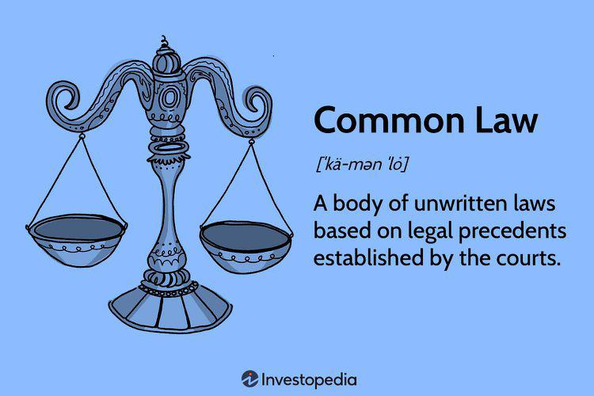

The intersection of law and finance presents a dynamic landscape, particularly as algorithmic trading continues to redefine the mechanisms of financial markets. This article examines the interplay between civil law and common law systems and their implications for algorithmic trading, an integral element of contemporary finance. Algorithmic trading (also known as algo trading) has dramatically altered the execution of trades, prompting legal systems around the globe to adjust and respond.

Algorithmic trading employs advanced algorithms to automate trading processes across multiple financial instruments, ranging from stocks to derivatives. This approach has been transformative, enhancing the speed and accuracy of trades amidst volatile market conditions. However, it simultaneously introduces new legal and regulatory challenges that vary by jurisdiction and legal system.

Civil law, which refers to a structured and codified set of statutes created by legislators, and common law, which is grounded in judicial precedents and interpretations, represent two predominant legal systems influencing global trading practices. The unique characteristics of these systems shape the regulatory environments in which algorithmic trading operates. A comprehensive understanding of these legal structures is essential for navigating the complex financial and legal arenas they intersect.

This exploration is not only crucial for legal professionals and financial analysts but also for anyone engaged in international trading. With the continuous evolution of algorithmic trading, understanding its implications within different legal frameworks is key to addressing the regulatory and ethical challenges arising from its use. Bridging the gap between legal theory and financial practice equips stakeholders with the tools necessary to thrive in this multifaceted landscape. The subsequent sections offer detailed insights into these dynamics, providing a foundation for informed decision-making in the field of international trading and finance.

## Table of Contents

## Understanding Civil Law and Common Law Systems

Civil law and common law systems constitute the primary legal frameworks influencing nations globally, each with unique characteristics shaping their jurisdictions' legal landscape. Civil law, predominant in continental Europe, Latin America, and parts of Asia and Africa, is characterized by a comprehensive, codified set of statutes and principles. These legal codes are crafted by legislators and provide a structured system where rules and regulations are explicitly outlined. This framework allows for predictability and consistency, as the laws are systematically compiled and regularly updated by legislative bodies.

In contrast, the common law system, which prevails in the United Kingdom, the United States, Canada, and numerous other countries, emphasizes the role of judicial decisions and precedents. Here, legal principles are derived from court rulings, allowing for interpretation and adaptation over time. The doctrine of stare decisis, meaning "to stand by things decided," ensures that past judicial decisions guide the resolution of future cases, promoting a flexible legal system capable of evolving with societal changes.

While both legal systems significantly impact global legal practices, they differ notably in their approach to legal interpretation and the establishment of precedents. Civil law relies more on written statutes and fixed codes, reducing the courts' role to merely applying the law to individual cases. Conversely, the common law system empowers judges to interpret laws and adapt legal principles in alignment with contemporary needs, offering a more dynamic legal evolution.

The influence of civil and common law systems extends into financial markets, particularly [algorithmic trading](/wiki/algorithmic-trading). These legal frameworks create the regulatory environment within which algorithmic trading operates, predominantly affecting how algorithmic trades are supervised, executed, and regulated. In civil law jurisdictions, codified regulations may offer precise guidelines and restrictions on trading practices. Conversely, common law jurisdictions may develop regulatory measures through accumulated judicial decisions, interpreting existing laws in response to new trading technologies and market behaviors.

Understanding the intricacies of these legal systems is essential for grasping their impact on global trading practices. Legal practitioners, financial analysts, and stakeholders in international trading must be adept at navigating these systems to ensure compliance and optimize trading strategies. The structured nature of civil law offers clarity, whereas the adaptability of common law provides flexibility, each offering distinct benefits and challenges in the realm of algorithmic trading and beyond.

## Algorithmic Trading: An Overview

Algorithmic trading represents a transformative development in financial markets, where computer algorithms execute trades at speeds and frequencies beyond human capability. Employing complex mathematical models and algorithms, these systems analyze market data to automate decision-making processes in trading. The primary objective is to identify profitable trading opportunities and execute orders efficiently.

The application of algorithmic trading spans a wide array of financial instruments, including stocks, bonds, and derivatives. This technology is instrumental in leveraging the minute price differences and [arbitrage](/wiki/arbitrage) opportunities that may exist for a fraction of a second, leading to gains that accumulate significantly over numerous transactions. A common practice in algorithmic trading involves high-frequency trading ([HFT](/wiki/high-frequency-trading-strategies)), characterized by a large number of transactions executed at lightning speed.

**Trading Speed and Precision**

The allure of algorithmic trading lies in the enhanced speed and precision it offers. Algorithms can process vast amounts of financial data in real-time, enabling rapid response to market fluctuations. This speed is crucial as financial markets are inherently volatile, with conditions that can change in milliseconds. Precision in execution reduces the likelihood of errors and slippage, ensuring transactions are conducted at the desired prices or within an acceptable range.

**Legal and Regulatory Challenges**

The proliferation of algorithmic trading introduces complex legal and regulatory challenges in the global financial landscape. As these systems become more pervasive, regulators worldwide face the daunting task of ensuring market integrity and preventing manipulative practices. Common concerns include market manipulation, flash crashes, and the accountability of errors originating from algorithm malfunctions.

For stakeholders, understanding the legal implications is critical, as legal frameworks differ across jurisdictions. Algorithmic trading may encounter varying regulations depending on whether it operates within a civil law or common law system. In civil law countries, regulations are often codified, providing explicit guidelines. In contrast, common law jurisdictions may derive regulatory principles from judicial decisions over time.

With the increasing dependency on algorithmic trading, stakeholders—comprising financial analysts, traders, and legal experts—must navigate these varied legal landscapes. A comprehensive understanding of the legal and regulatory frameworks is essential for compliance and risk management, ensuring the sustainable growth of algorithmic trading in the modern financial ecosystem.

## The Interaction of Legal Systems with Algo Trading

In civil law jurisdictions, regulations pertaining to algorithmic trading are often encapsulated within a codified legal framework. This framework provides detailed and prescriptive guidelines on trading practices, ensuring clarity and predictability in the enforcement of these practices. For instance, countries like Germany and France, which operate under civil law systems, have explicit statutes that govern financial markets and trading operations. These codified rules are essential in mitigating risks associated with market manipulation and in enhancing transparency and accountability. The rigidity of civil law can be advantageous in creating a stable legal environment for algorithmic trading, given its reliance on predefined rules and regulations.

Conversely, common law jurisdictions, such as the United States and the United Kingdom, develop and refine legal principles over time through judicial decisions and case law. This flexibility allows common law systems to adapt rapidly to new challenges and technologies, such as algorithmic trading. In these jurisdictions, regulations may evolve as courts interpret statutes and precedents in the context of new trading methods. This adaptability is crucial in addressing the dynamic nature of algo trading, where new trading strategies and technologies continually emerge. However, this can also lead to a degree of uncertainty, as market participants may have to navigate a less predictable legal landscape.

Both legal systems confront similar challenges in regulating algorithmic trading, particularly concerning market manipulation, ensuring transparency, and defining liability. Market manipulation poses significant risks as algorithms can be programmed to execute trades that mislead other market participants. To mitigate this, both civil and common law jurisdictions strive to establish robust legal frameworks that identify and penalize manipulative practices. Transparency is another critical concern; regulatory bodies in both systems are working to enhance reporting and disclosure requirements to ensure that algorithmic trading activities are conducted transparently.

Liability in algorithmic trading also presents unique challenges. Determining responsibility for algorithm-driven decisions can be complex, particularly when an algorithm operates autonomously. Regulations must address the attribution of liability, whether to the developers, users, or the institutions deploying the algorithms. This requires a nuanced understanding of the technology and its implications within different legal contexts.

Different jurisdictions may pursue varied approaches when regulating and supervising algorithmic trading. For instance, some may emphasize stricter regulatory oversight and comprehensive compliance requirements, while others might prioritize fostering innovation by providing a more accommodating regulatory environment. This divergence can complicate international trading, necessitating cross-border cooperation and dialogue among regulators to harmonize standards and practices wherever possible.

Legal adaptation remains imperative to meet the ethical and operational challenges of algorithmic trading. As this trading method evolves, so too must the legal regimes that govern it, ensuring they remain capable of safeguarding market integrity and protecting investors. Regulators and lawmakers must be proactive in addressing these challenges, striking a balance between fostering innovation and ensuring the stability and fairness of financial markets.

## Challenges and Opportunities in Global Algo Trading

Algorithmic trading, characterized by its rapid and automated execution of trades using complex algorithms, transcends national boundaries, creating both challenges and opportunities in the global financial landscape. This section explores the complexities and potential benefits of managing algorithmic trading across different jurisdictions.

Algorithmic trading interfaces with a diverse array of regulatory frameworks, highlighting the challenge of achieving legal consistency and standardization. Each country may have distinct financial regulations, which can create barriers for trading entities operating internationally. For instance, the European Union adheres to the Markets in Financial Instruments Directive (MiFID II), which emphasizes transparency and investor protection. Conversely, the United States regulates algorithmic trading through the Securities and Exchange Commission (SEC) and the Commodity Futures Trading Commission (CFTC), focusing on market integrity and systemic risk. The disparities in regulation can lead to compliance challenges, where firms must navigate multilayered legal environments, ensuring adherence to both domestic laws and international standards.

Despite these challenges, there are significant opportunities for harmonization in the global arena of algorithmic trading. Establishing international frameworks could address cross-border trading issues more effectively. These frameworks would facilitate smoother operations for international trading firms by providing uniform standards and guidelines. The establishment of global committees and collaborative efforts among regulatory bodies can aid in developing coherent policies that mitigate risks associated with algorithmic trading while ensuring fair market practices.

Legal practitioners involved in algorithmic trading must give due consideration to compliance, risk management, and technological advancements. Compliance demands an understanding of not only the legal requirements but also the technological capabilities that underpin algorithmic trading. Risk management is another critical area, focusing on the identification and mitigation of potential risks that could arise from algorithm failures, market [volatility](/wiki/volatility-trading-strategies), or systemic vulnerabilities.

Opportunities abound in refining legal approaches to accommodate the evolving nature of algorithmic trading. The dynamic environment of financial markets necessitates agility in legal frameworks, allowing for quick adaptation to technological advancements and innovative trading strategies. Legal systems that incorporate flexibility in their regulatory controls can better support the integration of emerging technologies such as [artificial intelligence](/wiki/ai-artificial-intelligence) and [machine learning](/wiki/machine-learning) in trading algorithms. These technologies can enhance the predictive accuracy and efficiency of trading models, thereby improving market [liquidity](/wiki/liquidity-risk-premium) and reducing transaction costs.

In conclusion, while algorithmic trading presents significant challenges due to varying regulatory standards and compliance requirements, it also offers a wealth of opportunities for legal harmonization and innovation in financial markets. As trading technologies continue to advance, regulatory bodies and legal practitioners must work collaboratively to ensure that legal frameworks can effectively manage the complexities of global algorithmic trading, fostering a stable, transparent, and resilient international financial system.

## Case Studies and Global Examples

Algorithmic trading represents a complex interface between financial innovation and regulatory oversight, demanding tailored legal responses from various jurisdictions. Examining case studies from the UK, USA, EU, and Asia illuminates the diverse application of civil and common law frameworks to regulate this dynamic technology.

In the UK, the Financial Conduct Authority (FCA) serves as the principal regulator for algorithmic trading activities. The FCA's focus centers on ensuring market integrity and protecting consumers. A notable example involved the FCA's response to incidents of market manipulation allegedly facilitated through algorithmic trading. In 2016, the FCA instituted regulations requiring firms to implement robust algorithmic testing procedures to prevent disruptive trading practices, highlighting the regulatory emphasis on pre-emptive measures and technological scrutiny.

The United States operates under a common law system where regulatory approaches to algorithmic trading have been shaped through both legislation and judicial interpretation. The Securities and Exchange Commission (SEC) and the Commodity Futures Trading Commission (CFTC) jointly oversee algorithmic trading. The "Flash Crash" of May 6, 2010, in which the Dow Jones Industrial Average dropped nearly 1,000 points within minutes, serves as a significant case study. The event prompted regulators to implement measures such as circuit breakers and stricter risk management protocols for algorithmic trades. This highlights the reactive and adaptive nature of common law jurisdictions in addressing unforeseen regulatory challenges posed by rapid technological advancements.

The European Union employs a civil law system where regulations are codified in comprehensive legislative instruments. The Markets in Financial Instruments Directive II (MiFID II), which came into effect in 2018, established a unified framework for regulating algorithmic trading across EU member states. MiFID II requires extensive record-keeping, transparency, and risk controls for firms engaging in high-frequency trading. A noteworthy aspect of EU regulation is its emphasis on harmonization across member states, striving to create a level playing field while mitigating systemic risks associated with algorithmic trading.

Asian markets, particularly Japan and Singapore, have become prominent hubs for algorithmic trading, each with distinct regulatory frameworks. Japan's Financial Services Agency (FSA) mandates algorithmic traders to submit reports detailing their trading strategies, emphasizing transparency and accountability. Singapore, governed by the Monetary Authority of Singapore (MAS), imposes stringent risk management and testing obligations on firms engaged in algorithmic trading, akin to those in Western markets but adjusted for local trading dynamics and legal considerations.

These global examples underscore varied regulatory challenges and legal outcomes. The adaptive measures in common law jurisdictions contrast with the codified and harmonized frameworks in civil law regions. Learning from these cases provides valuable insights for crafting future regulatory and legal reforms that accommodate the technological imperatives of algorithmic trading while ensuring robust market oversight.

## Conclusion and Future Outlook

As algorithmic trading evolves, the intersection of technology and law will become increasingly pivotal, requiring a dynamic alignment of legal norms. The seamless integration and growth of algo trading necessitate active collaboration among legal, financial, and regulatory communities globally. This interaction ensures that the challenges presented by rapid technological advancements are met with timely and effective legal responses.

The future trajectory of algorithmic trading is poised to incorporate principles from both civil and common law traditions, fostering a more cohesive legal framework. As markets continue to globalize, the influences of these legal systems will converge, potentially leading to more integrated regulatory approaches. This integration offers the potential to harmonize global trading standards while respecting the unique attributes of each legal tradition.

Stakeholders, including regulators, financial entities, and legal practitioners, must maintain a proactive stance in addressing the multifaceted legal challenges posed by algorithmic trading technologies. This involvement includes ensuring compliance with evolving regulations, managing risks associated with high-frequency trading, and staying abreast of technological innovations that may outpace current legal structures. Proactiveness in these areas is crucial to safeguarding market integrity and protecting investor interests.

Furthermore, a profound understanding of civil and common law systems enhances strategic decision-making within the international trading ecosystem. This knowledge facilitates the development of policies and strategies that are legally sound and adaptable to the nuances of global market operations. As trading strategies and technologies continue to advance, legal frameworks must adapt accordingly, ensuring they support innovation while mitigating potential risks.

In summary, as algorithmic trading continues to shape and be shaped by legal principles, a concerted effort from all stakeholders is essential for crafting a regulatory environment that promotes both innovation and stability. Continuous engagement and adaptation will be key in navigating the complex interplay of law and technology in this ever-evolving domain.

## References & Further Reading

[1]: Ogus, A. (2004). "Comparative law and economic analysis of civil and common law," *Oxford Journal of Legal Studies*, 24(3), 419-445.

[2]: Lopez de Prado, M. (2018). ["Advances in Financial Machine Learning"](https://www.amazon.com/Advances-Financial-Machine-Learning-Marcos/dp/1119482089), Wiley.

[3]: McGowan, M. (2010). "The Rise of Computerized High-Frequency Trading: Use and Controversy," *Northwestern Journal of Technology and Intellectual Property*, 8(2), 259-274.

[4]: Jansen, S. (2020). ["Machine Learning for Algorithmic Trading - Second Edition"](https://www.amazon.com/Machine-Learning-Algorithmic-Trading-alternative/dp/1839217715), Packt Publishing.

[5]: Chan, E. P. (2008). ["Quantitative Trading: How to Build Your Own Algorithmic Trading Business"](https://github.com/ftvision/quant_trading_echan_book), Wiley Trading.

[6]: MiFID II Directive. Official Journal of the European Union, Directive 2014/65/EU of the European Parliament and of the Council. 

[7]: IOSCO (2011). "Regulatory Issues Raised by the Impact of Technological Changes on Market Integrity and Efficiency," Technical Report. International Organization of Securities Commissions.

[8]: Benton, E. J., & Taylor, M. P. (2002). "Algorithmic Trading and Proprietary Traders at Investment Banks," Research Paper. 

[9]: Black, J. (2012). "Regulatory Styles and the Jurisdictional Reach of Regulators: The Interface of Civil Law and Common Law Jurisdictions," *University of Toronto Law Journal*, 62(2), 315-340.

[10]: Baird, D. G., Gertner, R. H., & Picker, R. C. (1994). ["Game Theory and the Law"](https://www.hup.harvard.edu/books/9780674341111), Harvard University Press.