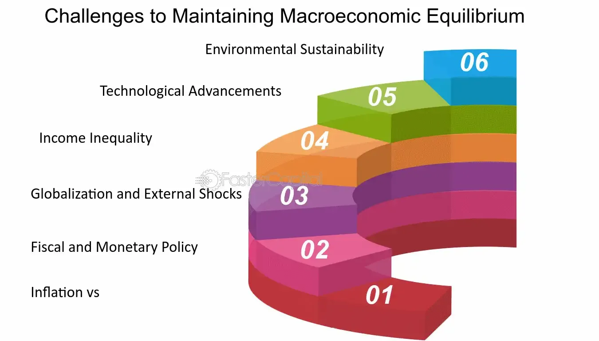

## Table of Contents

## What is macroeconomics and why is it important for policymakers?

Macroeconomics is the part of economics that looks at the big picture of a country's economy. It studies things like how much a country produces, how many people have jobs, how prices change over time, and how much money people spend. It's like looking at the economy from a helicopter, seeing the whole landscape instead of just one street.

Macroeconomics is really important for policymakers because it helps them make decisions that affect everyone in the country. For example, if they see that a lot of people are out of work, they might create programs to help people find jobs. Or if prices are going up too fast, they might change interest rates to slow things down. By understanding macroeconomics, policymakers can try to keep the economy stable and help it grow, which makes life better for everyone.

## What are the main goals of macroeconomic policy?

The main goals of macroeconomic policy are to keep the economy stable and help it grow. One big goal is to make sure there are enough jobs for everyone who wants to work. When lots of people have jobs, they can earn money and spend it on things they need and want, which helps the economy grow. Another goal is to keep prices from going up too fast. If prices rise too quickly, it can be hard for people to afford things, so policymakers try to keep inflation under control.

Another important goal is to make sure the economy doesn't grow too fast and then crash. This can happen if people and businesses borrow too much money and can't pay it back. Policymakers try to keep things balanced so the economy grows steadily without big ups and downs. Finally, they also want to make sure that the country's money is strong and trusted around the world. This helps the country trade with other countries and keeps the economy healthy.

In simple terms, macroeconomic policy aims to create a stable and growing economy where people can find jobs, prices stay reasonable, and the economy doesn't have big crashes. By focusing on these goals, policymakers can help make life better for everyone in the country.

## What is inflation and why is it a challenge for policymakers?

Inflation is when the prices of things we buy, like food, clothes, and gas, go up over time. It's like everything getting more expensive, and it means that the money we have can buy less stuff than before. Imagine if a candy bar that cost $1 last year now costs $1.10. That's inflation at work. A little bit of inflation is normal and can even be good for the economy because it encourages people to spend money now rather than later. But if inflation gets too high, it can be a big problem.

The challenge for policymakers is to keep inflation at a level that's just right—not too high, but not too low either. If inflation is too high, it can make life hard for people because their money doesn't go as far. They might struggle to pay for basic things like food and rent. On the other hand, if inflation is too low or even negative (called deflation), people might stop spending money because they think prices will keep falling, which can slow down the economy. Policymakers use tools like changing interest rates to try to keep inflation in check, but it's a tricky balance to maintain.

## How does unemployment affect the economy and what can policymakers do about it?

Unemployment is when people who want to work can't find jobs. When a lot of people are out of work, it can hurt the economy in big ways. If people don't have jobs, they don't have money to spend on things they need and want. When people aren't spending, businesses make less money and might have to lay off more workers or even close down. This can start a cycle where more and more people lose their jobs, making the economy weaker. Also, when a lot of people are unemployed, the government has to spend more on helping them, like with unemployment benefits, which can put a strain on the government's budget.

Policymakers can do a few things to try to lower unemployment. One way is to create programs that help people find jobs, like job training or helping them move to places where there are more job opportunities. They can also try to make the economy grow by spending more on things like building roads and schools, which can create jobs. Another way is to make it easier for businesses to start up and grow by cutting taxes or making rules less strict. By doing these things, policymakers hope to get more people working and help the economy get stronger.

## What is economic growth and what challenges do policymakers face in promoting it?

Economic growth is when a country's economy gets bigger over time. It means that people are making and buying more stuff, and the total value of everything produced in the country goes up. This is usually measured by something called Gross Domestic Product, or GDP. When the economy grows, more people can find jobs, and people can have more money to spend on things they need and want. This makes life better for everyone in the country.

Policymakers face a lot of challenges when trying to promote economic growth. One big challenge is making sure that the growth is steady and doesn't go too fast or too slow. If the economy grows too fast, it can lead to problems like high inflation, where prices go up too quickly. But if it grows too slowly, it can lead to high unemployment, where a lot of people can't find jobs. Policymakers have to find a balance, using tools like changing interest rates or spending more on things like roads and schools to keep the economy growing at the right pace.

Another challenge is making sure that the growth helps everyone, not just a few people. Sometimes, economic growth can make the rich richer while the poor don't see much change. Policymakers have to think about how to spread the benefits of growth so that everyone in the country can enjoy a better life. This might mean making policies that help people get better education and healthcare, or creating programs that support small businesses and workers. It's a big job, but when done right, it can lead to a stronger and fairer economy.

## How do fiscal policies impact macroeconomic stability and what are the challenges in implementing them?

Fiscal policies are the ways the government manages its spending and taxes to affect the economy. When the government spends more money or cuts taxes, it can help the economy grow by putting more money into people's pockets. This can lead to more spending, more jobs, and a healthier economy. But if the government spends too much and runs big deficits, it can lead to problems like higher inflation or more debt, which can make the economy unstable. On the other hand, if the government raises taxes or cuts spending, it can slow down the economy and help control inflation, but it might also lead to less growth and more unemployment.

Implementing fiscal policies comes with a lot of challenges. One big challenge is timing. It can take a while for changes in spending and taxes to affect the economy, so policymakers need to guess what the economy will be like in the future. If they get it wrong, their policies might make things worse instead of better. Another challenge is politics. Different people and groups have different ideas about what the government should do with its money, and it can be hard to get everyone to agree on the best plan. This can lead to delays or compromises that might not be the best for the economy. Finally, there's the challenge of balancing short-term needs with long-term goals. The government might need to spend more now to help the economy, but it also needs to think about how to pay for that spending in the future without causing more problems.

## What are monetary policies and what difficulties do central banks encounter in using them effectively?

Monetary policies are the ways that central banks control the amount of money in the economy and the cost of borrowing it. They do this mainly by changing interest rates. When they lower interest rates, it becomes cheaper for people and businesses to borrow money. This can help the economy grow because people can spend more and businesses can invest more. But if the central bank raises interest rates, borrowing becomes more expensive, which can slow down the economy and help control inflation. The central bank's goal is to keep the economy growing steadily without letting inflation get out of control.

Central banks face a lot of challenges when trying to use monetary policies effectively. One big challenge is figuring out the right time to change interest rates. It can take months for the effects of a rate change to show up in the economy, so central banks have to predict what the economy will be like in the future. If they make a wrong guess, their actions might not help and could even make things worse. Another challenge is dealing with unexpected events, like a financial crisis or a global health emergency, which can make it hard to keep the economy stable. Central banks also have to balance their actions with what other countries' central banks are doing, because what happens in one country can affect others. It's a tricky job, but when done well, monetary policies can help keep the economy on track.

## How do exchange rates influence a country's economy and what are the policy challenges associated with them?

Exchange rates are like the price of one country's money compared to another country's money. They can affect a country's economy a lot. When a country's money is strong, it means their money can buy more foreign money. This can be good because it makes things cheaper to buy from other countries. But it can also make it harder for that country to sell things to other countries because their products become more expensive for foreigners. On the other hand, if a country's money is weak, their products become cheaper for other countries to buy, which can help their businesses sell more stuff abroad. But it also means that things from other countries become more expensive, which can make life harder for people at home.

Policymakers face a lot of challenges when it comes to exchange rates. One big challenge is figuring out if they should let the exchange rate change freely or if they should try to control it. Letting it change freely can be good because it lets the market decide, but it can also lead to big ups and downs that can hurt the economy. Trying to control it can help keep things stable, but it can be hard to do and might not work if other countries don't do the same thing. Another challenge is that what happens in other countries can affect a country's exchange rate. If another country's economy is doing really well or really badly, it can change the value of their money compared to other countries. Policymakers have to keep an eye on what's happening around the world and try to make the best decisions for their own country's economy.

## What is the impact of income inequality on macroeconomic policy and how can it be addressed?

Income inequality is when some people in a country have a lot more money than others. This can make it harder for policymakers to keep the economy stable and growing. When a lot of money is in the hands of just a few people, it can mean that most people don't have enough money to spend on things they need and want. This can slow down the economy because businesses make less money if people aren't buying their stuff. Also, if the rich get richer and the poor stay poor, it can lead to problems like more crime or less trust in the government, which can make it even harder to make good economic policies.

To address income inequality, policymakers can try a few things. One way is to make tax policies that ask rich people to pay a bit more, and then use that money to help people who don't have as much. This can be done through things like better schools, more healthcare, or programs that help people find jobs. Another way is to make sure that everyone has a fair chance to get a good education and good job opportunities. This can help more people earn more money and reduce the gap between the rich and the poor. By working on these things, policymakers can help make the economy stronger and fairer for everyone.

## How do global economic interdependencies complicate macroeconomic policymaking?

Global economic interdependencies mean that what happens in one country can affect other countries. For example, if a big country like the United States has a strong economy, it can help other countries because more people in the US will buy things from around the world. But if the US economy slows down, it can hurt other countries because they might sell less stuff to the US. This makes it harder for policymakers in each country to make good decisions because they have to think about what's happening in other countries too, not just their own.

Policymakers have to be careful because their actions can have effects beyond their own borders. If a country decides to lower interest rates to help its own economy grow, it might make its money weaker, which can help its businesses sell more stuff abroad but make things from other countries more expensive at home. Other countries might not like this and could decide to change their own policies in response, which can start a chain reaction that makes things more complicated. It's like trying to play a game where everyone's moves affect everyone else, and it can be really hard to keep everything balanced and working well.

## What role do expectations and consumer confidence play in macroeconomic outcomes and policy effectiveness?

Expectations and consumer confidence are really important for how well the economy does. They're like the feelings people have about the future. If people think the economy will do well, they'll spend more money and businesses will invest more, which can help the economy grow. But if people are worried and think things will get worse, they might save their money instead of spending it, and businesses might not want to start new projects. This can slow down the economy. So, what people expect and how confident they feel can make a big difference in whether the economy grows or shrinks.

Policymakers have to think about these expectations and confidence levels when they make their plans. If they can make people feel good about the future, it can help their policies work better. For example, if the government says it's going to spend more money on things like roads and schools, and people believe it, they might start spending more themselves because they think the economy will get better. But if people don't trust what the policymakers are saying, they might not change their behavior, and the policies might not work as well. So, keeping people's expectations positive and their confidence high is a big part of making sure macroeconomic policies can help the economy.

## How can policymakers balance short-term economic needs with long-term sustainability goals?

Policymakers have a tough job trying to balance what the economy needs right now with what it will need in the future. In the short term, they might need to spend more money or cut taxes to help people who are struggling or to get the economy growing again. This can be really important because it helps people right away and can stop the economy from getting worse. But if they focus too much on the short term, they might borrow too much money or let problems like pollution and climate change get worse, which can hurt the economy in the long run.

To balance these needs, policymakers need to think about both the present and the future. They can do this by making plans that help the economy now but also take care of things like the environment and the country's debt. For example, they could spend money on green energy projects that create jobs today and help fight climate change in the future. It's like trying to walk a tightrope – they have to keep moving forward while making sure they don't fall off on either side. By doing this, they can help make the economy strong and healthy for everyone, now and in the years to come.

## How does Mathematical Economics Bridge Theory and Practice?

Mathematical economics uses advanced mathematical techniques and models to articulate economic theories, replacing verbal logic with precise mathematical expressions. This approach translates abstract economic concepts into testable hypotheses, enhancing clarity and communication among economists. The quantification and formalization of economic theories allow for explicit assumptions and derivations, fostering precision and consistency in economic analysis.

Econometrics, an indispensable tool in this discipline, integrates economic theory with data through statistical and mathematical techniques. It serves as a bridge, linking theoretical models to real-world data, enabling empirical validation of economic hypotheses. For instance, econometric models can be employed to test the validity of the demand theory by estimating demand functions based on observed data. The standard linear regression model, represented mathematically as:

$$
Y = \beta_0 + \beta_1X_1 + \beta_2X_2 + \cdots + \beta_nX_n + \epsilon
$$

where $Y$ is the dependent variable, $X_1, X_2, \ldots, X_n$ are independent variables, $\beta_0, \beta_1, \ldots, \beta_n$ are parameters, and $\epsilon$ is the error term, exemplifies how econometrics functions to quantify relationships within economic data.

Despite its advantages, mathematical economics faces criticism for potential oversimplification of complex human behaviors and economic interactions. Variables in mathematical models may not fully encapsulate the social and psychological factors influencing economic decisions. Nevertheless, the precision and replicability provided by mathematical modeling are invaluable for policy formulation and decision-making processes. These models allow for simulations and predictions, assisting policymakers in evaluating the impact of potential economic policies before implementation.

Emerging computational techniques and data science continue to enhance the capabilities of mathematical economics. Advanced algorithms and [machine learning](/wiki/machine-learning) methods are being integrated, facilitating the handling of more complex datasets and nonlinear relationships. This enhancement promises to address the criticism of oversimplification by offering more nuanced analyses that incorporate a wider array of variables and potential outcomes. Through continuous refinement and integration of qualitative insights, mathematical economics stands to offer even more robust frameworks for understanding and influencing economic trends.

## References & Further Reading

[1]: Bergstra, J., Bardenet, R., Bengio, Y., & Kégl, B. (2011). ["Algorithms for Hyper-Parameter Optimization."](https://papers.nips.cc/paper/4443-algorithms-for-hyper-parameter-optimization) Advances in Neural Information Processing Systems 24.

[2]: ["Advances in Financial Machine Learning"](https://www.amazon.com/Advances-Financial-Machine-Learning-Marcos/dp/1119482089) by Marcos Lopez de Prado

[3]: ["Evidence-Based Technical Analysis: Applying the Scientific Method and Statistical Inference to Trading Signals"](https://www.amazon.com/Evidence-Based-Technical-Analysis-Scientific-Statistical/dp/0470008741) by David Aronson

[4]: ["Machine Learning for Algorithmic Trading"](https://github.com/stefan-jansen/machine-learning-for-trading) by Stefan Jansen

[5]: ["Quantitative Trading: How to Build Your Own Algorithmic Trading Business"](https://www.amazon.com/Quantitative-Trading-Build-Algorithmic-Business/dp/1119800064) by Ernest P. Chan