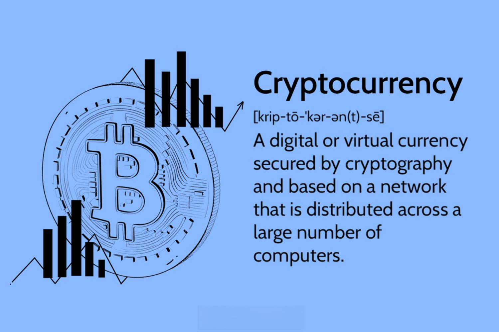

Cryptocurrency algorithmic trading (algo trading) has emerged as a transformative method in the evolving world of finance, allowing traders to maximize potential returns by using technology to their advantage. Unlike manual trading, which relies on a trader's instincts and interpretations, algo trading deploys automated platforms and algorithms to make split-second decisions based on predefined sets of rules and real-time data analysis. This technological shift has positioned algo trading as an integral part of modern financial markets, offering the promise of enhanced efficiency and execution speed.

Despite its increasing popularity, there are numerous misconceptions and myths surrounding crypto algo trading that often lead to confusion among both novice and seasoned traders. These misunderstandings can result in unrealistic expectations or misinformed strategies, potentially leading to financial losses rather than the envisioned profits. This article aims to address such myths and misconceptions by providing a clear elucidation of what crypto algo trading truly entails. 



We will examine the tangible benefits of utilizing this advanced trading method, such as improved accuracy and strategic automation, as well as its inevitable limitations, including vulnerability to market volatility and the necessity of continuous oversight. By addressing these points, we intend to separate fact from fiction, presenting a nuanced picture that acknowledges the utility of algo trading while also cautioning against its potential pitfalls.

By the end of this article, we expect readers to have a well-rounded understanding of crypto algo trading. They will be equipped not only with insight into the various facets that characterize algorithmic trading but also with a realistic view that underscores the importance of combining these tools with thorough market analysis and sound risk management practices. This foundational knowledge is crucial for anyone considering integrating cryptocurrency algo trading into their broader financial strategy.

## Table of Contents

## What is Cryptocurrency Algorithmic Trading?

Cryptocurrency algorithmic trading, commonly referred to as crypto algo trading, employs automated platforms and algorithms for trading digital currencies. This sophisticated approach leverages computer programs to execute trades at speeds and volumes impractical for human traders. The core advantage of algo trading lies in its ability to manage large datasets and perform complex calculations swiftly, leading to optimized trading decisions. 

In traditional finance, algo trading has been a well-established practice, efficiently handling repetitive and high-[volume](/wiki/volume-trading-strategy) tasks such as [arbitrage](/wiki/arbitrage), [market making](/wiki/market-making), and [trend following](/wiki/trend-following). Its success in traditional markets has naturally extended to the crypto market, where volatility and 24/7 operations provide fertile ground for algorithmic strategies to thrive.

At the heart of [cryptocurrency](/wiki/cryptocurrency) algo trading are the algorithms themselves—sets of specific rules and statistical models designed to make trading decisions. These algorithms can range from simple strategies, like executing a trade when a specific price point is reached, to more complex systems incorporating [machine learning](/wiki/machine-learning) and [artificial intelligence](/wiki/ai-artificial-intelligence) to predict market movements.

A basic example of a trading algorithm might involve a moving average crossover strategy, where the program buys or sells a cryptocurrency based on the crossing points of two moving averages with different time frames:

```python
# Example of a simple moving average crossover strategy
import pandas as pd

# Load historical crypto price data
crypto_data = pd.read_csv('crypto_prices.csv')

# Calculate short-term and long-term moving averages
crypto_data['Short_MA'] = crypto_data['Close'].rolling(window=50).mean()
crypto_data['Long_MA'] = crypto_data['Close'].rolling(window=200).mean()

# Generate trading signals
crypto_data['Signal'] = 0
crypto_data['Signal'][50:] = [1 if crypto_data['Short_MA'][i] > crypto_data['Long_MA'][i] else 0 for i in range(50, len(crypto_data))]

# Determine positions based on signals
crypto_data['Position'] = crypto_data['Signal'].diff()

# View trading signals
print(crypto_data[['Close', 'Short_MA', 'Long_MA', 'Signal', 'Position']])
```

In this example, the algorithm computes a short-term and long-term moving average of a cryptocurrency's closing prices. A buy signal is generated when the short-term average crosses above the long-term average, indicating a potential upward trend.

The expansion of algo trading in the crypto market is facilitated by several factors, including the continuous trading hours, the diverse range of digital assets, and advanced trading platforms offering API access for algorithmic deployment. Understanding how these algorithms function is crucial in demystifying crypto algo trading and navigating its potential effectively. By automating the trading process, participants can potentially capitalize on market opportunities while minimizing human errors.

## Myth 1: Crypto Algo Trading is a Get-Rich-Quick Scheme

One prevalent myth surrounding cryptocurrency [algorithmic trading](/wiki/algorithmic-trading) is the perception that it serves as a guaranteed pathway to rapid wealth accumulation. While crypto algo trading indeed offers the potential to enhance trading efficiency and optimize strategy execution, it is crucial to acknowledge that it does not inherently eliminate risk nor ensure quick profits.

Algorithmic trading operates on the foundation of programmatically executing trades based on predefined criteria. This automation facilitates improved reaction times to market events and the ability to manage a more significant number of transactions than would be feasible manually. However, the success of these algorithms largely depends on their underlying assumptions and data inputs.

A successful algo trading strategy requires comprehensive market analysis. This involves scrutinizing historical data to identify patterns and trends that may offer predictive insights. Such analysis often employs statistical models and machine learning techniques to forecast price movements. However, these predictions are inherently uncertain due to the volatile nature of cryptocurrency markets. A simple example in Python could illustrate the calculation of moving averages, a common component of many trading strategies:

```python
import pandas as pd

# Assuming df is a pandas DataFrame with a 'Price' column
df['20_MA'] = df['Price'].rolling(window=20).mean()
df['50_MA'] = df['Price'].rolling(window=50).mean()
```

Strategic planning is also a cornerstone of effective algo trading. This entails setting clear trade objectives, risk thresholds, and [exit](/wiki/exit-strategy) strategies. Developing a robust trading algorithm often involves [backtesting](/wiki/backtesting) on historical data to assess its reliability and performance across different market conditions. Through this iterative process, traders refine their strategies, attempting to account for various market scenarios.

Continuous monitoring of the algorithm's performance is essential. Market conditions can shift rapidly, rendering an initially profitable strategy ineffective. Regular oversight allows traders to adjust their algorithms in response to changing dynamics, such as shifts in [volatility](/wiki/volatility-trading-strategies) or [liquidity](/wiki/liquidity-risk-premium) levels.

Traders must exercise caution concerning platforms or services promising substantial returns with minimal effort. These claims often overlook the inherent risks and the level of expertise required to manage an algorithmic trading system effectively. The notion of effortless wealth through automation is misleading; instead, success in crypto algo trading stems from diligence, strategic foresight, and adaptability to market fluctuations.

In conclusion, while cryptocurrency algorithmic trading can significantly enhance the trade execution process and strategy implementation, it is not a foolproof mechanism for achieving quick profits. Understanding and navigating the associated risks, and maintaining rigorous strategic planning and monitoring processes, are critical for traders intending to utilize algo trading in their investment activities.

## Myth 2: Only Professionals Can Use Crypto Algo Trading

Cryptocurrency algorithmic trading (algo trading) is often perceived as the exclusive domain of professional or institutional traders. This perception is a misconception rooted in the historical complexity and technological barriers associated with algorithmic trading. However, this view does not hold true today.

A variety of platforms now offer user-friendly interfaces and tools that simplify the process of setting up and executing algorithmic trading strategies. For instance, platforms such as Binance, eToro, and Coinbase provide access to crypto markets with sophisticated yet easy-to-navigate features designed specifically to cater to traders without advanced technical knowledge. These platforms often include drag-and-drop interfaces and pre-configured algorithms, allowing novice traders to participate in algo trading without needing deep programming skills.

Further, the proliferation of educational resources has empowered individual investors to harness the benefits of algorithmic trading. Online courses, webinars, and forums provide valuable insights into market strategies, risk management, and algorithm design. As a result, even those with limited trading experience are now capable of understanding and implementing algorithmic strategies effectively.

A crucial aspect of this democratization is the availability of development environments and coding platforms that facilitate ease of access for those interested in writing their own trading algorithms. For instance, Python has emerged as the language of choice for many in the financial sector due to its simplicity and the extensive libraries available, such as Pandas for data manipulation and TensorFlow for machine learning applications.

```python
# Example of a simple moving average crossover algorithm in Python
import pandas as pd

def moving_average_strategy(data, short_window, long_window):
    signals = pd.DataFrame(index=data.index)
    signals['price'] = data['price']
    signals['short_mavg'] = data['price'].rolling(window=short_window, min_periods=1).mean()
    signals['long_mavg'] = data['price'].rolling(window=long_window, min_periods=1).mean()
    signals['signal'] = 0.0
    signals['signal'][short_window:] = [
        1.0 if signals['short_mavg'][i] > signals['long_mavg'][i] else 0.0 
        for i in range(short_window, len(signals))
    ]
    signals['positions'] = signals['signal'].diff()
    return signals
```

This drive towards accessibility has made algorithmic trading more inclusive than ever before, breaking the barriers that traditionally reserved such activities for experts. The development of no-code platforms further underscores this trend, as they allow users to create and automate trading strategies using visual programming techniques rather than traditional coding. This technology empowers aspiring traders, leveling the playing field between individuals and larger entities.

Ultimately, with the right educational resources and platforms, individual traders can overcome the challenges and stereotypes of crypto algo trading. The growing accessibility and democratization of trading technology ensure that algorithmic trading is not just for professionals but is a valuable tool for anyone looking to optimize their trading strategy.

## Myth 3: Algo Trading Eliminates All Risks

Many believe that using algorithms can eliminate all trading risks, which is a significant misunderstanding. While algorithmic trading provides a framework for executing trades with speed and accuracy, the inherent risks of financial markets remain. Automation addresses specific types of risk, such as human error or emotional decision-making, but it does not safeguard against market volatility or unforeseen events.

Market volatility refers to the frequency and magnitude of price movements within the financial markets. Algorithms operate based on pre-programmed rules and historical data, implying that sudden, unforeseen fluctuations in the market can still adversely impact trades. An example is a sudden news event or geopolitical incident that could result in rapid market shifts, rendering algorithmic predictions ineffective or outdated.

Traders must recognize that algorithmic trading strategies are not immune to errors or unforeseen market conditions. For instance, an algorithm may fail to execute a trade if it encounters conditions outside its programmed parameters. As such, it is vital to perform regular backtesting of trading algorithms. Backtesting involves running the algorithm with historical data to evaluate its performance and adapt it to changing market conditions.

Proper risk management practices are essential to mitigate the impact of these risks in any trading strategy, including algorithmic trading. Risk management involves the use of diversification, position sizing, and stop-loss orders to limit potential losses. Diversification reduces exposure by spreading investments across different assets, while position sizing ensures that no single trade poses a threat to the overall portfolio. Stop-loss orders automatically sell a security when its price falls below a predetermined level, curtailing further losses.

For instance, the following Python code snippet shows how to calculate the position size for a trade based on a predefined risk percentage of the total portfolio:

```python
def calculate_position_size(portfolio_value, risk_percentage, stop_loss_distance):
    risk_amount = portfolio_value * (risk_percentage / 100)
    position_size = risk_amount / stop_loss_distance
    return position_size

# Example usage
portfolio_value = 100000  # Total value of the portfolio in USD
risk_percentage = 1       # Risk only 1% of the portfolio on a single trade
stop_loss_distance = 2    # Distance of the stop-loss level in USD

position_size = calculate_position_size(portfolio_value, risk_percentage, stop_loss_distance)
print(f"Position Size: {position_size} units")
```

This approach integrates risk management directly into the trading strategy, reducing potential loss from volatile market movements. By acknowledging the limitations of algorithms and embracing robust risk management practices, traders can better protect their investments and make more informed decisions.

## Myth 4: Algorithms Function Perfectly Without Human Intervention

There's a widespread belief that once an algorithm is set, it can function flawlessly without human oversight. This is a misconception that can lead to misplaced trust in algorithmic systems. Although algorithms are powerful tools, they are not impervious to market dynamics or unforeseen anomalies.

Algorithms require continuous tweaking and supervision due to the ever-changing nature of financial markets. An algorithm successful today might not perform well tomorrow if it fails to account for shifts in market sentiment or unexpected geopolitical events. For instance, consider an algorithm optimized for a stable market condition: if a sudden market crash occurs, the strategy might need immediate adjustments. This highlights the necessity for ongoing evaluation and adaptation.

Human judgment plays a critical role in interpreting algorithmic results and making strategic adjustments. This is where the symbiotic relationship between humans and algorithms comes into play. While algorithms execute routine tasks with speed and accuracy, humans provide qualitative insights that machines may lack. For example, during significant news events, human traders might opt to adjust algorithmic parameters or even halt trading temporarily to prevent undesired losses.

A balance between automation and human intervention often leads to optimal results in algo trading. Consider a scenario where an algorithm detects a trend reversal pattern in the market. A human trader might review the pattern to ensure it aligns with broader macroeconomic indicators before allowing the algorithm to execute trades. This collaborative approach can enhance decision-making and mitigate risks that purely automated systems might overlook.

In summary, while algorithms are potent tools in cryptocurrency trading, they are not infallible. Continuous human oversight is essential to adjust for market volatility and interpret complex scenarios that algorithms alone might misjudge. This balanced approach ensures more sustainable and effective trading strategies.

## Myth 5: Crypto Algo Trading is Only About Speed

Cryptocurrency algorithmic trading is often misconceived as primarily focusing on speed, with many assuming that the main advantage lies in executing trades faster than human capacity. While speed certainly plays a role, the true strength of algo trading is found in precision, strategic execution, and data-driven decision-making.

Algorithms are capable of processing vast amounts of data within seconds, which enables them to identify patterns and trends that might be missed by human traders. For example, by analyzing past market data, an algorithm can detect price movements or anomalies that might indicate future market behavior. This ability to analyze large datasets quickly and accurately enhances the decision-making process, allowing traders to make informed choices and generate more effective trading strategies.

Furthermore, algorithms in trading are designed to execute strategies with high precision. Unlike humans, algorithms do not suffer from emotional biases or fatigue, ensuring consistent execution of the trading plan. This precision is particularly beneficial when employing complex trading strategies that involve multiple variables or require timely execution to maximize potential gains.

Speed, while important, is just one component of a much broader analytical capability offered by algo trading. The ability to uncover insights from raw data, back-test different strategies, and simulate market scenarios adds a layer of sophistication to trading operations. This analytical prowess enables traders to not only react to market conditions but also anticipate trends and adjust strategies proactively.

In conclusion, crypto algo trading is not merely about speed. Its true advantage is derived from the ability to make data-backed decisions that align with strategic objectives, thereby enhancing both the effectiveness and efficiency of trading activities.

## The Reality of Crypto Algo Trading

Understanding the realities of cryptocurrency algorithmic trading involves recognizing its capabilities and limitations. Algo trading leverages automated systems to execute trades with enhanced efficiency and effectiveness. These systems can rapidly analyze vast datasets and identify trading opportunities based on pre-determined criteria, offering a strategic advantage by minimizing human error and emotional decision-making.

However, it is crucial to acknowledge that algo trading is not a foolproof method for securing risk-free profits. The complexity of cryptocurrency markets—influenced by factors such as regulatory changes, technological developments, and market sentiment—means that risks remain inherent. Algorithimic strategies can help manage and mitigate these risks, but they cannot eliminate them entirely. As such, traders should not equate automation with guaranteed success.

Effective use of algo trading requires a well-rounded strategy that includes robust risk management procedures and continuous learning. Risk management might involve setting stop-loss orders and position-sizing rules to mitigate potential losses. Moreover, continuous learning is vital as it helps traders adapt their algorithms to new market conditions and refine their strategies based on performance analysis. 

Code Example:

```python
def calculate_position_size(capital, risk_per_trade, stop_loss):
    """
    Calculate the position size based on available capital,
    risk per trade as a fraction of capital, and stop-loss price.

    Parameters:
    capital: float - Total capital available for trading.
    risk_per_trade: float - Risk per trade as a percentage of capital (e.g., 0.02 for 2%).
    stop_loss: float - Percentage from the entry price (e.g., 0.05 for 5%).

    Returns:
    float - Position size.
    """
    return (capital * risk_per_trade) / stop_loss

# Example usage
capital = 100000  # $100,000
risk_per_trade = 0.02  # 2% risk
stop_loss = 0.05  # 5% stop loss

position_size = calculate_position_size(capital, risk_per_trade, stop_loss)
print(f"Position size: ${position_size:.2f}")
```

The algorithmic approach can provide significant insights into price movements and potential entry/exit points, but it requires ongoing supervision and adjustment. Human judgment remains a critical element in interpreting algorithm-generated data and responding to unforeseen market dynamics.

In summary, while crypto algo trading can be a powerful tool within a trader's arsenal, it should be employed as one component of a comprehensive trading strategy. Integrating risk management practices and fostering a mindset of continuous improvement in algorithmic system development are essential for maximizing the benefits and mitigating the risks associated with algorithmic trading in the cryptocurrency market.

## Conclusion

Cryptocurrency algorithmic trading presents novel opportunities for enhancing trading operations, yet it is often clouded by several misconceptions that can lead traders astray. By dispelling these myths, traders gain a clearer perspective, enabling them to establish realistic expectations and better navigate the trading landscape. Understanding both the strengths and limitations of algo trading allows traders to make informed decisions about its integration into their trading strategies. The technology, while powerful, is not a shortcut to guaranteed profits but rather a sophisticated tool that requires strategic application.

As the cryptocurrency market continues to grow and evolve, continuous learning and adaptation become pivotal for traders aiming to exploit the full potential of algorithmic trading. The dynamics of the crypto market can shift rapidly, necessitating a proactive approach grounded in substantial market knowledge and sound trading principles. By maintaining an emphasis on educational development and staying abreast of technological advancements, traders can optimize their use of algorithmic trading systems, tailoring them to maximize precision and effectiveness. Thus, embracing an approach that combines both automated technology and human insight is essential for those seeking to thrive amidst the complexity of the crypto trading environment.

## References & Further Reading

[1]: Bergstra, J., Bardenet, R., Bengio, Y., & Kégl, B. (2011). ["Algorithms for Hyper-Parameter Optimization."](https://papers.nips.cc/paper/4443-algorithms-for-hyper-parameter-optimization) Advances in Neural Information Processing Systems 24.

[2]: ["Advances in Financial Machine Learning"](https://www.amazon.com/Advances-Financial-Machine-Learning-Marcos/dp/1119482089) by Marcos Lopez de Prado

[3]: ["Evidence-Based Technical Analysis: Applying the Scientific Method and Statistical Inference to Trading Signals"](https://www.amazon.com/Evidence-Based-Technical-Analysis-Scientific-Statistical/dp/0470008741) by David Aronson

[4]: ["Machine Learning for Algorithmic Trading"](https://github.com/PacktPublishing/Machine-Learning-for-Algorithmic-Trading-Second-Edition) by Stefan Jansen

[5]: ["Quantitative Trading: How to Build Your Own Algorithmic Trading Business"](https://www.amazon.com/Quantitative-Trading-Build-Algorithmic-Business/dp/0470284889) by Ernest P. Chan