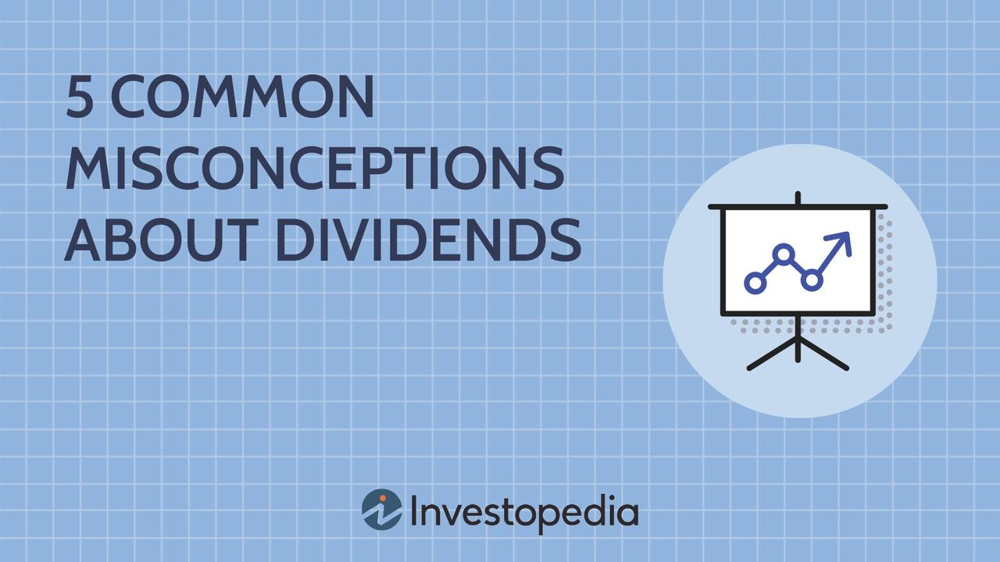

The stock market offers a plethora of investment opportunities, with dividend stocks being one of the more favored strategies among investors. Dividend stocks are appealing due to their potential to provide a steady income stream, particularly for those looking to generate passive income. However, despite their widespread popularity, several myths and misconceptions cloud investors' understanding of dividend stocks, stock market investing, and algorithmic trading. These misunderstandings can lead to misguided investment decisions and suboptimal returns.

One common misconception is that high dividend yields are inherently beneficial. While a high yield indicates that a company is returning a substantial portion of its profits to shareholders, it may also suggest limited reinvestment into the company's growth. Consequently, this could signal a lack of future growth prospects. Therefore, investors need to assess the sustainability of a company's dividend strategy by considering its dividend payout ratio. A sustainable payout ratio is typically one that allows the company to maintain or grow its dividends while reinvesting enough in its business to support future growth.



Dividend stocks are often perceived as stable but uninspiring investments, typically associated with industries that exhibit slow growth, such as utilities. Contrary to this belief, there are dividend stocks with significant growth potential, driven by increasing dividends or new dividend announcements. Investors should not focus solely on the dividend yield but should also evaluate the company's overall growth potential, considering factors such as cash flow and organic business growth.

Algorithmic trading has had a profound impact on the stock market, yet it is frequently shrouded in misconceptions. Some investors believe that algorithmic trading is a flawless strategy that guarantees profits. This is a fallacy, as algorithmic trading, like any other investment method, carries inherent risks and limitations. Understanding these risks is critical for investors to set realistic expectations and effectively leverage algorithmic trading as part of their strategy.

Another prevalent myth is the belief that a portfolio focused solely on dividend stocks provides adequate diversification. While dividend stocks can be an essential component of a diversified portfolio, limiting investments to them can lead to an over-concentration in specific sectors, increasing vulnerability to market downturns in those areas. A truly diversified portfolio should include a mix of growth and dividend stocks to optimize returns and minimize risk exposure.

It is vital for investors to grasp the distinct roles played by individual dividend stocks and dividend-focused funds. While investing in individual dividend stocks involves direct ownership and specific company risk, dividend funds pool investments, offering a diversified approach within the dividend investing parameter. Understanding these differences in the context of one's financial goals helps investors decide between direct stock ownership and more diversified fund strategies.

In summary, a comprehensive understanding of the myths surrounding dividend stocks, stock market investing, and algorithmic trading enables investors to make more informed decisions. With clear insights and strategic analysis, investors can maximize their potential returns by navigating these complex investment avenues wisely.

## Table of Contents

## The Myth of High Dividend Yields

High dividend yields are often attractive to investors seeking immediate income, but the assumption that they are always beneficial can be misleading. A high dividend yield, calculated as the annual dividends per share divided by the price per share, might initially suggest that a company is generously rewarding its shareholders. However, several factors warrant a closer examination.

Firstly, a high dividend yield might indicate that a company is allocating a large proportion of its profits to dividends, which can limit reinvestment opportunities necessary for future growth. Companies must balance between sharing profits with shareholders and reinvesting earnings back into the business for expansion, innovation, or debt reduction. When a company prioritizes high dividend payouts, it could imply insufficient investment in future growth opportunities, potentially stunting long-term company viability and share price appreciation.

To gain a clearer perspective, investors should examine the dividend payout ratio. This ratio, expressed as:

$$
\text{Dividend Payout Ratio} = \frac{\text{Dividends Per Share}}{\text{Earnings Per Share}}
$$

offers insight into how much of a company's earnings are distributed as dividends. A high ratio might indicate that a company is paying out more in dividends than it is earning, which may not be sustainable over the long term. 

Moreover, a company with a dramatically low stock price, perhaps due to market [volatility](/wiki/volatility-trading-strategies) or declining business performance, can also show a deceptively high yield. This scenario suggests that the yield is inflated more because of falling share prices than actual dividend growth, signaling potential financial instability.

Thus, while high dividend yields can seem advantageous, it is crucial for investors to scrutinize the underlying financial health of the company and its dividend strategy. By thoroughly evaluating both the dividend payout ratio and the broader financial context, investors can better gauge whether a high dividend yield is sustainable and aligns with their long-term investment goals. This approach helps distinguish between firms that are genuinely rewarding their shareholders and those that might be masking underlying financial challenges.

## Dividend Stocks - Stability and Boredom?

Dividend stocks have long been considered stable investments, frequently associated with companies operating in mature and slow-growth industries such as utilities, consumer staples, and telecommunications. These companies typically distribute a significant portion of their earnings as dividends, providing a reliable income stream to investors. However, labeling dividend stocks as merely "stable but boring" overlooks their potential for growth and dynamic changes within certain sectors.

Contrary to the perception of monotony, some dividend stocks can exhibit attractive growth prospects. This potential growth often arises from periodic announcements of dividend increases, which signal a company's robust financial health and confidence in its future performance. For instance, companies like Microsoft, which operates outside the traditional slow-growth sectors, have been known to provide attractive dividends while maintaining substantial growth prospects. The key is to identify companies that balance rewarding shareholders with dividends and reinvesting in business development.

Investors should adopt a holistic approach, analyzing various financial metrics beyond just the dividend yield. The yield is calculated as:

$$
\text{Dividend Yield} = \left(\frac{\text{Annual Dividends Per Share}}{\text{Price Per Share}}\right) \times 100
$$

While this formula provides a snapshot of the income return from holding a stock, it doesn't capture the company's growth potential. A high dividend yield might result from a declining stock price rather than an increasing dividend. Therefore, it's crucial to assess the sustainability of dividend payments through metrics such as the payout ratio and operational metrics like cash flow. The dividend payout ratio, defined as:

$$
\text{Payout Ratio} = \left(\frac{\text{Dividends Per Share}}{\text{Earnings Per Share}}\right) \times 100
$$

indicates the proportion of earnings paid out as dividends. A very high payout ratio may suggest that the company is returning too much profit to shareholders at the expense of future growth opportunities.

In evaluating potential growth, investors should also examine the company's cash flow statement and strategy for organic growth. Healthy cash flows indicate the company's capacity to maintain or increase dividends without compromising its innovation or expansion plans. Additionally, strategic investments in research and development, market expansion, or acquisitions can lead to substantial growth, even among companies traditionally viewed as dividend stalwarts.

In conclusion, while dividend stocks are sometimes perceived in terms of stability and predictability, understanding the broader financial health and strategic direction of a company can uncover opportunities that defy this stereotype. Evaluating factors such as cash flow, payout ratios, and growth strategies can provide insights into the real potential of dividend-paying stocks, revealing them as lucrative components for long-term investment strategies.

## Algorithmic Trading - Misconceptions and Realities

Algorithmic trading, characterized by the use of computer algorithms to execute trades, has significantly transformed modern financial markets. Despite its advantages, several misconceptions about the practice persist, affecting how it is perceived by investors.

Firstly, the notion that [algorithmic trading](/wiki/algorithmic-trading) is infallible and a guaranteed path to profits is fundamentally flawed. Algorithms are programmed to follow specific sets of rules and can process vast amounts of data for efficient decision-making. However, they are not immune to errors or market anomalies. Mispricing, unexpected market events, or erroneous data inputs can lead to substantial losses. For instance, the "Flash Crash" of May 6, 2010, is a notable example where automated trading systems contributed to a rapid market decline, causing a temporary, dramatic price drop in the U.S. stock market.

One important limitation of algorithmic trading is its reliance on historical data. While algorithms can be optimized based on past trends, they may not predict future market conditions accurately. This is encapsulated in the saying, "Past performance is not indicative of future results." Model risk is another critical [factor](/wiki/factor-investing), as algorithms are only as good as the assumptions that underpin them. If market conditions deviate from the normal patterns for which the algorithm was designed, it might produce suboptimal results.

To address these misconceptions, it is essential for investors to recognize the limitations and risks of algorithmic trading. Algorithms can amplify the impact of [liquidity](/wiki/liquidity-risk-premium) shortages and expose traders to execution risks, such as slippage, where the order is filled at a different price than expected. Moreover, regulatory risks exist as well, with potential changes in market rules affecting algorithmic strategies.

Investors and traders can better utilize algorithmic trading by maintaining realistic expectations and implementing risk management strategies. Diversification across different algorithms and asset classes can help mitigate some risks. Additionally, continuous monitoring and adjustment of trading algorithms ensure their relevance and effectiveness in changing market conditions. Using advanced risk metrics and stress-testing models can also provide insights into potential vulnerabilities.

In conclusion, while algorithmic trading offers powerful tools for streamlined and efficient trading, understanding its inherent risks and limitations is crucial for leveraging its full potential without falling prey to common myths. This knowledge is vital for anyone looking to use algorithmic trading as part of their investment strategy.

## Investment Diversification Myths

A common misconception among investors is that a focus solely on dividend stocks provides sufficient diversification. While dividend stocks can offer a consistent income through regular payouts and potentially lower volatility, relying entirely on them can inadvertently narrow the scope of an investment portfolio. This approach can expose investors to sector-specific risks, as dividend-paying companies are often concentrated in industries like utilities, consumer staples, and real estate. These sectors may be less volatile but can still be susceptible to unique economic factors that may not affect other sectors in the same way.

For instance, during [interest rate](/wiki/interest-rate-trading-strategies) hikes, utility stocks often face pressure as their debt servicing costs increase, potentially impacting their dividend distributions. Similarly, consumer staples might be vulnerable to changes in consumer spending habits. This sector-specific exposure underscores the importance of diversifying across industries to mitigate risks associated with any single economic condition.

To optimize returns and minimize risks, a well-rounded portfolio should incorporate a balance of growth and dividend stocks. Growth stocks, typically found in the technology and healthcare sectors, may not provide immediate income through dividends but offer the potential for capital appreciation as companies reinvest their profits to fuel expansion. Including [growth stocks](/wiki/growth-stocks) can enhance a portfolio's overall return potential, especially during economic cycles favoring innovation and technological advancement.

The concept of diversification is grounded in Modern Portfolio Theory (MPT), which suggests that an optimal portfolio maximizes returns for a given level of risk by combining a variety of asset types. Mathematically, this can be represented as finding the efficient frontier where the portfolio's expected return is maximized for a specific risk level, often measured by standard deviation.

```python
import numpy as np
import scipy.optimize as sco

# Example: Calculating an efficient frontier for a sample portfolio
returns = np.array([0.02, 0.08])  # Example expected returns
cov_matrix = np.array([[0.0001, 0.0001],
                       [0.0001, 0.001]])  # Example covariance matrix

def portfolio_return(weights, returns):
    return np.dot(weights, returns)

def portfolio_volatility(weights, cov_matrix):
    return np.sqrt(np.dot(weights.T, np.dot(cov_matrix, weights)))

def min_function_sharpe(weights, returns, cov_matrix):
    return -portfolio_return(weights, returns) / portfolio_volatility(weights, cov_matrix)

num_assets = len(returns)
constraints = ({'type': 'eq', 'fun': lambda x: np.sum(x) - 1})
bounds = tuple((0, 1) for _ in range(num_assets))
result = sco.minimize(min_function_sharpe, num_assets*[1./num_assets,], args=(returns, cov_matrix),
                      method='SLSQP', bounds=bounds, constraints=constraints)

weights_optimal = result['x']
return_optimal = portfolio_return(weights_optimal, returns)
volatility_optimal = portfolio_volatility(weights_optimal, cov_matrix)

weights_optimal, return_optimal, volatility_optimal
```

In this Python example, given hypothetical expected returns and a covariance matrix, the optimal weights for minimizing portfolio risk are calculated to illustrate how diverse asset allocation can lead to an efficient balance of risk and return.

In conclusion, while dividend stocks are appealing for their income generation, true diversification requires a broader investment approach. By strategically incorporating different asset classes, such as growth stocks, investors can protect their portfolios from sector-specific downturns and enhance long-term growth potential.

## The Role of Dividend Stocks and Dividend Funds

Understanding the distinction between individual dividend stocks and dividend-focused funds is essential for investors aiming to align their investments with financial goals. Dividend stocks are shares in individual companies that pay out a portion of their earnings to shareholders in the form of dividends. Owning these stocks provides direct equity ownership in a company, allowing investors to benefit from both the dividend income and any capital appreciation of the stock.

On the other hand, dividend-focused funds, such as mutual funds or exchange-traded funds (ETFs), pool together investments from numerous shareholders to collectively invest in a diversified portfolio of dividend-paying stocks. This diversification within the dividend investing strategy can help mitigate the risks associated with holding individual stocks, such as company-specific downturns or dividend cuts. 

When choosing between these two investment strategies, investors should consider their risk tolerance, financial goals, and investment horizon. Direct investment in dividend stocks might be suitable for those who prefer to have control over the selection of specific companies and have the capacity to manage a concentrated portfolio. Conversely, dividend funds may appeal to investors seeking diversification and a hands-off approach, as these funds are managed by professional portfolio managers who decide on the composition of the fund based on certain criteria.

Moreover, investors should analyze the expense ratios of dividend funds, as these can affect the net returns. While funds provide diversification, the associated management fees can sometimes reduce the overall yield. Thus, evaluating the trade-offs between potential returns and costs is crucial in fund selection.

In summary, the decision between investing in individual dividend stocks or opting for dividend-focused funds hinges on various factors, including the investor’s personal preferences and financial objectives. Assessing these elements can lead to a more tailored investment strategy, aligning with the investor’s needs while striving for potential income and growth.

## Conclusion: Separating Myth from Reality

Investors should exercise caution when navigating the complexities of dividend stocks and algorithmic trading, as misconceptions can lead to misguided strategies and suboptimal investment outcomes. By approaching these investment avenues with a clearer understanding, individuals are better equipped to make informed decisions that align with their financial goals.

A comprehensive analysis of dividend stocks involves more than assessing high dividend yields; it requires a thorough evaluation of a company’s financial health and growth prospects. Investors should pay careful attention to metrics such as the dividend payout ratio, which reflects the proportion of earnings paid out as dividends. This ratio can be an indicator of a company's sustainability in maintaining its dividend payments without compromising potential growth.

Equation for Dividend Payout Ratio:
$$
\text{Dividend Payout Ratio} = \frac{\text{Dividends per Share}}{\text{Earnings per Share}}
$$

Algorithmic trading, while a powerful tool in the modern investment landscape, is not devoid of risks. Investors should acknowledge that algorithms depend on historical data and predefined rules, which may not always account for unforeseen market anomalies. Therefore, setting realistic expectations regarding algorithmic performance and understanding its limitations is imperative.

A well-rounded investment strategy prioritizes diversification, balancing dividend-paying stocks with growth equities to spread risk and enhance overall returns. Concentrating solely on dividend stocks might expose investors to sector-specific volatility. A diversified portfolio seeks to mitigate such risks, ensuring it doesn't rely heavily on a single investment style or sector.

In conclusion, separating myth from reality in dividend investing and algorithmic trading allows investors to construct strategic portfolios tailored to their risk tolerance and financial objectives. By integrating a diversified approach with a detailed analysis of each element's risks and benefits, investors can potentially maximize their investment potential. Embracing evidence-based practices over common myths will foster a more resilient and effective investment strategy.

## References & Further Reading

[1]: ["The Little Book of Common Sense Investing: The Only Way to Guarantee Your Fair Share of Stock Market Returns"](https://www.amazon.com/Little-Book-Common-Sense-Investing/dp/1119404509) by John C. Bogle

[2]: ["The Intelligent Investor: The Definitive Book on Value Investing"](https://www.amazon.com/Intelligent-Investor-3rd-Ed/dp/0063356724) by Benjamin Graham

[3]: ["Dividends Still Don't Lie: The Truth About Investing in Blue Chip Stocks and Winning in the Stock Market"](https://www.amazon.com/Dividends-Still-Dont-Lie-Investing/dp/0470581565) by Kelley Wright

[4]: ["Algorithmic Trading: Winning Strategies and Their Rationale"](https://www.wiley.com/en-us/Algorithmic+Trading%3A+Winning+Strategies+and+Their+Rationale-p-9781118460146) by Ernest P. Chan

[5]: ["Flash Boys: A Wall Street Revolt"](https://en.wikipedia.org/wiki/Flash_Boys) by Michael Lewis

[6]: Fama, E. F., & French, K. R. (1992). ["The Cross-Section of Expected Stock Returns."](https://www.jstor.org/stable/2329112) The Journal of Finance, 47(2), 427-465.

[7]: Jegadeesh, N., & Titman, S. (1993). ["Returns to Buying Winners and Selling Losers: Implications for Stock Market Efficiency."](https://www.bauer.uh.edu/rsusmel/phd/jegadeesh-titman93.pdf) The Journal of Finance, 48(1), 65-91.

[8]: Lopez de Prado, M. (2018). ["Advances in Financial Machine Learning."](https://www.amazon.com/Advances-Financial-Machine-Learning-Marcos/dp/1119482089)