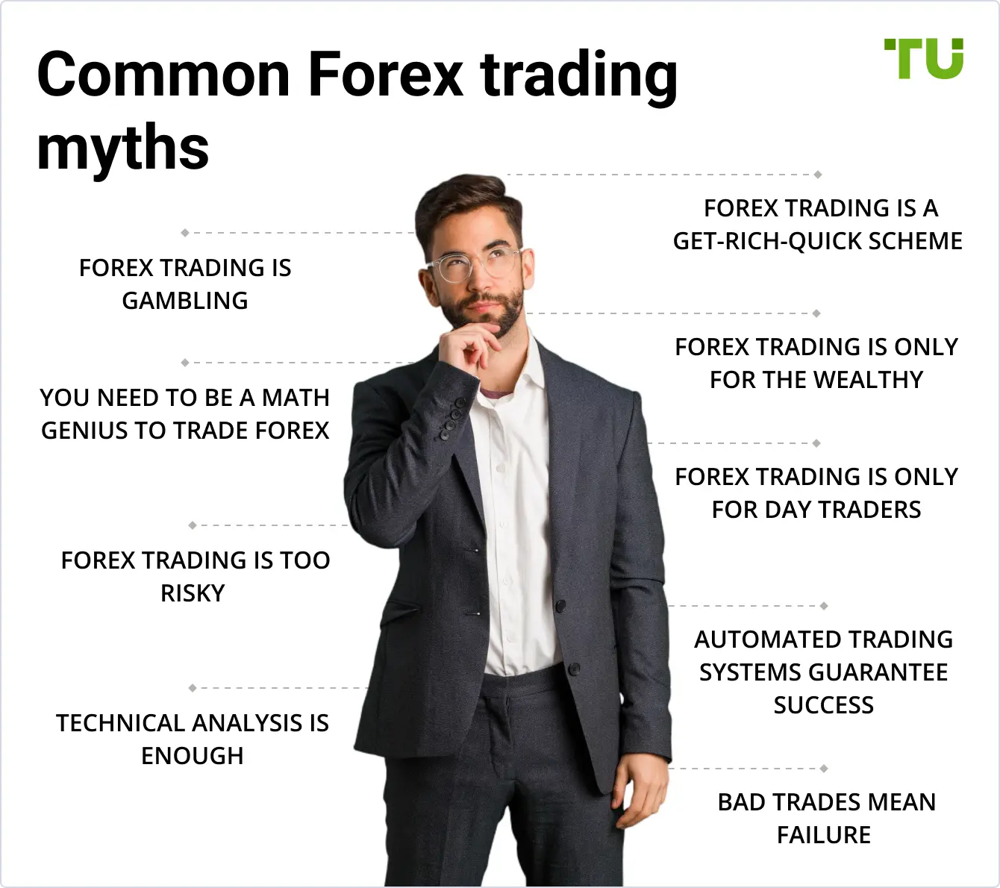

Forex trading represents a highly dynamic and fast-paced segment of the global financial markets, capturing the attention of traders across the globe. This decentralized market is characterized by the trading of currencies, and it functions 24 hours a day during the business week, offering ample opportunities and challenges for participants. With the integration of technology and the rise of algorithmic trading, the forex market has experienced unprecedented changes, benefiting from enhanced speed, efficiency, and accuracy in transactions.

However, alongside the advancements in trading technologies, there has been an increase in misconceptions surrounding both forex and algorithmic trading. These myths often mislead traders and can result in misguided decision-making. Addressing and debunking these myths is fundamental for all traders, whether novices or seasoned professionals, as it helps them develop a more comprehensive and realistic understanding of the market dynamics.

This article aims to clarify several common myths associated with forex trading and the use of algorithmic strategies. By doing so, it seeks to provide traders with the knowledge needed to navigate this complex market successfully. Whether related to the perceived ease of making profits, the risks involved, or the requirements for participation, understanding these misconceptions allows for strategic planning and risk management that align more closely with the realities of forex trading. Through a systematic exploration of these myths, traders can foster enhanced decision-making processes and adapt more effectively to the ever-evolving market landscape.

## Table of Contents

## Common Myths About Forex Trading

Forex trading is widely regarded as a complex financial arena, yet this complexity has given rise to several myths. These misconceptions often stem from misunderstanding the dynamics of the foreign exchange market. One prevalent myth is that forex trading guarantees quick and easy profits. This belief may attract individuals looking for rapid financial gains, but it overlooks the reality that forex trading necessitates comprehensive analysis and strategic planning. Successful traders often invest considerable time in learning market behaviors and developing a robust trading plan, rather than expecting immediate wealth.

Another common myth is equating forex trading with gambling. While both involve risk, forex trading fundamentally differs from gambling through its reliance on analysis, strategy, and risk management. Traders use tools such as technical analysis, which involves studying price charts and patterns, and fundamental analysis, which considers economic indicators and news events, to make informed decisions. In contrast, gambling typically involves making bets without a systematic approach that reduces risk through data-driven strategies.

Additionally, there is a widespread misconception that entering the forex market requires substantial initial capital. Modern online trading platforms have democratized access to forex trading, allowing individuals to start trading with relatively small amounts of money. The concept of leverage plays a crucial role here, enabling traders to control larger positions with a fraction of the total capital required. However, while leverage can magnify profits, it can equally amplify losses, underscoring the importance of sound risk management practices.

Addressing these myths provides a more realistic understanding of [forex](/wiki/forex-system) trading, emphasizing the importance of education, strategy development, and risk management in achieving success.

## Myth: Forex Trading is a Sure Way to Get Rich Quick

The allure of quick wealth often draws novice traders to the forex markets, but this perception is steeped in misunderstanding. Unlike speculative betting, successful forex trading demands a well-crafted strategy, patience, and discipline. Many enter the market expecting substantial profits with minimal effort, yet the reality is that forex trading requires dedication and a methodical approach.

Setting realistic expectations forms the cornerstone of a sustainable trading career. This involves crafting a comprehensive trading plan that outlines objectives, risk tolerance, and strategies. A robust trading plan serves as a roadmap, guiding decisions and helping traders to navigate the complexities of the market. For instance, traders should be wary of over-leveraging and the temptation of high-risk trades that promise immediate returns but may lead to significant losses.

Understanding market trends is crucial for consistent growth. Analyzing trends involves evaluating historical data, identifying patterns, and predicting future movements. Tools such as moving averages and trend lines are indispensable for traders seeking to interpret market behavior. Additionally, traders must employ effective risk management techniques, such as setting stop-loss orders and diversifying their trading portfolio. These practices help mitigate potential losses and safeguard capital.

Continuous learning and adaptation are vital components of successful forex trading. The forex market is dynamic, influenced by geopolitical events, economic reports, and market sentiment. Traders need to stay informed about global developments and how they affect currency valuations. By engaging with educational resources, attending webinars, and participating in trading forums, traders can enhance their knowledge and adapt to evolving market conditions.

In summary, the promise of quick riches in forex trading is a misconception that overshadows the diligent effort required for long-term success. With realistic expectations, an understanding of market trends, effective risk management, and ongoing education, traders can build a sustainable and profitable trading career.

## Myth: Forex Trading is Just Like Gambling

Forex trading is often mistakenly equated with gambling, a comparison that undermines its structured and analytical nature. Unlike gambling, where outcomes are primarily reliant on chance, forex trading requires the use of strategic analysis and disciplined risk management to achieve consistent results.

At the crux of forex trading is the application of both technical and [fundamental analysis](/wiki/fundamental-analysis). Technical analysis involves examining statistical trends gathered from trading activity, such as price movement and [volume](/wiki/volume-trading-strategy). Traders use various tools and indicators, like moving averages and relative strength index (RSI), to predict future price movements. In contrast, fundamental analysis entails evaluating macroeconomic factors that might impact currency valuation, including interest rates, economic indicators, and political stability.

For instance, a trader might employ a moving average crossover strategy, which involves buying or selling when a short-term moving average crosses a long-term moving average, signaling a potential price trend change. This approach is rooted in statistical analysis rather than pure chance, demonstrating a clear deviation from gambling practices.

Risk management further distinguishes forex trading from gambling. Traders implement strategies such as stop-loss and take-profit orders to manage potential losses and secure profits, maintaining control over financial outcomes. These measures are akin to setting boundaries, which are non-existent in cash-dependent gambling.

Moreover, psychological factors play significant roles in trading behavior. Successful forex traders cultivate discipline, patience, and an ability to remain objective during volatile market conditions. This contrasts with the impulsivity often seen in gambling. Human emotions like fear and greed can adversely impact trading decisions; hence, psychological discipline is crucial. Traders practice maintaining emotional detachment by adhering to pre-defined trading plans and systematic approaches.

In summary, forex trading operates within a framework of analysis, strategy, and risk management, which collectively create an environment governed by skill and informed decision-making rather than sheer luck. This distinction supports the legitimacy of forex trading as a disciplined financial practice rather than a gambling endeavor.

## Myth: Forex Trading Requires a Huge Initial Investment

Many assume that only individuals with substantial financial resources can engage in forex trading; however, this is a misconception. The forex market has evolved significantly over the years, primarily due to the development of online trading platforms. These platforms have democratized access, allowing traders with varying budgets to participate.

Leverage is a critical concept in forex trading that has lowered the barrier of entry for many traders. It enables traders to control a larger position in the market than what their initial capital would typically allow. For instance, with a leverage of 100:1, a trader can control a $100,000 position with just $1,000 of their capital. However, it's important to note that while leverage can amplify profits, it can also magnify losses. Effective risk management is thus vital when using leverage.

The potential for small-scale traders to succeed is bolstered by the flexibility of trading lot sizes. Forex allows the trading of micro lots, which are 1,000 units of a currency, enabling traders to enter the market with investments as low as a few hundred dollars. This flexibility makes forex trading accessible to individuals who may not have a large amount of capital at their disposal.

Risk management practices are crucial for traders, especially those with limited capital. Several strategies can help mitigate risks:

1. **Setting Stop-Loss Orders**: These automatically exit a trade when the price reaches a predetermined level, limiting potential losses.

2. **Diversification**: By spreading investments across different currency pairs or trading strategies, traders can reduce the impact of a single adverse market move.

3. **Position Sizing**: Adjusting the size of the trade relative to account size helps manage risk. A common rule of thumb is to risk only 1-2% of the trading account on a single trade.

4. **Continuous Monitoring and Adjustment**: Regularly analyzing market conditions and adjusting strategies accordingly helps in optimizing performance and managing risk.

The advancement of trading technology and educational resources has made it feasible for traders of all financial backgrounds to participate effectively in the forex market. With proper risk management and strategic planning, even those with minimal initial investment can aim for success in forex trading.

## Algorithmic Trading in Forex

Algorithmic trading, often associated with the usage of automated systems to execute trades on the forex market, has significantly changed how trading is conducted. This practice utilizes pre-programmed trading instructions to conduct trades at speeds and frequencies that a human trader cannot execute manually. By employing algorithms, traders can exploit market conditions more efficiently, making it a valuable tool for both retail and institutional traders.

One of the primary advantages of [algorithmic trading](/wiki/algorithmic-trading) is its ability to process vast amounts of data rapidly and to execute orders with precision. Algorithms can monitor multiple markets and securities concurrently, applying quantitative models to assess trading opportunities. Such systems facilitate the execution of complex trading strategies that could be impossible to manage manually, such as high-frequency trading or [arbitrage](/wiki/arbitrage) opportunities.

Despite its advantages, a common myth surrounding algorithmic trading is that it demands a high level of technical knowledge and programming skills, making it accessible only to those with such expertise. However, advancements in trading platforms have provided user-friendly environments where traders without deep technical backgrounds can engage in algorithmic trading. Many platforms offer drag-and-drop interfaces and pre-built strategies, enabling traders to implement algorithmic strategies without writing a single line of code.

Automated systems can outperform manual trading under specific conditions, particularly when quick execution and emotionless decision-making are required. Algorithms act based on predefined instructions, eliminating the psychological biases that often affect human traders. They ensure consistency and discipline in trading activities, operating within the set parameters regardless of market emotions.

However, algorithmic trading is not devoid of risks. The forex market is dynamic, and algorithms that perform well under certain market conditions may not maintain the same performance in a different context. This underscores the necessity of continuous monitoring and optimization of automated systems. An algorithm that became obsolete due to changing market dynamics or a minor programming error could lead to significant financial losses.

Moreover, reliance on technology requires traders to be vigilant about system failures, connectivity issues, or unexpected market events. Ensuring that backup plans and manual interventions are in place can mitigate such risks.

In summary, algorithmic trading offers significant advantages in the forex market by enabling rapid data analysis and execution of complex strategies. It is accessible even to those without extensive programming knowledge, thanks to modern platforms. Nonetheless, successful algorithmic trading requires vigilance, ongoing evaluation, and appropriate risk management practices to adapt to changing market conditions and mitigate potential risks.

## Myth: Algorithmic Trading is Only for Highly Skilled Programmers

Contrary to the common belief that algorithmic trading is exclusive to highly skilled programmers, the landscape of algo trading has evolved significantly, making it accessible to traders without extensive technical expertise. The advent of user-friendly platforms and tools has democratized algorithmic trading, bridging the knowledge gap for non-programmers.

Numerous platforms have emerged offering intuitive user interfaces and pre-configured trading algorithms that can be easily customized. These platforms often provide a drag-and-drop interface that allows traders to construct complex trading strategies without writing a single line of code. This approach opens up opportunities for individuals with little to no programming background to engage in algo trading.

Moreover, many of these platforms offer third-party algorithms, where traders can purchase or subscribe to pre-tested strategies developed by professionals. This option empowers traders to leverage sophisticated algorithms without having to understand the intricacies of the underlying code. By evaluating performance metrics and historical data, traders can make informed decisions about which algorithms align with their investment goals and risk tolerance.

Non-programmers can also benefit from social trading networks that facilitate the sharing and copying of successful trading strategies. Such platforms allow users to follow experienced traders and automatically replicate their trades, effectively crowd-sourcing expertise without requiring individual technical skills. This collaborative approach fosters a community where traders can learn from each other's successes and failures, enhancing overall trading acumen.

One notable case study involves a retail trader with no programming background, who utilized a user-friendly algorithmic trading platform to execute trades in the forex market. By using a combination of pre-built algorithms and performance tracking tools provided by the platform, the trader was able to achieve consistent returns without delving into programming complexities. This example underscores the potential for non-programmers to succeed in algo trading by leveraging readily available resources.

In conclusion, algorithmic trading is not confined to those with extensive programming skills. With the proliferation of intuitive platforms and access to professional strategies, traders of all technical levels can explore algorithmic trading. By harnessing these tools, non-programmers can effectively participate in the dynamic world of forex trading, potentially enhancing their trading outcomes without needing to master programming languages.

## Conclusion

Forex and algorithmic trading, when approached with proper knowledge and understanding, can serve as powerful instruments for financial success. Dispelling myths surrounding these trading avenues is a critical step towards fostering informed decision-making and setting realistic expectations. Myths can cloud judgment and lead to ill-informed strategies, which may result in adverse outcomes for traders.

Continuous learning and adapting to the ever-changing market landscape is essential for sustained success in the forex and algorithmic trading domains. Markets are inherently dynamic, driven by numerous factors such as economic indicators, geopolitical events, and emerging technologies. Hence, traders must remain abreast of these changes and continuously refine their strategies based on new insights and data.

We encourage traders to maintain an open mind regarding both traditional and algorithmic trading. The potential benefits of integrating these approaches can be significant, enabling traders to harness both conventional techniques and the efficiencies provided by automation. The synergistic use of forex and algorithmic trading, underpinned by a well-rounded understanding, can enhance decision-making and optimize trading outcomes.

By debunking misconceptions and embracing a well-informed approach, traders are better positioned to optimize their strategies. This not only increases their chances of success but also instills a disciplined approach to trading. Ultimately, being well-versed in both traditional and algorithmic trading magnifies a trader's ability to navigate the complexities of the financial markets effectively.

## References & Further Reading

[1]: Bergstra, J., Bardenet, R., Bengio, Y., & Kégl, B. (2011). ["Algorithms for Hyper-Parameter Optimization."](https://dl.acm.org/doi/10.5555/2986459.2986743) Advances in Neural Information Processing Systems 24.

[2]: ["Advances in Financial Machine Learning"](https://www.amazon.com/Advances-Financial-Machine-Learning-Marcos/dp/1119482089) by Marcos Lopez de Prado

[3]: ["Evidence-Based Technical Analysis: Applying the Scientific Method and Statistical Inference to Trading Signals"](https://www.amazon.com/Evidence-Based-Technical-Analysis-Scientific-Statistical/dp/0470008741) by David Aronson

[4]: ["Machine Learning for Algorithmic Trading"](https://github.com/stefan-jansen/machine-learning-for-trading) by Stefan Jansen

[5]: ["Quantitative Trading: How to Build Your Own Algorithmic Trading Business"](https://www.amazon.com/Quantitative-Trading-Build-Algorithmic-Business/dp/1119800064) by Ernest P. Chan