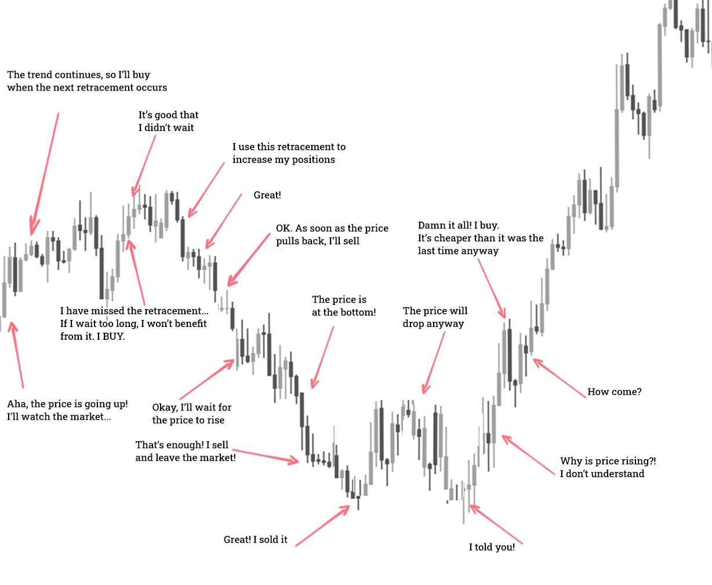

## Table of Contents

## What is Forex day trading and why do people engage in it?

Forex day trading is when people buy and sell different currencies during the same day. They try to make money from small changes in the value of these currencies. For example, if someone thinks the value of the Euro will go up compared to the US Dollar, they might buy Euros and then sell them later in the day for more US Dollars than they started with.

People engage in Forex day trading because it can be a way to make money quickly. The Forex market is open 24 hours a day from Monday to Friday, so traders can trade at any time that suits them. It's also very liquid, meaning it's easy to buy and sell currencies without affecting their price too much. However, it can be risky because the market can be unpredictable, and people can lose money if they don't know what they're doing.

## What are the most common psychological mistakes beginners make in Forex day trading?

One common psychological mistake beginners make in Forex day trading is letting their emotions control their decisions. They might feel excited when they make a profit and start taking bigger risks, hoping to make even more money. Or they might feel scared when they start losing money and make quick decisions to try and stop the losses, which can make things worse. It's important for traders to stay calm and stick to their trading plan, no matter what their emotions are telling them.

Another mistake is having unrealistic expectations. Some beginners think they will get rich quickly from Forex trading, but it's not that easy. The market can be unpredictable, and it takes time to learn how to trade well. Beginners might get frustrated when they don't see big profits right away and give up too soon. It's better to set realistic goals and understand that trading is a skill that takes time to develop.

Lastly, beginners often struggle with overtrading. They might feel like they need to be trading all the time to make money, but this can lead to more losses. It's important to wait for the right opportunities and not trade just for the sake of trading. Overtrading can also lead to exhaustion, which can cloud judgment and lead to more mistakes.

## How can inadequate risk management lead to significant losses in Forex day trading?

Inadequate risk management can lead to big losses in Forex [day trading](/wiki/day-trading-spy) because traders might not set limits on how much money they can lose on a single trade. If a trade goes badly, they could lose a lot more money than they planned. For example, if a trader doesn't use a stop-loss order, which automatically sells a currency when its value drops to a certain point, they might keep losing money until they decide to sell, which could be too late.

Also, without proper risk management, traders might put too much money into one trade. This is risky because if the trade doesn't go well, they could lose a big part of their trading money. It's better to spread the risk by not putting all the money into one trade. Good risk management helps traders keep their losses small and protect their trading money, so they can keep trading even if some trades don't work out.

## What are the dangers of overtrading and how can it be avoided?

Overtrading is when someone trades too much, and it can be very dangerous in Forex day trading. It can make traders tired and stressed, which can make them make bad decisions. When people are tired, they might not think clearly and could miss important signs in the market. Overtrading can also lead to bigger losses because traders might not stick to their trading plan and might take more risks than they should. This can quickly use up their trading money and make it hard for them to keep trading.

To avoid overtrading, it's important for traders to have a clear trading plan and stick to it. This plan should include rules about when to trade and when to take a break. Traders should also set limits on how many trades they can make in a day and stick to those limits. It can help to take regular breaks and step away from the computer to clear the mind. By being disciplined and following a plan, traders can avoid the dangers of overtrading and make better decisions.

## Why is it important to have a trading plan and what mistakes are made by not following one?

A trading plan is like a map that helps traders know what to do in the Forex market. It tells them when to buy and sell, how much money to risk on each trade, and what to do if things go wrong. Having a plan helps traders stay focused and make decisions based on clear rules instead of feelings. This can lead to better trading results and help traders avoid big losses.

Not following a trading plan can lead to many mistakes. Without a plan, traders might trade too much because they feel they need to be doing something all the time. This can make them tired and lead to bad decisions. They might also take bigger risks than they should, hoping to make more money quickly, but this can result in big losses. Without a plan, traders might let their emotions, like fear or excitement, control their actions, which can make things worse. Sticking to a trading plan helps traders stay disciplined and avoid these common mistakes.

## How does lack of market knowledge affect Forex day trading outcomes?

Not knowing enough about the Forex market can make it really hard to do well in day trading. The Forex market is big and always changing, so it's important to understand how it works. Without good knowledge, traders might not know the best times to buy or sell currencies, or they might not understand why the market is moving the way it is. This can lead to bad trading choices and losing money.

When traders don't know enough about the market, they might also miss important signs that could help them make better trades. They might not know about economic reports or news that can change currency values. Without this information, they could be surprised by big market changes and lose money because they weren't ready. Learning about the market and keeping up with news can help traders make smarter decisions and do better in their trades.

## What are the pitfalls of relying too heavily on technical analysis without understanding market context?

Relying too much on technical analysis without understanding the market context can lead to big mistakes in Forex day trading. Technical analysis looks at charts and patterns to predict what will happen next, but it doesn't tell the whole story. The market can be affected by things like news, economic reports, and world events that aren't shown on a chart. If a trader only uses technical analysis, they might miss these important factors and make trades based on incomplete information. This can lead to unexpected losses because the market might move in ways that the charts didn't predict.

For example, a trader might see a pattern that suggests a currency will go up, but if they don't know about an upcoming economic report that could change the market, they might be surprised when the currency goes down instead. Understanding the market context helps traders see the bigger picture and make better decisions. By combining technical analysis with an understanding of what's happening in the world, traders can have a more complete view of the market and avoid the pitfalls of relying on just one type of analysis.

## How can emotional trading decisions impact the success of Forex day trading?

Emotional trading decisions can really hurt a trader's success in Forex day trading. When traders let their feelings control their actions, they might make quick choices without thinking them through. For example, if a trader is scared because they're losing money, they might sell their currency too soon, even if the market might turn around. Or, if they're feeling excited after making a profit, they might take bigger risks hoping to make even more money, which can lead to big losses. These emotional decisions can make traders stray from their trading plan, which is important for staying disciplined and making smart choices.

It's important for traders to stay calm and stick to their plan, even when the market is moving a lot. If they let fear, greed, or excitement take over, they might miss out on good trading opportunities or make trades that they later regret. Keeping emotions in check helps traders think clearly and make decisions based on their strategy, not on how they feel at the moment. By managing their emotions, traders can improve their chances of success in the fast-paced world of Forex day trading.

## What are the consequences of not setting stop-loss orders and how should they be managed?

Not setting stop-loss orders can lead to big problems in Forex day trading. A stop-loss order is like a safety net that automatically sells a currency if its value drops to a certain point. Without it, a trader might keep losing money if the market moves against them. They might wait too long to sell, hoping the market will turn around, but this can make their losses even bigger. It's like watching a hole in a boat get bigger without doing anything to fix it.

To manage stop-loss orders well, traders should set them at the right level based on their trading plan. They need to think about how much they're willing to lose on a trade and set the stop-loss at that point. It's also important to check and adjust stop-loss orders as the market changes. Traders shouldn't move their stop-loss too far away just because they don't want to take a loss, but they can move it closer to their entry point if the trade is going well. This way, they can protect their money and still have a chance to make a profit.

## How does the failure to adapt to changing market conditions lead to trading errors?

Not changing how you trade when the market changes can cause big problems. The Forex market is always moving and can be affected by news, economic reports, and world events. If traders keep using the same old plan without looking at these changes, they might make trades that don't work anymore. For example, if a trader always buys a certain currency at the same time every day, but there's a big news event that makes that currency go down, they could lose a lot of money because they didn't change their plan.

It's important for traders to keep learning and watching the market. They need to be ready to change their trading plan if things in the market change. This might mean trading different currencies, using different strategies, or even taking a break from trading if the market is too unpredictable. By staying flexible and adapting to new conditions, traders can avoid big mistakes and do better in their trades.

## What advanced strategies can expert traders use to avoid common pitfalls in Forex day trading?

Expert traders can use advanced strategies like combining technical analysis with [fundamental analysis](/wiki/fundamental-analysis) to get a fuller picture of the market. Technical analysis looks at charts and patterns, but it doesn't tell everything. Fundamental analysis looks at economic reports, news, and world events that can change currency values. By using both, traders can see the bigger picture and make better decisions. They can also use advanced tools like [algorithmic trading](/wiki/algorithmic-trading), where computers make trades based on set rules. This can help take emotions out of trading and stick to a plan more easily.

Another strategy is to use risk management techniques like setting stop-loss and take-profit orders at the right levels. This helps traders limit their losses and lock in profits. They can also use position sizing, which means only risking a small part of their trading money on each trade. This way, even if a trade goes wrong, they won't lose too much. Expert traders also keep learning and stay flexible. They know the market can change quickly, so they're always ready to change their plans if needed. By staying disciplined and adapting to new conditions, they can avoid common pitfalls and do better in their trades.

## How can continuous learning and self-assessment help in overcoming common mistakes in Forex day trading?

Continuous learning and self-assessment are really important for getting better at Forex day trading and avoiding common mistakes. By always learning, traders can keep up with new strategies and understand how the market is changing. They can read [books](/wiki/algo-trading-books), take courses, and follow the news to learn more about what's happening in the Forex market. This helps them see the bigger picture and make better trading decisions. Self-assessment means looking at their own trades and figuring out what they did right and what they did wrong. By doing this, traders can learn from their mistakes and not make the same ones again.

Keeping up with learning and checking their own performance helps traders stay disciplined and avoid emotional trading. When traders know more about the market, they're less likely to make quick decisions based on fear or excitement. They can stick to their trading plan and use the strategies they've learned to make smart choices. Over time, this can lead to better trading results and help traders avoid the common pitfalls like overtrading, not managing risk properly, or letting emotions control their actions. By always learning and looking at their own performance, traders can improve and do better in the fast-paced world of Forex day trading.

## References & Further Reading

[1]: ["Quantitative Trading: How to Build Your Own Algorithmic Trading Business"](https://www.amazon.com/Quantitative-Trading-Build-Algorithmic-Business/dp/0470284889) by Ernest P. Chan

[2]: ["Advances in Financial Machine Learning"](https://www.amazon.com/Advances-Financial-Machine-Learning-Marcos/dp/1119482089) by Marcos Lopez de Prado

[3]: ["Machine Learning for Algorithmic Trading"](https://github.com/PacktPublishing/Machine-Learning-for-Algorithmic-Trading-Second-Edition) by Stefan Jansen

[4]: Bergstra, J., Bardenet, R., Bengio, Y., & Kégl, B. (2011). ["Algorithms for Hyper-Parameter Optimization."](https://proceedings.neurips.cc/paper/2011/file/86e8f7ab32cfd12577bc2619bc635690-Paper.pdf) Advances in Neural Information Processing Systems 24.

[5]: ["Evidence-Based Technical Analysis: Applying the Scientific Method and Statistical Inference to Trading Signals"](https://www.amazon.com/Evidence-Based-Technical-Analysis-Scientific-Statistical/dp/0470008741) by David Aronson