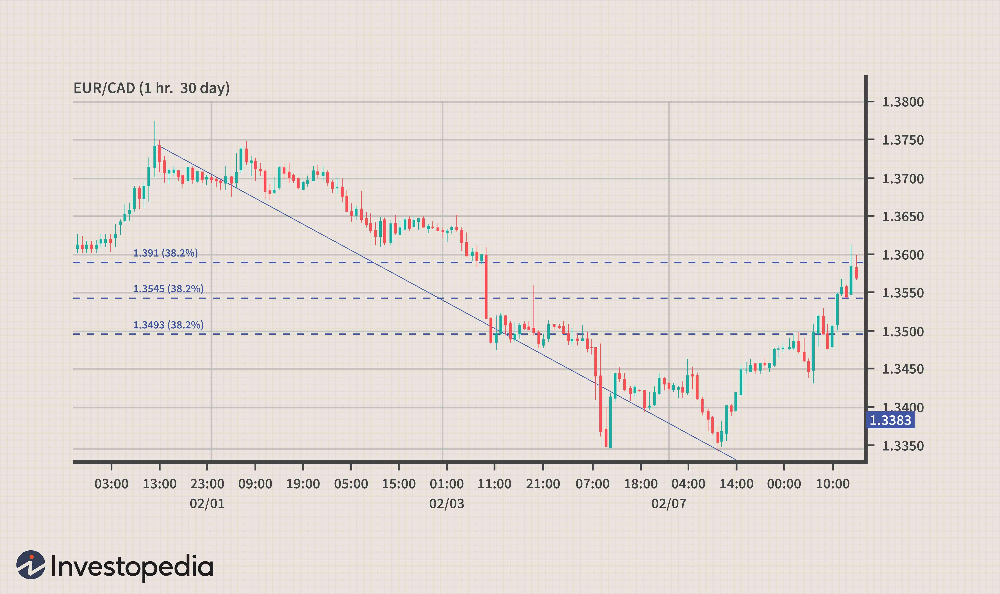

Day trading in the forex market has long been seen as a potential avenue for substantial profits, yet it inherently carries a significant degree of risk. The volatile nature of currency exchange rates offers numerous opportunities for profit, but it also exposes traders to potential losses. As the forex market operates 24 hours a day, this continuous activity can lead to swift and unpredictable changes in market conditions.

With the advancement of technology, algorithmic trading has gained prominence. Many traders are leveraging automation to gain a competitive advantage. Algorithmic trading involves using complex mathematical models and algorithms to make decisions on buying or selling assets on financial markets. This approach can process vast amounts of data quickly and execute trades at speeds beyond human capability. Despite these advantages, algorithmic trading does not eliminate risk and can introduce its own set of challenges.



Both novice and experienced traders are susceptible to common pitfalls that can threaten their trading success. These mistakes can stem from psychological factors such as overconfidence and emotional trading, technical flaws such as inadequate strategy testing, or risk management failures. Identifying and understanding these errors is crucial for any trader looking to improve their performance.

This article will examine the typical mistakes associated with day trading in the forex market and algorithmic trading. Awareness of these issues is the first step toward developing robust trading strategies and increasing the likelihood of long-term success. By learning from these mistakes, traders can craft more effective plans and implement disciplined execution in their trading activities.

## Table of Contents

## Common Mistakes in Day Trading Forex

Day trading in the forex market involves buying and selling currency pairs within a single trading day, aiming to profit from short-term price movements. However, traders frequently make mistakes that can negatively impact their profitability. Understanding these common pitfalls is crucial for improving trading outcomes.

1. **Averaging Down**: Many traders fall into the trap of averaging down, which involves adding to a losing position in hopes of an eventual rebound. While this strategy might occasionally pay off, it significantly increases potential losses. Averaging down is particularly risky in the volatile forex market, where trends can persist longer than expected. For example, if a trader initially buys a currency pair at $1.30, expecting it to rise, and the price instead falls to $1.25, buying more at the lower price assumes the price will revert. However, if the downward trend continues, every additional purchase magnifies the loss.

2. **Pre-Positioning Forex Trades**: Pre-positioning involves taking a position just before the release of major market-moving news, such as economic indicators or central bank announcements. This strategy can be perilous due to the inherent unpredictability and volatility surrounding such events. Sudden and significant price movements can occur, leading to unexpected losses. For example, if a trader anticipates a positive announcement and positions accordingly, an unfavorable report could rapidly drive the currency’s price in the opposite direction. It's crucial to recognize that the forex market often reacts to news in ways that defy expectations, making pre-positioning a high-risk endeavor.

3. **Reacting to News Without a Plan**: Impulsive trading in response to news events is a common mistake that can lead to poor decision-making. News-driven volatility can create enticing opportunities, but it also increases the likelihood of making hasty, emotion-driven trades. Without a well-conceived plan, traders may enter or exit positions irrationally, resulting in suboptimal outcomes. Developing a clear strategy for how to handle news events, such as setting predefined entry and exit points or using stop-loss orders, can help mitigate these risks. It is essential for traders to have a disciplined approach to news-related trading to avoid unnecessary losses.

By being aware of these common mistakes, traders can adopt strategies to minimize risks and improve their chances of success in [forex](/wiki/forex-system) [day trading](/wiki/day-trading-spy). Employing sound risk management techniques and maintaining a disciplined trading approach are key components in navigating the complexities of the forex market effectively.

## Risk Management Mistakes

In day trading forex, risk management is crucial for maintaining financial stability and ensuring long-term profitability. One of the primary mistakes traders make is risking more than 1% of their capital on a single trade, commonly referred to as over-leveraging. This practice significantly increases a trader's vulnerability to substantial losses, as a few unsuccessful trades can deplete their trading account rapidly. The fundamental principle of risk management is to safeguard capital; thus, maintaining exposure within the manageable threshold is advisable. 

Another prevalent error is the absence of a well-defined trading plan. Traders often enter the market without a structured plan, leading to uncalculated risks and subsequent losses. A comprehensive trading plan includes setting clear entry and [exit](/wiki/exit-strategy) points, determining stop-loss levels, and specifying risk-reward ratios. This framework not only provides direction but also instills discipline, helping traders to avoid impulsive decisions.

Emotional trading represents a substantial risk to traders' success. Trading based on emotions rather than logic can lead to irrational choices and significant financial losses. Emotions such as fear and greed can skew a trader's judgment and strategy, leading to premature exit from profitable trades or holding onto losing positions for too long. To mitigate the risk of emotional trading, traders should adhere strictly to their plans and employ strategies, such as position sizing and stop-loss orders, to limit emotional influence.

Implementing a disciplined and consistent risk management strategy is essential for day traders seeking to improve their market performance. By acknowledging these common mistakes and taking corrective actions, traders can enhance their decision-making processes and increase their chances of achieving sustainable success in the forex market.

## Challenges in Algorithmic Trading

Algorithmic trading has become a popular method among traders due to its ability to execute trades at high speeds and with greater precision than manual trading. However, the implementation of [algorithmic trading](/wiki/algorithmic-trading) strategies is not without challenges. Understanding these challenges is essential for traders looking to optimize their algorithmic systems and ensure success in the market.

1. **Overfitting and Curve Fitting**: Overfitting occurs when an algorithm is tailored too closely to historical data, producing a model that performs excellently with past data but poorly in real-time markets. This can happen due to the algorithm capturing noise or random fluctuations in the data rather than underlying market patterns. A model that is overfitted will typically perform well during backtesting but fail to generalize to new, unseen data, resulting in substantial losses. To mitigate overfitting, traders can use techniques such as cross-validation, which divides the dataset into training and testing subsets to evaluate performance on unseen data. Additionally, parameter simplicity can prevent unnecessary complexities in the model, thus enhancing its generalizability.

2. **Ignoring Slippage and Transaction Costs**: Slippage refers to the difference between the expected price of a trade and the price at which the trade is actually executed. This is particularly relevant in fast-moving markets where prices can change rapidly. Transaction costs, including commissions and spreads, can also significantly impact the profitability of a trading strategy. When these costs are not factored into the trading strategy, a theoretically profitable system can quickly become unprofitable. Transparent trading platforms that offer detailed transaction cost analyses can assist in accounting for these variables. Furthermore, simulations that incorporate slippage and transaction costs can provide a more realistic evaluation of an algorithm's performance.

3. **Lack of Diversification**: Relying solely on a single algorithmic strategy can expose traders to heightened risk, as market conditions can change unexpectedly, rendering a once-successful strategy ineffective. Diversification involves employing a variety of trading strategies or instruments to spread risk. A well-diversified strategy aligns with the principle of not putting all eggs in one basket. For instance, while one algorithm may focus on trend-following, another might target mean reversion. By balancing between different strategies, traders can reduce overall risk and increase the resilience of their trading portfolio to adverse market movements.

In summary, addressing the challenges inherent in algorithmic trading necessitates careful attention to issues such as overfitting, transaction costs, and diversification. By doing so, traders can enhance the robustness of their strategies and improve their chances of achieving sustained success.

## Developing a Robust Forex Trading Strategy

Developing a robust forex trading strategy requires a structured approach that incorporates clear goal-setting, thorough [backtesting](/wiki/backtesting) and optimization, and continuous monitoring and adjustment. These components ensure that traders are well prepared to navigate the dynamic nature of forex markets.

1. **Defining Clear Goals**: The foundation of any successful trading strategy is understanding what you aim to achieve. Clear goals provide direction and purpose, helping traders remain focused and disciplined. Goals should be specific, measurable, achievable, relevant, and time-bound (SMART). For instance, instead of setting a vague goal like "making money," a SMART goal would be "achieving a 10% return on investment over the next six months while limiting daily losses to 1% of trading capital."

2. **Backtesting and Optimization**: Before deploying a strategy in live markets, it is crucial to test it using historical data. Backtesting allows traders to evaluate how their strategy would have performed in the past, providing insights into its potential effectiveness. The process involves running the strategy on historical market data to assess its profitability and risk management robustness. However, traders must avoid over-optimization, a common pitfall where the strategy is excessively fine-tuned to perform well on past data but fails in current market conditions. Over-optimization leads to curve fitting, where the strategy is tailored to specific historical data patterns that may not recur. A balanced approach should be taken, focusing on robust performance across different market scenarios rather than perfect past performance.

   ```python
   import pandas as pd
   import numpy as np
   from backtesting import Strategy, Backtest

   # Example of a simple moving average crossover strategy for backtesting
   class SMACross(Strategy):
       def init(self):
           self.short_ma = self.I(pd.Series.rolling, self.data.Close, 10).mean
           self.long_ma = self.I(pd.Series.rolling, self.data.Close, 50).mean

       def next(self):
           if self.short_ma > self.long_ma:
               self.buy()
           else:
               self.sell()

   # Assume data is a DataFrame with historical forex prices
   bt = Backtest(data, SMACross, cash=10000, commission=.002)
   output = bt.run()
   output.plot()
   ```

3. **Continuous Monitoring and Adjustment**: Forex markets are inherently volatile and influenced by a multitude of factors ranging from geopolitical events to macroeconomic indicators. As such, even the most well-crafted strategies require regular assessment and fine-tuning. Continuous monitoring involves tracking the performance of a strategy in real-time, identifying deviations from expected results, and making necessary adjustments. This may involve recalibrating technical indicators, modifying risk management parameters, or completely revising the strategy. The key is to remain adaptable and responsive to market changes while maintaining adherence to the predefined trading plan.

In summary, by setting clear objectives, rigorously backtesting strategies while avoiding over-optimization, and consistently monitoring and adjusting strategies as needed, traders can enhance the resiliency and effectiveness of their forex trading approaches. This disciplined process not only mitigates risks but also capitalizes on opportunities, fostering long-term trading success.

## Implementing Algorithmic Trading

Selecting the appropriate tools is a pivotal step for anyone venturing into algorithmic trading. A trading platform must support the technical requirements of the trading strategy and offer features such as backtesting capabilities, real-time data access, and a user-friendly interface. Commonly used platforms include MetaTrader 4/5, [Interactive Brokers](/wiki/interactive-brokers-api), and QuantConnect, each offering distinct advantages in terms of scripting languages and integration options.

The importance of thoroughly testing algorithms before live deployment cannot be overstated. Backtesting involves simulating a trading strategy using historical data to evaluate its viability and potential profitability. It is crucial to use a comprehensive dataset that reflects various market conditions and to adjust for factors such as slippage and transaction costs. This process helps identify limitations and optimize the parameters of the algorithm. Here's a simple Python example using the `[backtrader](/wiki/backtrader)` library for performing backtesting:

```python
import backtrader as bt

class TestStrategy(bt.Strategy):
    def __init__(self):
        self.sma = bt.indicators.SimpleMovingAverage(self.data.close, period=15)

    def next(self):
        if self.data.close[0] > self.sma[0]:
            self.buy()
        elif self.data.close[0] < self.sma[0]:
            self.sell()

cerebro = bt.Cerebro()
cerebro.addstrategy(TestStrategy)
data = bt.feeds.YahooFinanceData(dataname='AAPL', fromdate=datetime(2020, 1, 1), todate=datetime(2021, 1, 1))
cerebro.adddata(data)
cerebro.run()
cerebro.plot()
```

Managing latency and execution speed is also critical in algorithmic trading. Latency refers to the delay between an action being initiated and executed, which can significantly impact profitability in a fast-moving market. To minimize latency, traders should choose platforms that offer co-located servers or low-latency network infrastructures. Furthermore, optimizing the algorithm's code to execute efficiently is essential. For instance, using computational optimizations and efficient data structures can enhance execution speed.

In summary, implementing algorithmic trading involves the careful selection of platforms that meet trading needs, comprehensive testing via backtesting, and minimizing latency and ensuring quick execution. These steps are foundational to developing a robust, effective algorithmic trading strategy.

## Conclusion

Avoiding common trading mistakes requires a high level of awareness and continuous vigilance, especially in the fast-paced environment of forex day trading and algorithmic trading. Successful trading is inherently dependent on the combination of a well-researched strategy and disciplined execution. A strategy is not merely an operational guide but a carefully constructed plan that considers market analysis, risk management, and theoretical propositions that guide decision-making. This dual requirement helps traders mitigate risks and capitalize on opportunities as market conditions fluctuate.

Incorporating lessons from past mistakes is not just beneficial but essential for enhancing the probability of long-term success. By analyzing past trading errors—whether they stem from poor risk management, emotional impulsiveness, or over-optimization of algorithms—traders can refine their strategies. Such reflection allows traders to adapt and optimize their approach, tailoring it to current market dynamics and personal risk tolerance.

In algorithmic trading, learning from prior missteps, such as ignoring transaction costs or relying on overfitted algorithms, enables traders to build more robust systems. Rigorous testing and optimization, coupled with a focus on speed and accuracy in execution, add layers of resilience to trading algorithms. This iterative process of learning, adapting, and optimizing not only enhances trading strategies but also fortifies the trader’s ability to remain competitive in highly volatile markets.

The continuous circle of research, strategy refinement, and disciplined application becomes the cornerstone of achieving sustained success in forex day trading and algorithmic trading. Through persistent learning and strategic execution, traders can not only avoid the pitfalls of common mistakes but also cultivate an adaptive approach that responds effectively to the ever-evolving financial landscape.

## References & Further Reading

[1]: ["Quantitative Trading: How to Build Your Own Algorithmic Trading Business"](https://www.amazon.com/Quantitative-Trading-Build-Algorithmic-Business/dp/0470284889) by Ernest P. Chan

[2]: ["Advances in Financial Machine Learning"](https://www.amazon.com/Advances-Financial-Machine-Learning-Marcos/dp/1119482089) by Marcos Lopez de Prado

[3]: ["Machine Learning for Algorithmic Trading"](https://github.com/PacktPublishing/Machine-Learning-for-Algorithmic-Trading-Second-Edition) by Stefan Jansen

[4]: Bergstra, J., Bardenet, R., Bengio, Y., & Kégl, B. (2011). ["Algorithms for Hyper-Parameter Optimization."](https://proceedings.neurips.cc/paper/2011/file/86e8f7ab32cfd12577bc2619bc635690-Paper.pdf) Advances in Neural Information Processing Systems 24.

[5]: ["Evidence-Based Technical Analysis: Applying the Scientific Method and Statistical Inference to Trading Signals"](https://www.amazon.com/Evidence-Based-Technical-Analysis-Scientific-Statistical/dp/0470008741) by David Aronson