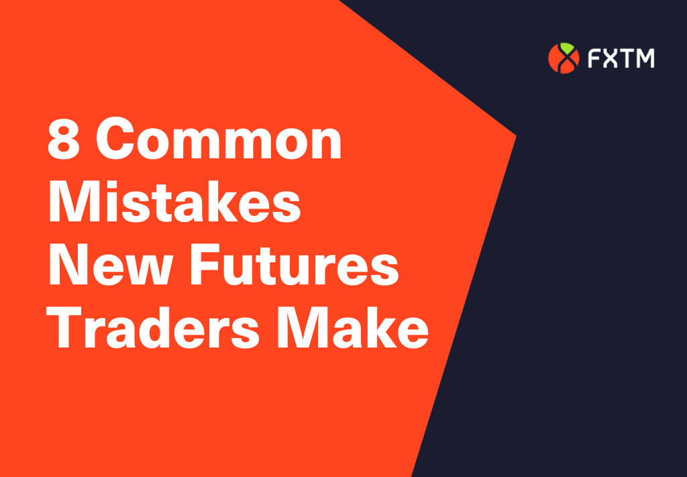

## Table of Contents

## What are futures contracts and how do they work?

Futures contracts are agreements to buy or sell an asset at a specific price on a specific date in the future. They are commonly used for commodities like oil, gold, or agricultural products, but can also be for financial assets like stocks or currencies. The main purpose of futures is to help people manage risk. For example, a farmer might use a futures contract to lock in a price for their crops, protecting them from price drops before the harvest.

When you buy or sell a futures contract, you don't have to pay the full amount right away. Instead, you put down a smaller amount called a margin, which acts like a deposit. The value of the futures contract can change every day based on the market price of the underlying asset. If the price moves in your favor, you make a profit, and if it moves against you, you could lose money. At the end of the contract, you either deliver the asset or settle the difference in cash, depending on the terms of the contract.

## What are the most common mistakes beginners make when starting futures trading?

One common mistake beginners make in futures trading is not understanding the risks involved. Futures can be very risky because they use leverage, which means you can lose more money than you put in. Beginners often start trading without learning enough about how futures work and how to manage their risks. They might not use stop-loss orders, which can help limit losses, or they might trade too much with money they can't afford to lose.

Another mistake is not having a good trading plan. A trading plan is like a roadmap that tells you when to buy or sell and how much to trade. Beginners often jump into trading without a clear plan, which can lead to emotional decisions instead of smart ones. They might chase after big gains without thinking about the risks or they might hold onto losing trades hoping the market will turn around.

Lastly, beginners often overlook the importance of keeping up with market news and trends. The futures market can be influenced by many things like economic reports, weather changes, or global events. Not staying informed can lead to missed opportunities or unexpected losses. It's important for beginners to take the time to learn and stay updated to make better trading decisions.

## How can inadequate risk management lead to failure in futures trading?

Inadequate risk management can lead to big losses in futures trading. Futures use something called leverage, which means you can control a large amount of money with a small deposit. If the market moves against you, your losses can be much bigger than what you put in. If you don't manage this risk well, you might lose all your money very quickly. For example, if you don't set a stop-loss order, which is a way to automatically sell your contract if the price drops too much, you could lose a lot before you can do anything about it.

Another way inadequate risk management can lead to failure is by not having a clear plan for how much you're willing to lose on each trade. Without this plan, you might keep losing money on trades that aren't working out, hoping they'll turn around. This can make your losses even bigger. Also, if you're not keeping an eye on how much risk you're taking overall, you might end up with too many risky trades at once, which can lead to a big loss if the market goes the wrong way.

## What role does lack of education and research play in unsuccessful futures trading?

Not knowing enough about futures trading can make it really hard to do well. Futures are tricky because they use something called leverage, which means you can lose a lot of money fast if you don't know what you're doing. If you don't take the time to learn how futures work, you might make bad choices without even realizing it. For example, you might not understand how to use stop-loss orders, which can help you lose less money if things go wrong. Without this knowledge, you're more likely to make mistakes that cost you a lot.

Not doing enough research can also lead to problems. The futures market can change a lot because of things like the weather, news, or big world events. If you're not keeping up with what's happening, you might miss important information that could affect your trades. Without research, you might buy or sell at the wrong times, which can lead to losses. So, taking the time to learn and stay informed is really important if you want to do well in futures trading.

## How does emotional trading affect outcomes in futures trading?

Emotional trading can really mess up your futures trading. When you let your feelings like fear or greed control your choices, you might make quick decisions without thinking them through. For example, if you see the price of something going up fast, you might feel greedy and buy more than you should, hoping to make a big profit. But if the price suddenly drops, you could lose a lot of money. Or, if you're scared because the market is going down, you might sell too soon and miss out on a chance to make money if the market goes back up.

Sticking to a good plan is really important in futures trading. If you let your emotions take over, you might not follow your plan. This can lead to buying and selling at the wrong times, which can hurt your chances of making money. It's better to make decisions based on what you've learned and what the facts tell you, not on how you feel at the moment. Keeping your emotions in check helps you trade smarter and avoid big mistakes.

## What are the dangers of over-leveraging in futures markets?

Over-leveraging in futures markets can be really dangerous. It means you're using a lot of borrowed money to trade, which can make your gains bigger but also your losses. If the market moves against you, you could lose more money than you put in. This is because futures use leverage, so a small change in the market can lead to a big change in your account. If you're not careful, you might get a margin call, where you have to put in more money to keep your trade going. If you can't do that, your trade might be closed, and you could lose a lot.

Another problem with over-leveraging is that it can make you feel more pressure and stress. When you're using a lot of borrowed money, every little move in the market can feel like a big deal. This can make you make quick, emotional decisions instead of smart ones. You might hold onto losing trades hoping they'll turn around, or you might sell too soon and miss out on gains. Over-leveraging can lead to big losses and a lot of stress, so it's important to be careful and use it wisely.

## How can failing to use stop-loss orders increase the risk of significant losses?

Not using stop-loss orders can make your losses much bigger in futures trading. A stop-loss order is like a safety net that automatically sells your futures contract if the price drops to a certain level. Without this, if the market goes against you, you might keep losing money until you decide to sell. By the time you do, your losses could be a lot more than if you had used a stop-loss order.

Failing to use stop-loss orders can also make you feel more stressed and lead to bad decisions. If you see your money going down and down, you might panic and sell at the worst time, or you might hold on too long hoping the market will turn around. This can make your losses even bigger. Using stop-loss orders helps you manage your risk better and keep your emotions in check, which can save you from big losses.

## What impact does ignoring market trends and analysis have on futures trading?

Ignoring market trends and analysis can make futures trading much harder. Trends and analysis help you understand where the market might be going. If you don't pay attention to them, you might buy or sell at the wrong times. For example, if everyone else sees that the price of oil is going up because of a new report, but you don't know about it, you might miss out on making money or even lose money if you sell too soon.

Not keeping up with market trends and analysis can also make you more likely to make emotional decisions. When you don't have the facts, you might feel more unsure and make quick choices based on how you feel instead of what's really happening. This can lead to big losses because you're not trading based on what the market is telling you. So, it's really important to stay informed and use market trends and analysis to make smarter trading decisions.

## How does poor timing of trades contribute to failure in futures trading?

Poor timing of trades can really hurt your chances of doing well in futures trading. If you buy or sell at the wrong time, you might miss out on making money or end up losing a lot. For example, if you buy a futures contract right before the price drops, you could lose money. Or if you sell too soon and the price keeps going up, you miss out on making more money. Timing is important because the futures market can change quickly because of things like news, weather, or big world events.

Not paying attention to when you make your trades can also make you feel more stressed and lead to bad decisions. If you're not timing your trades well, you might feel like you need to act fast without thinking things through. This can make you buy or sell based on how you feel instead of what the market is telling you. When you let your emotions take over, you're more likely to make mistakes that can cost you a lot of money. So, it's important to think carefully about when you're making your trades and use the information you have to make smart choices.

## What are advanced strategies that, if misused, can lead to trading failures?

One advanced strategy that can lead to trading failures if misused is called "hedging." Hedging is when you make another trade to protect yourself from losing money on your first trade. But if you don't understand how to do it right, you might end up losing money on both trades. For example, if you hedge too much, you might miss out on making money if the market goes your way. Or if you hedge at the wrong time, you could end up with bigger losses than if you had just stuck with your first trade.

Another strategy that can be risky if you don't use it correctly is "[scalping](/wiki/gamma-scalping)." Scalping means making a lot of small trades in a short time to make small profits. It can be exciting, but it's also really hard to do well. If you're not quick enough or if you make a small mistake, you could lose money fast. Plus, scalping can make you feel stressed and lead to bad decisions because you're always trying to make quick trades. So, it's important to really understand these strategies before you try them, or they could lead to big losses.

## How can a lack of diversification in a futures trading portfolio lead to increased risk?

Not having different types of futures in your trading portfolio can make your risk bigger. If you only trade one kind of futures, like oil, your money is all tied up in how well oil does. If something bad happens to oil prices, like a big drop because of too much supply, you could lose a lot of money. But if you have different kinds of futures, like oil, gold, and corn, a drop in oil prices might not hurt you as much because your other futures might still be doing okay.

Diversification helps spread out your risk so you're not depending on just one thing. If you don't diversify, you might make more money if that one thing does well, but you could also lose more if it goes bad. It's like not putting all your eggs in one basket. By having different futures in your portfolio, you can protect yourself better and have a smoother ride in trading.

## What are the expert-level pitfalls in futures trading that even seasoned traders might overlook?

Even seasoned traders can sometimes miss some expert-level pitfalls in futures trading. One of these is overconfidence. When you've been trading for a while and had some success, it's easy to think you know everything. But the market can change fast, and if you're too sure of yourself, you might not see new risks coming. You might trade too much or take on too much risk without realizing it, which can lead to big losses.

Another pitfall is ignoring small changes in the market. Seasoned traders might focus on big trends and forget about the little things that can add up. For example, small shifts in supply and demand or changes in interest rates might not seem important at first, but they can affect the market over time. If you don't keep an eye on these small changes, you might miss out on making money or end up losing more than you expected.

## What are common futures trading mistakes?

Futures trading offers significant opportunities but is equally riddled with challenges that can undermine profitability. Being aware of and avoiding common mistakes can drastically improve a trader's success rate.

1. **Not Sticking With Your System**: It is essential for traders to adhere to their established trading plans. Emotional decision-making often leads to deviation from well-formulated strategies, resulting in inconsistent results and potential losses. A trading plan typically includes defined entry and exit points, position sizing, and risk management rules. Deviating from this system in response to emotions or market fluctuations can lead to decisions based not on logic but on fear or greed, eroding any potential advantages the system was designed to provide. Methods such as maintaining a trading journal and employing algorithmic trading can help minimize emotional interference.

2. **Not Protecting Yourself**: A robust risk management strategy is vital for sustaining long-term success in futures trading. This involves setting stop-loss orders, using position sizes proportional to account size, and diversifying trades. The absence of such measures can result in substantial and possibly irrecoverable financial losses. Risk management can be quantified using metrics such as the Kelly Criterion, which helps determine the optimal size of a series of bets and is given by:
$$
   f^* = \frac{bp - q}{b}

$$

   where $f^*$ is the fraction of the capital to be wagered, $b$ is the odds received on the wager, $p$ is the probability of winning, and $q$ is the probability of losing ($1-p$).

3. **Not Staying Focused**: Focus is a critical factor for traders, as the fast-paced nature of futures markets requires constant attention to details and quick decisions based on real-time data. Distractions can lead traders to miss important signals or fail to execute trades at optimal times. Maintaining discipline and setting specific times dedicated to market analysis and trading can help mitigate this risk. Utilizing trading alerts and automated trading platforms can also ensure that traders are promptly informed of critical market movements.

4. **Not Being Open to New Ideas**: The financial markets are dynamic, and the strategies that work today may not be effective tomorrow. Traders must be willing to evolve and adapt their strategies as market conditions change. Keeping abreast of new trading techniques, market analyses, and technological advancements is crucial. Continuous education and participation in trading forums or communities can expose traders to diverse perspectives and innovative strategies, potentially enhancing their trading practices.

Avoiding these common mistakes by adhering strictly to a trading plan, employing effective risk management, maintaining focus, and being open to new strategies can significantly enhance a trader's ability to succeed in the futures market.

## References & Further Reading

[1]: Bergstra, J., Bardenet, R., Bengio, Y., & Kégl, B. (2011). ["Algorithms for Hyper-Parameter Optimization."](https://dl.acm.org/doi/10.5555/2986459.2986743) Advances in Neural Information Processing Systems 24.

[2]: ["Advances in Financial Machine Learning"](https://www.amazon.com/Advances-Financial-Machine-Learning-Marcos/dp/1119482089) by Marcos Lopez de Prado

[3]: ["Evidence-Based Technical Analysis: Applying the Scientific Method and Statistical Inference to Trading Signals"](https://www.amazon.com/Evidence-Based-Technical-Analysis-Scientific-Statistical/dp/0470008741) by David Aronson

[4]: ["Machine Learning for Algorithmic Trading"](https://github.com/stefan-jansen/machine-learning-for-trading) by Stefan Jansen

[5]: ["Quantitative Trading: How to Build Your Own Algorithmic Trading Business"](https://www.amazon.com/Quantitative-Trading-Build-Algorithmic-Business/dp/1119800064) by Ernest P. Chan