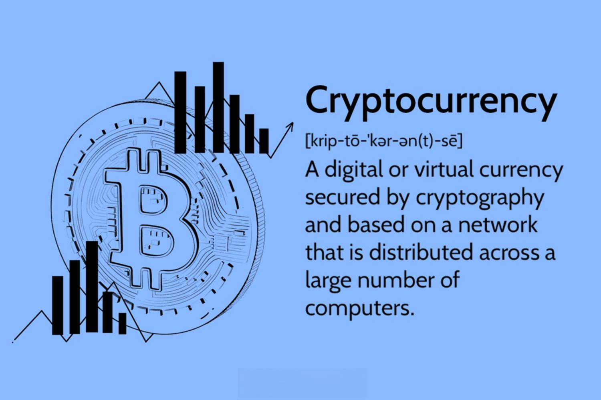

## Table of Contents

## What are the most common misconceptions about cryptocurrencies among beginners?

One of the biggest misconceptions among beginners about cryptocurrencies is that they are completely anonymous. Many people think that using cryptocurrencies like Bitcoin means their transactions are untraceable. However, this is not entirely true. While cryptocurrencies offer a level of privacy, transactions are recorded on a public ledger called the blockchain. With the right tools and skills, it's possible to trace transactions back to individuals, especially if they convert their cryptocurrencies to traditional money through exchanges that require identification.

Another common misunderstanding is that cryptocurrencies are a quick and easy way to get rich. Some beginners jump into the market hoping to make a lot of money fast, influenced by stories of people who made big profits. But the reality is that the crypto market can be very unpredictable and risky. Prices can go up and down a lot, and many people end up losing money. It's important for beginners to understand that investing in cryptocurrencies should be done carefully, with a good understanding of the market and a willingness to accept the risks involved.

## How can new investors avoid falling for cryptocurrency scams?

New investors can avoid falling for cryptocurrency scams by being careful and doing their homework. They should always check the background of the cryptocurrency project or platform they're interested in. This means looking at who is behind the project, what their goals are, and if they have a clear plan. It's also a good idea to read reviews and see what other people are saying about it. If something sounds too good to be true, it probably is. Scammers often promise big returns with little risk, so it's important to be skeptical of these claims.

Another way to stay safe is to use reputable exchanges and wallets. Stick to well-known platforms that have a good track record and strong security measures. Be wary of any platform that asks for personal information or money upfront without clear reasons. Also, never share your private keys or seed phrases with anyone. These are like the passwords to your [cryptocurrency](/wiki/cryptocurrency), and giving them out can lead to your funds being stolen. By being cautious and doing your research, you can protect yourself from many common cryptocurrency scams.

## What is the importance of understanding the technology behind a cryptocurrency before investing?

Understanding the technology behind a cryptocurrency is very important before you decide to invest. This is because the technology, like the blockchain, is what makes the cryptocurrency work. If you know how it works, you can see if the cryptocurrency is good and if it can do what it says it will do. For example, if a cryptocurrency says it will be fast and cheap to use, you can check if the technology can really do that. This helps you make a smarter choice about whether to invest your money.

Also, knowing the technology can help you spot problems or risks. Sometimes, new cryptocurrencies might have weak spots in their technology that could cause big problems later. If you understand these risks, you can decide if you want to take a chance on that cryptocurrency. Plus, when you know more about the technology, you can better understand news and updates about the cryptocurrency. This can help you make better decisions about buying, selling, or holding onto your investment.

## What are the risks of investing in cryptocurrencies without a clear strategy?

Investing in cryptocurrencies without a clear strategy is risky because you might not know when to buy or sell. Without a plan, you could end up buying at high prices and selling at low prices, which means losing money. You might also be easily swayed by the ups and downs of the market, making quick decisions based on emotions instead of thinking things through. This can lead to big losses if the market suddenly drops.

Another risk is that you might not know how much money you can afford to lose. Without a strategy, you might put in more money than you should, hoping to make a quick profit. But if the value of the cryptocurrency goes down, you could lose a lot. Having a clear strategy helps you set limits on how much you're willing to invest and when to cut your losses, which can protect you from big financial hits.

## How can beginners manage their emotions to prevent impulsive investment decisions?

Managing emotions is really important for beginners when they invest in cryptocurrencies. The market can go up and down a lot, which can make people feel excited or scared. When you feel these strong emotions, it's easy to make quick decisions without thinking them through. This can lead to buying when prices are high or selling when they're low, which is not good for making money. To handle this, it's helpful to take a step back and think about your decisions calmly. Don't let fear or excitement push you into doing something you might regret later.

One good way to manage your emotions is to have a plan and stick to it. Decide ahead of time what you want to do and when you want to do it. This can help you avoid making choices based on how you feel at the moment. It's also a good idea to talk to someone you trust about your investment plans. They can give you a different perspective and help you stay calm. Remember, it's okay to feel excited or worried, but try not to let those feelings control your decisions.

## What are the tax implications of cryptocurrency investments that new investors often overlook?

One thing new investors often miss about cryptocurrency is that you have to pay taxes on it. In many places, if you make money from selling or trading cryptocurrencies, you have to report that as income and pay taxes on it. This can be a surprise because people might not think of their crypto gains as something they need to report. But if you don't report it, you could get in trouble with the tax authorities.

Another tax issue that people overlook is that you need to keep good records of all your cryptocurrency transactions. This includes when you bought the crypto, how much you paid, when you sold it, and how much you got for it. Without these records, it can be hard to figure out how much tax you owe. It's important to keep track of everything so you can report it correctly and avoid any problems with the tax office.

## How does the volatility of cryptocurrencies affect investment strategies for beginners?

The ups and downs of cryptocurrencies can really change how beginners plan their investments. Because the prices can go up and down a lot, it's easy to feel scared or excited and make quick decisions without thinking. A good way to handle this is to have a plan and stick to it. This means deciding ahead of time when to buy and sell, and not letting your feelings push you into doing something different. By having a clear strategy, you can avoid making choices based on the moment's emotions and instead make decisions that fit your long-term goals.

Another thing to think about is how much risk you're willing to take. The big changes in cryptocurrency prices mean there's a chance to make a lot of money, but also a chance to lose a lot. Beginners should start with small amounts of money they can afford to lose. This way, if the price drops a lot, it won't hurt them too much. It's also a good idea to spread out your investments, not putting all your money into one cryptocurrency. By doing this, you can lower the risk and have a better chance of doing well even when the market is moving a lot.

## What are the dangers of investing in ICOs (Initial Coin Offerings) without thorough research?

Investing in ICOs without doing a lot of research can be very risky. An ICO is when a new cryptocurrency project sells its tokens to raise money. But some of these projects might not be honest or might not have a good plan. If you don't check the project carefully, you might give your money to a scam. Scammers can make their project look good with fancy websites and promises of big returns, but they might just take your money and disappear. So, it's really important to look into the team behind the project, their goals, and if they have a clear plan before you invest.

Another danger is that even if the project is honest, it might not succeed. Many new cryptocurrency projects fail because they can't do what they promised or because the market changes. If you invest without understanding the project's technology and risks, you might lose your money. It's a good idea to read reviews, look at what experts say, and think about how the project fits into the bigger picture of the cryptocurrency world. By doing your homework, you can make a smarter choice and avoid putting your money into something that might not work out.

## How can new investors diversify their cryptocurrency portfolios to minimize risk?

New investors can minimize risk by spreading their money across different cryptocurrencies instead of putting it all into one. This is called diversification. By investing in a few different types of cryptocurrencies, you can lower the chance that a big drop in one will hurt your whole investment. For example, you might choose to invest in well-known cryptocurrencies like Bitcoin and Ethereum, but also look at some smaller, newer ones that might grow a lot. Just make sure to do your research on each one so you understand what you're investing in.

Another way to diversify is to not just stick to cryptocurrencies. You can also put some of your money into other types of investments, like stocks or bonds. This way, if the cryptocurrency market goes down, your other investments might help balance things out. It's important to think about how much risk you're comfortable with and adjust your investments to fit that. By spreading your money around, you can protect yourself from big losses and have a better chance of doing well over time.

## What are the best practices for securing cryptocurrency wallets and private keys?

Keeping your cryptocurrency wallets and private keys safe is very important. One good way to do this is by using a hardware wallet. A hardware wallet is a special device that keeps your private keys offline, which means they're not connected to the internet where hackers can get them. Always buy hardware wallets from trusted sources and make sure they're not tampered with. When you set up your hardware wallet, write down your recovery phrase and keep it in a safe place, like a locked drawer or a safe. Never share your recovery phrase with anyone, because it's like the master key to your cryptocurrencies.

Another important practice is to use strong, unique passwords for your online wallets and to enable two-[factor](/wiki/factor-investing) authentication (2FA) whenever possible. Two-factor authentication adds an extra layer of security by requiring a code from your phone or another device before you can log in. Make sure to update your software regularly, as updates often include important security fixes. Also, be careful about where you use your wallets. Avoid using public computers or unsecured Wi-Fi networks to access your cryptocurrencies, as these can be less safe. By following these simple steps, you can help keep your cryptocurrencies secure.

## How can new investors stay informed about regulatory changes that might impact their investments?

New investors can stay informed about regulatory changes by regularly checking news from trusted sources that focus on cryptocurrencies. Websites like CoinDesk, CoinTelegraph, and Bloomberg often have updates on new laws and regulations. It's also a good idea to follow official government websites and regulatory bodies like the SEC in the United States or the FCA in the UK. These organizations will post updates about new rules that might affect cryptocurrencies. By keeping an eye on these sources, investors can stay up-to-date and make smart decisions based on the latest information.

Another way to stay informed is by joining online communities and forums where people talk about cryptocurrencies. Places like Reddit, Twitter, and specialized forums can be great for getting quick updates and discussing how new regulations might impact the market. It's important to be careful, though, because not everything you read online is true. Always double-check information with reliable sources before making any decisions. By staying active in these communities and doing your own research, you can better understand how regulatory changes might affect your investments.

## What advanced trading strategies should experienced investors consider to optimize their cryptocurrency investments?

Experienced investors might want to look into using a strategy called dollar-cost averaging to make their cryptocurrency investments better. This means putting in a fixed amount of money into cryptocurrencies at regular times, no matter what the price is. By doing this, you can buy more when the price is low and less when it's high, which can help smooth out the ups and downs of the market. Over time, this can lead to a lower average cost per coin and might help you make more money in the long run. It's a good way to take some of the guesswork out of when to buy and can help you stick to a plan without getting too caught up in the daily price changes.

Another strategy to think about is called [arbitrage](/wiki/arbitrage). This is when you buy a cryptocurrency on one exchange where the price is lower and then sell it on another exchange where the price is higher. The difference in price is your profit. This can be a good way to make money, but it takes a lot of watching and quick action because the price differences don't last long. You also need to think about the fees for moving your cryptocurrencies between exchanges, as these can eat into your profits. Arbitrage can be a smart move for experienced investors who know how to spot these opportunities and act fast.

## References & Further Reading

[1]: Bergstra, J., Bardenet, R., Bengio, Y., & Kégl, B. (2011). ["Algorithms for Hyper-Parameter Optimization."](https://papers.nips.cc/paper/4443-algorithms-for-hyper-parameter-optimization) Advances in Neural Information Processing Systems 24.

[2]: ["Advances in Financial Machine Learning"](https://www.amazon.com/Advances-Financial-Machine-Learning-Marcos/dp/1119482089) by Marcos Lopez de Prado

[3]: ["Evidence-Based Technical Analysis: Applying the Scientific Method and Statistical Inference to Trading Signals"](https://www.amazon.com/Evidence-Based-Technical-Analysis-Scientific-Statistical/dp/0470008741) by David Aronson

[4]: ["Machine Learning for Algorithmic Trading"](https://github.com/PacktPublishing/Machine-Learning-for-Algorithmic-Trading-Second-Edition) by Stefan Jansen

[5]: ["Quantitative Trading: How to Build Your Own Algorithmic Trading Business"](https://books.google.com/books/about/Quantitative_Trading.html?id=j70yEAAAQBAJ) by Ernest P. Chan