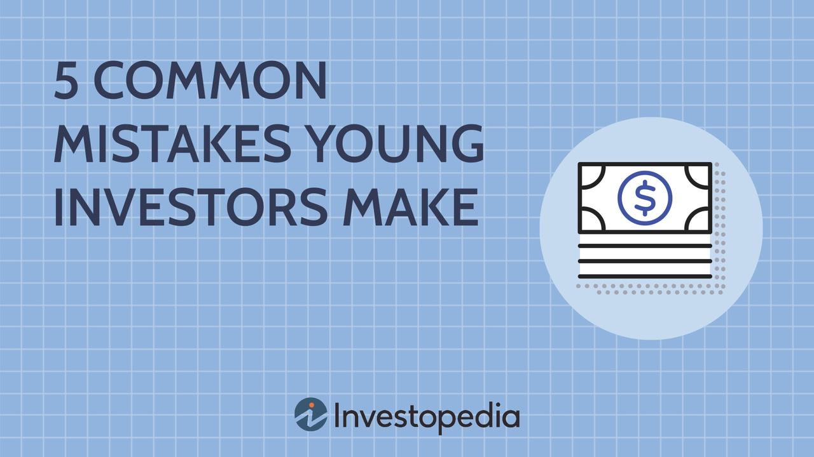

## Table of Contents

## What are the most common mistakes young investors make when starting out?

When young investors start out, one of the most common mistakes they make is not doing enough research before investing their money. They might see a stock or a cryptocurrency that's popular on social media and decide to invest without really understanding what they're buying. This can lead to big losses if the investment doesn't perform well. It's important for young investors to take the time to learn about the companies or assets they're interested in and to understand the risks involved.

Another mistake young investors often make is trying to time the market. They might think they can predict when the market will go up or down and try to buy and sell at the perfect times. But this is very hard to do, even for experienced investors. Instead of trying to time the market, young investors should focus on having a long-term plan and sticking to it. This means investing regularly and not being too worried about short-term ups and downs in the market.

Lastly, many young investors put all their money into one type of investment, like stocks or cryptocurrencies, instead of spreading it out. This is called not diversifying their portfolio. If that one investment does badly, they could lose a lot of money. A better approach is to spread their money across different types of investments, like stocks, bonds, and real estate. This can help reduce risk and make their investments more stable over time.

## How can a lack of diversification impact a young investor's portfolio?

A lack of diversification can really hurt a young investor's portfolio. When all the money is put into just one type of investment, like stocks or cryptocurrencies, it's like putting all your eggs in one basket. If that one investment goes down, the whole portfolio can lose a lot of value. For example, if a young investor only buys tech stocks and the tech industry has a bad year, their portfolio could take a big hit.

Diversifying means spreading money across different types of investments, like stocks, bonds, and real estate. This can help protect the portfolio because if one type of investment does badly, the others might do well and balance things out. Without diversification, a young investor's portfolio can be more risky and might not grow as steadily over time. It's like having a safety net that can catch you if one part of your investments falls.

## Why is it important for young investors to understand the concept of risk versus reward?

Understanding risk versus reward is super important for young investors because it helps them make smarter choices with their money. Every investment has a chance of making money, but it also has a chance of losing money. The more risk an investment has, the bigger the reward could be if things go well. But if things go badly, the losses could be bigger too. Young investors need to figure out how much risk they're okay with, based on what they want to achieve and how much they can afford to lose.

For example, putting money into a new startup might have a huge reward if the company does well, but it's also very risky because the company could fail. On the other hand, putting money into a savings account is very safe, but the reward is small because the [interest rate](/wiki/interest-rate-trading-strategies) is low. By understanding risk versus reward, young investors can pick investments that match their goals and comfort level with risk. This way, they can build a portfolio that grows over time without taking on more risk than they can handle.

## What role does emotional decision-making play in investment mistakes among young investors?

Emotional decision-making can lead young investors to make big mistakes with their money. When the market goes up and down, it's easy to get scared or excited and make quick choices without thinking them through. For example, if a young investor sees their stocks losing value, they might panic and sell everything, even if it's a good long-term investment. This is called selling low, which means they might miss out on future gains if the market goes back up.

On the other hand, young investors might get too excited about a hot new investment and jump in without doing their homework. They might see everyone on social media talking about a certain stock or [cryptocurrency](/wiki/cryptocurrency) and decide to buy it without understanding the risks. This can lead to buying high and then losing money if the investment doesn't do well. It's important for young investors to try to stay calm and stick to their plan, even when emotions are running high.

## How can chasing high returns lead to poor investment decisions?

Chasing high returns can lead young investors to make bad choices because they might be tempted to put their money into risky investments that promise big rewards. These investments can be things like new startups or cryptocurrencies that are popular but very unpredictable. When young investors focus too much on the possible big wins, they might not think about the chances of losing money. They might put all their money into one or two of these risky investments, hoping to get rich quick, but end up losing a lot if the investments don't do well.

This kind of behavior can also make young investors ignore safer, more reliable investments like bonds or diversified stock funds. These might not offer the chance of huge gains, but they are more likely to grow steadily over time and protect their money. When young investors chase high returns, they might miss out on building a solid, balanced portfolio that can grow slowly but surely. It's important for them to understand that trying to get rich quick often leads to more losses than gains, and a more patient, thoughtful approach can lead to better long-term results.

## What are the consequences of not having a long-term investment strategy?

Not having a long-term investment strategy can make young investors focus too much on what's happening right now instead of thinking about the future. They might get excited about a hot new stock or cryptocurrency and put all their money into it, hoping to make a quick profit. But if the market goes down or the investment doesn't do well, they could lose a lot of money. Without a long-term plan, they might not have a clear idea of what they want to achieve with their investments, like saving for a house or retirement. This can make them more likely to make emotional decisions based on short-term market changes, which often leads to buying high and selling low.

Another problem with not having a long-term strategy is that young investors might not diversify their investments. They might put all their money into one type of investment, like tech stocks, instead of spreading it out across different kinds of assets. If that one investment does badly, their whole portfolio could suffer. A long-term strategy helps young investors think about balancing risk and reward, and it encourages them to stick with their investments through ups and downs. This can lead to more stable growth over time and help them reach their financial goals without taking unnecessary risks.

## How does failing to do proper research affect investment outcomes for young investors?

Not doing enough research before investing can really hurt young investors. When they jump into buying a stock or a cryptocurrency just because it's popular on social media or among friends, they might not understand what they're getting into. Without knowing the company's financial health, the industry it's in, or the risks involved, young investors can end up losing a lot of money. They might buy something that looks good on the surface but has big problems underneath, leading to bad investment choices.

Failing to research also means young investors might miss out on good opportunities. If they don't take the time to learn about different types of investments, they might stick to what's familiar or trendy, instead of finding solid, long-term investments that could grow their money steadily. Proper research helps them understand the potential rewards and risks, so they can make smarter choices and build a more balanced and successful investment portfolio.

## Why is it harmful to invest money that is needed for short-term goals or emergencies?

It's harmful to invest money that you need for short-term goals or emergencies because you might not be able to get that money back quickly if you need it. When you invest, your money can go up or down, and if you need to use it soon, you might have to sell your investments when they're worth less than what you paid for them. This means you could lose money right when you need it the most. For example, if you invest money that you need to pay for a car repair or a medical bill, you might not have enough money when the time comes, and you'll be in a tough spot.

Also, using money meant for short-term needs or emergencies for investing can make you feel stressed and worried. If you know you might need that money soon, you'll be watching the market closely and might make quick, emotional decisions to sell your investments, even if it's not a good time. This can lead to more losses and make it harder to reach your financial goals. It's better to keep money for short-term needs in a safe place, like a savings account, where you can get to it quickly without worrying about losing value.

## What are the risks of over-relying on a single investment or asset class?

Over-relying on a single investment or asset class can be very risky for young investors. If all their money is in one type of investment, like stocks from one company or all in cryptocurrencies, they are putting all their eggs in one basket. If that one investment does badly, they could lose a lot of money. For example, if a young investor only buys shares in a tech company and that company has a bad year, their whole portfolio could go down a lot. This is why it's important to spread money across different types of investments to reduce the risk of losing everything if one investment fails.

Not diversifying can also make it harder for young investors to reach their long-term goals. If they only invest in one thing, they might miss out on other opportunities that could help their money grow more steadily. For instance, if they only invest in stocks and the stock market crashes, they won't have other investments like bonds or real estate to help balance out their losses. By spreading their money around, young investors can have a safer and more stable portfolio that can handle ups and downs in the market better.

## How can young investors avoid the pitfalls of market timing?

Young investors can avoid the pitfalls of market timing by focusing on a long-term investment plan instead of trying to guess when the market will go up or down. Market timing is really hard, even for people who have been investing for a long time. It's easy to get it wrong and end up buying high and selling low, which can lead to big losses. Instead of trying to time the market, young investors should think about their goals, like saving for a house or retirement, and invest regularly over time. This way, they can take advantage of the market's ups and downs without having to predict them.

Sticking to a long-term plan also helps young investors avoid making emotional decisions based on short-term market changes. When the market goes down, it's easy to get scared and sell everything, but this can mean missing out on future gains when the market goes back up. By investing regularly and not worrying about daily market movements, young investors can build a more stable portfolio that grows over time. It's important for them to stay calm and keep their eyes on their long-term goals, rather than trying to time the market and risking big losses.

## What impact does ignoring fees and costs have on investment returns?

Ignoring fees and costs can really hurt how much money young investors make from their investments. Every time you buy or sell an investment, there might be fees you have to pay. These can be things like trading fees, management fees, or other charges. If you don't pay attention to these costs, they can add up and take a big chunk out of your returns. Over time, even small fees can make a big difference in how much your investments grow.

For example, if you're paying a 1% fee every year on your investments, that might not seem like a lot. But over 20 or 30 years, those fees can add up to thousands of dollars. It's important for young investors to look at the fees and costs of different investments and try to keep them as low as possible. By choosing investments with lower fees, they can keep more of their money working for them and see bigger returns in the long run.

## How can young investors learn from their mistakes to improve their investment strategies?

Young investors can learn a lot from their mistakes by taking the time to think about what went wrong and why. If they lose money on an investment, they should look back and see if they didn't do enough research, got too excited about a hot new stock, or maybe tried to time the market. By understanding their mistakes, they can figure out what they need to do differently next time. For example, if they realize they didn't diversify their portfolio, they can start spreading their money across different types of investments to reduce risk.

Another way young investors can improve is by keeping a record of their investments and the reasons behind their decisions. Writing down why they chose a certain stock or how they felt about the market at the time can help them see patterns in their behavior. If they notice they often make emotional decisions, they can work on staying calm and sticking to their long-term plan. Learning from mistakes isn't just about avoiding the same errors; it's also about building better habits and strategies that will help them grow their money more successfully in the future.

## What is the hidden cost of procrastination?

Procrastination stands as one of the largest barriers to successful investing, particularly for young investors beginning their financial journey. The importance of starting early cannot be overstated due to the exponential power of compound interest, which Albert Einstein reputedly dubbed the "eighth wonder of the world"—those who comprehend it earn it, and those who do not, pay it. Compound interest generates earnings on both the initial principal and on the accumulated interest from previous periods. 

Mathematically, the formula for compound interest is:

$$
A = P \left(1 + \frac{r}{n}\right)^{nt}
$$

where:
- $A$ is the amount of money accumulated after n years, including interest.
- $P$ is the principal amount (initial investment).
- $r$ is the annual interest rate (decimal).
- $n$ is the number of times that interest is compounded per year.
- $t$ is the time in years.

This formula underscores how an early start in investing allows for the growth potential of an initial investment to amplify significantly over time. Young investors who procrastinate miss this opportunity for their money to grow exponentially, thereby limiting their potential financial growth.

Investing consistently further amplifies these benefits. One effective strategy to ensure consistency and mitigate [volatility](/wiki/volatility-trading-strategies) is dollar-cost averaging. This approach involves regularly investing a fixed dollar amount into a particular investment, such as index funds, regardless of its share price. This allows investors to purchase more shares when prices are low and fewer when prices are high, potentially lowering the average cost per share over time and smoothing out the effects of market volatility.

For example, consider an investor who commits to investing $100 monthly in an index fund. Some months, the investor might purchase more shares if the price dips; other months, fewer shares when the price rises. Over time, this approach can lead to a beneficial lower average cost per share, as illustrated by the formula:

$$
\text{Average Cost per Share} = \frac{\text{Total Amount Invested}}{\text{Total Shares Purchased}}
$$

In summary, by overcoming procrastination and committing to early and regular investments, young investors can markedly benefit from the natural growth cycle of the market, leveraging the power of compound interest and strategic investment practices like dollar-cost averaging.

## References & Further Reading

[1]: "Bitcoin's Wild Ride: A History of its Price Swings," Investopedia. 

[2]: "Vanguard's Advisor's Alpha: Quantifying the Value of Advice," Vanguard, 2020.

[3]: Bergstra, J., Bardenet, R., Bengio, Y., & Kégl, B. (2011). ["Algorithms for Hyper-Parameter Optimization."](https://dl.acm.org/doi/10.5555/2986459.2986743) Advances in Neural Information Processing Systems 24.

[4]: ["Advances in Financial Machine Learning"](https://www.amazon.com/Advances-Financial-Machine-Learning-Marcos/dp/1119482089) by Marcos Lopez de Prado.

[5]: ["Evidence-Based Technical Analysis: Applying the Scientific Method and Statistical Inference to Trading Signals"](https://www.amazon.com/Evidence-Based-Technical-Analysis-Scientific-Statistical/dp/0470008741) by David Aronson.

[6]: ["Machine Learning for Algorithmic Trading"](https://github.com/stefan-jansen/machine-learning-for-trading) by Stefan Jansen.

[7]: ["Quantitative Trading: How to Build Your Own Algorithmic Trading Business"](https://www.wiley.com/en-us/exportProduct/pdf/9781119203377) by Ernest P. Chan.