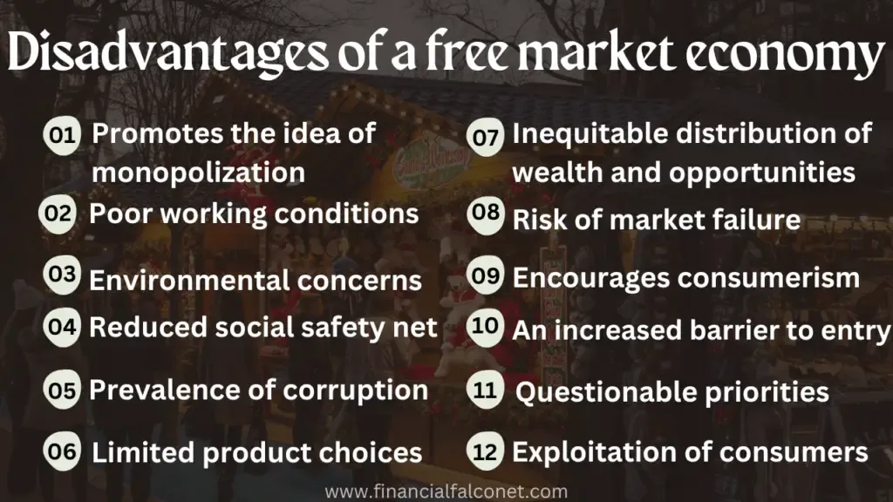

The concepts of free markets and algorithmic trading have gained substantial attention in recent years. However, these topics are often clouded with numerous misconceptions and myths. Free markets are typically understood as systems where prices are determined through the interactions of supply and demand without undue interference. Meanwhile, algorithmic trading employs pre-programmed algorithms to execute trades at high speeds, aiming to optimize investment outcomes.

This article aims to unravel the common misunderstandings surrounding free markets, market myths, and algorithmic trading. By addressing these misconceptions, we provide clarity that is crucial for making informed decisions, both at the policy level and for individual investors. Misconceptions can lead to misguided strategies that affect economic stability and profitability, underscoring the importance of accurate understanding.



Understanding these misconceptions is crucial for both policymakers and individual investors to make informed decisions. Policymakers need accurate information to craft regulations that support stable and efficient markets, while individual investors require a clear understanding to make sound investment choices and manage risks effectively.

The article is structured into different sections, each addressing specific myths related to economics and trading. We will explore prevalent misconceptions about inflation, which often is incorrectly viewed as an inevitable economic phenomenon. The role of governmental interventions in markets, often seen as either universally negative or a complete remedy, will be assessed. Additional focus will be on the myth of unregulated free markets and how self-regulation functions within these systems. The misunderstanding of the impact of taxes on economic output will also be scrutinized.

Moreover, we will cover the essence of algorithmic trading to dispel myths around its accessibility and risk levels. The aim is to provide a holistic understanding of how traditional economic principles integrate with modern trading technologies like algorithmic trading. Each section of this article is designed to clarify misunderstandings and provide insights that promote more effective free-market systems and trading practices.

## Table of Contents

## The Myth of Inevitable Inflation

Inflation is a complex economic phenomenon often perceived as an inevitable outcome over time. This perception, however, is rooted in various misconceptions. Inflation is not an unavoidable event but often results from specific economic policies, notably excessive money printing. By expanding the money supply beyond economic growth, governments may inadvertently ignite inflationary pressures. Milton Friedman famously stated that "inflation is always and everywhere a monetary phenomenon," emphasizing the link between money supply and price levels.

The phenomenon of inflation can also be understood as an indirect tax on earnings. This notion refers to how inflation erodes purchasing power, diminishing the real value of money held by consumers. As prices rise, the amount of goods and services that can be purchased with a fixed income decreases, effectively reducing the real income of individuals. In the long term, this principally benefits governments by decreasing the real value of their outstanding debt obligations. By repaying debt with money that has less purchasing power, governments reduce their debt burden without altering nominal debt figures.

Critics argue that a perceived inevitability of inflation stems from insufficient efforts to control it. Monetary authorities may sometimes lack the political will to implement necessary measures such as tightening monetary policy or reducing government spending. This reluctance can perpetuate inflationary cycles, making inflation appear unavoidable despite its controllable nature. 

To understand inflation comprehensively, it's essential to explore its origins and consequences. Inflation's roots can typically be traced back to monetary policy decisions, particularly those involving interest rates and money supply levels. For example, when central banks lower interest rates or engage in quantitative easing, they make borrowing cheaper and increase money circulation. While these actions can stimulate economic activity, they can also fuel inflation if not carefully managed.

The impacts of inflation on economic stability are significant. Moderate inflation can encourage spending and investment, as individuals and businesses prefer to utilize their money before it loses value. However, high or unpredictable inflation can lead to economic uncertainty, discouraging investment and savings. It can also strain fixed-income earners and distort price signals, leading to inefficient resource allocations.

Understanding these dynamics is crucial for policymakers aiming to balance economic growth with price stability. By recognizing that inflation is not an inexorable process but one largely influenced by policy choices, more effective monetary and fiscal strategies can be developed to mitigate its adverse effects.

## Governmental Interventions: A Savior or a Hindrance?

Government interventions in the economy are widely viewed as essential tools for addressing economic problems, yet their effectiveness is often debated. While proponents argue that government actions can stabilize markets and provide public goods, critics emphasize the unintended consequences that frequently accompany such policies. These interventions can lead to increased costs and are sometimes driven by political agendas rather than economic efficiency, raising questions about their long-term impact on economic health.

A prime example of government intervention with unexpected consequences is Social Security. Initially designed to provide a safety net for the retired population, Social Security has evolved into a significant fiscal responsibility for the government, placing a long-term tax burden on the working population. The system's sustainability is often questioned, as demographic changes strain its finances, necessitating ongoing reforms and increased taxes to maintain its solvency.

From a free-market perspective, government interventions are often viewed with skepticism. Such policies may be seen as predominantly serving political interests, possibly undermining the very economic efficiency they aim to enhance. For instance, subsidies or tariffs intended to protect domestic industries might distort market competition, leading to inefficiencies and higher consumer prices.

Historical examples illuminate the varied impacts of government interventions. The New Deal programs in the United States during the Great Depression sought to reenergize the economy through extensive reforms and public works projects. While these interventions provided immediate relief and employment opportunities, their long-term effectiveness in resolving fundamental economic problems remains debated among economists. Some argue that these initiatives laid the groundwork for robust economic institutions, while others contend that the recovery was largely due to subsequent market-driven growth.

In contrast, deregulation efforts in the late 20th century, such as those in the airline and telecommunications industries, aimed to reduce government intervention and promote competition. These reforms generally resulted in increased efficiency, lower prices, and more choices for consumers, illustrating how reducing government influence can yield positive outcomes in certain contexts.

Overall, the complex interplay between governmental interventions and economic outcomes underscores the need for a nuanced understanding of policy impacts. While interventions can address immediate issues and provide necessary public goods, their long-term consequences, driven by both economic and political factors, warrant careful evaluation to ensure they do not hinder overall economic health.

## The Fallacy of an Unregulated Free Market

There's a widespread myth that free markets equate to a lack of regulation. This misconception often arises from the simplistic interpretation of the term "free market," which suggests a chaotic environment with unchecked activities. However, this interpretation is flawed as it overlooks the inherent mechanisms within free markets that naturally facilitate regulation through consumer behavior and industry norms.

Free markets thrive on the principle of voluntary exchange, where businesses and consumers engage in transactions that reflect their preferences and constraints. Within this framework, consumer feedback serves as a powerful regulatory tool. When businesses fail to meet consumer demands or engage in unethical practices, the repercussions are often immediate. Consumers can choose to withdraw their patronage, negatively impacting the business financially. For example, if a company consistently delivers substandard products, negative consumer reviews and the consequent decline in sales act as a natural deterrent against such practices.

Another layer of organic regulation emerges from industry standards and certifications. These standards often arise voluntarily from industry participants who seek to ensure quality, safety, and efficiency. Over time, businesses adhering to these standards gain a competitive advantage by building trust and credibility with consumers. In the tech industry, for instance, adherence to data protection standards like the General Data Protection Regulation (GDPR) not only ensures compliance but also provides a marketing advantage by assuring customers of data security.

This self-regulation in free markets can often be more nimble and cost-effective compared to government-imposed regulations. Regulatory agencies face challenges such as bureaucratic inertia, which can lead to outdated or inefficient regulations. In contrast, market-based regulation adapts swiftly to changing consumer preferences and technological advancements. Consider the rapid evolution of digital payment systems; industry standards have quickly developed to address security and interoperability without the need for direct governmental intervention.

However, this approach to regulation requires a careful balance. While markets can self-regulate, they are not immune to failures, particularly in scenarios involving externalities or asymmetric information. For instance, environmental pollution represents an externality where individual businesses might not consider the broader societal impact of their activities. In such cases, minimal regulatory frameworks can complement market forces by addressing these specific market failures without stifling innovation and competition.

In summary, the myth that free markets lack regulation fails to recognize the dynamic and self-regulatory processes inherent within these economic systems. By understanding how markets use consumer feedback and industry standards to enforce discipline, we gain a clearer picture of how freedom and regulation coexist synergistically in promoting economic order and efficiency.

## The Misunderstanding of Tax Impacts

Taxes are commonly perceived as neutral to economic output, a view that fails to consider their potential disincentive effects. This perception is particularly challenged by advocates of free-market economics, who argue that higher taxes can reduce the incentives for individuals and businesses to produce goods and services, ultimately leading to a decrease in national output. When taxes are increased, individuals may opt to work fewer hours, and businesses might decide against investing in new projects, both of which can harm economic growth.

Although taxes are integral to funding essential public services such as infrastructure, healthcare, and education, their broader economic impact cannot be overlooked. The concept of the "drag effect" refers to the reduced efficiency and lower levels of productivity that can result from higher tax brackets. This effect arises because higher taxes can lead to reduced disposable income, thus diminishing consumer spending and investment, which are critical components of economic activity.

Empirical data from various economic studies suggest that reducing tax burdens can lead to increases in productivity and overall economic prosperity. For example, the economic policies of the 1980s in the United States, often credited with reducing tax rates, were associated with a period of robust economic growth, although the causality is a topic of economic debate. The Laffer Curve is often cited in this context; it illustrates the theoretical relationship between tax rates and tax revenue, suggesting that there is an optimal tax rate that maximizes revenue without discouraging productivity.

Understanding the complex interplay between taxation and economic performance is crucial for the formulation of effective fiscal policies. Policymakers must consider not only the immediate fiscal needs but also the long-term effects of taxation on economic growth. A nuanced understanding of this relationship can lead to more balanced tax policies that support economic prosperity while still providing for public services.

## Demystifying Algorithmic Trading

Algorithmic trading, often surrounded by myths, is frequently perceived as a domain exclusive to Wall Street experts and inherently risky for average investors. However, these misconceptions merit reevaluation. Contrary to popular belief, [algorithmic trading](/wiki/algorithmic-trading) tools are increasingly accessible to individual traders, facilitated by user-friendly platforms that streamline the trading process. This democratization of trading technology enables a wider audience to engage with algorithmic strategies.

At its core, algorithmic trading involves the use of computer programs to execute trades based on predefined criteria. These algorithms can analyze vast amounts of market data more quickly and accurately than a human trader. While all trading inherently involves risk, algorithmic strategies can assist in managing and mitigating these risks. For instance, algorithms can implement risk management techniques such as stop-loss orders and position sizing to minimize potential losses. They can also exploit market inefficiencies, allowing traders to capitalize on price discrepancies across various exchanges or timeframes.

The idea that algorithmic trading requires expensive setups is another misconception. Today, numerous affordable platforms offer access to algorithmic trading for beginners. These platforms often include a range of tools, such as historical data analysis, [backtesting](/wiki/backtesting), and strategy optimization, which were previously available only to institutional traders. Moreover, many of these platforms provide educational resources and community support, enabling new traders to learn and develop their skills effectively.

To illustrate the accessibility of algorithmic trading, consider the Python programming language, widely used in the financial industry for developing trading algorithms. Python's numerous libraries, such as NumPy for numerical calculations and Pandas for data manipulation, facilitate the creation and optimization of trading strategies. For example, using the `ccxt` library, a trader can easily connect to [cryptocurrency](/wiki/cryptocurrency) exchanges to fetch market data and execute trades programmatically. Here's a basic example of connecting to an exchange and retrieving market data using Python:

```python
import ccxt

exchange = ccxt.binance()
markets = exchange.load_markets()

print("Available Markets: ", markets.keys())  # Outputs available trading pairs
```

By dispelling myths surrounding algorithmic trading, traders of all levels can harness these tools for improved trading outcomes. Embracing algorithmic trading not only opens opportunities for more informed decision-making but also integrates technological advancements into traditional trading practices, enhancing financial literacy and effectiveness in navigating modern financial markets.

## Conclusion

Economic misconceptions and market myths continue to wield significant influence over both public opinion and policy decisions on a global scale. Misunderstandings about inflation, government interventions, market regulation, tax impacts, and algorithmic trading often misguide policymakers and investors, leading to suboptimal economic outcomes. By actively addressing these misconceptions, we can progress towards more efficient free-market systems and trading practices. This is particularly pertinent as the integration of traditional economic principles with modern trading technologies, such as algorithmic trading, forms the cornerstone of contemporary economic strategies.

Traditional economic theories provide a fundamental framework for understanding market dynamics. When combined with algorithmic trading, characterized by the use of algorithms to automate trading decisions, this integration can enhance market efficiency and [liquidity](/wiki/liquidity-risk-premium). Algorithmic trading offers the possibility of executing highly complex trading strategies at scale, which can be beneficial for both institutional and individual investors. As such tools become increasingly accessible, they enable a broader demographic of traders to participate effectively in the market.

Understanding these myths serves a dual purpose: it empowers individual investors with the knowledge necessary to make informed decisions, and it supports the development of more sound and informed economic policies at the macroeconomic level. Dispelling myths about the inevitability of inflation, the effectiveness of government intervention, the nature of free markets, and the impacts of taxation is vital. Such clarity aids in designing policies that favor sustainable economic growth and stability, diminish unnecessary regulatory burdens, and optimize tax structures to encourage productivity.

It is crucial to approach economic theories and practices with a critical mindset. This skepticism ensures that stakeholders continually scrutinize and question prevailing narratives, which is necessary for dispelling misconceptions and ultimately enhancing financial literacy. With greater understanding, individuals and policymakers alike can navigate the complexities of economic systems more effectively, contributing to a more robust and dynamic global economy.

## References & Further Reading

[1]: Friedman, M. (1970). ["The Counter-Revolution in Monetary Theory."](https://link.springer.com/chapter/10.1007/978-1-349-24967-1_1) Institute of Economic Affairs.

[2]: ["Advances in Financial Machine Learning"](https://www.amazon.com/Advances-Financial-Machine-Learning-Marcos/dp/1119482089) by Marcos Lopez de Prado

[3]: ["Quantitative Trading: How to Build Your Own Algorithmic Trading Business"](https://www.amazon.com/Quantitative-Trading-Build-Algorithmic-Business/dp/1119800064) by Ernest P. Chan

[4]: ["The Great Depression: An Inquiry into the Causes, Course, and Consequences of the Worldwide Depression of the Nineteen-Thirties, as Seen by Contemporaries and in the Light of History"](https://archive.org/details/greatdepressiona00garr) Edited by Lionel Robbins

[5]: Stiglitz, J. E. (2009). ["Government Failure vs. Market Failure: Principles of Regulation."](https://www.cambridge.org/core/books/government-and-markets/government-failure-vs-market-failure-principles-of-regulation/D66D50EFD53E5823A8CBE2C48B8085D1) National Bureau of Economic Research Working Paper. 

[6]: ["Machine Learning for Algorithmic Trading"](https://github.com/stefan-jansen/machine-learning-for-trading) by Stefan Jansen

[7]: Aarvik, S., & Rekdal, R. (2017). ["Algorithmic Trading and High-Frequency Trading – A Literature Review."](https://assets.cambridge.org/97811070/91146/frontmatter/9781107091146_frontmatter.pdf) 

[8]: ["Understanding The Laffer Curve"](https://en.wikipedia.org/wiki/Laffer_curve) by Arthur Laffer.

[9]: Knittel, C. R., & Pindyck, R. S. (2016). ["The Simple Economics of Commodity Price Speculation."](http://web.mit.edu/rpindyck/www/Papers/CommodityPriceSpecAEJMacro2016.pdf) National Bureau of Economic Research Working Paper.