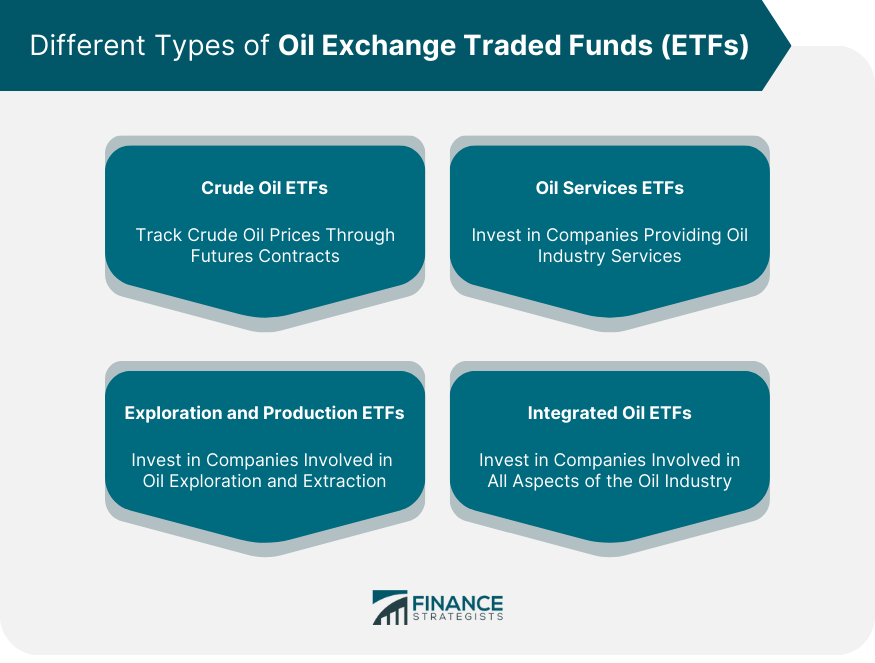

## Table of Contents

## What are Exchange-Traded Funds (ETFs)?

Exchange-Traded Funds, or ETFs, are a type of investment that combines the features of mutual funds and stocks. They are a basket of securities, like stocks, bonds, or commodities, that you can buy and sell on a stock exchange, just like you would with individual stocks. This makes them easy to trade throughout the day at market prices, unlike mutual funds which are only traded at the end of the day.

ETFs are popular because they offer a way to diversify your investments without having to buy each security individually. For example, if you want to invest in the technology sector, you can buy an ETF that includes a variety of tech companies. This can help spread out your risk. Plus, ETFs often have lower fees than mutual funds, making them a cost-effective choice for many investors.

## How do oil and gas ETFs work?

Oil and gas ETFs are a type of exchange-traded fund that focuses on investing in companies involved in the oil and gas industry. These companies can include those that explore, produce, refine, or transport oil and gas. When you buy shares of an oil and gas ETF, you're essentially buying a small piece of many different companies in this sector all at once. This helps spread out your risk because if one company doesn't do well, the impact on your investment might be less severe since you're invested in a variety of companies.

The value of an oil and gas ETF goes up and down based on how well the companies inside the ETF are doing and what's happening in the oil and gas market. If oil prices go up, the value of the ETF might go up too because the companies in the ETF could make more money. But if oil prices drop, the ETF's value could go down. You can buy and sell shares of the ETF throughout the day, just like you would with any stock, making it easy to get in and out of your investment when you want to.

## What are the benefits of investing in oil and gas ETFs?

Investing in oil and gas ETFs can be a good way to spread out your risk. Instead of putting all your money into one company, you're investing in a whole bunch of them at the same time. This means if one company doesn't do well, it might not hurt your investment as much because you're also invested in other companies that might be doing better. It's like not putting all your eggs in one basket.

Another benefit is that oil and gas ETFs can help you take advantage of changes in the oil and gas market. If oil prices go up, the value of your ETF might go up too because the companies in the ETF could make more money. This can be a good way to make money if you think the oil and gas industry is going to do well. Plus, ETFs are easy to buy and sell, so you can quickly change your investment if you need to.

## What are the risks associated with oil and gas ETFs?

Investing in oil and gas ETFs can be risky because the value of the ETF goes up and down with the price of oil and gas. If oil prices drop a lot, the value of your ETF can go down too. This means you could lose money if you need to sell your shares when the price is low. The oil and gas industry can be affected by things like politics, natural disasters, or changes in how much people use oil and gas, so it can be hard to predict what will happen.

Another risk is that oil and gas ETFs focus on just one industry. If the whole oil and gas sector does badly, your ETF will likely do badly too. This is different from investing in a more diverse ETF that includes companies from different industries. If you put all your money into oil and gas ETFs, you might miss out on opportunities in other areas that could be doing better. It's important to think about how much of your money you want to put into this one type of investment.

## Can you list some popular oil and gas ETFs?

Some popular oil and gas ETFs are the Energy Select Sector SPDR Fund (XLE), the Vanguard Energy ETF (VDE), and the iShares Global Energy ETF (IXC). These ETFs are well-known and often chosen by investors who want to put their money into the oil and gas industry. The Energy Select Sector SPDR Fund (XLE) is one of the biggest and most traded ETFs in this category, focusing on U.S. energy companies.

Another popular choice is the Vanguard Energy ETF (VDE), which also invests in a wide range of U.S. energy companies. It's known for having lower fees, which can be a big plus for investors looking to save money. The iShares Global Energy ETF (IXC) is a bit different because it includes energy companies from all around the world, not just the U.S. This can be good if you want to spread your investment across different countries.

These ETFs can help you invest in the oil and gas industry without having to pick individual companies. But remember, the value of these ETFs can go up and down a lot depending on what's happening in the oil and gas market. So, it's important to think carefully before you invest.

## How do oil and gas ETFs differ from other energy ETFs?

Oil and gas ETFs focus specifically on companies that are involved in exploring, producing, refining, or transporting oil and gas. These ETFs are all about the oil and gas industry, so if you invest in them, your money is tied to how well oil and gas companies do. This means the value of your investment can go up and down a lot depending on what's happening with oil prices and the oil and gas market.

Other energy ETFs might include a wider range of companies from the energy sector, not just oil and gas. For example, they might invest in companies that produce renewable energy like solar or wind power, or they might include companies that work with other types of energy like nuclear or coal. These ETFs can help spread out your risk because they're not focused only on oil and gas. If oil prices drop, but renewable energy companies do well, your investment might not lose as much value.

So, the main difference is that oil and gas ETFs are more specific and focus only on the oil and gas part of the energy sector, while other energy ETFs can include a mix of different energy sources. This means oil and gas ETFs might be riskier because they're more tied to the ups and downs of the oil and gas market, but they can also offer big rewards if the oil and gas industry does well.

## What factors should be considered when choosing an oil and gas ETF?

When choosing an oil and gas ETF, it's important to look at the fees. Some ETFs charge more than others, and these fees can eat into your returns over time. So, picking an ETF with lower fees can help you keep more of your money. Another thing to think about is how the ETF is made up. Some ETFs might focus more on big oil companies, while others might include smaller companies or even companies that work in other parts of the energy sector. Knowing what's inside the ETF can help you decide if it fits with what you're looking for.

You should also consider how the ETF has performed in the past. While past performance doesn't guarantee future results, it can give you an idea of how the ETF has handled different market conditions. If an ETF has done well when oil prices were high or low, that might be a good sign. Also, think about how much risk you're comfortable with. Oil and gas ETFs can be pretty volatile, so if you don't like big swings in your investment's value, you might want to think twice before putting a lot of money into them.

## How do geopolitical events affect oil and gas ETFs?

Geopolitical events can have a big impact on oil and gas ETFs. When there's tension or conflict in countries that produce a lot of oil, like in the Middle East, it can make people worried about whether the oil will keep flowing. If there's a chance that oil supplies might be cut off, oil prices can go up fast. This is good for oil and gas ETFs because when oil prices go up, the companies in the ETF can make more money, which can make the value of the ETF go up too.

On the other hand, if a geopolitical event makes oil prices drop, like if countries agree to produce more oil, that can hurt oil and gas ETFs. Lower oil prices mean the companies in the ETF might make less money, which can make the value of the ETF go down. So, it's important to keep an eye on what's happening around the world because these events can shake up the oil and gas market and affect your investment in oil and gas ETFs.

## What is the impact of oil prices on oil and gas ETFs?

Oil prices have a big effect on oil and gas ETFs. When oil prices go up, the companies in the ETF usually make more money because they can sell their oil for more. This can make the value of the ETF go up too. For example, if there's a shortage of oil or if people start using more oil, the price can go up, which is good for the ETF.

On the other hand, when oil prices go down, the companies in the ETF might make less money. This can make the value of the ETF go down. If there's too much oil being produced or if people start using less oil, the price can drop, which can hurt the ETF. So, watching oil prices is important if you're investing in oil and gas ETFs.

## How can one analyze the performance of oil and gas ETFs?

To analyze the performance of oil and gas ETFs, you should look at how the ETF has done over time. Check its past returns to see if it has made money or lost money in different market conditions. You can find this information on financial websites or the ETF's official website. Also, look at how the ETF compares to other ETFs in the same category. If an oil and gas ETF has done better than most others, it might be a good choice.

Another thing to consider is how the ETF reacts to changes in oil prices. When oil prices go up or down, does the ETF's value move in the same direction? You can look at charts that show the ETF's performance alongside oil prices to see this. Also, pay attention to the ETF's expense ratio, which is how much it costs to own the ETF. Lower fees can mean more money in your pocket over time. By looking at these factors, you can get a good idea of how well an oil and gas ETF is doing and whether it might be a good investment for you.

## What are the tax implications of investing in oil and gas ETFs?

Investing in oil and gas ETFs can have tax implications that you should know about. When you buy and sell shares of an ETF, you might have to pay capital gains tax. If you sell your shares for more than you paid for them, you'll owe taxes on the profit. The tax rate depends on how long you held the shares. If you held them for more than a year, it's considered a long-term capital gain, which usually has a lower tax rate. If you held them for a year or less, it's a short-term capital gain, and you'll pay your regular income tax rate on that.

Another thing to consider is that oil and gas ETFs might pay out dividends. These dividends are usually taxed as ordinary income, which means they're taxed at your regular income tax rate. However, some ETFs might pay out qualified dividends, which are taxed at the lower long-term capital gains rate. It's important to check the specifics of the ETF you're investing in to understand how the dividends will be taxed. Keeping track of these tax implications can help you plan better and maybe even save some money on taxes.

## How do oil and gas ETFs fit into a diversified investment portfolio?

Oil and gas ETFs can be a good way to add some variety to your investment portfolio. By investing in an oil and gas ETF, you're putting your money into a whole bunch of companies in the oil and gas industry all at once. This helps spread out your risk because if one company doesn't do well, the others might still be doing okay. Plus, oil and gas ETFs can help you take advantage of changes in the oil market. If oil prices go up, the value of your ETF might go up too, which can be a nice boost to your overall portfolio.

But, it's important to remember that oil and gas ETFs are focused on just one part of the energy sector. This means they can be riskier than ETFs that include a mix of different industries. If the whole oil and gas industry does badly, your ETF will likely do badly too. So, when you're building a diversified portfolio, you should think about how much of your money you want to put into oil and gas ETFs. It's usually a good idea to balance them with investments in other areas, like technology, healthcare, or renewable energy, to help protect your money from big swings in the oil market.

## What are the risks and challenges of investing in oil and gas ETFs?

Investing in oil and gas ETFs (Exchange-Traded Funds) presents several risks and challenges linked to market volatility, geopolitical factors, environmental issues, and algorithmic trading dependencies. Understanding these risks is crucial for investors seeking to navigate the complexities of energy markets effectively.

### Market Volatility and Geopolitical Risks

The oil and gas industries are inherently volatile. Prices are influenced by numerous factors, including changes in supply and demand, international conflicts, and political instability in key producing regions. Geopolitical tensions, such as those in the Middle East or between major powers, can lead to significant price swings. For example, an unexpected conflict can disrupt supply chains, causing sudden spikes in oil prices, while diplomatic resolutions may stabilize markets.

Volatility can be measured using the standard deviation of historical price returns. For instance, if the historical monthly returns of an oil ETF are given, the volatility ($\sigma$) is calculated as:

$$
\sigma = \sqrt{\frac{\sum (R_i - \bar{R})^2}{n - 1}}
$$

where $R_i$ is each period's return, $\bar{R}$ is the average return, and $n$ is the number of observations.

### Environmental Concerns and Regulatory Challenges

Fossil fuel investments are increasingly scrutinized due to environmental concerns. Global efforts to tackle climate change, such as the Paris Agreement, place regulatory pressures on oil and gas companies to reduce emissions. These regulations can affect the profitability and operations of companies included in oil and gas ETFs, posing risks to investors. Furthermore, societal shifts towards renewable energy sources may decrease long-term demand for fossil fuels, impacting investor returns.

### Risks of Algorithmic Trading

Algorithmic trading, while offering opportunities for optimizing investment strategies, also presents significant risks. Technical failures or errors in algorithm design can lead to substantial financial losses. For instance, if an algorithm is designed to trade based on incorrect price triggers, it may execute trades at disadvantageous times, leading to losses. Moreover, these systems can contribute to market volatility, as witnessed in 'flash crashes' where rapid, automated trades exacerbate pricing errors.

Python, for example, is often used in developing algorithms for trading:

```python
import numpy as np

# Simulate a simple moving average crossover strategy
def moving_average(prices, window):
    return np.convolve(prices, np.ones(window), 'valid') / window

# Dummy price data
prices = np.array([100, 101, 102, 103, 104, 105, 106])

# Calculate moving averages
short_window = moving_average(prices, 2)
long_window = moving_average(prices, 5)

# Identify buy/sell signals
signals = short_window > long_window[:-(len(short_window) - len(long_window))]

print("Trade signals:", signals)
```

### Importance of Research and Risk Mitigation

Thorough research and risk management are paramount in addressing these challenges. Investors should regularly monitor geopolitical developments, regulatory changes, and environmental policies affecting the oil and gas sectors. Additionally, diversifying investments can reduce exposure to specific risks. Incorporating various asset classes or sectors can balance potential losses in the oil and gas markets, aligning with an investor's risk tolerance and financial goals.

Risk mitigation strategies, such as using stop-loss orders and maintaining a diversified portfolio, are crucial. Staying informed and adapting to new information allows investors to make better decisions, enhancing their ability to manage risks effectively.

In summary, while investing in oil and gas ETFs offers potential returns, being cognizant of these challenges helps investors navigate complexities, maximizing their investment outcomes responsibly.

## References & Further Reading

[1]: ["Advances in Financial Machine Learning"](https://www.amazon.com/Advances-Financial-Machine-Learning-Marcos/dp/1119482089) by Marcos Lopez de Prado

[2]: Bergstra, J., Bardenet, R., Bengio, Y., & Kégl, B. (2011). ["Algorithms for Hyper-Parameter Optimization."](https://dl.acm.org/doi/10.5555/2986459.2986743) Advances in Neural Information Processing Systems 24.

[3]: ["Evidence-Based Technical Analysis: Applying the Scientific Method and Statistical Inference to Trading Signals"](https://www.amazon.com/Evidence-Based-Technical-Analysis-Scientific-Statistical/dp/0470008741) by David Aronson

[4]: ["Machine Learning for Algorithmic Trading"](https://github.com/stefan-jansen/machine-learning-for-trading) by Stefan Jansen

[5]: ["Quantitative Trading: How to Build Your Own Algorithmic Trading Business"](https://github.com/LucindaYa/quant-resources/blob/master/Quantitative%20Trading%20How%20to%20Build%20Your%20Own%20Algorithmic%20Trading%20Business.pdf) by Ernest P. Chan