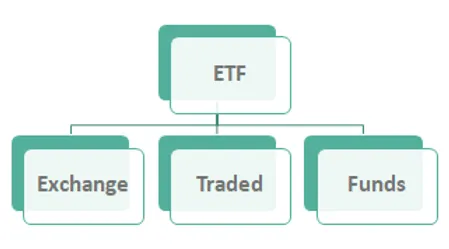

In recent years, there has been a notable surge in interest in energy investments, particularly within the oil and gas sectors. This rising attention is driven by the essential role energy plays in the global economy, coupled with the fluctuating demands and prices of oil and gas. As traditional energy sources continue to be pivotal in the energy mix, investors are increasingly looking for efficient ways to gain exposure to these markets, aiming for potentially lucrative returns.

Exchange-Traded Funds (ETFs) emerge as a significant financial instrument in this context. ETFs are investment funds that trade on stock exchanges, much like stocks. They offer investors a convenient way to invest in a diversified portfolio of assets, such as stocks, bonds, or commodities, with lower costs and higher liquidity compared to traditional mutual funds. In the energy market, ETFs allow investors to gain targeted exposure to the oil and gas sectors without the need to directly purchase commodity futures or shares in individual energy companies. This diversification is crucial in managing the inherent risks associated with energy investments, given the market's volatility and geopolitical influences.



Algorithmic trading, the use of automated systems to conduct trades at speed and volume that are beyond human capability, plays a pivotal role in optimizing these investments. This technology leverages complex algorithms and data analytics to make informed trading decisions, enhancing the efficiency and effectiveness of investment strategies. In the context of Energy Investment ETFs, algorithmic trading can analyze vast datasets to identify market trends, execute trades at optimal times, and adjust positions dynamically, thus maximizing returns and minimizing risks.

This article aims to offer a comprehensive look at Energy Investment ETFs with a particular focus on oil and gas. It seeks to provide valuable insights into why these financial instruments have become attractive options for both novice and seasoned investors. By exploring the benefits and challenges of investing in oil and gas ETFs, and understanding the impact of algorithmic trading, readers will be well-equipped to navigate the dynamic landscape of energy markets. Whether you are a newcomer to the world of investing or an experienced trader, the insights shared will help in making informed decisions and optimizing your energy investment portfolio.

## Table of Contents

## Understanding Exchange-Traded Funds (ETFs)

Exchange-Traded Funds (ETFs) are investment funds that are traded on stock exchanges, much like individual stocks. An ETF holds assets such as stocks, commodities, or bonds and generally operates with an arbitrage mechanism designed to keep trading close to its net asset value, though deviations can occasionally occur.

Fundamentally, ETFs combine elements of both mutual funds and individual stocks. Like mutual funds, they pool investors' money to purchase a diversified portfolio of assets. However, unlike mutual funds, ETFs are traded throughout the trading day on exchanges at prices determined by the market. This liquidity and ease of trading are characteristics that make them akin to individual stock investments.

The benefits of investing in ETFs are manifold:

1. **Diversification**: ETFs often track a specific index, sector, or commodity, allowing investors to diversify their portfolios with a single purchase. By investing in one ETF, an investor can gain exposure to a broad range of assets, reducing the risk associated with holding individual securities.

2. **Cost-Efficiency**: ETFs generally have lower expense ratios compared to mutual funds, mainly due to their passive management style which often follows indices. This cost-efficiency is attractive to investors seeking to minimize fees while maintaining exposure to market movements.

3. **Flexibility and Liquidity**: As ETFs are traded on exchanges, they can be bought and sold at any time during the trading day at market prices, providing investors with flexibility and liquidity. This contrasts with mutual funds, which are priced at the end-of-day net asset value (NAV) and can only be exchanged once trading for the day has closed.

4. **Tax Efficiency**: ETFs tend to be more tax-efficient than mutual funds because their structure allows for what is known as "in-kind" creation and redemption of shares. This process may help to minimize capital gains taxes that are realized when securities are bought and sold within a fund.

Comparison with other investment vehicles highlights the unique advantages of ETFs. Unlike individual stocks, ETFs provide instant diversification. Compared to mutual funds, they offer better trading flexibility and lower management costs.

The growth and popularity of ETFs have been significant over recent years. For instance, according to Statista, the number of ETFs worldwide increased from about 276 in 2003 to over 7,602 by the beginning of 2022. Assets under management (AUM) in ETFs reached a staggering $9.46 trillion globally at the start of 2022, illustrating the increasing preference for ETFs among both institutional and retail investors.

This surge can be attributed to the inherent benefits of ETFs coupled with the growing investor appetite for diversified, cost-effective investment options that leverage market advancements and democratize access to a wide array of asset classes.

## Overview of Oil and Gas Markets

The oil and gas industry has been a cornerstone of the global economy since its inception in the mid-19th century. The commercial use of oil began with the drilling of the first oil well by Edwin Drake in Pennsylvania in 1859, which marked the start of a new era. Crude oil and its refined products became fundamental to industrial progress, powering machinery, transportation, and later, electricity generation. The development of the internal combustion engine in the early 20th century further entrenched oil as a critical resource. Natural gas gained prominence in the mid-20th century, especially as a cleaner alternative for electricity production and heating.

Currently, the oil and gas markets are shaped by several key players and emerging trends. Major international oil companies (IOCs) such as ExxonMobil, Royal Dutch Shell, and BP have traditionally dominated the sector. However, national oil companies (NOCs) like Saudi Aramco and Gazprom have significant influence due to ownership of vast reserves. A notable trend is the increasing investments in liquefied natural gas (LNG) to meet rising global energy demands while managing carbon footprints. Additionally, technological advancements in hydraulic fracturing and horizontal drilling have unlocked resources in shale formations, particularly in the United States, transforming it into a leading producer.

The oil and gas sectors face various challenges and opportunities. Environmental concerns and stringent regulatory requirements demand cleaner production processes and investments in sustainable alternatives. Volatility in oil prices, driven by geopolitical tensions and supply-demand imbalances, poses a significant challenge. Nevertheless, opportunities are present in the form of technological innovations that increase efficiency and reduce emissions, as well as in the growth of emerging markets with increasing energy needs.

Despite inherent [volatility](/wiki/volatility-trading-strategies), investors continue to be drawn to the oil and gas markets. The potential for high returns, driven by fluctuations in commodity prices, is attractive. Furthermore, the sectors' fundamental role in fueling economies worldwide ensures their continued relevance. The growing interest in energy transition technologies, including those owned by traditional oil and gas companies, offers additional avenues for investment, making the sector a pivotal component of diversified portfolios despite its challenges.

## Energy Investment through Oil and Gas ETFs

Exchange-Traded Funds (ETFs) focused on oil and gas provide a structured way for investors to gain exposure to the energy markets, particularly by investing in a diversified portfolio of assets related to the oil and gas industry. These ETFs track indices or sectors within the energy market and are designed to reflect the performance of specific components, such as companies involved in oil exploration, production, refining, or distributing petroleum products.

There are several types of oil and gas ETFs, each targeting different segments of the industry:

1. **Exploration and Production ETFs**: These ETFs invest in companies actively involved in the discovery and extraction of oil and natural gas. They benefit from increases in commodity prices as they directly impact the profitability of exploration and production companies. An example is the SPDR S&P Oil & Gas Exploration & Production ETF (XOP), which offers exposure to U.S. companies in these sectors.

2. **Refining and Marketing ETFs**: Focused on companies that refine crude oil into marketable products like gasoline, these ETFs track entities involved in refining operations and the marketing of finished products. The VanEck Vectors Oil Refiners ETF (CRAK) is an example that provides exposure to global oil refinery companies.

3. **Integrated Oil & Gas ETFs**: These funds invest in large, established companies that perform multiple functions across the oil and gas value chain, from exploration to distribution. The iShares Global Energy ETF (IXC) is a prime example, as it includes major integrated oil companies among its holdings.

The performance metrics of these ETFs can vary significantly based on market conditions. For instance, during periods of high oil prices, exploration and production ETFs like XOP may witness substantial gains due to increased profitability for companies involved in these sectors. Conversely, during market downturns, these ETFs might experience losses. Historical data often show that oil and gas ETFs are sensitive to price changes in the commodities they cover as well as geopolitical events affecting supply and demand.

The advantages of investing in oil and gas ETFs are manifold:

- **Diversification**: By investing in a basket of securities within the oil and gas sector, ETFs offer diversification, which reduces individual security risk.

- **Liquidity**: Most oil and gas ETFs trade on major exchanges, providing liquidity and allowing investors to buy and sell shares as needed throughout the trading day.

- **Cost Efficiency**: ETFs generally have lower expense ratios compared to mutual funds, making them a cost-effective way for investors to gain sector exposure.

- **Transparent Pricing**: Because ETFs trade on exchanges like individual stocks, their prices are transparent and real-time, allowing investors to make informed decisions.

Investing in oil and gas ETFs allows investors to strategically target aspects of the energy industry while mitigating some risks associated with direct investment in single commodity futures or individual company stocks. However, potential investors should conduct thorough research and consider market conditions before investing in these securities.

## The Role of Algorithmic Trading in ETFs

Algorithmic trading refers to the use of computer algorithms to automate trading decisions based on pre-set conditions. These algorithms analyze market data at speeds and frequencies that are impossible for a human trader. The adoption of [algorithmic trading](/wiki/algorithmic-trading) has transformed the financial markets by enhancing trading speed, efficiency, and accuracy. Its role in exchange-traded funds (ETFs) is particularly notable due to the complex and dynamic nature of [ETF](/wiki/etf-trading-strategies) trading.

Algorithms in ETF trading facilitate various strategies, such as [arbitrage](/wiki/arbitrage), [market making](/wiki/market-making), and risk management, by leveraging technology to optimize decision-making and execution. For oil and gas ETFs, algorithmic trading provides an edge by capitalizing on the volatility and price movements inherent in energy markets. Investors use algorithms to time entries and exits more effectively, ensuring they maximize returns and minimize risks.

One of the primary benefits of algorithmic trading for managing large portfolios of oil and gas ETFs is the ability to handle vast amounts of data while executing trades across different exchanges and markets simultaneously. This ability enhances [liquidity](/wiki/liquidity-risk-premium) and ensures tighter spreads, which are crucial in commodity-based ETFs, where price swings can be substantial. Algorithms can assess and react to real-time market conditions, economic releases, and geopolitical events that heavily influence energy prices.

Tools and platforms offering algorithmic trading capabilities for ETFs include TradeStation, MetaTrader, and QuantConnect. These platforms provide access to algorithm development, back-testing, and implementation without requiring extensive programming knowledge. For instance, QuantConnect offers a cloud-based environment where investors can test their strategies using historical data. Python, a popular language for algorithmic trading, can be used to write scripts that execute specified strategies. Here's a simple example of a Python algorithm using a basic moving average crossover strategy:

```python
import pandas as pd
import numpy as np

# Load ETF price data
data = pd.read_csv('etf_prices.csv', parse_dates=True, index_col='Date')
data['SMA_20'] = data['Close'].rolling(window=20).mean()
data['SMA_50'] = data['Close'].rolling(window=50).mean()

# Generate trading signals
data['Signal'] = np.where(data['SMA_20'] > data['SMA_50'], 1, 0)

# Calculate daily returns
data['Returns'] = data['Close'].pct_change()
data['Strategy_Returns'] = data['Signal'].shift(1) * data['Returns']

# Calculate cumulative returns
data['Cumulative_Strategy_Returns'] = (1 + data['Strategy_Returns']).cumprod()

print(data.tail())
```

This script demonstrates how an algorithm can generate buy and sell signals based on the crossing of short-term and long-term moving averages. Given the rapid fluctuations in oil and gas prices, such strategies enable traders to systematically capitalize on price trends.

In conclusion, algorithmic trading plays a crucial role in ETF markets, including the oil and gas sectors. By processing vast datasets and executing trades efficiently, algorithms help investors optimize their strategies, manage risks, and enhance portfolio performance. As technology evolves, the impact and capabilities of algorithmic trading in ETFs will grow, continuing to shape how investors engage with dynamic markets.

## Risks and Challenges of Investing in Oil and Gas ETFs

Investing in oil and gas ETFs (Exchange-Traded Funds) presents several risks and challenges linked to market volatility, geopolitical factors, environmental issues, and algorithmic trading dependencies. Understanding these risks is crucial for investors seeking to navigate the complexities of energy markets effectively.

### Market Volatility and Geopolitical Risks

The oil and gas industries are inherently volatile. Prices are influenced by numerous factors, including changes in supply and demand, international conflicts, and political instability in key producing regions. Geopolitical tensions, such as those in the Middle East or between major powers, can lead to significant price swings. For example, an unexpected conflict can disrupt supply chains, causing sudden spikes in oil prices, while diplomatic resolutions may stabilize markets.

Volatility can be measured using the standard deviation of historical price returns. For instance, if the historical monthly returns of an oil ETF are given, the volatility ($\sigma$) is calculated as:

$$
\sigma = \sqrt{\frac{\sum (R_i - \bar{R})^2}{n - 1}}
$$

where $R_i$ is each period's return, $\bar{R}$ is the average return, and $n$ is the number of observations.

### Environmental Concerns and Regulatory Challenges

Fossil fuel investments are increasingly scrutinized due to environmental concerns. Global efforts to tackle climate change, such as the Paris Agreement, place regulatory pressures on oil and gas companies to reduce emissions. These regulations can affect the profitability and operations of companies included in oil and gas ETFs, posing risks to investors. Furthermore, societal shifts towards renewable energy sources may decrease long-term demand for fossil fuels, impacting investor returns.

### Risks of Algorithmic Trading

Algorithmic trading, while offering opportunities for optimizing investment strategies, also presents significant risks. Technical failures or errors in algorithm design can lead to substantial financial losses. For instance, if an algorithm is designed to trade based on incorrect price triggers, it may execute trades at disadvantageous times, leading to losses. Moreover, these systems can contribute to market volatility, as witnessed in 'flash crashes' where rapid, automated trades exacerbate pricing errors.

Python, for example, is often used in developing algorithms for trading:

```python
import numpy as np

# Simulate a simple moving average crossover strategy
def moving_average(prices, window):
    return np.convolve(prices, np.ones(window), 'valid') / window

# Dummy price data
prices = np.array([100, 101, 102, 103, 104, 105, 106])

# Calculate moving averages
short_window = moving_average(prices, 2)
long_window = moving_average(prices, 5)

# Identify buy/sell signals
signals = short_window > long_window[:-(len(short_window) - len(long_window))]

print("Trade signals:", signals)
```

### Importance of Research and Risk Mitigation

Thorough research and risk management are paramount in addressing these challenges. Investors should regularly monitor geopolitical developments, regulatory changes, and environmental policies affecting the oil and gas sectors. Additionally, diversifying investments can reduce exposure to specific risks. Incorporating various asset classes or sectors can balance potential losses in the oil and gas markets, aligning with an investor's risk tolerance and financial goals.

Risk mitigation strategies, such as using stop-loss orders and maintaining a diversified portfolio, are crucial. Staying informed and adapting to new information allows investors to make better decisions, enhancing their ability to manage risks effectively.

In summary, while investing in oil and gas ETFs offers potential returns, being cognizant of these challenges helps investors navigate complexities, maximizing their investment outcomes responsibly.

## Strategies for Successful Energy Investment

Creating a balanced and diversified energy investment portfolio requires careful planning and strategic decision-making. Investors should consider several key factors to optimize their investments specifically in the oil and gas sectors.

Firstly, diversification is fundamental. Diversifying an energy investment portfolio can mitigate volatility and reduce risks. This may involve allocating funds across various types of energy-related assets such as oil and gas ETFs that focus on different areas like exploration, production, or refining. By spreading investments across different segments and geographical regions, investors can insulate their portfolios from sector-specific downturns and geopolitical disruptions.

Staying informed about energy market trends and global economic indicators is vital. The oil and gas markets are highly sensitive to changes in supply and demand, geopolitical dynamics, and regulatory shifts. Investors should continuously monitor developments such as OPEC production decisions, major geopolitical events, and technological advancements in energy extraction and production. Economic indicators like GDP growth rates, inflation, and currency exchange rates also play a significant role in influencing energy prices.

Continuous learning and adaptation are crucial in the fast-paced trading environment. The energy sector is constantly evolving with innovations in technology and shifts in consumer preferences towards sustainable energy sources. Investors should remain open to learning new investment strategies and adaptable to industry changes. This might involve gaining knowledge from financial news, energy market reports, and educational platforms offering courses on energy investments.

Leveraging technology and expert insights can significantly enhance investment strategies. Algorithmic trading has become a powerful tool for managing energy portfolios, facilitating the analysis of large volumes of data to optimize trade executions. Investors can use algorithmic trading platforms to backtest strategies, identify trends, and execute trades with precision. Additionally, seeking expert advice from financial analysts specializing in the energy sector can provide valuable insights into market dynamics and assist in decision-making. 

By combining these strategies, investors can develop a robust framework for successful energy investments. A well-balanced portfolio, coupled with informed decision-making and technological leverage, equips investors to navigate the complexities of the oil and gas markets effectively.

## Conclusion

Energy investments, particularly through oil and gas Exchange-Traded Funds (ETFs), present a compelling opportunity for investors seeking exposure to the energy markets. These ETFs provide diversification and cost efficiency compared to direct investments in individual stocks or mutual funds. However, investing in the oil and gas sectors is not without its complexities and risks, stemming from market volatility, geopolitical instability, and environmental regulations.

Traditional investment approaches continue to hold value, providing a structured way to engage with the markets. Yet, the integration of emerging technologies such as algorithmic trading enhances the ability to optimize investment strategies, especially in managing large portfolios. Algorithmic trading minimizes human errors and takes advantage of market efficiencies, but it also carries the risk of technological malfunction.

Staying informed and making well-considered decisions are crucial in navigating the dynamic landscape of energy markets. Investors must be vigilant about market trends, geopolitical developments, and innovations in trading technologies. A balanced approach that combines traditional investment strategies with modern technological tools offers a robust framework for participating successfully in the energy investment sphere. Continuous learning and adaptation remain key to thriving in this ever-evolving market segment.

## References & Further Reading

[1]: ["Advances in Financial Machine Learning"](https://www.amazon.com/Advances-Financial-Machine-Learning-Marcos/dp/1119482089) by Marcos Lopez de Prado

[2]: Bergstra, J., Bardenet, R., Bengio, Y., & Kégl, B. (2011). ["Algorithms for Hyper-Parameter Optimization."](https://dl.acm.org/doi/10.5555/2986459.2986743) Advances in Neural Information Processing Systems 24.

[3]: ["Evidence-Based Technical Analysis: Applying the Scientific Method and Statistical Inference to Trading Signals"](https://www.amazon.com/Evidence-Based-Technical-Analysis-Scientific-Statistical/dp/0470008741) by David Aronson

[4]: ["Machine Learning for Algorithmic Trading"](https://github.com/stefan-jansen/machine-learning-for-trading) by Stefan Jansen

[5]: ["Quantitative Trading: How to Build Your Own Algorithmic Trading Business"](https://github.com/LucindaYa/quant-resources/blob/master/Quantitative%20Trading%20How%20to%20Build%20Your%20Own%20Algorithmic%20Trading%20Business.pdf) by Ernest P. Chan