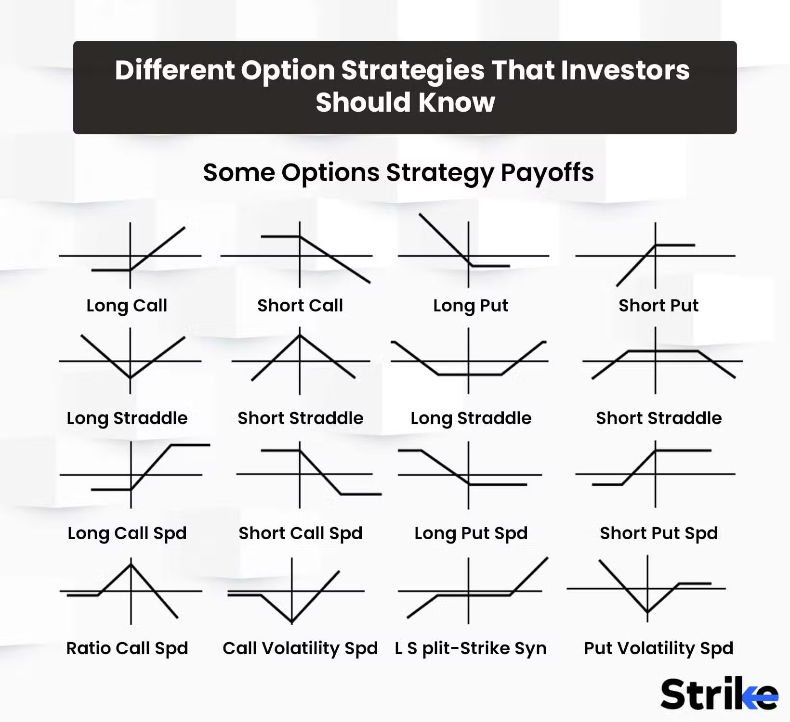

## Table of Contents

## What is an options strategy and why is it important for investors?

An options strategy is a way for investors to use options, which are financial contracts that give the buyer the right, but not the obligation, to buy or sell an asset at a set price before a certain date. These strategies can help investors make money, protect their investments, or both. There are many different options strategies, and each one has its own risks and benefits. Some common strategies include buying calls or puts, selling covered calls, and using spreads.

Options strategies are important for investors because they offer flexibility and can help manage risk. For example, if an investor thinks a stock will go up, they can buy a call option, which could lead to big profits if they're right. On the other hand, if they're worried about a stock going down, they can buy a put option to limit their losses. Options can also be used to generate extra income from stocks an investor already owns, like when they sell covered calls. By understanding and using options strategies, investors can better handle the ups and downs of the market and potentially improve their investment returns.

## What are the basic types of options: calls and puts?

A call option gives you the right to buy a stock at a certain price before a certain date. Think of it like a coupon that lets you buy something at a discount if the price goes up. If you think a stock's price will go up, you can buy a call option. If the stock price does go up, you can use the call option to buy the stock at the lower price and then sell it at the higher price to make a profit. But if the stock price doesn't go up, you don't have to buy the stock, and you only lose the money you paid for the call option.

A put option is the opposite. It gives you the right to sell a stock at a certain price before a certain date. It's like having a safety net if the stock price falls. If you think a stock's price will go down, you can buy a put option. If the stock price does go down, you can use the put option to sell the stock at the higher price and make a profit. If the stock price stays the same or goes up, you don't have to sell the stock, and you only lose the money you paid for the put option.

## How does a covered call strategy work and who should use it?

A covered call strategy is when you own a stock and then sell someone else the right to buy that stock from you at a set price before a certain date. This is called selling a call option. The person who buys the call option pays you money, which is called a premium. If the stock price stays below the set price, the call option will expire worthless, and you get to keep the premium as extra income. But if the stock price goes above the set price, the buyer can use the call option to buy your stock at the lower price, and you have to sell it to them.

This strategy is good for people who think the stock price will stay the same or go up a little bit, but not too much. It's a way to make some extra money from stocks you already own. It's best for investors who are okay with selling their stock if it goes up a lot, because that's what might happen if the stock price goes above the set price. Covered calls can help lower the risk of owning stocks and give you a bit of extra income, but they also limit how much you can make if the stock price goes way up.

## What is a protective put and how can it be used to hedge a portfolio?

A protective put is like buying insurance for your stock. If you own a stock and you're worried it might go down in price, you can buy a put option. This put option gives you the right to sell your stock at a set price, even if the market price drops below that. So, if the stock price does fall, you can use the put option to sell your stock at the higher set price, which helps limit your losses.

This strategy is great for hedging a portfolio because it acts as a safety net. If you have a lot of stocks and you're worried about a big drop in the market, buying protective puts on your key stocks can help protect your overall investment. It won't stop your stocks from losing value, but it can make sure you don't lose as much money if things go south. It's like having a backup plan that gives you peace of mind.

## Can you explain the long straddle strategy and in what market conditions it is most effective?

A long straddle strategy is when you buy both a call option and a put option on the same stock at the same time. Both options have the same expiration date and the same price at which you can buy or sell the stock. The idea is to make money if the stock price moves a lot in either direction. If the stock price goes up a lot, you can use the call option to buy the stock at a lower price and sell it at the higher price. If the stock price goes down a lot, you can use the put option to sell the stock at a higher price than it's worth in the market.

This strategy works best in market conditions where you expect big moves but you're not sure which way the stock will go. It's like betting on a big change without knowing if it will be good or bad. For example, if a company is about to release important news that could make the stock price jump up or down, a long straddle could be a good choice. The downside is that it can be expensive because you have to pay for both the call and the put options, and if the stock price doesn't move much, you could lose the money you spent on the options.

## What is a short strangle and what are the risks associated with it?

A short strangle is when you sell both a call option and a put option on the same stock at the same time. Both options have the same expiration date, but they have different prices at which you can buy or sell the stock. The call option's price is higher than the current stock price, and the put option's price is lower. You do this because you get paid for selling the options, and you hope that the stock price will stay between the two prices until the options expire. If it does, both options will be worthless, and you keep the money you were paid.

But there are risks with a short strangle. The biggest risk is that the stock price moves a lot in either direction. If the stock price goes above the call option's price, the person who bought the call can make you sell them the stock at a lower price than it's worth, and you lose money. If the stock price goes below the put option's price, the person who bought the put can make you buy the stock at a higher price than it's worth, and you lose money again. So, while you can make money if the stock price stays in a certain range, you can lose a lot if it moves too much.

## How does an iron condor strategy work and what are its potential benefits and drawbacks?

An iron condor strategy is a way to make money when you think a stock will stay in a certain price range. You do this by selling a call option with a high price and a put option with a low price, and then buying a call option with an even higher price and a put option with an even lower price. The money you get from selling the first two options is more than what you pay for the other two, so you start with some profit. If the stock stays between the high and low prices you set, all four options will expire worthless, and you keep the money you made at the start.

The benefit of an iron condor is that it can give you a steady income if you pick the right price range for the stock. It's like betting that the stock won't move too much, which can be a good guess if the market is calm. But the drawback is that if the stock moves a lot in either direction, you can lose money. If it goes above the highest price or below the lowest price, one of your options will be used against you, and you'll have to pay to fix it. So, while it can be a good way to make money, it also has risks if the stock moves more than you expect.

## What is a butterfly spread and how can it be used to profit from low volatility?

A butterfly spread is a way to make money when you think a stock won't move much. You do this by buying one call option with a low price, selling two call options with a middle price, and buying one call option with a high price. All these options have the same expiration date. If the stock stays close to the middle price when the options expire, you make the most money. The idea is that the two middle options you sold will lose value faster than the other two options you bought, and you end up with a profit.

This strategy is good for low [volatility](/wiki/volatility-trading-strategies) because it works best when the stock price doesn't move a lot. If the stock stays right around the middle price, the options you sold will be worthless, and the options you bought will still have some value. But if the stock moves a lot in either direction, you could lose money. So, a butterfly spread is like betting that the stock will stay calm, and it can be a smart choice when you expect the market to be quiet.

## Can you describe the calendar spread strategy and the scenarios where it might be profitable?

A calendar spread strategy is when you buy and sell options with the same stock and the same price, but they have different expiration dates. You sell an option that expires soon and buy an option that expires later. The idea is to make money from the difference in how fast the options lose their value over time. If the stock price stays close to the price you set, the option you sold will lose value faster than the option you bought, and you can make a profit.

This strategy can be profitable in a few different situations. One good time to use it is when you think the stock price will stay about the same for a while. If the stock doesn't move much, the option you sold will expire worthless, and the option you bought will still have some value. Another good time is right before a big event that might move the stock price, like an earnings report. If you think the stock will stay calm until the event and then might move a lot, a calendar spread can help you make money if you're right about the timing.

## What is a diagonal spread and how does it differ from a calendar spread?

A diagonal spread is a bit like a calendar spread, but it's a bit more flexible. In a diagonal spread, you buy and sell options on the same stock, but they have different expiration dates and different prices. You sell an option that expires soon and buy an option that expires later, just like in a calendar spread. But in a diagonal spread, the option you buy has a different price from the one you sell. This lets you make money if the stock price moves a little bit in one direction while staying calm until the first option expires.

The main difference between a diagonal spread and a calendar spread is that a diagonal spread gives you more room for the stock price to move. In a calendar spread, the stock has to stay very close to the same price for you to make money. But with a diagonal spread, you can still make money if the stock price goes up or down a bit, as long as it stays within the range you set. This makes diagonal spreads a good choice if you think the stock will move a little but not too much before the first option expires.

## How can advanced investors use a玉collar strategy to manage risk while maintaining upside potential?

A collar strategy is a way for advanced investors to protect their investments while still having a chance to make money if the stock price goes up. To use a collar, you own a stock, buy a put option to protect against the stock going down, and sell a call option to help pay for the put. The put option acts like insurance, letting you sell the stock at a set price if it falls a lot. The call option you sell gives someone else the right to buy your stock at a higher price, and you get paid for that, which helps cover the cost of the put.

This strategy is good for investors who want to limit their risk but still want some chance to make money if the stock goes up. If the stock price stays between the prices you set for the put and call options, you keep the money from selling the call and your stock is safe. But if the stock price goes above the call option's price, you might have to sell your stock at that lower price. So, while a collar helps protect against big losses, it also means you might miss out on big gains if the stock price jumps a lot.

## What are some advanced considerations and adjustments for managing complex options strategies?

Managing complex options strategies requires careful monitoring and timely adjustments. One key consideration is keeping an eye on the stock's price and how it's moving. If the stock starts to move a lot in one direction, you might need to adjust your options to stay protected or to keep your chances of making money. For example, if you're using a strategy like an iron condor and the stock starts to go up fast, you might need to buy back the call option you sold to stop your losses from getting too big. It's also important to think about how much time is left until the options expire. As the expiration date gets closer, the value of the options can change a lot, so you might need to make changes to your strategy to stay on track.

Another thing to think about is the overall market conditions and any big events that could affect your stock. If there's an earnings report coming up or some other news that could move the stock price, you might want to adjust your options to be ready for it. Sometimes, it can help to roll your options, which means closing out the current options and opening new ones with different expiration dates or prices. This can give you more time or a better chance to make money. It's also good to keep an eye on how much money you're making or losing, and be ready to cut your losses if things aren't going your way. Managing complex options strategies takes practice and a good understanding of how options work, but with the right adjustments, you can keep your investments safe and still have a chance to make money.

## References & Further Reading

[1]: Hull, J.C. (2017). ["Options, Futures, and Other Derivatives"](https://www.semanticscholar.org/paper/Options%2C-Futures%2C-and-Other-Derivatives-Hull/89bdee500c8623864fc9eb7a471546aa713acc44). Pearson Education.

[2]: de Prado, M.L. (2018). ["Advances in Financial Machine Learning"](https://www.amazon.com/Advances-Financial-Machine-Learning-Marcos/dp/1119482089). John Wiley & Sons.

[3]: Chan, E.P. (2009). ["Quantitative Trading: How to Build Your Own Algorithmic Trading Business"](https://github.com/ftvision/quant_trading_echan_book). Wiley Trading.

[4]: Jansen, S. (2020). ["Machine Learning for Algorithmic Trading"](https://github.com/stefan-jansen/machine-learning-for-trading). Packt Publishing.

[5]: Passarelli, D. (2008). ["Trading Options Greeks: How Time, Volatility, and Other Pricing Factors Drive Profits"](https://www.semanticscholar.org/paper/Trading-Options-Greeks%3A-How-Time%2C-Volatility%2C-and-Passarelli/787366f74438cec30fb90f42a069a139e44ab1db). Bloomberg Press.

[6]: Kelleher, J.D., Mac Namee, B., & D'Arcy, A. (2015). ["Fundamentals of Machine Learning for Predictive Data Analytics"](https://mitpress.mit.edu/9780262029445/fundamentals-of-machine-learning-for-predictive-data-analytics/). MIT Press.

[7]: Das, S. (2015). ["Swaps and Other Derivatives"](https://onlinelibrary.wiley.com/doi/book/10.1002/9781119206224). John Wiley & Sons.