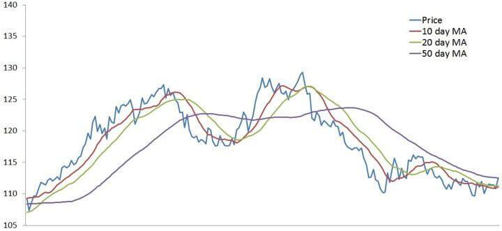

In the fast-paced world of financial markets, trading indicators are integral to analyzing market trends and making informed decisions. Among these indicators, moving averages stand out as some of the most widely utilized tools by both financial analysts and algorithmic traders. Moving averages are simplistic yet powerful, assisting in smoothing out price data to highlight underlying trends over specified periods. Their importance in financial analysis lies in their ability to filter out the noise created by short-term volatility, thereby providing a clearer view of longer-term market movements.

Moving averages form the backbone of many trading strategies and are instrumental in various applications within algorithmic trading. These strategies rely on predefined rules to execute trades, allowing traders to automate processes and make quick, data-driven decisions. Understanding the concept of moving averages involves exploring their calculation methods, which can vary. Common types include the Simple Moving Average (SMA) and the Exponential Moving Average (EMA). While SMA offers a straightforward calculation by averaging prices over a set period, EMA gives more weight to recent prices, making it more reactive to current market changes.



This article also covers the advantages and limitations of moving averages. These indicators can simplify complex market data into recognizable patterns, guiding traders in determining support and resistance levels and forecasting potential price movements. However, it's essential to acknowledge their limitations; as lagging indicators, moving averages may not always predict future market movements accurately. Furthermore, the application of moving averages in automated trading strategies offers insights into their adaptability and optimization for better trading performance.

By providing a comprehensive understanding of moving averages and their role in modern trading, this discussion serves as an essential resource for traders and analysts looking to enhance their decision-making processes and improve their trading outcomes.

## Table of Contents

## Understanding Moving Averages

Moving averages are technical indicators that play a vital role in financial market analysis by smoothing out price data over a specified period, enhancing the visibility of underlying trends. By mitigating the impact of short-lived price fluctuations, moving averages allow traders to filter out market noise, providing a clearer picture of market directions.

There are several types of moving averages, each offering a unique approach to analyzing price data. The most widely used are the Simple Moving Average (SMA) and the Exponential Moving Average (EMA). The SMA is calculated by averaging the closing prices of an asset over a predetermined period. This method provides a straightforward view of price trends by offering an equal weight to all data points in the selected period. The formula for a simple moving average is:

$$
\text{SMA} = \frac{P_1 + P_2 + \ldots + P_n}{n}
$$

where $P_1, P_2, \ldots, P_n$ are the closing prices over $n$ periods.

Conversely, the EMA assigns more significance to recent prices, making it more sensitive to recent price movements. This feature allows EMA to react more quickly to market price changes compared to SMA. The calculation for EMA is more complex as it involves a smoothing [factor](/wiki/factor-investing), giving exponentially decreasing weight to older prices. The formula for the exponential moving average is:

$$
\text{EMA} = (P_t \cdot \alpha) + (\text{EMA}_{t-1} \cdot (1-\alpha))
$$

where $P_t$ is the price at time $t$ and $\alpha = \frac{2}{n+1}$ is the smoothing factor, with $n$ being the number of periods.

Moving averages are invaluable in trading strategies, especially in identifying support and resistance levels. These levels are crucial in determining potential price reversals or continuations. Furthermore, moving averages help forecast potential market movements by analyzing the trend direction indicated by the slope of the moving average line. This utility makes them indispensable tools for traders and analysts seeking to interpret and act on market data effectively.

## Types of Moving Averages

The most commonly used moving averages in financial markets are the Simple Moving Average (SMA) and the Exponential Moving Average (EMA). 

The Simple Moving Average (SMA) is calculated by taking the arithmetic mean of a given set of prices over a specified number of periods. It is expressed mathematically as:

$$
\text{SMA} = \frac{P_1 + P_2 + \ldots + P_n}{n}
$$

where $P$ denotes the closing prices, and $n$ is the number of periods considered. The SMA provides a straightforward overview of price trends, smoothing out fluctuations to highlight the underlying trend.

The Exponential Moving Average (EMA), on the other hand, assigns greater weight to the most recent prices, making it more sensitive to the latest data. This emphasis is achieved by using a smoothing factor, $\alpha$, typically calculated as:

$$
\alpha = \frac{2}{n + 1}
$$

The EMA can be recursively calculated using the formula:

$$
\text{EMA}_t = \alpha \times P_t + (1 - \alpha) \times \text{EMA}_{t-1}
$$

where $P_t$ is the current price, and $\text{EMA}_{t-1}$ is the previous period's EMA. This responsive nature makes EMA particularly valuable for identifying short-term market movements.

In addition to SMA and EMA, there are other types of moving averages, such as the Weighted Moving Average (WMA) and Double Exponential Moving Average (DEMA). The WMA assigns weights linearly decreasing with each older price. This bias towards recent data can be useful in markets with rapid price changes. The DEMA goes further by applying EMA to an EMA, thus reducing the lag and offering a more responsive measure. These variations offer unique benefits and challenges that traders consider based on their specific strategies and the prevailing market dynamics.

Traders choose a type of moving average depending on their objectives and market conditions. For instance, in volatile markets where timeliness is crucial, an EMA might be preferred for its responsiveness. Conversely, in stable markets, an SMA may suffice to provide a clear view of the trend. Understanding these differences is key to selecting the appropriate moving average tailored to a trader's needs.

## Applying Moving Averages in Algo Trading

Algorithmic trading uses moving averages to automate trading strategies by following predefined rules. These averages assist in generating buy or sell signals through crossover strategies, a common approach where a short-term moving average crosses a long-term moving average, signaling a potential shift in market trends. For instance, a bullish signal might be generated when a 50-day simple moving average (SMA) crosses above a 200-day SMA, indicating a potential upward trend.

Moving averages also play a critical role in risk management by identifying dynamic support and resistance levels. These levels help traders determine optimal entry and [exit](/wiki/exit-strategy) points, reducing potential losses. For example, in a rising market, a long-term moving average may act as a support level, indicating a buying opportunity if the asset's price approaches this line.

The adaptability of moving averages makes them a cornerstone in programmatic trading systems. Their application varies across different market conditions, enabling traders to adjust strategies in response to market [volatility](/wiki/volatility-trading-strategies). For instance, in a trending market, moving averages can filter out noise and help maintain a clear view of the overall market direction.

Optimization of moving average parameters is crucial in [backtesting](/wiki/backtesting) [algorithmic trading](/wiki/algorithmic-trading) strategies. This involves fine-tuning the period lengths of moving averages to enhance strategy performance and reduce the likelihood of false signals. For instance, utilizing Python, a popular tool among algorithmic traders, one might employ libraries like `pandas` and `numpy` to conduct backtesting:

```python
import pandas as pd
import numpy as np

# Simulated stock prices
data = {'Price': [100, 102, 101, 105, 107, 110, 108, 111, 115]}
df = pd.DataFrame(data)

# Calculate moving averages
df['Short_MA'] = df['Price'].rolling(window=3).mean()
df['Long_MA'] = df['Price'].rolling(window=5).mean()

# Generate signals
df['Signal'] = np.where(df['Short_MA'] > df['Long_MA'], 1, 0)  # Buy signal when short MA crosses above long MA

print(df)
```

In this code snippet, short-term and long-term moving averages are calculated to create a simplistic crossover strategy for generating buy signals. Optimization might involve testing various window sizes to determine which configuration yields the best historical performance. 

Such systematic approaches provide a framework for traders to methodically evaluate and refine their strategies, ultimately enhancing the economics of their trading activities.

## Advantages and Limitations of Moving Averages

Moving averages are instrumental in financial analysis by transforming complex market information into clear, discernible trends. They are versatile, which allows traders to apply them across different financial instruments and time frames, and thus provide a broad applicability in strategy development. 

Despite their advantages, moving averages have limitations. As lagging indicators, they rely on historical data and may not be effective in predicting future price movements with precision. This inherent lag can be problematic in rapidly changing market conditions where reaction time is critical.

The Exponential Moving Average (EMA) is particularly sensitive to price swings due to its weighting towards more recent data points. This sensitivity can lead to false signals, which may mislead traders into executing non-optimal trades. To mitigate this risk, traders often use EMAs in conjunction with other technical indicators like the Relative Strength Index (RSI) or the Moving Average Convergence Divergence (MACD) for confirmation and enhanced accuracy.

Moreover, an over-reliance on moving averages can limit a trader’s perspective. It is essential to combine moving averages with other analysis tools to account for diverse market conditions and improve decision-making. Emphasizing a holistic approach that includes [fundamental analysis](/wiki/fundamental-analysis) and market sentiment can assist in overcoming the shortcomings of moving averages. 

Appropriate selection of the moving average type, careful definition of the averaging period, and continuous backtesting can help traders optimize their strategies. By acknowledging the limitations of moving averages and integrating them thoughtfully into a broader array of analytical tools, traders can better navigate complex trading environments and enhance their trading success.

## Key Considerations for Using Moving Averages

When using moving averages in trading strategies, selecting an appropriate period for calculation is paramount. The chosen timeframe should align with a trader's specific trading strategy and goals. For instance, a short-term trader might opt for a 5-day to 20-day moving average to capture quick, minor trends, while long-term investors may prefer a 50-day to 200-day period to identify major trend directions. The period determines the moving average's sensitivity to price changes; shorter periods result in more responsive indicators, while longer periods offer a smoother, broader view of market trends.

Combining moving averages with other technical indicators such as the Relative Strength Index (RSI) or Moving Average Convergence Divergence (MACD) can enhance signal accuracy. For example, a crossover between a short-term moving average and a longer-term moving average can indicate a buy or sell opportunity. Adding an RSI or MACD into the analysis can validate these signals by providing a clearer picture of market [momentum](/wiki/momentum) and potential reversal points.

Regular backtesting of moving average strategies is essential. By historically evaluating how a moving average would have performed, traders can optimize parameters to maximize strategy performance under varying market conditions. This involves adjusting the timeframe of the moving averages, incorporating different technical indicators, and testing on diverse market environments to ensure robustness.

Moving averages have their limitations, particularly in sideways or range-bound markets, where their signal accuracy can suffer. In such contexts, moving averages might generate conflicting or unhelpful signals as the price oscillates within a tight range. Rather than relying solely on moving averages, traders should use them in conjunction with price action analysis and other tools that might better capture the nuances of a non-trending market.

Additionally, it is crucial to confirm trends identified by moving averages with fundamental analysis and market sentiment. Even when technical indicators suggest a trend, underlying economic factors and investor sentiment can significantly impact market direction. Therefore, integrating moving averages into a broader analytical framework that includes economic data releases, news events, and broader market analysis offers a more rounded approach.

Example Python code for combining moving averages with RSI:

```python
import pandas as pd
import numpy as np

# Example setup, assumes a pandas DataFrame 'data' with a 'Close' column
period_short = 20
period_long = 50

data['SMA'] = data['Close'].rolling(window=period_short).mean()
data['SMA_long'] = data['Close'].rolling(window=period_long).mean()

# Calculate RSI
def calculate_rsi(data, window=14):
    delta = data['Close'].diff()
    gain = (delta.where(delta > 0, 0)).rolling(window=window).mean()
    loss = (-delta.where(delta < 0, 0)).rolling(window=window).mean()
    rs = gain / loss
    rsi = 100 - (100 / (1 + rs))
    return rsi

data['RSI'] = calculate_rsi(data)

# Signal generation
data['Signal'] = np.where((data['SMA'] > data['SMA_long']) & (data['RSI'] < 30), 'Buy', 
                          np.where((data['SMA'] < data['SMA_long']) & (data['RSI'] > 70), 'Sell', 'Hold'))
```

This code exemplifies how traders can set up a straightforward strategy that combines moving averages with RSI to derive trading signals, with the flexibility for further customization based on specific backtest results.

## Conclusion

Moving averages serve as fundamental tools in financial analysis, providing critical insights into market trends and facilitating informed trading decisions. These indicators, by smoothing price data over defined intervals, help traders identify underlying patterns and potential reversals, proving especially useful in both manual and algorithmic trading contexts. In algorithmic trading, moving averages enhance the precision and efficiency of trade execution, allowing for the development of automated strategies that follow clear, rule-based criteria for entering and exiting the market.

Despite their inherent limitations, such as being lagging indicators, moving averages remain invaluable when applied correctly. They complement other analytical tools and indicators, forming a composite view that aids traders and financial analysts in navigating volatile markets. A key to maximizing the utility of moving averages is continuous learning and the dynamic adaptation of trading strategies. Markets evolve, and so too must the strategies that traders employ, necessitating regular evaluation and recalibration of moving average parameters to ensure they remain relevant to current market conditions.

By integrating moving averages into a comprehensive trading strategy, market participants can not only enhance their decision-making processes but also improve overall trading success. This integration involves using moving averages in conjunction with other technical and fundamental analysis methods, thereby forming a robust, well-rounded approach to market analysis. Through disciplined and informed application, traders can leverage the full potential of moving averages, turning analytical insights into profitable trading outcomes.

## References & Further Reading

[1]: Bergstra, J., Bardenet, R., Bengio, Y., & Kégl, B. (2011). ["Algorithms for Hyper-Parameter Optimization."](https://dl.acm.org/doi/10.5555/2986459.2986743) Advances in Neural Information Processing Systems 24.

[2]: ["Advances in Financial Machine Learning"](https://www.amazon.com/Advances-Financial-Machine-Learning-Marcos/dp/1119482089) by Marcos Lopez de Prado

[3]: ["Evidence-Based Technical Analysis: Applying the Scientific Method and Statistical Inference to Trading Signals"](https://www.amazon.com/Evidence-Based-Technical-Analysis-Scientific-Statistical/dp/0470008741) by David Aronson

[4]: ["Machine Learning for Algorithmic Trading"](https://github.com/PacktPublishing/Machine-Learning-for-Algorithmic-Trading-Second-Edition) by Stefan Jansen

[5]: ["Quantitative Trading: How to Build Your Own Algorithmic Trading Business"](https://books.google.com/books/about/Quantitative_Trading.html?id=j70yEAAAQBAJ) by Ernest P. Chan