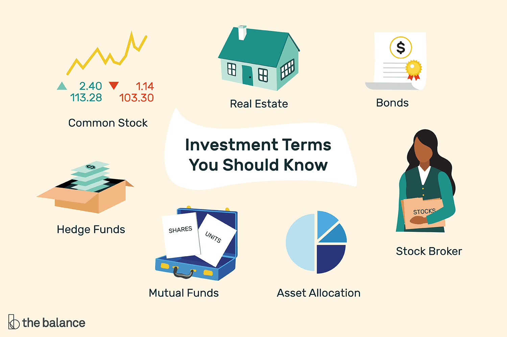

## Table of Contents

## What are some basic terms every amateur investor should know?

When you start investing, it's helpful to know some basic terms. One important term is "stock," which is a piece of ownership in a company. When you buy a stock, you become a part-owner of that company. Another term is "bond," which is like a loan you give to a company or government. They promise to pay you back with interest over time. "Dividend" is money that a company pays to its shareholders, usually from its profits. And "mutual fund" is a way to invest in a bunch of different stocks or bonds at once, which can help spread out your risk.

Another key term is "portfolio," which is just all the investments you own put together. "Diversification" means spreading your money across different types of investments to lower your risk. "Market" refers to the place where stocks and other investments are bought and sold, like the stock market. "Bull market" is when stock prices are going up and people feel good about investing, while a "bear market" is when prices are falling and people are more worried. Understanding these terms can help you feel more confident as you start your investing journey.

## How can beginners identify common investment phrases used in financial news?

Beginners can identify common investment phrases in financial news by paying attention to certain words and phrases that come up a lot. For example, you might see terms like "stock market," "bull market," or "bear market" used to describe how the market is doing. If a news article talks about a "bull market," it means that stock prices are going up and people are feeling good about investing. On the other hand, a "bear market" means prices are falling and people are more worried. Another common phrase is "market volatility," which means the market is going up and down a lot, and it can be a bit scary for new investors.

Another way to spot these phrases is to look for words like "dividend," "yield," and "P/E ratio." A "dividend" is money a company pays to its shareholders, usually from its profits. "Yield" is how much money you get back from an investment, often shown as a percentage. The "P/E ratio" (or price-to-earnings ratio) is a way to figure out if a stock is a good deal by comparing its price to how much money the company makes. By getting familiar with these terms, beginners can better understand what they're reading in financial news and make smarter investment choices.

## What does 'bull market' and 'bear market' mean, and how should investors react to them?

A 'bull market' is when stock prices are going up and people feel good about investing. It's like everyone is excited and wants to buy more stocks because they think the prices will keep going up. This can be a good time for investors because their investments can grow in value. If you're an investor during a bull market, you might want to keep investing, but also be careful not to get too excited and make risky choices. It's important to keep a long-term plan and not just follow the crowd.

A 'bear market' is the opposite. It's when stock prices are falling and people are worried about their investments. It can feel scary because it seems like everything is losing value. During a bear market, it's important for investors to stay calm and not make quick decisions to sell everything. Instead, you might want to keep your investments and wait for the market to recover, which it usually does over time. It can also be a good time to buy stocks at lower prices if you believe in the long-term growth of the companies you're investing in.

## What is the significance of 'diversification' in an investment portfolio?

Diversification is really important when you're putting together an investment portfolio. It means spreading your money across different types of investments, like stocks, bonds, and maybe even real estate. The big reason to do this is to lower your risk. If you put all your money into just one stock or one type of investment, and it does badly, you could lose a lot. But if you have a mix of different investments, a problem with one won't hurt your whole portfolio as much.

Think of it like this: if you have all your eggs in one basket and you drop it, you lose all your eggs. But if you spread your eggs into different baskets, dropping one basket won't ruin everything. Diversification helps protect your money by making sure that if one part of your portfolio goes down, other parts might still be doing okay. This way, you can feel more secure and have a better chance of growing your money over time.

## How should amateur investors interpret 'risk vs. reward' in their investment decisions?

When amateur investors think about 'risk vs. reward,' they're trying to figure out how much they could gain from an investment compared to how much they could lose. Every investment has some level of risk. If you put your money into something that could grow a lot, like a new tech company, the reward could be big if it does well. But there's also a chance you could lose a lot if it doesn't work out. On the other hand, if you invest in something safer, like a government bond, the reward might be smaller, but the risk of losing your money is also lower.

Understanding this balance is key for making smart investment choices. As an amateur investor, you need to think about how much risk you're comfortable with. If losing money would make you really worried, you might want to stick with safer investments. But if you're okay with taking some chances for the possibility of bigger rewards, you might choose riskier investments. The important thing is to match your investments with your own risk tolerance and financial goals.

## What does 'buy low, sell high' really mean, and how can it be applied effectively?

'Buy low, sell high' is a basic idea in investing. It means you should try to buy things when their price is low and then sell them when the price goes up. It sounds easy, but it can be hard to do because you need to guess when a price is low enough to buy and when it's high enough to sell. The goal is to make a profit by selling something for more than you paid for it.

To apply this idea effectively, you need to do some research and be patient. Look for investments that you think are undervalued, meaning they're cheaper than they should be. This could be a stock of a good company that's going through a tough time but you believe will recover. Once you buy, you have to wait until the price goes up. It's important not to get too excited and sell too soon, or too scared and sell too late. The key is to have a plan and stick to it, even when the market goes up and down.

## What are 'blue-chip stocks' and why might they be attractive to amateur investors?

Blue-chip stocks are shares in big, well-known companies that have been around for a long time and are seen as very reliable. These companies are usually leaders in their industries and have a strong history of making money. Think of companies like Apple, Microsoft, or Coca-Cola. They're called blue-chip stocks because they're like the best cards in a poker game - they're the safest and most valuable.

Amateur investors might find blue-chip stocks attractive because they're less risky than other stocks. Since these companies are stable and have a good track record, there's a lower chance of losing a lot of money. Plus, many blue-chip companies pay dividends, which means you get a little bit of money regularly just for owning their stock. This can be a nice way to earn some extra cash while your investment grows over time. So, for someone new to investing, blue-chip stocks can be a safe and smart choice.

## How can understanding 'market volatility' help in making informed investment choices?

Understanding 'market volatility' can really help amateur investors make better choices. Market volatility means how much the prices of stocks and other investments go up and down. When the market is volatile, prices can change a lot in a short time, which can be scary. But if you know about volatility, you can be ready for these ups and downs and not panic when they happen. You might decide to invest in things that don't change as much, like bonds, or you might see a volatile market as a chance to buy stocks at a lower price.

Knowing about market volatility also helps you plan your investments better. If you understand that the market can be bumpy, you can set up your portfolio to handle these bumps. This might mean spreading your money across different types of investments, so if one goes down, others might stay steady. By being aware of volatility, you can make choices that match your comfort with risk and your long-term goals, helping you stay calm and stick to your plan even when the market gets wild.

## What does 'stop-loss order' mean and how can it be used to manage investment risks?

A 'stop-loss order' is a tool that investors use to limit how much money they might lose on an investment. It's like setting a safety net. When you place a stop-loss order, you tell your broker to sell your stock if it drops to a certain price. This way, if the stock price starts falling a lot, the stop-loss order kicks in and sells the stock before you lose too much money.

Using a stop-loss order can help manage investment risks by automatically protecting you from big losses. It's especially useful if you can't watch the market all the time. For example, if you're on vacation and the stock market drops suddenly, your stop-loss order will work without you having to do anything. Just remember, while stop-loss orders can limit losses, they can also mean you sell your stock at a low price if the market quickly recovers. So, it's important to set the stop-loss level carefully based on how much risk you're okay with.

## What is 'fundamental analysis' and how can it be used by amateur investors to evaluate stocks?

Fundamental analysis is a way to figure out if a stock is a good buy by looking at the company's basic details. It's like doing a health check on a company. You look at things like how much money the company makes, how much it owes, and how well it's growing. By understanding these numbers, you can guess if the stock's price is fair or if it's too high or too low. This can help you decide if you should buy the stock or not.

Amateur investors can use [fundamental analysis](/wiki/fundamental-analysis) to make smarter choices. Start by looking at the company's financial reports, which you can find online. Pay attention to the company's earnings, which show how much profit it's making. Also, check the price-to-earnings (P/E) ratio, which tells you if the stock is pricey compared to its earnings. If the P/E ratio is low, the stock might be a good deal. By doing this homework, you can feel more confident about your investments and pick stocks that have a good chance of doing well over time.

## How can 'technical analysis' assist amateur investors in timing their market entries and exits?

Technical analysis is a way to guess where stock prices might go next by looking at past price movements and trading volumes. It's like trying to spot patterns in a chart to see if a stock will go up or down. Amateur investors can use this to decide when to buy or sell a stock. For example, if you see a pattern that usually means the price will go up, you might decide it's a good time to buy. On the other hand, if you see a pattern that often means the price will drop, you might want to sell before it happens.

By using technical analysis, amateur investors can try to time their moves better. It's not perfect, and it doesn't always work, but it can give you clues about what might happen next. You might look at things like moving averages, which smooth out price changes over time, or support and resistance levels, which are price points where the stock often stops going up or down. By paying attention to these signs, you can make more informed decisions about when to get into or out of the market.

## What advanced strategies involve using 'leverage' and what are the associated risks for amateur investors?

Using 'leverage' in investing means borrowing money to buy more investments than you could with just your own money. It's like using a lever to lift a heavy object - it can help you make bigger moves with less effort. For example, if you use leverage to buy stocks, you might be able to buy more shares than you could if you were only using your own cash. This can lead to bigger gains if the investments go up in value. Some common ways to use leverage include buying stocks on margin, investing in options, or using futures contracts.

However, leverage is risky, especially for amateur investors. The main problem is that while it can make your gains bigger, it can also make your losses bigger. If the investments you bought with borrowed money go down in value, you still have to pay back the loan, which could mean losing more money than you started with. Plus, if you're using margin, your broker might ask for more money if your investments drop too much, which is called a margin call. This can force you to sell your investments at a bad time. So, while leverage can be tempting because of the potential for big rewards, it's important to understand the high risks involved and be very careful if you decide to use it.

## What are Key Investment Phrases and How Can They Be Understood?

Investment terminology can initially appear daunting to beginners, yet grasping these fundamental concepts is vital for making informed financial decisions. Familiarity with key terms such as 'asset allocation,' 'diversification,' 'equity,' 'bonds,' and 'mutual funds' serves as a foundation for evaluating investment opportunities effectively.

**Asset Allocation**

Asset allocation refers to the strategic distribution of an investor's portfolio among various asset classes, such as stocks, bonds, and cash. This diversification aims to balance risk and reward according to an individual’s investment goals, risk tolerance, and time horizon. For instance, younger investors with a long-term perspective might allocate a larger portion of their portfolio to equities, while retirees may prefer a higher allocation in bonds to reduce risk.

**Diversification**

Diversification involves spreading investments across different categories to reduce risk. By holding a mix of assets, including domestic and international stocks, real estate, and commodities, investors can mitigate the impact of poor performance in a single asset class. A simple example is a basket with apples and oranges; if apple prices fall, the value of oranges can offset the loss, maintaining the overall value of the basket.

**Equity**

Equity represents ownership in a company, typically through stocks. Shareholders are entitled to a portion of the company’s profits, distributed as dividends. The value of equity investments can fluctuate based on company performance, market conditions, and economic factors. For instance, purchasing shares in a growing tech company could yield higher returns, though it inherently carries more risk than fixed-income securities.

**Bonds**

Bonds are fixed-income securities representing a loan from an investor to a borrower, usually a corporation or government. The borrower promises to pay back the principal along with interest at specified intervals. Bonds are generally considered safer than stocks, offering regular interest payments and returning the principal at maturity. For example, U.S. Treasury bonds are seen as low-risk investments due to the government's creditworthiness.

**Mutual Funds**

Mutual funds pool money from multiple investors to purchase a diversified portfolio of stocks, bonds, or other securities. Managed by professional fund managers, these funds provide individual investors with access to a diversified portfolio, which might be difficult to achieve independently. Mutual funds can be categorized by their investment strategy, such as growth funds, which aim for capital appreciation, or income funds, which focus on generating regular earnings.

**Risk Management**

Risk management involves identifying, assessing, and prioritizing risks, implementing strategies to minimize the impact of these risks on investments. Techniques like stop-loss orders, diversification, and setting investment limits are commonly used. Understanding risk tolerance helps investors align their portfolio with their ability to withstand potential losses. For instance, a conservative investor might keep a larger proportion of their portfolio in bonds to manage [volatility](/wiki/volatility-trading-strategies).

**Return on Investment (ROI)**

Return on Investment (ROI) is a performance measure used to evaluate the efficiency of an investment. It is calculated using the formula:

$$
\text{ROI} = \left(\frac{\text{Net Profit}}{\text{Cost of Investment}}\right) \times 100
$$

A higher ROI indicates a more profitable investment. For example, if an investor spends $1,000 on a stock and later sells it for $1,200, the ROI would be:

$$
\text{ROI} = \left(\frac{\text{\$200}}{\text{\$1,000}}\right) \times 100 = 20\%
$$

Understanding these investment phrases empowers beginners to make sound investment decisions by assessing potential risks and returns more effectively. By applying these concepts to real-world scenarios, investors can build robust strategies that align with their financial goals.

## References & Further Reading

[1]: Bergstra, J., Bardenet, R., Bengio, Y., & Kégl, B. (2011). ["Algorithms for Hyper-Parameter Optimization."](https://dl.acm.org/doi/10.5555/2986459.2986743) Advances in Neural Information Processing Systems 24.

[2]: ["Advances in Financial Machine Learning"](https://www.amazon.com/Advances-Financial-Machine-Learning-Marcos/dp/1119482089) by Marcos Lopez de Prado

[3]: ["Evidence-Based Technical Analysis: Applying the Scientific Method and Statistical Inference to Trading Signals"](https://www.amazon.com/Evidence-Based-Technical-Analysis-Scientific-Statistical/dp/0470008741) by David Aronson

[4]: ["Machine Learning for Algorithmic Trading"](https://github.com/stefan-jansen/machine-learning-for-trading) by Stefan Jansen

[5]: ["Quantitative Trading: How to Build Your Own Algorithmic Trading Business"](https://www.amazon.com/Quantitative-Trading-Build-Algorithmic-Business/dp/1119800064) by Ernest P. Chan