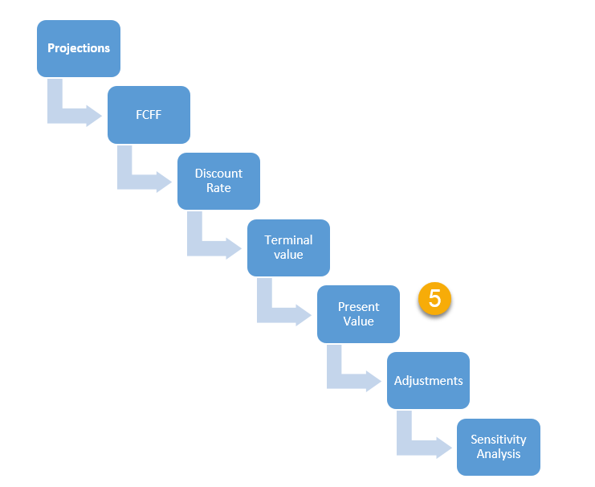

## Table of Contents

## What is Discounted Cash Flow (DCF) analysis?

Discounted Cash Flow (DCF) analysis is a method used to estimate the value of an investment based on its expected future cash flows. The main idea is to figure out how much money the investment will make in the future and then calculate what that money is worth today. This is done by using a discount rate, which reflects the time value of money and the risk associated with the investment. The higher the risk, the higher the discount rate, which means future cash flows are worth less today.

To perform a DCF analysis, you start by forecasting the cash flows that the investment will generate over a certain period. This could be the profits from a business, rental income from a property, or any other type of cash inflow. Once you have these projections, you apply the discount rate to each future cash flow to bring it back to its present value. Finally, you sum up all these present values to get the total value of the investment. If this total value is higher than the cost of the investment, it might be a good investment to make.

## Why is DCF analysis important in financial valuation?

DCF analysis is important in financial valuation because it helps investors figure out if an investment is worth the money. It does this by looking at the money the investment will make in the future and then calculating what that money is worth right now. This is useful because it considers the time value of money, which means a dollar today is worth more than a dollar in the future. By using DCF, investors can see if the future profits from an investment will be enough to justify the cost of buying it.

Another reason DCF analysis is important is that it helps investors compare different investments. Since DCF calculates the present value of future cash flows, it gives a common way to measure the value of different types of investments, like stocks, bonds, or real estate. This makes it easier for investors to decide where to put their money to get the best return. Overall, DCF analysis is a key tool in making smart investment decisions because it provides a clear picture of an investment's potential value.

## What are the basic steps involved in performing a DCF analysis?

To start a DCF analysis, you first need to forecast the future cash flows of the investment. This means guessing how much money the investment will make each year. You can do this by looking at past performance, market trends, and other factors that might affect the investment's earnings. Once you have these projections, you need to decide how many years to include in your forecast. Usually, people forecast for 5 to 10 years, but it can be longer or shorter depending on the investment.

After you have your cash flow forecasts, the next step is to choose a discount rate. This rate reflects the time value of money and the risk of the investment. A common way to pick a discount rate is to use the weighted average cost of capital (WACC) if you're analyzing a business, or you might use other rates that fit the investment better. Once you have your discount rate, you use it to calculate the present value of each future cash flow. You do this by dividing each future cash flow by (1 + discount rate) raised to the power of the number of years into the future that cash flow is expected.

The final step is to add up all the present values of the future cash flows to get the total value of the investment. If you're looking at a business, you might also need to add the present value of the terminal value, which is what the business is worth after your forecast period ends. If the total value you calculate is more than what you would have to pay for the investment, it might be a good deal. This way, DCF analysis helps you decide if an investment is worth the money.

## How do you determine the appropriate discount rate for a DCF model?

Choosing the right discount rate for a DCF model is important because it affects how much future cash flows are worth today. A common way to pick a discount rate is by using the weighted average cost of capital (WACC). WACC is the average rate a company pays to finance its assets, considering both debt and equity. To find WACC, you need to know the cost of equity, the cost of debt, the company's tax rate, and the proportions of debt and equity in the company's capital structure. The cost of equity can be estimated using models like the Capital Asset Pricing Model (CAPM), which looks at the risk-free rate, the expected market return, and the company's beta.

Another way to determine the discount rate is by looking at the riskiness of the investment. If the investment is riskier, you should use a higher discount rate because future cash flows are less certain. For example, if you're investing in a startup, you might use a higher rate than if you were investing in a stable, established company. Sometimes, you might also look at what similar investments are using for their discount rates or use industry-specific rates. The key is to choose a rate that reflects the time value of money and the risk of the investment accurately.

## What common errors can occur when forecasting cash flows in a DCF analysis?

One common error when forecasting cash flows in a DCF analysis is being too optimistic or too pessimistic. It's easy to get excited about a new investment and think it will make a lot of money, but if you overestimate future earnings, your DCF analysis might make the investment look better than it really is. On the flip side, if you're too cautious and underestimate future cash flows, you might miss out on a good investment because the DCF analysis makes it look worse than it actually is. Getting the balance right is tough, but it's important to use realistic assumptions based on good data and market research.

Another mistake people often make is not considering all the factors that can affect future cash flows. Things like changes in the economy, new competitors, or shifts in customer preferences can all have a big impact on how much money an investment will make. If you don't take these things into account, your forecasts might be way off. It's also important to remember that cash flows can be affected by one-time events or costs that might not happen every year. For example, if a business needs to spend a lot of money on new equipment, that will affect its cash flows for that year, and you need to include that in your forecast.

## How can terminal value miscalculations impact the results of a DCF analysis?

Terminal value miscalculations can really mess up a DCF analysis. The terminal value is what you think an investment will be worth after the years you've forecasted. If you get it wrong, it can make the whole investment look way better or worse than it really is. For example, if you think the investment will keep growing fast forever and you use a high terminal value, you might end up thinking the investment is worth a lot more than it actually is. On the other hand, if you use a terminal value that's too low because you think the investment won't do well after your forecast period, you might miss out on a good opportunity.

Getting the terminal value right is tricky because it's based on guesses about the future. If you use the wrong growth rate or discount rate to calculate the terminal value, it can throw off your whole analysis. A small mistake in these numbers can lead to a big difference in the final value of the investment. That's why it's really important to be careful and use realistic numbers when you're figuring out the terminal value. If you don't, you might make a bad investment decision based on a DCF analysis that's way off the mark.

## What are the risks of using historical data to project future cash flows?

Using historical data to guess future cash flows can be risky because past performance doesn't always mean the same thing will happen in the future. Things like the economy, competition, or even new laws can change a lot, making old data less useful. If you rely too much on what happened before, you might miss important new trends or changes that could affect how much money an investment will make.

Another problem is that historical data might not show one-time events or unusual situations that won't happen again. For example, if a business had a really good year because of a special event, using that year's numbers to predict the future could make you think the business will always do that well. This can lead to over-optimistic forecasts and bad investment decisions. It's important to look at historical data carefully and think about how things might be different in the future.

## How does the choice of growth rate affect the outcome of a DCF analysis?

The growth rate you pick for your DCF analysis can really change how much you think an investment is worth. If you use a high growth rate, it means you're guessing the investment will keep getting bigger and making more money over time. This makes the future cash flows look bigger when you bring them back to today's value, so the total value of the investment goes up. But if you're too hopeful and use a growth rate that's too high, you might think the investment is worth more than it really is, which could lead to a bad investment decision.

On the other hand, if you use a low growth rate, it means you're guessing the investment won't grow much. This makes the future cash flows smaller when you bring them back to today's value, so the total value of the investment goes down. Using a growth rate that's too low can make you miss out on a good investment because you think it's not worth as much as it could be. It's important to pick a growth rate that's realistic based on what you know about the investment and the market, so your DCF analysis gives you a good idea of what the investment is really worth.

## What are the implications of not adjusting for inflation in a DCF model?

If you don't adjust for inflation in a DCF model, you might end up with a wrong idea of how much money an investment is really worth. Inflation means that over time, the value of money goes down. So, if you don't take this into account, the future cash flows you're looking at might seem bigger than they really will be when you get them. This can make the investment look better than it actually is, because you're not considering that the money you get in the future won't be worth as much as it is today.

Not adjusting for inflation can also mess up the discount rate you use. The discount rate is supposed to reflect the time value of money, which includes inflation. If you don't account for inflation, your discount rate might be too low, making future cash flows seem more valuable in today's terms than they should be. This can lead to overvaluing the investment and making a bad investment decision. It's important to use real cash flows and a real discount rate that both account for inflation to get a true picture of an investment's value.

## How can sensitivity analysis improve the accuracy of a DCF analysis?

Sensitivity analysis can help make a DCF analysis more accurate by showing how changes in your guesses can affect the final value of an investment. When you do a DCF, you have to make a lot of guesses about things like future cash flows, the discount rate, and the growth rate. If any of these guesses are wrong, it can change how much you think the investment is worth. By doing sensitivity analysis, you can see how sensitive the final value is to these guesses. For example, you can see what happens if the growth rate is a little higher or lower than you thought, or if the discount rate changes. This helps you understand which guesses are most important and where you need to be most careful.

Using sensitivity analysis also helps you make better decisions because it shows you a range of possible outcomes instead of just one number. Instead of just saying an investment is worth a certain amount, you can see how much that value could change with different scenarios. This can help you be more confident in your decision, because you can see how likely it is that the investment will be worth what you think it is. It also helps you plan for different possibilities and be ready for changes in the future. So, sensitivity analysis makes your DCF analysis more useful and reliable by showing you the full picture of what could happen.

## What advanced techniques can be used to refine a DCF model?

One advanced technique to refine a DCF model is to use Monte Carlo simulations. This method helps you see how different guesses about future cash flows, discount rates, and growth rates can change the final value of an investment. Instead of just using one set of numbers, Monte Carlo simulations use a lot of different sets of numbers to show you a range of possible outcomes. This can help you understand how likely it is that the investment will be worth what you think it is, and it can make your DCF model more accurate by showing you the full picture of what could happen.

Another technique is to use scenario analysis, which lets you look at different situations that could happen in the future. For example, you can create a best-case scenario where everything goes well, a worst-case scenario where things go badly, and a middle-case scenario that's somewhere in between. By comparing these different scenarios, you can see how the value of the investment might change under different conditions. This helps you make better decisions because you can plan for different possibilities and be ready for changes in the future. Both Monte Carlo simulations and scenario analysis can make your DCF model more useful and reliable by giving you a clearer idea of the risks and rewards of an investment.

## How do you compare the results of a DCF analysis with other valuation methods to validate findings?

To validate the findings of a DCF analysis, you can compare its results with other valuation methods like the comparable company analysis (CCA) and the precedent transaction analysis (PTA). In CCA, you look at similar companies in the same industry and see how much they are worth. This gives you a good idea of what other people think similar businesses are worth. If your DCF value is way different from the values you find in CCA, it might mean you need to check your DCF numbers again. PTA involves looking at past deals where similar companies were bought or sold. By seeing what prices were paid in those deals, you can get another view on what your investment might be worth. If your DCF value is very different from these past transaction values, it's a sign to double-check your DCF model.

Another way to validate your DCF results is by using the asset-based valuation method. This method looks at what the company's assets are worth if you sold them all today. If the asset-based value is much lower than your DCF value, it might mean you're being too optimistic about future cash flows. On the other hand, if the asset-based value is higher, it could mean you're not giving enough credit to the company's potential to make money in the future. By comparing your DCF results with these other methods, you can get a better sense of whether your DCF analysis is realistic and trustworthy. This helps you make a smarter investment decision because you're looking at the investment from different angles.

## What are the Basics of Discounted Cash Flow Analysis?

Discounted Cash Flow (DCF) analysis is a core financial technique utilized to estimate the present value of an asset based on its expected future cash flows. This assessment method is instrumental in evaluating an asset's intrinsic value, determining whether it is overvalued or undervalued by the market. By projecting the future cash flows the asset will generate and calculating their present value, investors can make informed decisions regarding acquisitions, mergers, and investment strategies.

### Key Components of DCF Analysis

**Free Cash Flows (FCF):**
Free cash flows represent the cash that a company generates from its operations after accounting for capital expenditures. This cash is the money available for distribution to investors and is a critical element in DCF calculations. The formula for free cash flow is as follows:

$$
FCF = \text{Operating Cash Flow} - \text{Capital Expenditures}
$$

For accurate DCF analysis, projections of free cash flows typically extend over a period that reflects reliable growth estimations, often ranging between five to ten years.

**Discount Rates:**
The discount rate is a crucial [factor](/wiki/factor-investing) that reflects the risk associated with the future cash flows of the asset. It is the rate at which future cash flows are discounted to obtain their present value. The Weighted Average Cost of Capital (WACC) is commonly used as the discount rate in DCF analysis. WACC represents a firm's cost of capital wherein each category of capital is proportionately weighted. It includes all sources of capital such as equity, debt, and other financial instruments.

The WACC formula is:

$$
WACC = \left(\frac{E}{E + D}\right) \cdot Re + \left(\frac{D}{E + D}\right) \cdot Rd \cdot (1 - Tc)
$$

where:
- $E$ is the market value of equity,
- $D$ is the market value of debt,
- $Re$ is the cost of equity,
- $Rd$ is the cost of debt,
- $Tc$ is the corporate tax rate.

**Growth Expectations:**
Growth expectations entail projecting how a company’s cash flows will expand over time. This element captures the expected increase in revenue and efficiency improvements. Analysts often estimate growth rates based on historical performance, industry trends, and economic conditions. Properly estimating growth rates is pivotal, as overestimation can result in inflated valuations.

DCF analysis also involves calculating a terminal value, which estimates the asset's value beyond the forecast period. The terminal value is often determined using the Gordon Growth Model, calculated as:

$$
TV = \frac{FCF \times (1 + g)}{r - g}
$$

where:
- $TV$ is the terminal value,
- $FCF$ is the free cash flow in the final forecasted year,
- $g$ is the perpetual growth rate,
- $r$ is the discount rate.

By integrating these elements, DCF provides a comprehensive framework to assess the intrinsic value of an asset, making it an indispensable tool in financial valuation and investment decision-making.

## References & Further Reading

[1]: ["Valuation: Measuring and Managing the Value of Companies"](https://www.amazon.com/Valuation-Measuring-Managing-Companies-Finance/dp/1119610885) by McKinsey & Company Inc.

[2]: Damodaran, A. ["Investment Valuation: Tools and Techniques for Determining the Value of Any Asset."](https://archive.org/details/investmentvaluat0000damo_n6k9) 3rd Edition. Wiley.

[3]: ["Finance: Applications and Theory"](https://www.mheducation.com/highered/product/Finance-Applications-and-Theory-Cornett.html) by Cornett, M., Adair, T., & Nofsinger, J.

[4]: ["Algorithmic and High-Frequency Trading"](https://www.amazon.com/Algorithmic-High-Frequency-Trading-Mathematics-Finance/dp/1107091144) by Cartea, Á., Jaimungal, S., & Penalva, J.

[5]: ["Principles of Corporate Finance"](https://www.fincart.com/blog/corporate-finance-importance-types-principles/) by Brealey, R., Myers, S., & Allen, F.

[6]: ["Corporate Valuation: Theory, Evidence and Practice"](https://www.amazon.com/Corporate-Valuation-Theory-Evidence-Practice/dp/1618530364) by DePamphilis, D.

[7]: Aswath Damodaran's website, [NYU Stern School of Business](https://pages.stern.nyu.edu/~adamodar/), which offers numerous insights and resources on valuation.