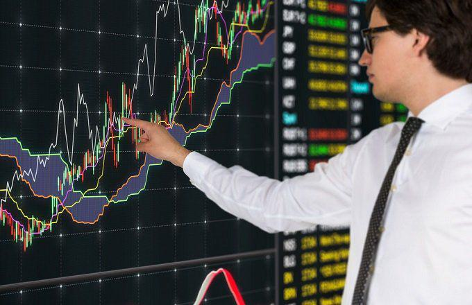

Technical analysis plays an indispensable role for traders looking to predict price movements in financial markets. Among the myriad of technical indicators available, moving averages stand out for their simplicity and effectiveness in trend identification. Moving averages are used to smooth out price data, helping to reduce noise and present a clearer picture of market direction. However, despite their popularity and ease of use, moving averages can present several financial pitfalls, particularly when incorporated into algorithmic trading strategies.

This article explores these pitfalls, focusing on the challenges and limitations faced by traders who rely heavily on moving averages. While moving averages can highlight trends systematically, mistaken reliance on them can lead to suboptimal trading decisions. This is particularly true in highly algorithmic environments, where moving averages are often used to signal entry and exit points automatically. Such reliance can complicate trading as it may lead to false signals, especially in volatile or non-trending markets.



Understanding the pitfalls associated with moving averages is crucial for making informed trading decisions. This knowledge can empower traders to refine their trading strategies, potentially leading to improved performance. Moreover, while algorithms offer precision and speed, the reliance on moving averages within these systems introduces vulnerabilities. These include issues of lag, where the indicator tends to follow the market rather than lead it, or challenges in rapidly changing market conditions, where past trends may not necessarily predict future movement.

In addressing these complexities, it is important to adopt a balanced approach. This involves integrating moving averages with other technical indicators and continuously revising and adapting strategies to reflect current market conditions. By enhancing the robustness of trading strategies and acknowledging the limitations of moving averages, traders can better navigate the evolving landscape of financial markets.

## Table of Contents

## Understanding Moving Averages

Moving averages are a fundamental component in technical analysis, serving as tools to smooth out price data and provide a clearer view of market trends. By calculating averages over specific periods, these indicators help traders filter out short-term fluctuations and emphasize longer-term movements in an asset's price.

The most widely used types of moving averages are the Simple Moving Average (SMA) and the Exponential Moving Average (EMA). The SMA is calculated by taking the arithmetic mean of prices over a chosen period. For instance, a 10-day SMA adds up the closing prices of the last ten days and divides the sum by ten. This formula provides an equal weighting to all prices within the period:

$$
\text{SMA} = \frac{P_1 + P_2 + ... + P_n}{n}
$$

where $P_1, P_2, ..., P_n$ represent the asset prices and $n$ is the number of periods.

In contrast, the EMA assigns greater weight to the most recent prices, making it more responsive to new information. The EMA is calculated using the formula:

$$
\text{EMA}_t = \alpha \times P_t + (1-\alpha) \times \text{EMA}_{t-1}
$$

where $P_t$ is the price at time $t$, and $\alpha$ is the smoothing factor, typically calculated as $\alpha = \frac{2}{n+1}$. This weighting scheme helps EMAs react more swiftly to price changes than SMAs.

Despite their simplicity and utility, moving averages are inherently lagging indicators. Their reliance on historical price data means they may not provide timely signals, especially in volatile or sideways markets. During such periods, price actions can oscillate around the moving average, resulting in whipsaw signals that could mislead traders.

Traders often use moving averages to identify trends and potential entry or [exit](/wiki/exit-strategy) points by observing crossover strategies, where a short-term moving average crosses above or below a long-term moving average, indicating potential buy or sell signals. However, to enhance their effectiveness, it is crucial not to rely on moving averages in isolation. Utilizing a combination of various technical indicators alongside moving averages can help in corroborating signals and mitigating the inherent limitations of moving averages.

## Common Pitfalls of Moving Averages

Traders often encounter several common pitfalls when utilizing moving averages in their trading strategies. One of the most prevalent issues is the "crossover trap." This occurs when traders rely too heavily on the signals generated by moving average crossovers—typically when a short-term moving average crosses above or below a long-term moving average. While such crossovers can indicate potential buy or sell signals, premature decisions based solely on these events can lead to significant losses, especially if the crossover is false or occurs in a volatile market without clear trends.

Another pitfall involves an over-reliance on a single moving average while ignoring different timeframes. Each time period can provide a distinct perspective on market trends. Focusing on only one timeframe can yield misleading conclusions, potentially causing traders to miss broader trend changes or focus too narrowly on short-term fluctuations. To mitigate this, traders should consider multiple timeframes in their analysis to gain a more comprehensive understanding of the market dynamics.

Moving averages, being lagging indicators, are particularly susceptible to producing false signals in choppy or sideways markets. In such environments, prices often fluctuate within a range, leading moving averages to frequently cross and recross in quick succession without indicating a clear trend. This can result in traders entering and exiting positions unnecessarily, incurring transaction costs and potential losses without any genuine price movement.

A notable assumption that can lead to financial risks is the belief that past trends will continue into the future. While moving averages are effective in identifying previous trends, markets are influenced by numerous factors that can alter the trajectory of these trends. Traders relying on moving averages without considering the possibility of trend reversals can face significant risks.

Lastly, a critical pitfall is the neglect of broader market context. Moving averages should not be used in isolation. They are lagging indicators, which means they reflect past price movements and may not fully account for current or impending market conditions. Ignoring economic indicators, geopolitical events, and other relevant factors can result in an incomplete analysis and misguided trading decisions.

Understanding these pitfalls is vital for traders to refine their strategies and optimize the use of moving averages. By integrating these insights with additional technical indicators and market analysis, traders can better navigate the complexities of financial markets.

## Challenges in Algorithmic Trading with Moving Averages

Algorithmic trading integrates moving averages to automate trading decisions swiftly through predetermined criteria. Despite the precision with which algorithms execute trades, their effectiveness is significantly influenced by the quality of both data and selected indicators. This reliance on moving averages introduces several challenges that traders must navigate carefully.

Curve fitting, a critical issue in [algorithmic trading](/wiki/algorithmic-trading), occurs when an algorithm is overly optimized to fit historical data. This optimization often leads to the creation of a model that performs well retrospectively but fails to adapt to live markets, potentially resulting in unreliable trading strategies. For instance, an algorithm rigorously tested on past data might generate exceptional results during backtests yet yield unsatisfactory performance in real-time trading due to market changes that weren't accounted for in the historical dataset.

The performance of algorithms based on moving averages is often compromised in high-[volatility](/wiki/volatility-trading-strategies) markets. During such conditions, price movements become erratic, causing increased market noise. Moving averages, being lagging indicators, are inherently slow to reflect rapid price changes. As a result, reliance solely on moving averages can lead to misinterpretations of market trends, generating false signals and erroneous trading decisions. 

For instance, the formula for a Simple Moving Average (SMA) is given by:

$$
\text{SMA} = \frac{1}{n} \sum_{i=0}^{n-1} P_i
$$

where $n$ is the number of periods, and $P_i$ is the price at period $i$. While this formula smooths data over time, it does not account for sudden market shifts typically observed in volatile environments.

Ensuring the robustness of algorithmic trading systems requires constant evaluation and adjustment of strategies. This dynamic approach involves assessing algorithm performance against real-time data and tweaking parameters to accommodate evolving market conditions. Implementing such measures can prevent significant financial losses and enhance the reliability of trading algorithms. Python, as a popular programming language for developing algorithms, provides various libraries such as pandas and NumPy to conduct these evaluations effectively:

```python
import pandas as pd

# Example: Calculate a moving average and evaluate strategy
def calculate_sma(prices, window):
    return prices.rolling(window=window).mean()

# Prices series example
prices = pd.Series([...])

# Calculate 20-period SMA
sma_20 = calculate_sma(prices, 20)

# Assess performance and adjust strategies as required
def evaluate_strategy(prices, sma):
    # Add logic to compare prices with SMA and adjust trading logic
    pass

evaluate_strategy(prices, sma_20)
```

In conclusion, while moving averages are fundamental tools in algorithmic trading, understanding their limitations is crucial. By addressing data quality, combating curve fitting, and adapting to market conditions, traders can better harness the potential of moving averages within algorithmic systems.

## Strategies for Overcoming Pitfalls

To mitigate the risks associated with moving averages in trading strategies, it's advisable for traders to employ these averages alongside other technical indicators. This multifaceted approach can enhance the effectiveness of moving average signals and provide a more robust analysis framework.

Tools such as the Relative Strength Index (RSI), Moving Average Convergence Divergence (MACD), and Average True Range (ATR) are instrumental in complementing moving averages. The RSI, for instance, can indicate overbought or oversold conditions, helping to confirm or contradict signals derived from moving average crossovers. The MACD, which uses moving averages to show changes in [momentum](/wiki/momentum), can also validate trends indicated by simple or exponential moving averages. Additionally, the ATR can provide insights into market volatility, allowing traders to adjust their strategies accordingly, especially during periods of heightened market activity.

Volatility filters are crucial in strengthening algorithmic responses to fluctuating market conditions. By incorporating measures that account for price volatility, algorithms can be better prepared to differentiate between genuine signals and noise. This approach can be implemented using code. For example, in Python:

```python
import pandas as pd

def volatility_filter(price_data, lookback):
    returns = price_data.pct_change().dropna()
    volatility = returns.rolling(window=lookback).std()
    return volatility

# Example usage
price_data = pd.Series([...])  # Assume this is your price data
volatility = volatility_filter(price_data, lookback=14)

price_data = price_data[volatility < threshold]  # Filter based on a volatility threshold
```

Conducting both [backtesting](/wiki/backtesting) and forward testing is imperative in uncovering the strengths and weaknesses of trading algorithms. Backtesting allows for the evaluation of a strategy against historical data to assess its potential profitability and risk. Forward testing, or paper trading, involves testing the strategy in a live environment without financial risk, which can reveal how it performs under current market conditions.

Lastly, adaptability is key to maintaining an effective trading strategy. As market dynamics evolve, so too should the parameters and strategies employed by traders. This could involve adjusting the lengths of moving averages or re-calibrating volatility thresholds. Flexibility ensures that traders are not anchored to outdated models and can swiftly adapt to new market realities.

By applying a diverse set of tools and practices, traders can better navigate the inherent challenges associated with moving averages in trading, contributing to more resilient and dynamic trading strategies.

## Conclusion

Moving averages remain a staple in technical analysis due to their simplicity and ability to smooth out volatile market data. However, their effectiveness is contingent upon a nuanced understanding of their limitations. As lagging indicators, they are often criticized for their delayed response to market changes, prompting traders to explore beyond algorithmic trading pitfalls.

Recognizing these limitations allows traders to augment their strategies with additional analytical tools, thereby elevating their trading approaches. The integration of multiple indicators, such as the Relative Strength Index (RSI), Moving Average Convergence Divergence (MACD), and Average True Range (ATR), can provide a more comprehensive understanding of market dynamics. This multifaceted perspective aids in validating signals derived from moving averages, ensuring they are not used in isolation, which can lead to erroneous decisions.

A balanced approach that incorporates strategy revisions is critical to trading success. Markets are dynamic, and strategies must adapt accordingly. Continuously updating and adjusting parameters in response to market evolution can prevent obsolescence and enhance effectiveness. This adaptability requires rigorous backtesting and forward testing to reveal both strengths and potential vulnerabilities in trading algorithms.

By being aware of common errors and pitfalls associated with moving averages, traders can better navigate the complexities inherent in algorithmic trading. Avoiding the over-reliance on these indicators and acknowledging their contextual market implications mitigates financial risks.

Ultimately, leveraging diverse analytical methods equips traders with a competitive advantage. This diversification reduces reliance on any single methodology, enhancing overall trading efficacy. Through the considered application of multiple analytical tools and continuous strategy refinement, traders can position themselves more favorably in an ever-changing financial landscape.

## References & Further Reading

[1]: Bergstra, J., Bardenet, R., Bengio, Y., & Kégl, B. (2011). ["Algorithms for Hyper-Parameter Optimization."](https://dl.acm.org/doi/10.5555/2986459.2986743) Advances in Neural Information Processing Systems 24.

[2]: ["Advances in Financial Machine Learning"](https://www.amazon.com/Advances-Financial-Machine-Learning-Marcos/dp/1119482089) by Marcos Lopez de Prado

[3]: ["Evidence-Based Technical Analysis: Applying the Scientific Method and Statistical Inference to Trading Signals"](https://www.amazon.com/Evidence-Based-Technical-Analysis-Scientific-Statistical/dp/0470008741) by David Aronson

[4]: ["Machine Learning for Algorithmic Trading"](https://github.com/stefan-jansen/machine-learning-for-trading) by Stefan Jansen

[5]: ["Quantitative Trading: How to Build Your Own Algorithmic Trading Business"](https://www.amazon.com/Quantitative-Trading-Build-Algorithmic-Business/dp/1119800064) by Ernest P. Chan