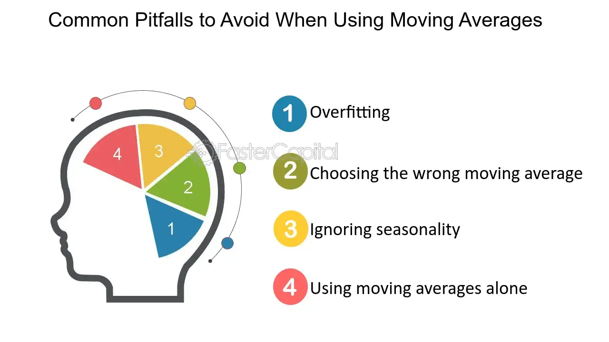

## Table of Contents

## What is a moving average and why is it used in financial analysis?

A moving average is a tool used to smooth out price data over a specific period of time. It does this by creating a constantly updated average price, which helps to show the overall direction of the price movement. Imagine you're tracking the daily price of a stock. Instead of looking at the price every single day, which can be confusing because it goes up and down a lot, you can use a moving average to see a clearer trend over time.

In financial analysis, moving averages are used for several reasons. One main reason is to help identify trends. By smoothing out the short-term fluctuations, analysts can see if a stock's price is generally going up, down, or staying the same over time. This can be very helpful for making decisions about buying or selling stocks. Another reason is to help with timing. For example, if a stock's price crosses above its moving average, it might be a good time to buy, and if it falls below, it might be a good time to sell. Overall, moving averages make it easier to understand and predict market movements.

## What are the different types of moving averages?

There are a few different types of moving averages that people use. The most common one is called the Simple Moving Average (SMA). It's pretty straightforward: you just take the average price of a stock over a certain number of days. For example, if you want to know the 10-day SMA, you add up the closing prices of the last 10 days and then divide by 10. This gives you a smooth line that helps you see the general trend of the stock's price.

Another type is the Exponential Moving Average (EMA). This one is a bit more complicated, but it's useful because it gives more weight to recent prices. This means it reacts faster to new information than the SMA does. To calculate the EMA, you start with the SMA and then use a formula that puts more emphasis on the most recent prices. This makes the EMA a good choice if you want to catch trends early.

There's also the Weighted Moving Average (WMA), which is similar to the EMA but uses a different way to give more importance to recent prices. With the WMA, you assign weights to each price in the period you're looking at, with the most recent prices getting the highest weights. This can be useful if you want to fine-tune how much the recent past affects your moving average. Each of these types of moving averages can help you understand the market in slightly different ways, so it's good to know which one fits your needs best.

## How does the choice of time period affect a moving average?

The time period you choose for a moving average really changes how it looks and works. If you pick a short time period, like 10 days, the moving average will be quick to show changes in the stock's price. It'll go up and down a lot because it's always using the most recent prices. This can be good if you want to catch trends early, but it might also make the chart look messy because it's reacting to every little change.

On the other hand, if you choose a longer time period, like 200 days, the moving average will be much smoother and slower to change. It won't react as quickly to what's happening right now, but it'll give you a better idea of the big picture trend. This can be helpful if you want to see the overall direction of the stock's price without getting distracted by short-term ups and downs. So, the time period you pick depends on whether you want to focus on short-term movements or long-term trends.

## What is the difference between a simple moving average (SMA) and an exponential moving average (EMA)?

The simple moving average (SMA) and the exponential moving average (EMA) are two ways to smooth out price data, but they do it differently. The SMA is easy to understand: you just add up the prices over a certain number of days and then divide by that number of days. For example, if you want a 10-day SMA, you add up the last 10 days of prices and divide by 10. This gives you a smooth line that shows the general trend, but it treats all the days the same, so it can be slow to show new changes.

The EMA is a bit more complex, but it reacts faster to new price changes. It does this by giving more weight to the most recent prices. To calculate the EMA, you start with the SMA and then use a formula that puts more emphasis on what's happened lately. This means if the price of a stock suddenly goes up or down, the EMA will show that change more quickly than the SMA. So, if you want to catch trends early, the EMA might be a better choice, but it can also make the chart look more jumpy because it's always reacting to the latest prices.

## Can you explain the concept of lag in moving averages and its impact on trading?

Lag in moving averages means that these averages always show what happened in the past, not what's happening right now. When you use a moving average, you're looking at an average price over a certain number of days, so it takes a bit of time for the moving average to catch up with the current price. This delay, or lag, can affect your trading decisions because you're not seeing the very latest price movements.

The impact of lag on trading can be both good and bad. On the good side, lag helps smooth out the ups and downs in the price, making it easier to see the overall trend. This can be helpful if you're trying to make decisions based on longer-term trends rather than short-term noise. On the bad side, because of the lag, you might miss out on quick changes in the market. If you're using a moving average to decide when to buy or sell, you might be a bit late to the party because the moving average is still catching up with what's already happened. So, it's important to understand this lag and think about how it fits with your trading strategy.

## How do moving averages generate false signals, and what are some common examples?

Moving averages can sometimes trick you by giving false signals. A false signal happens when the moving average makes it look like the price is going to do one thing, but then it does something different. This can happen because moving averages look at past prices, so they can be slow to catch up with what's happening now. If the market is moving fast, the moving average might not show the change quickly enough, and you might think it's time to buy or sell when it's actually not.

A common example of a false signal is when the price of a stock crosses above or below a moving average, but then quickly goes back the other way. Let's say the price goes above the moving average, which might make you think it's a good time to buy. But then the price drops back down below the moving average soon after. That's a false signal because it looked like the price was going up, but it didn't keep going up. Another example is when the market is very choppy, with lots of ups and downs. The moving average might cross the price back and forth a lot, making it hard to tell if it's really a good time to buy or sell. These false signals can lead to bad trading decisions if you're not careful.

## What are the risks of over-reliance on moving averages for making trading decisions?

Relying too much on moving averages for trading decisions can lead to problems. Moving averages look at past prices, so they're always a bit behind what's happening now. This means you might miss out on quick changes in the market. If you buy or sell based only on what the moving average says, you could end up making trades too late or at the wrong time. Also, moving averages can give false signals, making it look like the price is going to go up or down when it doesn't. If you follow these signals without thinking, you might lose money.

Another risk is that moving averages can make you ignore other important things that affect the market. Things like news, company earnings, or big events can change prices a lot, but moving averages don't show these. If you only look at the moving average, you might not see these other factors and make bad decisions. It's better to use moving averages along with other tools and information to get a fuller picture of what's going on in the market.

## How can moving averages be combined with other indicators to improve analysis?

Moving averages can be used with other indicators to make your analysis better. One way to do this is to use moving averages with the Relative Strength Index (RSI). The RSI helps you see if a stock is overbought or oversold. When you use the RSI with a moving average, you can look for times when the price crosses the moving average and the RSI is also showing a strong signal. This can give you more confidence in your trading decisions because you're using two different ways to check the market.

Another way to combine moving averages with other indicators is to use them with the Moving Average Convergence Divergence (MACD). The MACD looks at the difference between two moving averages to find trends and [momentum](/wiki/momentum). When you use the MACD along with a simple moving average, you can see if the short-term trend (from the MACD) matches the longer-term trend (from the moving average). This can help you spot good times to buy or sell a stock. By using moving averages with other indicators, you get a clearer picture of what's happening in the market, which can lead to better trading choices.

## What are some advanced techniques for adjusting moving averages to market conditions?

One advanced way to adjust moving averages to market conditions is by using adaptive moving averages. These are special types of moving averages that change how quickly they react to new price changes based on how much the market is moving. For example, if the market is moving a lot, the adaptive moving average will start to react faster, so you can catch trends earlier. If the market is calm and not moving much, the adaptive moving average will slow down, helping you see the bigger picture trend without getting distracted by small changes. This can be really helpful because it lets you use one moving average that works well in different market situations.

Another technique is using multiple moving averages together. Instead of just looking at one moving average, you can use two or more with different time periods. For example, you might use a short-term moving average, like a 10-day one, and a long-term moving average, like a 50-day one. When the short-term moving average crosses above the long-term one, it might be a good time to buy because it shows that the price is starting to go up faster. If the short-term moving average goes below the long-term one, it could be a sign to sell because the price might be starting to go down. By using multiple moving averages, you can get a better sense of when the market is changing and make smarter trading decisions.

## How do different market environments affect the performance of moving averages?

Different market environments can change how well moving averages work. In a trending market, where prices are going up or down in a clear direction, moving averages can be really helpful. They smooth out the small ups and downs, so you can see the big trend more easily. For example, if the market is going up, the moving average will go up too, helping you know when to buy. But if the market is going down, the moving average will help you see when to sell. In these kinds of markets, moving averages are good at showing you the right direction.

But in a choppy or sideways market, where prices go up and down a lot without going anywhere, moving averages can be tricky. They might give you false signals because they keep crossing the price back and forth. This can make you think it's time to buy or sell when it's not really a good time. In these markets, moving averages might not work as well, and you might need to use other tools to help you make better decisions. So, it's important to think about what the market is doing when you use moving averages.

## What are the statistical limitations of moving averages in predicting future price movements?

Moving averages have some problems when it comes to guessing what prices will do next. They look at what happened in the past, so they can't really tell you what will happen in the future. This means they might not catch quick changes in the market because they're always a bit slow. If the market moves fast, the moving average might not show that change until it's too late, which can make you miss out on good times to buy or sell.

Also, moving averages can trick you by giving false signals. They might make it look like the price is going to go up or down, but then it does something different. This can happen a lot in markets that move up and down without going anywhere. If you only use moving averages, you might think it's time to make a trade when it's not really the right time. So, it's good to use moving averages with other tools to get a better idea of what might happen next.

## How can one backtest and optimize moving average strategies to minimize common pitfalls?

To backtest and optimize moving average strategies, you need to look at how well they worked in the past. Start by [picking](/wiki/asset-class-picking) a time period to test, like the last few years, and see how your moving average strategy would have done during that time. You can use a computer program to do this, which will show you if your strategy made money or lost money. While you're testing, try different time periods for your moving averages, like 10 days, 20 days, or 50 days, to see which one works best. Also, try using different types of moving averages, like simple and exponential, to see if one type is better than the others. By doing this, you can find the best way to use moving averages for your trading.

One common problem with moving averages is that they can give false signals, making it look like it's time to buy or sell when it's not. To fix this, you can add other indicators, like the Relative Strength Index (RSI) or the Moving Average Convergence Divergence (MACD), to your strategy. These can help you check if the moving average signal is really a good one. Another way to avoid pitfalls is to not rely only on moving averages. Look at other things that can affect the market, like news or company earnings, to make better decisions. By testing your strategy carefully and using other tools, you can make your moving average strategy work better and avoid some of the common problems.

## What is Understanding Moving Averages?

Moving averages are a fundamental component in technical analysis, serving as tools to smooth out price data and provide a clearer view of market trends. By calculating averages over specific periods, these indicators help traders filter out short-term fluctuations and emphasize longer-term movements in an asset's price.

The most widely used types of moving averages are the Simple Moving Average (SMA) and the Exponential Moving Average (EMA). The SMA is calculated by taking the arithmetic mean of prices over a chosen period. For instance, a 10-day SMA adds up the closing prices of the last ten days and divides the sum by ten. This formula provides an equal weighting to all prices within the period:

$$
\text{SMA} = \frac{P_1 + P_2 + ... + P_n}{n}
$$

where $P_1, P_2, ..., P_n$ represent the asset prices and $n$ is the number of periods.

In contrast, the EMA assigns greater weight to the most recent prices, making it more responsive to new information. The EMA is calculated using the formula:

$$
\text{EMA}_t = \alpha \times P_t + (1-\alpha) \times \text{EMA}_{t-1}
$$

where $P_t$ is the price at time $t$, and $\alpha$ is the smoothing factor, typically calculated as $\alpha = \frac{2}{n+1}$. This weighting scheme helps EMAs react more swiftly to price changes than SMAs.

Despite their simplicity and utility, moving averages are inherently lagging indicators. Their reliance on historical price data means they may not provide timely signals, especially in volatile or sideways markets. During such periods, price actions can oscillate around the moving average, resulting in whipsaw signals that could mislead traders.

Traders often use moving averages to identify trends and potential entry or [exit](/wiki/exit-strategy) points by observing crossover strategies, where a short-term moving average crosses above or below a long-term moving average, indicating potential buy or sell signals. However, to enhance their effectiveness, it is crucial not to rely on moving averages in isolation. Utilizing a combination of various technical indicators alongside moving averages can help in corroborating signals and mitigating the inherent limitations of moving averages.

## What are the challenges in algorithmic trading with moving averages?

Algorithmic trading integrates moving averages to automate trading decisions swiftly through predetermined criteria. Despite the precision with which algorithms execute trades, their effectiveness is significantly influenced by the quality of both data and selected indicators. This reliance on moving averages introduces several challenges that traders must navigate carefully.

Curve fitting, a critical issue in [algorithmic trading](/wiki/algorithmic-trading), occurs when an algorithm is overly optimized to fit historical data. This optimization often leads to the creation of a model that performs well retrospectively but fails to adapt to live markets, potentially resulting in unreliable trading strategies. For instance, an algorithm rigorously tested on past data might generate exceptional results during backtests yet yield unsatisfactory performance in real-time trading due to market changes that weren't accounted for in the historical dataset.

The performance of algorithms based on moving averages is often compromised in high-[volatility](/wiki/volatility-trading-strategies) markets. During such conditions, price movements become erratic, causing increased market noise. Moving averages, being lagging indicators, are inherently slow to reflect rapid price changes. As a result, reliance solely on moving averages can lead to misinterpretations of market trends, generating false signals and erroneous trading decisions. 

For instance, the formula for a Simple Moving Average (SMA) is given by:

$$
\text{SMA} = \frac{1}{n} \sum_{i=0}^{n-1} P_i
$$

where $n$ is the number of periods, and $P_i$ is the price at period $i$. While this formula smooths data over time, it does not account for sudden market shifts typically observed in volatile environments.

Ensuring the robustness of algorithmic trading systems requires constant evaluation and adjustment of strategies. This dynamic approach involves assessing algorithm performance against real-time data and tweaking parameters to accommodate evolving market conditions. Implementing such measures can prevent significant financial losses and enhance the reliability of trading algorithms. Python, as a popular programming language for developing algorithms, provides various libraries such as pandas and NumPy to conduct these evaluations effectively:

```python
import pandas as pd

# Example: Calculate a moving average and evaluate strategy
def calculate_sma(prices, window):
    return prices.rolling(window=window).mean()

# Prices series example
prices = pd.Series([...])

# Calculate 20-period SMA
sma_20 = calculate_sma(prices, 20)

# Assess performance and adjust strategies as required
def evaluate_strategy(prices, sma):
    # Add logic to compare prices with SMA and adjust trading logic
    pass

evaluate_strategy(prices, sma_20)
```

In conclusion, while moving averages are fundamental tools in algorithmic trading, understanding their limitations is crucial. By addressing data quality, combating curve fitting, and adapting to market conditions, traders can better harness the potential of moving averages within algorithmic systems.

## References & Further Reading

[1]: Bergstra, J., Bardenet, R., Bengio, Y., & Kégl, B. (2011). ["Algorithms for Hyper-Parameter Optimization."](https://dl.acm.org/doi/10.5555/2986459.2986743) Advances in Neural Information Processing Systems 24.

[2]: ["Advances in Financial Machine Learning"](https://www.amazon.com/Advances-Financial-Machine-Learning-Marcos/dp/1119482089) by Marcos Lopez de Prado

[3]: ["Evidence-Based Technical Analysis: Applying the Scientific Method and Statistical Inference to Trading Signals"](https://www.amazon.com/Evidence-Based-Technical-Analysis-Scientific-Statistical/dp/0470008741) by David Aronson

[4]: ["Machine Learning for Algorithmic Trading"](https://github.com/stefan-jansen/machine-learning-for-trading) by Stefan Jansen

[5]: ["Quantitative Trading: How to Build Your Own Algorithmic Trading Business"](https://www.amazon.com/Quantitative-Trading-Build-Algorithmic-Business/dp/1119800064) by Ernest P. Chan