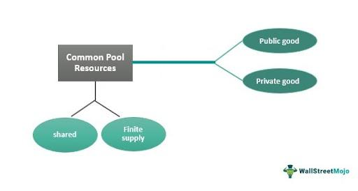

In an interconnected global economy, the dynamics of resource management play a pivotal role in ensuring sustainable growth. As resources are finite, understanding how to manage them effectively is essential to meeting current and future human needs while maintaining ecological balance. Economic principles offer a framework for analyzing and optimizing the use of these resources, particularly in cases involving common-pool resources, which present unique challenges due to their susceptibility to overuse and depletion.

The article examines how economic theories apply to the management of common-pool resources—those goods that are accessible to all but are limited in availability, such as fisheries, forests, and water basins. These resources require careful management to prevent overexploitation, which can lead to the "tragedy of the commons," a situation where individual self-interest leads to collective resource exhaustion. This underscores the need for well-structured management strategies and regulatory frameworks that can balance the competing demands of various stakeholders.



In addition to traditional resource management techniques, the emergence of algorithmic trading represents a modern approach to optimizing the management of financial resources. Algorithmic trading uses sophisticated algorithms to automate trading processes, improving efficiency and minimizing human error. This innovation has significant implications for financial markets, offering potential benefits in terms of liquidity, pricing accuracy, and market stability.

By integrating economic examples and case studies, the article provides a comprehensive overview of resource management strategies. These examples highlight successful practices in sectors such as water management in drought-prone regions and policies aimed at reducing overfishing. Such cases illustrate the application of economic principles in real-world scenarios, demonstrating the benefits of sustainable resource management strategies.

In conclusion, effectively managing economic resources, particularly common-pool resources, is crucial for fostering a sustainable development pathway. As the global economy evolves, understanding and applying economic principles to resource management will remain essential for aligning individual interests with collective benefits, paving the way for innovative solutions and continued policy development.

## Table of Contents

## Understanding Common-Pool Resources

Common-pool resources (CPRs) are a category of economic goods characterized by accessibility and finiteness, leading to the potential for overuse and depletion. These resources exhibit a hybrid nature, embodying characteristics of both public and private goods. Specifically, CPRs are rival in consumption, meaning that the use of the resource by one individual reduces its availability to others, yet they are non-excludable, implying that it is challenging to prevent individuals from utilizing the resource.

The intrinsic scarcity of CPRs and the rivalry in their consumption necessitate effective management strategies to prevent resource exhaustion. Unlike pure public goods, which are non-rival and non-excludable (e.g., national defense), CPRs require careful governance to manage access and consumption levels. An example of a common-pool resource is a fishery. Fisheries are accessible to numerous fishers, yet the fish caught by one fisher are no longer available to others, highlighting the rivalrous nature of the resource. Overfishing can lead to the depletion of fish stocks, emphasizing the need for sustainable fishing practices and regulatory measures.

Forests provide another illustration of CPRs. They are accessible resources providing timber, non-timber forest products, and ecosystem services. However, without proper management, activities like logging and land conversion can lead to deforestation and loss of biodiversity. Effective management strategies, such as community forestry and sustainable logging practices, are critical to maintaining these resources for future generations.

Water basins also exemplify common-pool resources. They are vital for agricultural, industrial, and domestic use. However, over-extraction of water can lead to scarcity, posing significant challenges for communities relying on these water sources. Implementing water management strategies, such as quotas, pricing policies, and water rights, can help ensure equitable and sustainable access to this finite resource.

In summary, the economic impact of common-pool resources arises from their unique nature, combining accessibility with finite availability. With shared responsibility and collaborative efforts, it is possible to manage these resources effectively to promote long-term environmental and economic sustainability.

## The Tragedy of the Commons: An Economic Perspective

The tragedy of the commons is a concept that illustrates the challenge of managing common-pool resources, which are resources that anyone can access but which are inherently limited in supply. Garrett Hardin coined this term in 1968, discussing how individual actions grounded in self-interest can cumulatively lead to the depletion of shared resources, thereby harming collective welfare. The economic perspective on this issue focuses on the balance between individual consumption and the overall sustainability of these resources.

The tragedy arises primarily because common-pool resources combine elements of both public and private goods. They are non-excludable, meaning it is difficult to prevent individuals from accessing them, but they are rivalrous; one person's use diminishes the availability for others. This combination leads to what economists describe as a "free-rider" problem, where individuals benefit from the resource without bearing proportional responsibilities for its upkeep or sustainability.

In economic terms, the tragedy of the commons can be illustrated using the concept of externalities. An externality refers to a cost or benefit incurred by a third party not involved in a transaction. In the case of common-pool resources, individuals who overuse the resource impose a negative externality on others. This misalignment between private incentives and social welfare can be represented through a classic payoff matrix in game theory, where cooperative behavior would yield the optimal collective outcome but non-cooperation (or overuse) leads to a suboptimal, tragic equilibrium.

One common solution proposed to mitigate the tragedy of the commons is government intervention. Regulatory frameworks can help align individual incentives with societal goals. For example, implementing quotas or permits for resource use can control access and regulate consumption rates. This governmental approach comes with challenges, such as the need for accurate assessment of the resource's health and the ongoing cost of monitoring and enforcement.

Alternatively, community-driven initiatives can offer an efficient solution, grounded in local knowledge and social norms. Elinor Ostrom's work on governing the commons emphasizes that local communities can effectively manage resources through mechanisms of collective decision-making and shared norms. Such community governance frameworks often include clearly defined boundaries, participatory decision-making processes, and systems for monitoring and sanctioning rule violations.

Ultimately, managing common-pool resources requires an understanding that individual short-term interests need to be balanced with long-term communal benefits. Through regulatory or community-driven approaches, sustainable management becomes possible, transforming potential tragedy into successful preservation.

## Algorithmic Trading: A Tool for Resource Management

Algorithmic trading represents a significant advancement in financial resource management by utilizing computer algorithms to make trading decisions at speeds and frequencies that are humanly impossible. These algorithms are designed to analyze vast arrays of data, which include historical trends, market conditions, and real-time information to generate optimal trading strategies. The primary aim of [algorithmic trading](/wiki/algorithmic-trading) is to maximize efficiency and minimize human error, leading to improved market outcomes and resource allocation.

One key feature of algorithmic trading is its ability to execute trades automatically based on predefined criteria. By doing so, it eliminates emotional decisions, thereby reducing the potential for human error. This is particularly useful in volatile markets where speed and precision are critical. Algorithms can process information and execute trades in milliseconds, enabling traders to capitalize on short-lived market opportunities that would be missed by manual trading.

Algorithmic trading integrates seamlessly within financial markets, impacting [liquidity](/wiki/liquidity-risk-premium), pricing, and stability in several ways. Enhanced liquidity arises as algorithms often involve high-frequency trading ([HFT](/wiki/high-frequency-trading-strategies)), where numerous trades are conducted in short intervals. HFT helps narrow bid-ask spreads, allowing market participants to trade large amounts with minimal impact on price. This increase in liquidity can stabilize markets as it reduces price [volatility](/wiki/volatility-trading-strategies) and improves price discovery.

Moreover, algorithmic trading affects market pricing by ensuring that prices reflect all available information almost instantaneously. This efficiency in price discovery results from algorithms responding to new data and executing trades that align with evolving market conditions. As a result, prices are more likely to remain aligned with the underlying economic fundamentals, promoting fair and efficient markets.

However, the widespread adoption of algorithmic trading raises concerns over market stability. The rapid execution of trades can sometimes lead to flash crashes—sudden and severe price drops followed by swift recoveries. Such events occur when algorithms react to market signals in unexpected ways, potentially creating feedback loops that amplify market movements.

To mitigate risks and enhance the benefits of algorithmic trading, regulators and market participants are continually developing strategies that involve circuit breakers and trade halts to manage extreme volatility. Additionally, continuous monitoring and refinement of algorithms ensure they adapt to changing market dynamics and incorporate a broader spectrum of risk factors.

The economic implications of algorithmic trading extend to competitive advantages for traders and institutions employing advanced technologies. By leveraging these tools, market participants can achieve greater scalability, cost savings, and improved performance outcomes compared to traditional trading methods.

In summary, algorithmic trading serves as a powerful tool for managing financial resources, offering enhanced efficiency and precision in trading activities. Its influence on liquidity, pricing, and market stability demonstrates the need for thoughtful integration and oversight to harness its benefits while minimizing potential adverse effects.

## Economic Examples of Resource Management Strategies

Effective resource management is essential for ensuring sustainability and economic stability. One notable example is water management in drought-prone regions. In such areas, careful allocation and usage of water resources can significantly mitigate the adverse effects of water scarcity. For instance, Australia has implemented comprehensive water management plans such as the Murray-Darling Basin Plan, which establishes water trading and allocation systems to enhance efficiency and equitable distribution. This plan uses market-based mechanisms to address water scarcity, demonstrating how economic strategies can help sustain essential resources.

Water trading in Australia is facilitated through a system where water rights can be bought and sold, creating a flexible market. This approach incentivizes efficient water use by aligning economic benefits with conservation. Additionally, implementing smart irrigation technologies and infrastructure investments helps optimize water usage, further supporting sustainable management (Australia's Department of Agriculture, Water and the Environment).

In contrast, effective fishery management policies showcase another dimension of resource management. Overfishing poses a significant threat to marine biodiversity and economic stability in coastal communities. Iceland's Individual Transferable Quotas (ITQ) system represents a successful fishery management strategy. ITQs allocate a specific portion of the total allowable catch to individual fishers or companies, which can be traded or sold. This system not only prevents overfishing but also fosters sustainable fishing practices by ensuring long-term stock health and economic viability for those in the fishing industry.

The success of Iceland's ITQ system can be attributed to setting quotas based on scientific assessments, ensuring that fishing efforts remain within sustainable limits. This policy exemplifies how regulating access to common-pool resources can preserve them for future generations while maintaining economic benefits for stakeholders.

The principles underpinning these successful management practices reflect the balance between consumption and sustainability. Economic frameworks, whether through market-based solutions like water trading or regulatory measures such as fishery quotas, play a crucial role in managing resources effectively. By studying these models, policymakers can develop strategies that align economic and environmental objectives, safeguarding resources for future use.

In summary, these cases highlight the importance of employing strategic economic approaches to resource management. By leveraging market mechanisms and regulatory frameworks, regions can address resource scarcity and promote sustainability, showcasing the powerful intersection of economics and environmental stewardship.

## Challenges and Future Directions in Resource Management

As technology continues to evolve, managing common-pool resources (CPRs) such as water basins, fisheries, and forests is expected to face significant challenges and opportunities. These resources are crucial for human survival, yet their finite nature, combined with increasing global demands, presents complex management issues.

Global population growth and climate change further exacerbate these challenges. With the world's population projected to reach nearly 10 billion by 2050, the demand for resources is anticipated to outpace current supply capabilities, intensifying pressures on common-pool resources. Furthermore, climate change has introduced variability and unpredictability in resource availability, affecting everything from agricultural yields to water resource distribution. Consequently, effective resource management strategies have become more critical than ever.

To address these multifaceted challenges, future resource management strategies need to focus on integrating innovative technologies. Advanced monitoring technologies, such as remote sensing and geographic information systems (GIS), are vital tools for tracking resource use and availability. These technologies enable real-time data collection and analysis, allowing for more informed decision-making.

Additionally, the adoption of [artificial intelligence](/wiki/ai-artificial-intelligence) (AI) and [machine learning](/wiki/machine-learning) models can predict resource availability and consumption patterns. Machine learning algorithms, for example, can analyze large datasets to identify trends and make recommendations for sustainable resource allocation.

Here is a simple Python code snippet to demonstrate how machine learning can be applied to predict resource needs:

```python
from sklearn.linear_model import LinearRegression
import numpy as np

# Sample data: [resource consumption, time (in years)]
data = np.array([[1, 1], [2, 2], [3, 3], [4, 4], [5, 5]])
X = data[:, 1].reshape(-1, 1)  # time
y = data[:, 0]  # consumption

# Create and train the model
model = LinearRegression()
model.fit(X, y)

# Predict future resource consumption
future_time = np.array([[6], [7], [8]])
predicted_consumption = model.predict(future_time)

print(predicted_consumption)
```

Moreover, cross-sector collaboration is essential for effective resource management. This involves cooperation between governments, non-governmental organizations (NGOs), and the private sector to share knowledge, resources, and best practices. Policies that encourage such collaboration can foster the development of comprehensive strategies that balance economic demands with environmental sustainability.

Emerging trends also point to the importance of adaptable policies. As economic and environmental landscapes shift, policies must be flexible to meet evolving global demands. Policymakers are encouraged to adopt adaptive management approaches, which emphasize learning and adjustment in response to new information and changing conditions.

In conclusion, managing common-pool resources in a rapidly changing world requires embracing technological innovations, fostering collaboration across sectors, and implementing flexible policies. These strategies provide a foundation to address the pressing challenges of resource scarcity and environmental change while promoting long-term sustainability and economic prosperity.

## Conclusion

The management of economic resources is a pivotal component for achieving sustainable development. Common-pool resources, which are characterized by their finite nature and accessibility, pose a significant challenge in this context as they require a careful balance between individual interests and collective benefits. Understanding the intricacies of these resources demands a nuanced approach that combines strategic planning with a deep appreciation of their economic and ecological implications.

Algorithmic trading is emerging as a forward-looking approach to enhancing resource efficiency within financial markets. By utilizing advanced technologies and complex algorithms, algorithmic trading facilitates the optimization of financial resources, reducing human error, and increasing market efficiency. Its integration into financial systems emphasizes the importance of technological advancements in managing economic resources effectively.

However, tackling the complexities of resource management requires more than just technological solutions. Continuous research and proactive policy innovation are indispensable. As the pressure from global population growth and climate change intensifies, policies must evolve to integrate these challenges. Cross-sector collaboration and adaptable strategies will be crucial to ensuring both the equitable distribution and sustainable utilization of resources.

Ultimately, the successful management of economic resources, particularly common-pool resources, hinges on a comprehensive understanding of these dynamics. By fostering innovative solutions and reinforcing cooperative frameworks, we can navigate the intricate landscape of resource management and pave the way towards sustainable development.

## References & Further Reading

[1]: Hardin, G. (1968). ["The Tragedy of the Commons."](https://www.science.org/doi/10.1126/science.162.3859.1243) Science, 162(3859), 1243-1248.

[2]: Ostrom, E. (1990). ["Governing the Commons: The Evolution of Institutions for Collective Action."](https://archive.org/details/governingcommons0000ostr) Cambridge University Press.

[3]: Arnason, R. (1993). ["The Icelandic Individual Transferable Quota System: A Descriptive Account."](https://www.jstor.org/stable/42629066) Marine Resource Economics, 8(3), 201-217.

[4]: National Water Commission (2012). ["The National Water Initiative—Securing Australia’s Water Future: 2011 Assessment."](https://www.dcceew.gov.au/sites/default/files/sitecollectiondocuments/water/nwi-assessment-2011.pdf) Commonwealth of Australia. 

[5]: Hasbrouck, J. (2003). ["Intraday Price Formation in U.S. Equity Markets."](https://link.springer.com/chapter/10.1007/978-981-16-1135-3_3) Journal of Finance, 58(6), 2375-2400.