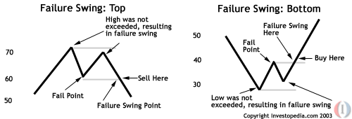

In forex trading, the advent of algorithmic trading has revolutionized how traders capitalize on currency fluctuations. Algorithmic trading, also known as algo trading, involves using computer programs to execute trades based on predefined criteria. This method enables traders to automate their strategies, reduce human errors, and enhance the speed and efficiency of trading processes. Despite its advantages, however, many traders frequently encounter mistakes that lead to failures.

This article seeks to illuminate these common pitfalls in forex and algorithmic trading and provide insights on how to avoid them. Whether you are just starting or have years of experience, understanding these mistakes is essential for refining your strategies and improving your success rate. Forex trading encompasses intricate market dynamics, and algorithmic approaches can lead to unforeseen challenges if not meticulously handled.



Join us as we explore frequent missteps in forex and algorithmic trading, focusing on areas such as lack of proper research and education, over-optimization of trading algorithms, ignoring risk management, emotional trading decisions, failure to test and adjust algorithms, and neglecting the impact of market conditions. By understanding and steering clear of these errors, traders can significantly enhance their trading strategies and perform more consistently in the volatile forex markets.

## Table of Contents

## Lack of Proper Research and Education

Forex trading is an intricate field requiring a comprehensive understanding of various elements such as currency fluctuations, market dynamics, and economic indicators. One of the foremost errors traders often make is embarking on their trading journey without adequate preparation and knowledge. The absence of proper research on market trends, historical data, and economic events can severely hinder a trader's ability to make informed decisions. Acquiring foundational knowledge is paramount; it involves understanding the basic principles of trading, the functionality of forex markets, and the economic factors affecting currency values.

Continuous education is equally crucial. The forex market is ever-evolving, with new trends, strategies, and technologies emerging at a rapid pace. Many traders, especially novices, tend to underestimate the significance of staying updated with these changes. Engaging in regular learning activities such as webinars, reading finance-related books, or participating in discussion forums can greatly enhance a trader's skill set and awareness. Online platforms offering trading courses can serve as a valuable resource for both beginners and seasoned traders looking to refine their strategies.

A lack of proper research and education contributes to a higher probability of errors. For instance, misunderstanding economic indicators or failing to analyze market signals can lead to misguided trading decisions. Developing a habit of conducting thorough market analysis and engaging with credible financial news sources can mitigate these risks. By building a solid educational foundation, traders position themselves to better anticipate market movements and adapt their strategies accordingly.

Moreover, traders should embrace a mindset of continuous improvement. Learning from past mistakes, seeking feedback, and adjusting strategies based on newly acquired knowledge are essential practices for long-term success. Regularly revisiting and revising trading plans helps traders remain flexible and responsive to market changes.

In summary, adequate research and continuous education are vital cornerstones of successful [forex](/wiki/forex-system) trading. By prioritizing ongoing learning and maintaining a robust understanding of market dynamics, traders can enhance their decision-making processes and improve their overall performance in the forex market.

## Over-Optimization of Trading Algorithms

Traders frequently encounter the pitfall of over-optimizing their trading algorithms, a practice that can undermine the effectiveness of their strategies. Over-optimization, often referred to as "curve-fitting," occurs when a model is excessively tailored to fit historical data, capturing noise instead of genuine market signals. This results in trading models that appear robust during [backtesting](/wiki/backtesting) but underperform in real-world conditions.

A key element in avoiding over-optimization is striking the right balance between performance and generalization. While it may be tempting to tweak a model until it exhibits near-perfect historical performance, such precision often comes at the cost of adaptability to new data. Algorithms must be designed to perform well across various datasets, incorporating randomness and variability to simulate diverse market conditions. For instance, cross-validation techniques can be employed to partition data into training and testing sets, ensuring that the model's performance is consistent not just for known data but also for unseen data.

It's crucial to work with realistic data sets throughout the algorithm development process. This involves using out-of-sample data that the model has not been trained on to evaluate its performance. Using realistic market conditions rather than an idealized version ensures that the model is aligned with actual trading environments.

Furthermore, traders should prioritize simplicity and robustness over unnecessary complexity. Complex models are more prone to overfitting due to their capacity to 'memorize' the data rather than learning from it. Simple models, on the other hand, tend to be more robust and easier to understand, interpret, and adjust. For instance, implementing regularization techniques such as L1 (Lasso) or L2 (Ridge) penalties can prevent overfitting by adding a constraint on the magnitude of the coefficients of the model, helping maintain a balance between bias and variance.

Here's a simple Python example of applying regularization to a linear regression model using Scikit-learn:

```python
from sklearn.linear_model import Ridge
from sklearn.model_selection import train_test_split
from sklearn.metrics import mean_squared_error
import numpy as np

# Assuming X and y are your features and target variable
X_train, X_test, y_train, y_test = train_test_split(X, y, test_size=0.2, random_state=42)

# Applying Ridge Regression
ridge = Ridge(alpha=1.0)
ridge.fit(X_train, y_train)

# Predicting and evaluating the model
y_pred = ridge.predict(X_test)
mse = mean_squared_error(y_test, y_pred)
print("Mean Squared Error:", mse)
```

The code above illustrates the use of Ridge Regression, which applies L2 regularization by default, effectively mitigating overfitting by penalizing high variance models. By integrating simplicity and reinforcing the importance of generalization, traders can construct trading algorithms that withstand diverse market environments, ultimately enhancing their performance in live scenarios.

## Ignoring Risk Management

Risk management plays a crucial role in ensuring trading success, yet it is frequently neglected by traders. A common mistake involves employing excessive leverage, which amplifies both potential gains and losses, increasing exposure to dangerous market swings. For instance, leverage of 1:100 means that even a 1% decrease in the market can result in complete capital loss. Such high-risk leverage strategies can lead to devastating financial consequences, especially for those unprepared for sudden market reversals.

Additionally, the failure to implement appropriate stop-loss orders further exacerbates this risk. Stop-loss orders are essential for capping potential losses and protecting trading capital. Without them, traders may experience larger-than-expected drawdowns, eroding their resources. For example, a stop-loss order at a 10% threshold means a position will be automatically sold if the price falls by 10%, thus protecting against larger losses.

The inherent [volatility](/wiki/volatility-trading-strategies) in the forex market necessitates a carefully crafted risk management approach. Unlike other financial markets, forex is subject to rapid and unpredictable fluctuations driven by geopolitical events, economic announcements, and market sentiment. A disciplined risk management strategy is therefore imperative to navigate this volatility successfully. This includes setting defined risk-reward ratios, diversifying trading portfolios, and avoiding emotional trading that might lead to hasty decisions.

Robust risk management strategies are vital for averting catastrophic failures. By ensuring that risks are managed correctly, traders can safeguard their investments and enhance long-term profitability. This encompasses continually reassessing strategies to adapt to changing market conditions, and maintaining a clear understanding of one’s financial limits. Proper risk management not only shields against losses but also provides the confidence necessary to execute trades effectively, fostering sustainable trading practices.

## Emotional Trading Decisions

In the multifaceted environment of forex trading, emotional decision-making remains a significant barrier to achieving consistent success, even for those utilizing algorithmic systems. Two primary emotions that can severely disrupt trading are fear and greed, which lead to irrational decisions that cannot be entirely mitigated by algorithms. Algorithms are designed to follow predefined logic, yet the human tendency to override these systems in response to emotional impulses can result in substantial losses.

Fear might cause a trader to [exit](/wiki/exit-strategy) a position prematurely, while greed can tempt one to hold positions longer than justified by market trends or data signals. While algorithms aim to eliminate biases, they require human intervention for setup and adjustments, where emotions can infiltrate decision-making processes.

Recognizing and controlling emotional triggers is crucial for maintaining an effective trading approach. Emotional self-awareness allows traders to identify when emotion-driven decisions might be influencing their actions. Techniques such as keeping a trading journal to note emotional states at the time of trade decisions can provide invaluable insights into patterns that might jeopardize trading outcomes.

Moreover, trading discipline involves strictly adhering to a well-developed trading plan. This plan serves as a roadmap, minimizing the impact of emotions by establishing clear entry and exit strategies and risk management protocols. Trusting in the trading plan's efficacy and resisting emotional impulses is essential for disciplined execution.

The intersection of automation and psychology highlights the importance of preparing psychologically before implementing automated systems. Adopting a mindset that embraces short-term fluctuations without reacting emotionally can enhance the performance of algorithmic strategies. Additionally, maintaining a long-term perspective and focusing on the overall performance of one's strategy, rather than individual trades, can mitigate the effects of emotional decision-making.

Integrating psychological preparation with algorithmic strategies ensures that the human component complements rather than contradicts algorithmic logic. By fostering a disciplined approach and developing emotional resilience, traders can better align their decision-making with the strategic objectives of their automated systems, enhancing the potential for long-term trading success.

## Failure to Test and Adjust Algorithms

Testing and adjusting trading algorithms is a critical component of successful forex and [algorithmic trading](/wiki/algorithmic-trading), yet many traders overlook its importance. Algorithm testing and adjustments allow traders to refine their strategies in a realistic market context. This process often involves several steps, including backtesting, forward testing, and ongoing optimization.

Backtesting is the evaluation of a trading strategy using historical data to ascertain its effectiveness. While powerful, backtesting comes with challenges such as "data-snooping bias," where traders inadvertently tailor their strategies too closely to past data. This can be mitigated by using out-of-sample data to evaluate predictive performance. Forward testing, on the other hand, involves applying the algorithm in a simulated live market environment to assess its real-time effectiveness without the financial risk.

Continuous monitoring and adjustment of algorithms are necessary to respond to rapidly changing market conditions. Market dynamics can shift due to various factors, such as geopolitical events or economic policy changes. As these changes occur, they can render an otherwise effective algorithm obsolete. Therefore, traders need to consistently monitor their algorithm's performance and use a feedback loop for improvements. This involves analyzing the algorithm's outcomes, identifying areas of discrepancy from expected performance, and making iterative adjustments.

Implementing simulations is another key component of effective algorithm testing. Simulations allow traders to test their algorithms in a controlled environment that mimics real-world market conditions. Software tools like MetaTrader or Python libraries such as Backtrader can facilitate this process. The following is a basic example of using Python for backtesting with simple moving averages:

```python
import pandas as pd
import numpy as np

# Simulated data
data = pd.DataFrame({'price': np.random.rand(100)})

# Calculate moving averages
data['MA_short'] = data['price'].rolling(window=5).mean()
data['MA_long'] = data['price'].rolling(window=20).mean()

# Generating signals
data['signal'] = np.where(data['MA_short'] > data['MA_long'], 1, 0)

# Backtesting
data['returns'] = data['price'].pct_change()
data['strategy_returns'] = data['returns'] * data['signal'].shift(1)

# Calculating cumulative returns
cumulative_strategy_returns = (data['strategy_returns'] + 1).cumprod()

print(cumulative_strategy_returns)
```

Regular adjustments based on empirical findings ensure that an algorithm remains robust against market variations. Frequently revisiting and revising the algorithm as part of a cohesive strategy is integral for enduring success in forex trading. Such proactive adjustments not only help maintain competitive performance but also enhance the overall resilience of the trading strategy in the face of unforeseen market changes. By emphasizing thorough testing and continuous refinement, traders can significantly improve the reliability and efficiency of their algorithmic trading systems.

## Neglecting the Impact of Market Conditions

In the fast-paced environment of forex trading, the impact of market conditions on trading algorithms cannot be overstated. These conditions can change swiftly, often leading to significant repercussions for even the most robust algorithms. Macroeconomic events, such as changes in interest rates, inflation data, and employment figures, can introduce volatility in the currency markets. 

For instance, central bank announcements regarding [interest rate](/wiki/interest-rate-trading-strategies) changes can have profound effects on currency values. A sudden rate hike may lead to an appreciation of the currency as higher rates attract foreign capital. Conversely, a rate cut might cause a depreciation, as investors seek higher returns elsewhere. Such macroeconomic conditions must be considered to prevent unexpected outcomes in trading strategies.

Geopolitical events also play a critical role in influencing market conditions. Political instability, trade negotiations, and international conflicts can lead to rapid shifts in exchange rates. For example, announcements of trade tariffs can cause currencies of the involved countries to fluctuate sharply. Staying informed about these geopolitical developments is imperative for traders, allowing them to anticipate market movements and adjust their strategies accordingly.

To remain competitive, traders need continuous adaptation of their strategies. This involves regular updates and testing of algorithms to ensure they account for recent market conditions. A static approach can be detrimental, as it may not reflect the current economic landscape. Instead, algorithms should be dynamic, incorporating real-time data and adjusting parameters as necessary. 

Incorporating [machine learning](/wiki/machine-learning) techniques may offer an advantage in adapting to changing market conditions. For example, [reinforcement learning](/wiki/reinforcement-learning) could be employed to adapt trading strategies based on feedback from market performance. A basic example in Python might involve using a reinforcement learning library to continuously optimize a trading model:

```python
import gym
import numpy as np
from stable_baselines3 import PPO

# Simulated environment for forex trading
env = gym.make('ForexTradingEnv-v0')

# Initialize model using Proximal Policy Optimization
model = PPO('MlpPolicy', env, verbose=1)

# Train the model
model.learn(total_timesteps=10000)

# Test the model
obs = env.reset()
for _ in range(1000):
    action, _states = model.predict(obs, deterministic=True)
    obs, rewards, done, info = env.step(action)
    if done:
        obs = env.reset()
```

This code demonstrates the potential utility of reinforcement learning in effectively navigating the complex and ever-changing forex market. By continuously learning from new data, a trading model can respond to market shifts and maintain robustness against unforeseen events. 

In summary, forex traders must remain vigilant of market conditions. By staying informed about macroeconomic and geopolitical factors, and implementing dynamic strategies, traders can mitigate risks and capitalize on opportunities presented by market fluctuations.

## Conclusion

Forex and algorithmic trading provide substantial opportunities for traders, yet they also present distinct challenges that require careful consideration and strategy. Recognizing and avoiding common mistakes can significantly enhance the probability of success in this dynamic field. Each step, from continuous education to disciplined risk management, plays a vital role in building a resilient trading practice. Staying informed about market trends and being prepared to modify strategies as needed is crucial in maintaining a competitive edge. 

A commitment to ongoing learning allows traders to stay abreast of new tools, techniques, and market developments, reinforcing their foundational knowledge. Moreover, rigorous risk management practices help mitigate potential losses and secure long-term profitability. By being vigilant and proactive in understanding these pitfalls, traders can better navigate the complexities and nuances of forex and algorithmic trading, harnessing their potential while minimizing risks.

## References & Further Reading

[1]: Bergstra, J., Bardenet, R., Bengio, Y., & Kégl, B. (2011). ["Algorithms for Hyper-Parameter Optimization."](https://papers.nips.cc/paper/4443-algorithms-for-hyper-parameter-optimization) Advances in Neural Information Processing Systems 24.

[2]: ["Advances in Financial Machine Learning"](https://www.amazon.com/Advances-Financial-Machine-Learning-Marcos/dp/1119482089) by Marcos Lopez de Prado

[3]: ["Evidence-Based Technical Analysis: Applying the Scientific Method and Statistical Inference to Trading Signals"](https://www.amazon.com/Evidence-Based-Technical-Analysis-Scientific-Statistical/dp/0470008741) by David Aronson

[4]: ["Machine Learning for Algorithmic Trading"](https://github.com/stefan-jansen/machine-learning-for-trading) by Stefan Jansen

[5]: ["Quantitative Trading: How to Build Your Own Algorithmic Trading Business"](https://www.amazon.com/Quantitative-Trading-Build-Algorithmic-Business/dp/1119800064) by Ernest P. Chan