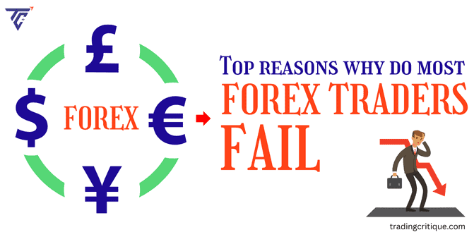

## Table of Contents

## What are the most common mistakes beginners make in forex trading?

One of the most common mistakes beginners make in forex trading is not having a clear trading plan. They often jump into trades without setting specific goals or understanding their risk tolerance. This can lead to emotional trading, where decisions are based on feelings rather than a well-thought-out strategy. A good trading plan should include entry and exit points, stop-loss levels, and clear objectives for each trade. Without this, beginners can easily lose money because they don't know when to cut their losses or take profits.

Another frequent mistake is overleveraging. Forex markets allow traders to use leverage, which means they can control a large position with a relatively small amount of money. While this can amplify profits, it can also magnify losses. Beginners often get tempted by the potential for big gains and use too much leverage, which can quickly wipe out their trading account if the market moves against them. It's important for new traders to understand leverage and use it cautiously.

Lastly, many beginners fail to manage their risks properly. They might not use stop-loss orders, which are crucial for limiting potential losses. Additionally, they might risk too much of their capital on a single trade. A good rule of thumb is to never risk more than a small percentage of your trading account on any one trade. By managing risks effectively, beginners can protect their capital and stay in the game longer, increasing their chances of becoming successful traders.

## How does lack of education contribute to forex trading failures?

Not knowing enough about [forex](/wiki/forex-system) trading can really hurt a beginner's chances of success. When someone starts trading without learning the basics, they don't understand important things like how currency pairs work, what affects exchange rates, and how to read market trends. This lack of knowledge makes it hard for them to make smart trading decisions. They might not know when to buy or sell, or how to use tools like charts and indicators to help them trade better. Without this education, they are more likely to make mistakes that cost them money.

Another big problem is not understanding risk management. Forex trading can be risky, and without proper education, beginners don't know how to protect their money. They might not use stop-loss orders, which are important for limiting losses if the market moves against them. They might also not know how much of their money they should risk on each trade. This can lead to big losses that could have been avoided with a bit of learning. In the end, not taking the time to get educated can lead to a lot of frustration and failure in forex trading.

## What role does emotional decision-making play in unsuccessful forex trading?

Emotional decision-making can really mess up forex trading. When traders let their feelings take over, they often make bad choices. For example, if they see their trade going down, they might get scared and sell too soon, even if waiting a bit longer could have turned things around. Or, if they're feeling really excited about a trade, they might jump in without thinking it through properly, which can lead to big losses. These emotional reactions can make traders ignore their trading plans and do things that don't make sense in the long run.

Over time, letting emotions guide trading decisions can lead to a lot of stress and failure. Traders who act on fear or greed are more likely to keep making the same mistakes, like holding onto losing trades hoping they'll turn around or chasing after quick wins. This can drain their trading account and make them feel frustrated and discouraged. To be successful in forex trading, it's important to stick to a well-thought-out plan and keep emotions in check, even when the market gets tough.

## How can improper risk management lead to losses in forex trading?

Not managing risk properly can really hurt forex traders. When traders don't set stop-loss orders, they let their losses grow bigger and bigger. A stop-loss order is like a safety net that automatically closes a trade if it starts losing too much money. Without it, a trade that goes the wrong way can wipe out a lot of the trader's money. Also, if traders risk too much of their money on one trade, they can lose a big chunk of their account in one go. It's smart to only risk a small part of the account on any single trade, like 1% or 2%, to stay safe.

Another problem is not having a clear plan for how much to risk on each trade. If traders don't think about how much they can afford to lose, they might end up betting too much. This can lead to big losses that could have been avoided. Plus, not knowing when to cut losses and take profits can make things worse. If traders hold onto losing trades hoping they'll turn around, they can lose even more money. Proper risk management helps traders keep their losses small and their trading account safe, so they can keep trading and maybe make money in the long run.

## What are the dangers of overleveraging in forex markets?

Overleveraging in forex markets can be really risky. It means using borrowed money to make bigger trades than you could with just your own money. This can make your profits bigger if things go well, but it can also make your losses a lot worse if the market goes against you. Imagine you're using a lot of leverage and the market moves just a little bit the wrong way. That small move can wipe out your whole account really fast. It's like trying to balance on a tightrope with a heavy load - one small slip and you fall.

Another danger is that overleveraging can make you feel like you're doing better than you really are. If you're making big profits because of high leverage, you might start thinking you're a great trader. But really, it's just the leverage making your gains look bigger. This can make you take even bigger risks, which can lead to even bigger losses. It's important to use leverage carefully and understand that it's a double-edged sword - it can help, but it can also hurt a lot if you're not careful.

## How does trading without a strategy affect forex trading outcomes?

Trading without a strategy in forex markets is like trying to find your way in a new city without a map. When traders don't have a clear plan, they often make decisions based on feelings instead of thinking things through. They might buy or sell just because they feel excited or scared, which can lead to bad choices. Without a strategy, traders don't know when to enter or [exit](/wiki/exit-strategy) trades, or how much money they should risk. This can make them lose money quickly because they're not following a set plan.

Not having a strategy also means traders don't have clear goals for their trades. They might not know what they want to achieve or how they will get there. This can make them hold onto losing trades for too long, hoping things will turn around, or take profits too early and miss out on bigger gains. Over time, trading without a strategy can lead to a lot of stress and failure because the trader is not in control of their decisions. A good strategy helps traders stay focused and make better choices, which can lead to more successful trading in the long run.

## What impact does ignoring market trends have on forex trading performance?

Ignoring market trends can really hurt a forex trader's performance. When traders don't pay attention to where the market is going, they might miss out on good chances to make money. For example, if the market is going up and they don't see it, they might sell when they should be buying. This can make them lose money because they're not following what the market is doing.

Not watching market trends also means traders might hold onto losing trades for too long. If they don't see that the market is going down, they might keep hoping their trade will turn around. This can lead to bigger losses because they're not cutting their losses when they should. In the end, ignoring market trends can make trading a lot harder and less successful.

## How can a lack of discipline result in forex trading failures?

Not having discipline can really mess up forex trading. When traders don't stick to their plans, they might start making trades based on their feelings instead of thinking things through. They could get excited and jump into a trade without checking if it's a good idea, or they might get scared and sell too soon, even if waiting a bit longer could have made them money. This kind of emotional trading can lead to big losses because they're not following a set strategy.

Over time, a lack of discipline can make things even worse. Traders who don't follow their rules might keep making the same mistakes over and over. They might not use stop-loss orders to limit their losses, or they might risk too much money on one trade. This can drain their trading account and make them feel frustrated and discouraged. To be successful in forex trading, it's really important to stay disciplined and stick to the plan, even when the market gets tough.

## What are the consequences of not using stop-loss orders effectively?

Not using stop-loss orders the right way can lead to big losses in forex trading. A stop-loss order is like a safety net that automatically closes a trade if it starts losing too much money. If traders don't set these orders, they might let their losses grow bigger and bigger. Imagine a trade going the wrong way, and instead of stopping the loss at a small amount, it keeps going down until it wipes out a big part of the trading account. This can happen really fast, especially in the forex market where things can change quickly.

Over time, not using stop-loss orders can make trading a lot harder and less successful. Traders who don't use them might hold onto losing trades hoping they'll turn around. This can lead to even bigger losses because they're not cutting their losses when they should. It's important to use stop-loss orders to keep losses small and protect the trading account. Without them, traders can lose a lot of money and feel really frustrated and discouraged.

## How does failing to adapt to changing market conditions contribute to trading losses?

Not changing how you trade when the market changes can lead to big losses. The forex market is always moving and can be affected by lots of things like news, politics, and money policies. If traders keep using the same old strategies without looking at what's happening now, they might miss out on good chances to make money or end up losing money because they're not ready for the changes.

For example, if the market starts moving differently than usual, like becoming more up and down, traders who don't adjust their plans might keep trading the same way. They could hold onto trades too long, hoping things will go back to how they were, but instead, they lose more money. It's important for traders to keep an eye on the market and be ready to change their strategies to do well in forex trading.

## What advanced technical analysis errors often lead to forex trading failures?

One big mistake in advanced technical analysis is overcomplicating things. Traders might use too many indicators or charts, thinking it will help them predict the market better. But this can make things confusing and lead to bad decisions. For example, if a trader looks at too many signals, they might see different things telling them to buy or sell at the same time. This can make them unsure and end up making choices based on feelings instead of clear analysis. Keeping things simple and focusing on a few reliable indicators can help traders make better decisions.

Another common error is not understanding how to use certain tools correctly. For instance, some traders might misuse tools like Fibonacci retracements or moving averages. They might place these tools on the chart without really knowing what they mean or how to interpret them properly. This can lead to wrong predictions about where the market is going. It's important for traders to learn how each tool works and practice using them in a way that fits their trading strategy. By doing this, they can avoid making costly mistakes and improve their chances of success in forex trading.

## How can psychological biases and overconfidence affect expert forex traders?

Psychological biases and overconfidence can really mess up even expert forex traders. One big problem is confirmation bias, where traders only pay attention to information that agrees with what they already think. This can make them ignore important signs that the market is changing, leading to bad trading decisions. Another issue is overconfidence, where traders start thinking they're better at predicting the market than they really are. This can make them take bigger risks, like using too much leverage or not using stop-loss orders, which can lead to big losses.

Over time, these biases can make expert traders feel like they're always right, even when they're not. They might keep making the same mistakes because they believe their past success means they can't fail. This can lead to a false sense of security and make them ignore their trading plans. In the end, psychological biases and overconfidence can turn even the best traders into their own worst enemies, causing them to lose money and feel frustrated.

## References & Further Reading

[1]: Bergstra, J., Bardenet, R., Bengio, Y., & Kégl, B. (2011). ["Algorithms for Hyper-Parameter Optimization."](https://papers.nips.cc/paper/4443-algorithms-for-hyper-parameter-optimization) Advances in Neural Information Processing Systems 24.

[2]: ["Advances in Financial Machine Learning"](https://www.amazon.com/Advances-Financial-Machine-Learning-Marcos/dp/1119482089) by Marcos Lopez de Prado

[3]: ["Evidence-Based Technical Analysis: Applying the Scientific Method and Statistical Inference to Trading Signals"](https://www.amazon.com/Evidence-Based-Technical-Analysis-Scientific-Statistical/dp/0470008741) by David Aronson

[4]: ["Machine Learning for Algorithmic Trading"](https://github.com/stefan-jansen/machine-learning-for-trading) by Stefan Jansen

[5]: ["Quantitative Trading: How to Build Your Own Algorithmic Trading Business"](https://www.amazon.com/Quantitative-Trading-Build-Algorithmic-Business/dp/1119800064) by Ernest P. Chan