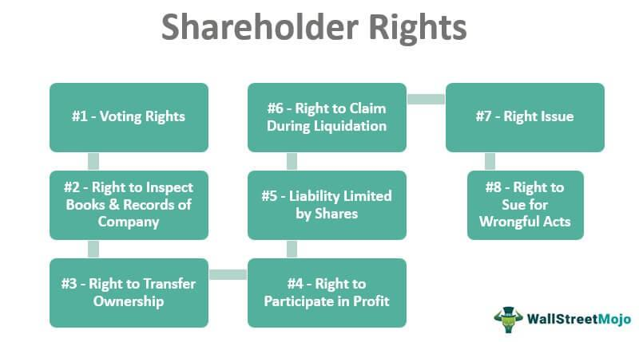

Stock investing holds a pivotal role in today’s financial markets, serving as a fundamental vehicle for individuals and institutions to build wealth. The equities market allows investors to buy shares in companies, thereby gaining potential returns through appreciation and dividends. This not only fuels personal financial growth but also provides companies with the capital necessary for expansion and innovation. As such, understanding the rights associated with stock ownership becomes critical, especially with the expansive and intricate developments in financial trading methods, such as algorithmic trading.

Algorithmic trading, a method that utilizes complex algorithms for executing orders at speeds and frequencies impossible for human traders, has transformed stock investing. This technological advancement has significantly increased the volume and velocity of trades in global markets, influencing stock prices and market trends. As a transformative force, algorithmic trading offers enhanced efficiency and liquidity, allowing trades to be executed at optimal prices. However, this shift also introduces complexities and challenges, affecting traditional trading dynamics and, by extension, shareholder power and influence.



At the core of stock investing is the presence of common shareholders. These investors own common stock, the most prevalent form of equity ownership, granting them specific rights and privileges within a corporation. Common shareholder rights typically encompass voting rights on important corporate matters, the receipt of dividends, and a share in the company's residual value upon dissolution. These rights establish a direct link between shareholders and corporate governance, enabling them to influence the direction and management of the companies they invest in.

The interplay between shareholder rights and algorithmic trading is a crucial area of study, as it affects both traditional investor roles and the evolving landscape of financial markets. By understanding their rights and the impact of technological advancements, investors can navigate the modern financial environment more effectively.

## Table of Contents

## Understanding Common Shareholders

A common shareholder is an individual or entity that holds common stock in a corporation, representing a residual interest in the company's assets and earnings. These shareholders are considered part-owners of the business and have various rights and responsibilities. The ownership acquired through common stocks allows shareholders to enjoy certain privileges, such as voting rights on corporate matters, but also comes with a level of risk since they are last in line in case of company liquidation.

### Acquiring Ownership

Common shareholders ordinarily acquire their shares through initial public offerings (IPOs), secondary market transactions, or employee stock options. In an IPO, a company offers its stocks to the public for the first time, allowing investors to purchase shares directly and thus become owners. Secondary market transactions take place on stock exchanges, where existing investors sell their shares to new investors. Employee stock options enable employees to purchase company shares at a predetermined price, often as part of their compensation package.

### Distinction from Preferred Shareholders

The distinction between common and preferred shareholders lies primarily in the rights and preferences each class of shareholder receives. Common shareholders typically have voting rights, allowing them to influence corporate governance through votes on significant issues such as the election of board directors, mergers, or changes in corporate policy. However, their claims on assets and earnings are subordinated to those of preferred shareholders and creditors.

Preferred shareholders, on the other hand, usually do not possess voting rights, but they enjoy priority over common shareholders in dividend payments and asset distribution upon liquidation. Preferred dividends are generally fixed and must be paid out before any dividends can be issued to common shareholders. Furthermore, in the event of liquidation, preferred shareholders have a higher claim on company assets than common shareholders, positioning them between creditors and common equity holders in the hierarchy of repayment.

In essence, common shareholders stand to gain significantly from the appreciation of the company's stock price and potential dividend increases, reflecting the company's profitability and growth over time. However, they also bear the risk of loss if the company's performance declines or in the event of bankruptcy, reflecting their role as the primary risk-bearers among equity investors.

## Common Shareholder Rights

Common shareholders possess several critical rights that ensure their participation and influence within a corporation. These rights are foundational to maintaining a balance between the interests of shareholders and the management.

### Voting Rights on Corporate Matters

Common shareholders generally hold the right to vote on essential corporate issues, particularly during annual general meetings (AGMs) or special meetings. Typically, each share of common stock equates to one vote, enabling shareholders to influence corporate governance aspects such as the election of the board of directors, approval of significant mergers or acquisitions, and other major corporate policies. This voting mechanism fosters a democratic process within the corporate structure, allowing shareholders to express their preferences on strategic decisions that impact the company's future ([SEC.gov](https://www.sec.gov)).

### Rights to Dividends and Understanding Dividend Payments

Common shareholders have the right to receive dividends, which are portions of a company's earnings distributed to shareholders. While dividends are not guaranteed and are declared at the discretion of the company's board of directors, common shareholders typically receive them only after preferred shareholders have been paid. Dividends can be issued as cash payments or additional shares of stock, and their value is a reflection of the company's financial health and profitability. The formula for calculating dividends per share (DPS) is:

$$
\text{DPS} = \frac{\text{Total Dividends Paid}}{\text{Number of Outstanding Shares}}
$$

This formula aids in understanding the income derived from each share owned.

### Preemptive Rights and Their Significance

Preemptive rights enable common shareholders to maintain their proportional ownership in a company whenever new shares are issued. This right ensures that existing shareholders are not diluted by allowing them to purchase new shares before the company offers them to the public. Preemptive rights are significant in protecting shareholders from dilution of their voting power and financial investment, especially during additional rounds of fund-raising or stock issues.

### Access to Company Records and Information

Common shareholders are entitled to access certain company documents and information, which is crucial for making informed decisions regarding their investments. This right typically includes the ability to inspect the company's bylaws, minutes from board meetings, and financial statements. Access to these records allows shareholders to stay informed about the company's performance, governance, and strategic direction. By having access to critical corporate documents, shareholders can better assess the viability and potential of their investments ([Corporate Finance Institute](https://corporatefinanceinstitute.com)).

These rights collectively form the backbone of shareholder influence and responsibility, ensuring that shareholders can effectively participate in the governance and future direction of the company they have invested in.

## Impact of Common Shareholder Rights on Corporate Governance

Common shareholder rights significantly shape corporate governance, largely through their voting power. Shareholders have the right to vote on critical corporate matters, such as the election of board members, mergers and acquisitions, and significant changes in corporate policies. This voting power influences the direction and decisions made by the company, requiring corporations to align their actions with shareholder interests to maintain support.

Shareholder meetings are pivotal events where investors express their votes. These meetings, typically held annually, allow shareholders to engage with company executives, review the financial performance, and discuss future directions. During these meetings, shareholders can propose and vote on various resolutions. Proxy voting is another key component, enabling shareholders to vote even if they cannot attend the meetings physically. This method is essential for maintaining democratic processes in corporations, ensuring all investor voices are heard and counted.

Examples of shareholder activism illustrate the profound impact shareholders can have on corporate governance. Activism typically involves shareholders seeking to influence a company's behavior by exercising their rights to vote and propose changes. For example, activist investors have successfully advocated for changes in environmental policies, executive compensation, and strategic direction. High-profile cases include hedge funds demanding corporate restructuring or changes in management to unlock shareholder value.

Through voting, participation in meetings, and activism, common shareholders wield considerable influence over corporate governance. This influence ensures that companies remain accountable to their owners, fostering a balance between management and shareholder interests.

## Basics of Stock Investing

Stock investing is a fundamental component of modern financial markets, offering individuals and institutions the opportunity to participate in the ownership and economic performance of companies. Investors purchase shares in companies with the expectation that these shares will generate returns through price appreciation and, potentially, dividend payments. Engaging in stock investing can offer several benefits, including potential income through dividends, capital growth, and the ability to participate in corporate governance.

### Types of Stock Investments: Common vs. Preferred

Stock investments can typically be categorized into common and preferred stocks, each offering different rights and potential benefits to investors.

**Common Stocks:**

Common stocks represent ownership in a company and grant shareholders voting rights on key corporate decisions, such as electing the board of directors or approving mergers. These shares generally come with the potential for substantial capital appreciation, as their value tends to rise and fall with the company’s performance. Additionally, common shareholders may receive dividends, although these payments are not guaranteed and can vary based on the company's profitability and dividend policy.

**Preferred Stocks:**

Preferred stocks are a type of equity security that combines characteristics of both stocks and bonds. They typically offer fixed dividend payments and have priority over common stocks in the payment of dividends and in the event of liquidation. However, preferred shareholders usually do not have voting rights. The fixed income nature of preferred stocks appeals to investors seeking more stable returns rather than the potentially higher, but more volatile, returns associated with common stocks.

### Strategies for Successful Stock Investing

Successful stock investing often involves strategic planning and analysis. Some commonly utilized strategies include:

1. **Diversification:**

   Diversifying an investment portfolio involves spreading investments across different asset classes, sectors, or geographies to reduce risk. By investing in a varied mix of stocks, investors can mitigate the impact of any single security's poor performance on the overall portfolio.

2. **Value Investing:**

   Value investing focuses on identifying and purchasing undervalued stocks that are trading below their intrinsic value. This strategy relies on thorough financial analysis and aims to realize gains when the market eventually recognizes the stock's true worth.

3. **Growth Investing:**

   Growth investors seek companies that exhibit strong growth potential, characterized by increasing revenues, profits, and market share. This strategy often involves investing in younger companies or industries poised for expansion.

4. **Dividend Investing:**

   This strategy prioritizes stocks that regularly pay dividends, providing a predictable income stream and potential for long-term capital appreciation. Dividend investors typically focus on companies with a history of stable and growing dividend payments.

5. **Index Investing:**

   Index investing involves purchasing shares in mutual funds or exchange-traded funds (ETFs) that track specific market indices. This passive investment approach offers broad market exposure, typically at lower costs than actively managed funds.

By understanding the benefits of stock investing and differentiating between common and preferred stocks, investors can make informed decisions aligned with their financial goals and risk tolerance. Successful strategies like diversification, value investing, and dividend investing can help maximize returns while managing risks.

## Integration of Algorithmic Trading in Stock Investing

Algorithmic trading, often referred to as algo trading, has garnered significant attention and adoption in modern financial markets. It involves using computer algorithms to execute trades automatically based on predefined criteria, which might include timing, price, and quantity. This approach has gained immense popularity due to its ability to process large volumes of data and execute trades at speeds unattainable by human traders.

The rise of [algorithmic trading](/wiki/algorithmic-trading) can be attributed to several factors. Firstly, the massive increase in computing power and the advancement of technology have made it feasible for algorithms to analyze market data and execute trades in milliseconds. Secondly, the ubiquity of electronic trading platforms has facilitated algo trading, providing the necessary infrastructure for fast and efficient trade execution. Moreover, the growing complexity of financial markets and the demand for more sophisticated trading strategies have also fueled the development of algorithmic approaches.

One of the primary benefits of algorithmic trading is its speed. Algorithms can scan various markets simultaneously and place orders promptly, taking advantage of minute price discrepancies before they vanish. This rapid execution reduces the chances of price slippage, which can occur when the price changes unfavorably between the time a trade order is placed and the time it is executed. 

Efficiency is another notable advantage of algorithmic trading. Algorithms can operate continuously without fatigue, making them ideal for executing numerous trades across different time zones. They also reduce the risk of human error, as emotions and subjective biases do not influence trading decisions. This objectivity can lead to more disciplined and consistent trading outcomes.

Optimization of trading strategies is a significant aspect of algorithmic trading. Traders use algorithms to process historical and real-time data to identify patterns and generate signals for buying or selling securities. For instance, in statistical [arbitrage](/wiki/arbitrage), algorithms exploit the mean-reversion tendencies of securities prices. Traders can backtest these algorithms using historical data to evaluate their potential effectiveness before deploying them in live markets. 

Here is a simple Python example to illustrate how an algorithm might be used to detect trading signals based on moving averages:

```python
def calculate_moving_average(data, window_size):
    return data.rolling(window_size).mean()

def identify_signals(prices, short_window, long_window):
    signals = {'buy': [], 'sell': []}
    short_moving_avg = calculate_moving_average(prices, short_window)
    long_moving_avg = calculate_moving_average(prices, long_window)

    for i in range(1, len(prices)):
        if short_moving_avg[i] > long_moving_avg[i] and short_moving_avg[i-1] <= long_moving_avg[i-1]:
            signals['buy'].append(i)
        elif short_moving_avg[i] < long_moving_avg[i] and short_moving_avg[i-1] >= long_moving_avg[i-1]:
            signals['sell'].append(i)

    return signals
```

In this example, the algorithm calculates two moving averages (short-term and long-term) and generates buy signals when the short-term moving average crosses above the long-term moving average, and sell signals when the reverse occurs. This type of strategy can help traders identify potential entry and [exit](/wiki/exit-strategy) points in the market.

Overall, algorithmic trading continues to shape the landscape of stock investing, offering tools that enhance the precision and effectiveness of trading strategies. As technology evolves, its integration into trading practices is likely to deepen, offering novel insights and efficiencies for market participants.

## The Impact of Algorithmic Trading on Shareholder Rights

Algorithmic trading, a form of trading that utilizes computerized algorithms to execute a large [volume](/wiki/volume-trading-strategy) of orders with speed and precision, significantly impacts shareholder rights, posing both challenges and opportunities for traditional shareholders. 

### Challenges Posed by Algorithmic Trading for Traditional Shareholders

Traditional shareholders often face several challenges due to the pervasive rise of algorithmic trading:

1. **Market Volatility**: Algorithmic trading can exacerbate market volatility due to the rapid execution and cancellation of trades. This heightened volatility can lead to sudden, unpredictable swings in stock prices, potentially eroding shareholder value and posing risks for those relying on stable investment returns.

2. **Reduced Market Transparency**: The complexity and speed of algorithmic trading can obscure market activities, leading to reduced transparency. Shareholders may find it challenging to understand market movements and the underlying rationale of trading strategies, resulting in an information asymmetry between institutional algorithmic traders and individual investors.

3. **Price Distortion**: Algorithms designed for high-frequency trading can lead to price distortions as they exploit minute arbitrage opportunities. This can result in stock prices that do not accurately reflect the underlying fundamentals of the company, thereby affecting shareholders' decisions based on price signals.

### Mitigation Strategies Shareholders Can Use in an Algo-Driven Market

Shareholders can employ several strategies to mitigate the adverse effects of algorithmic trading:

1. **Enhanced Due Diligence**: Shareholders should conduct thorough research and analysis to understand the factors affecting their investments. Utilizing modern analytical tools and services that provide insights on market conditions can better equip investors to make informed decisions.

2. **Diversification**: By diversifying their portfolios across various asset classes, sectors, and geographical areas, shareholders can reduce the overall risk associated with increased volatility due to algorithmic trading.

3. **Engagement with Financial Advisors**: Investors can work with financial advisors who are knowledgeable about algorithmic trading trends. Such professionals can provide strategic advice on navigating these fast-moving markets and leveraging algorithmic capabilities.

4. **Adopting Technology**: Shareholders can use technology-driven platforms that provide real-time data, risk management tools, and algorithm-based advisory services to make more informed investment choices.

### How Technology Can Empower Shareholders in Decision-Making

Technology plays a pivotal role in empowering shareholders by:

1. **Access to Real-Time Data**: Advanced trading platforms offer real-time data analytics and insights, enabling shareholders to make timely and informed decisions. 

2. **Algorithmic Advisory Tools**: These tools can simulate potential investment outcomes, helping shareholders evaluate different scenarios and optimize their investment strategies.

3. **Enhanced Communication**: Technology facilitates better communication between shareholders and corporate boards. Shareholder platforms can provide forums for discussion, opinion polls, and voting capabilities that ensure shareholders' voices are heard and considered in corporate governance.

4. **Cost-Effective Trading Solutions**: With algorithmic platforms available to retail investors, technology has democratized access to sophisticated trading tools, allowing individual shareholders to participate in markets more cost-effectively and efficiently than before.

By employing these strategies and tools, shareholders can navigate the challenges presented by algorithmic trading, ensuring that their rights and interests are safeguarded in an evolving financial landscape.

## Risk Management in Algo Trading and Shareholder Value

Algorithmic trading, a method that employs complex algorithms to make automated trading decisions, has transformed financial markets through increased efficiency and speed. However, this technological innovation introduces several key risks that need to be addressed to protect shareholder value.

### Key Risks Associated with Algorithmic Trading

1. **Market Volatility**: Algorithmic trading can exacerbate market volatility due to its ability to execute large volumes of trades in milliseconds. Sudden price swings can occur when multiple algorithms react to the same market signals, potentially leading to a chain reaction of buying and selling.

2. **Systemic Risk**: The interconnectedness of trading systems means that a failure in one algorithm can have cascading effects, impacting other systems and the broader financial market. Algorithmic crashes, such as the "Flash Crash" of 2010, highlight the systemic risks posed by automated trading.

3. **Execution Risk**: Algorithms are designed to operate within defined parameters, but unexpected market conditions can lead to suboptimal execution. This risk includes delays, incorrect trades, and the failure to execute trades at the intended price.

4. **Regulatory and Compliance Risk**: The rapid nature of algorithmic trading can lead to inadvertent violations of regulatory requirements. Ensuring compliance with trading rules across multiple jurisdictions adds complexity and risk.

### Importance of Risk Management Strategies

Effective risk management is crucial to mitigate these risks and protect shareholder interests. Key strategies include:

- **Robust Algorithm Design**: Ensuring that trading algorithms have well-defined parameters and fail-safes to handle unexpected market conditions. This includes backtesting strategies against historical data and stress testing under extreme scenarios.

- **Real-time Monitoring**: Continuous monitoring of algorithm performance and market conditions is essential. This allows for quick identification and remediation of issues before they escalate.

- **Diversification**: Just like traditional trading, diversification in algorithmic strategies can reduce risk. By employing multiple trading algorithms with varying strategies, the impact of any single algorithm's failure can be minimized.

- **Compliance Checks**: Regular audits and updates of algorithmic trading systems to ensure they meet new and existing regulatory requirements are essential in avoiding legal pitfalls.

### The Role of Technology in Safeguarding Shareholder Value

Technology plays a crucial role in managing the risks associated with algorithmic trading and safeguarding shareholder value:

- **Advanced Analytics**: Utilizing big data analytics to predict market movements and identify potential risks before they manifest. Predictive modeling can assist in adjusting algorithms dynamically in response to changing market conditions.

- **Machine Learning**: Incorporating machine learning techniques into algorithmic trading allows for the adaptation of strategies based on new market data. This adaptive learning capability can improve the decision-making process and reduce execution risks.

- **Cybersecurity Measures**: Protecting trading algorithms from cyber threats is paramount. Implementing robust cybersecurity measures ensures the integrity and security of trading systems, thus safeguarding shareholder interests.

Well-designed risk management strategies and the integration of advanced technologies are essential for mitigating the risks posed by algorithmic trading. These measures ensure that while the benefits of algorithmic trading are leveraged, shareholder value remains protected amidst the dynamic nature of financial markets.

## Future Prospects for Shareholders and Algorithmic Trading

The future prospects for shareholders amid the growing prevalence of algorithmic trading are characterized by significant transformations in shareholder rights and technological integration in finance. 

### Trends in the Evolution of Shareholder Rights

Historically, shareholder rights have evolved with the economic and regulatory landscapes. In recent years, there has been a trend towards greater empowerment and participation of shareholders in corporate governance. Shareholder activism, driven by increasing awareness and advocacy for environmental, social, and governance ([ESG](/wiki/esg-investing)) criteria, illustrates this shift. Shareholders are demanding more transparency and influence over corporate decisions, necessitating adaptations in traditional governance structures.

### Technological Advancements and Their Influence on Investing

Technological innovations are reshaping the investment landscape, offering new tools and platforms for both retail and institutional investors. Fintech innovations, such as robo-advisors and blockchain technology, are democratizing access to financial markets. These technologies enable real-time access to vast amounts of data, sophisticated analysis, and ease of trading, reducing barriers for individual investors.

Algorithmic trading, utilizing complex algorithms and [machine learning](/wiki/machine-learning), is at the forefront of this technological shift. It facilitates high-frequency trading and enhances market efficiency through rapid execution of trades based on pre-defined criteria. As a result, traditional investors are adapting by incorporating algorithmic insights into their strategies to remain competitive.

### Predictions for the Future Integration of Tech in Finance

Looking forward, the integration of technology in finance is likely to deepen, with developments such as quantum computing poised to revolutionize data processing and analysis capabilities. This evolution will likely introduce new, more efficient trading algorithms, thereby pushing the boundaries of predictive analytics in finance.

Moreover, as decentralized finance (DeFi) continues to mature, it could redefine traditional financial ecosystems, offering decentralized access to financial instruments without intermediaries. This transformation may pave the way for novel shareholder models, where rights and votes are potentially encoded into blockchain systems, ensuring greater transparency and security.

In conclusion, the trajectory of shareholder rights and algorithmic trading is towards increased integration of technology, providing enhanced tools for investors while simultaneously necessitating the reevaluation of traditional practices and governance models. Stakeholders must remain vigilant and adaptable to capitalize on these advancements while advocating for responsible and equitable market developments.

## Conclusion

The journey through the intricacies of common shareholder rights and the transformative role of algorithmic trading has outlined a landscape where traditional investment principles and modern technology converge. Common shareholders, equipped with rights such as voting on corporate matters, receiving dividends, and accessing company information, play a vital role in corporate governance. These rights have not only empowered individual investors but have also significantly influenced corporate strategies and policies, underscoring the foundational ethos of shareholder democracy.

Algorithmic trading, with its emphasis on speed, efficiency, and data-driven decision-making, represents a significant shift in stock investing paradigms. The integration of algorithms in trading enhances market [liquidity](/wiki/liquidity-risk-premium) and offers opportunities for optimizing investment strategies. However, it also presents challenges, such as increased market [volatility](/wiki/volatility-trading-strategies) and challenges to traditional shareholder engagement practices.

To harmonize shareholder rights with the rapid advancements in algorithmic trading, stakeholders must embrace adaptive strategies that leverage technological tools to enhance decision-making processes. This involves embracing technological solutions that provide greater insights and equity in shareholder engagements. 

As the financial markets continue to evolve, staying informed and adaptable becomes crucial for investors. This adaptability ensures that they can capitalize on emerging opportunities while safeguarding their interests against potential risks posed by technological disruptions. Investors are encouraged to continuously educate themselves on both the traditional aspects of shareholder rights and the innovative dynamics introduced by algorithmic trading. Such an approach will facilitate a robust understanding and effective navigation of the modern investment landscape, ultimately ensuring that shareholder value is maximized in a rapidly transforming market environment.

## References & Further Reading

[1]: ["The Little Book of Common Sense Investing: The Only Way to Guarantee Your Fair Share of Stock Market Returns"](https://www.amazon.com/Little-Book-Common-Sense-Investing/dp/1119404509) by John C. Bogle

[2]: Pardo, R. (2008). ["The Evaluation and Optimization of Trading Strategies."](https://onlinelibrary.wiley.com/doi/book/10.1002/9781119196969) Wiley.

[3]: Willmott, P., & Steve, H. (1998). ["Quantitative Finance: Its Development, Mathematical Foundations and Opportunities."](https://archive.org/details/quantitativefina0000epps) Wiley.

[4]: Narang, R. (2013). ["Inside the Black Box: A Simple Guide to Quantitative and High Frequency Trading."](https://onlinelibrary.wiley.com/doi/book/10.1002/9781118662717) Wiley.

[5]: Hasbrouck, J. (2007). ["Empirical Market Microstructure: The Institutions, Economics, and Econometrics of Securities Trading."](https://academic.oup.com/book/52241) Oxford University Press.