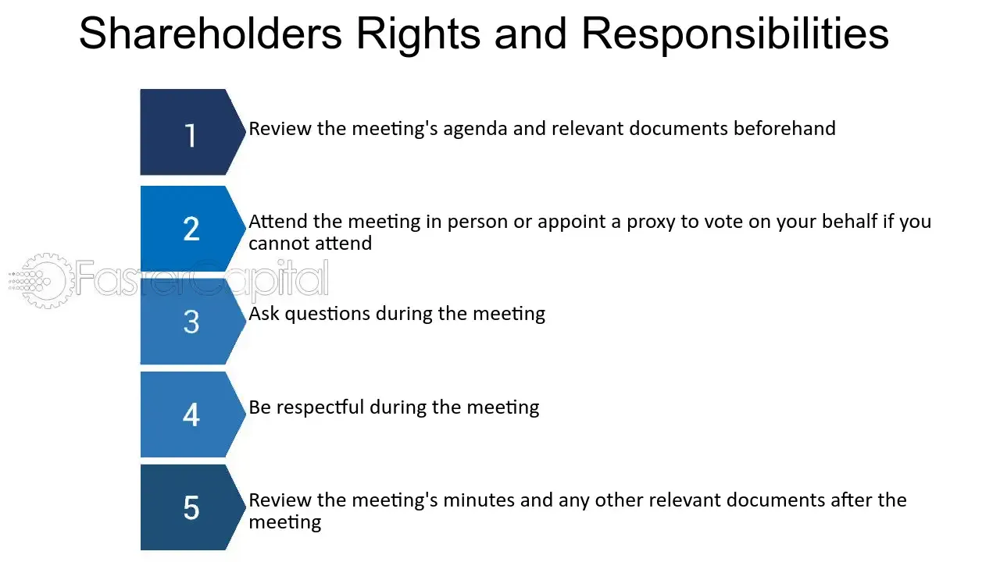

## Table of Contents

## What is a common shareholder?

A common shareholder is someone who owns shares in a company. These shares are called common stock. When you own common stock, you have a part of the company. You can vote on important decisions at meetings, like choosing the board of directors.

Common shareholders might get dividends, which are payments from the company's profits. But, they are paid after other people who own different types of shares, like preferred shareholders. If the company goes bankrupt, common shareholders are the last to get any money back. This makes common stock riskier, but it can also offer bigger rewards if the company does well.

## How does one become a common shareholder?

To become a common shareholder, you need to buy common stock in a company. You can do this through a stockbroker or an online trading platform. A stockbroker is a person or company that helps you buy and sell stocks. An online trading platform is a website or app where you can buy and sell stocks yourself. Once you have an account set up, you can search for the company you want to invest in, decide how many shares you want to buy, and place an order.

After you buy the shares, you will receive a confirmation of your purchase. This means you are now a common shareholder in that company. You will have the right to vote at shareholder meetings and may receive dividends if the company decides to pay them. Remember, the value of your shares can go up or down depending on how well the company is doing. If you ever want to sell your shares, you can do so through the same stockbroker or trading platform you used to buy them.

## What are the basic rights of a common shareholder?

As a common shareholder, you have some basic rights. One of the main rights is the right to vote. This means you can have a say in important decisions about the company. You get to vote at meetings called shareholder meetings. At these meetings, you can vote on things like who should be on the board of directors. The board of directors helps run the company, so it's important to have a say in who they are.

Another right you have is the chance to get dividends. Dividends are like a share of the company's profits. If the company makes money and decides to share it with shareholders, you might get some of it. But, remember, common shareholders get paid after other types of shareholders, like preferred shareholders. Also, if the company goes bankrupt, common shareholders are the last to get any money back. This makes being a common shareholder a bit riskier, but it can also be more rewarding if the company does well.

## What is the difference between common and preferred shareholders?

Common shareholders and preferred shareholders both own parts of a company, but they have different rights and benefits. Common shareholders own common stock, which gives them the right to vote at shareholder meetings. They can help decide who runs the company by voting for the board of directors. Common shareholders might also get dividends, which are payments from the company's profits. However, they get these dividends after preferred shareholders, and if the company goes bankrupt, common shareholders are the last to get any money back. This makes common stock riskier, but it can also offer bigger rewards if the company does well.

Preferred shareholders own preferred stock, which usually doesn't give them voting rights. Instead, they have a higher claim on the company's assets and earnings. This means they get paid dividends before common shareholders. If the company goes bankrupt, preferred shareholders get their money back before common shareholders. Preferred stock is often seen as less risky than common stock because of these benefits, but it might not grow in value as much as common stock if the company does really well.

## How do common shareholders participate in corporate governance?

Common shareholders participate in corporate governance mainly through voting at shareholder meetings. They get to vote on important decisions, like who should be on the board of directors. The board of directors is a group of people who help run the company and make big decisions. By voting, common shareholders can influence who these people are and, in turn, how the company is managed.

Besides voting, common shareholders can also participate in corporate governance by attending shareholder meetings. At these meetings, they can ask questions and voice their opinions on the company's performance and future plans. This gives them a chance to directly communicate with the company's leaders and other shareholders. Even though common shareholders are the last to get paid if the company goes bankrupt, their ability to vote and participate in meetings gives them a voice in how the company is run.

## What are dividends and how do they relate to common shareholders?

Dividends are payments that a company gives to its shareholders from its profits. When a company makes money, it can choose to share some of that money with the people who own its stock. These payments are called dividends. Common shareholders might get dividends, but they are paid after other shareholders, like preferred shareholders. This means if the company decides to pay dividends, common shareholders will get their share only after preferred shareholders have been paid.

The amount of dividends that common shareholders get can change. It depends on how well the company is doing and how much profit it makes. Sometimes, a company might decide not to pay any dividends at all, choosing instead to use the money to grow the business. Even though common shareholders are the last to get paid, getting dividends can be a nice reward for owning part of a successful company.

## Can common shareholders influence company decisions?

Common shareholders can influence company decisions by voting at shareholder meetings. They get to vote on important things like who should be on the board of directors. The board of directors helps run the company and makes big decisions, so choosing them is a big deal. By voting, common shareholders can have a say in who gets to make these decisions and how the company is managed.

Besides voting, common shareholders can also go to shareholder meetings. At these meetings, they can ask questions and share their thoughts about how the company is doing and what it should do next. This gives them a chance to talk directly to the people who run the company and other shareholders. Even though common shareholders are the last to get paid if the company goes bankrupt, their ability to vote and speak at meetings gives them a voice in the company's future.

## What is a shareholder meeting and what role do common shareholders play?

A shareholder meeting is a gathering where people who own parts of a company, called shareholders, come together. These meetings happen regularly, and they are important because they give shareholders a chance to talk about the company and make decisions. At these meetings, shareholders can vote on big things like who should be on the board of directors. The board of directors is a group of people who help run the company and make big decisions, so choosing them is a big deal.

Common shareholders play an important role in these meetings. They get to vote on things like who should be on the board of directors. By voting, they can help decide who gets to make decisions for the company. Common shareholders can also go to these meetings and ask questions or share their thoughts about the company. Even though they get paid last if the company goes bankrupt, their votes and voices at these meetings give them a say in how the company is run.

## How do common shareholders benefit from stock price appreciation?

Common shareholders benefit from stock price appreciation when the value of the company's stock goes up. If you own common stock and the price of the stock increases, the value of your investment goes up too. This means that if you decide to sell your shares, you can sell them for more money than you paid for them. This is one of the main ways that common shareholders can make money from their investments.

For example, if you bought a share for $10 and it goes up to $15, you can sell that share for a $5 profit. This increase in stock price can happen because the company is doing well and more people want to buy its stock. Stock price appreciation is important because it can lead to big rewards for common shareholders, even though they are the last to get paid if the company goes bankrupt.

## What are preemptive rights and how do they affect common shareholders?

Preemptive rights are a special right that some common shareholders have. It means that if the company wants to sell new shares, these shareholders get to buy them first before anyone else. This is important because it helps them keep their share of ownership in the company. If new shares are sold and they don't get to buy them, their part of the company could get smaller. By having preemptive rights, they can keep their ownership the same by buying the new shares.

Not all common shareholders have preemptive rights. It depends on what the company's rules say. If a company does give preemptive rights, it can be good for shareholders because it helps them protect their investment. But, if the company doesn't offer these rights, shareholders might see their ownership get smaller if new shares are sold to others.

## What are the risks associated with being a common shareholder?

Being a common shareholder comes with some risks. One big risk is that if the company does not do well, the value of the stock can go down. If you need to sell your shares when the price is low, you might lose money. Also, common shareholders are the last to get paid if the company goes bankrupt. This means that if the company fails, you might not get any money back at all. This makes being a common shareholder riskier than being a preferred shareholder.

Another risk is that common shareholders might not get dividends. Dividends are payments from the company's profits, but the company can choose not to pay them. If the company decides to use its profits to grow the business instead of paying dividends, common shareholders won't get any extra money. Even if dividends are paid, common shareholders get them after preferred shareholders, so there might not be much left for them. These risks make being a common shareholder a bit like a gamble, but it can also be rewarding if the company does well.

## How can common shareholders protect their interests in a company?

Common shareholders can protect their interests by voting at shareholder meetings. They get to vote on important things like who should be on the board of directors. The board helps run the company, so choosing the right people is important. By voting, common shareholders can make sure the company is run by people they trust. They can also go to these meetings and ask questions or share their thoughts. This helps them stay informed and have a say in what the company does.

Another way common shareholders can protect their interests is by keeping an eye on the company's performance. They can read reports and news about the company to see if it's doing well. If they see problems, they can talk to other shareholders or even start a campaign to make changes. Some common shareholders also have preemptive rights, which means they get to buy new shares before anyone else. This can help them keep their share of the company the same, even if new shares are sold.

## What are common shareholder rights?

Common shareholders possess several critical rights that ensure their participation and influence within a corporation. These rights are foundational to maintaining a balance between the interests of shareholders and the management.

### Voting Rights on Corporate Matters

Common shareholders generally hold the right to vote on essential corporate issues, particularly during annual general meetings (AGMs) or special meetings. Typically, each share of common stock equates to one vote, enabling shareholders to influence corporate governance aspects such as the election of the board of directors, approval of significant mergers or acquisitions, and other major corporate policies. This voting mechanism fosters a democratic process within the corporate structure, allowing shareholders to express their preferences on strategic decisions that impact the company's future ([SEC.gov](https://www.sec.gov)).

### Rights to Dividends and Understanding Dividend Payments

Common shareholders have the right to receive dividends, which are portions of a company's earnings distributed to shareholders. While dividends are not guaranteed and are declared at the discretion of the company's board of directors, common shareholders typically receive them only after preferred shareholders have been paid. Dividends can be issued as cash payments or additional shares of stock, and their value is a reflection of the company's financial health and profitability. The formula for calculating dividends per share (DPS) is:

$$
\text{DPS} = \frac{\text{Total Dividends Paid}}{\text{Number of Outstanding Shares}}
$$

This formula aids in understanding the income derived from each share owned.

### Preemptive Rights and Their Significance

Preemptive rights enable common shareholders to maintain their proportional ownership in a company whenever new shares are issued. This right ensures that existing shareholders are not diluted by allowing them to purchase new shares before the company offers them to the public. Preemptive rights are significant in protecting shareholders from dilution of their voting power and financial investment, especially during additional rounds of fund-raising or stock issues.

### Access to Company Records and Information

Common shareholders are entitled to access certain company documents and information, which is crucial for making informed decisions regarding their investments. This right typically includes the ability to inspect the company's bylaws, minutes from board meetings, and financial statements. Access to these records allows shareholders to stay informed about the company's performance, governance, and strategic direction. By having access to critical corporate documents, shareholders can better assess the viability and potential of their investments ([Corporate Finance Institute](https://corporatefinanceinstitute.com)).

These rights collectively form the backbone of shareholder influence and responsibility, ensuring that shareholders can effectively participate in the governance and future direction of the company they have invested in.

## References & Further Reading

[1]: ["The Little Book of Common Sense Investing: The Only Way to Guarantee Your Fair Share of Stock Market Returns"](https://www.amazon.com/Little-Book-Common-Sense-Investing/dp/1119404509) by John C. Bogle

[2]: Pardo, R. (2008). ["The Evaluation and Optimization of Trading Strategies."](https://onlinelibrary.wiley.com/doi/book/10.1002/9781119196969) Wiley.

[3]: Willmott, P., & Steve, H. (1998). ["Quantitative Finance: Its Development, Mathematical Foundations and Opportunities."](https://archive.org/details/quantitativefina0000epps) Wiley.

[4]: Narang, R. (2013). ["Inside the Black Box: A Simple Guide to Quantitative and High Frequency Trading."](https://onlinelibrary.wiley.com/doi/book/10.1002/9781118662717) Wiley.

[5]: Hasbrouck, J. (2007). ["Empirical Market Microstructure: The Institutions, Economics, and Econometrics of Securities Trading."](https://academic.oup.com/book/52241) Oxford University Press.