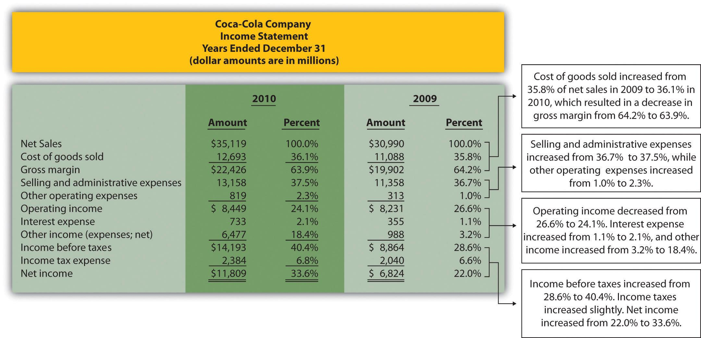

## Table of Contents

## What is common-size analysis in financial statements?

Common-size analysis is a way to compare financial statements by turning the numbers into percentages. Instead of looking at the actual dollar amounts, you look at each item as a percentage of a total. For example, on an income statement, every line item is shown as a percentage of total sales. This makes it easier to compare companies of different sizes or to see how a company's financials change over time.

This method is useful because it helps you see the big picture. You can quickly spot trends or differences that might be hard to see with just dollar amounts. For example, if a company's cost of goods sold is going up as a percentage of sales, it might mean their costs are increasing faster than their sales. This kind of analysis can be done on income statements, balance sheets, and cash flow statements, making it a versatile tool for financial analysis.

## Why is common-size analysis useful for financial statement analysis?

Common-size analysis is useful for financial statement analysis because it helps you compare companies of different sizes easily. When you turn everything into percentages, you can see how each part of the business is doing compared to the whole, no matter how big or small the company is. This means you can compare a small local business with a big corporation and still get meaningful insights. It's like looking at a pie chart where each slice represents a part of the business, making it easy to see which parts are getting bigger or smaller over time.

Another reason common-size analysis is helpful is that it makes it easier to spot trends and changes in a company's financials. By looking at percentages instead of dollar amounts, you can quickly see if something like the cost of goods sold is going up or down as a part of total sales. This can tell you if the company is becoming more or less efficient. It also helps in comparing the company's performance over different years or against industry averages, giving a clearer picture of how the business is doing overall.

## How do you perform common-size analysis on an income statement?

To perform common-size analysis on an income statement, you start by taking each line item and dividing it by the total revenue or sales for that period. For example, if you want to see what percentage of sales goes to the cost of goods sold, you take the cost of goods sold number and divide it by total sales. Then, you multiply that number by 100 to turn it into a percentage. You do this for every line item on the income statement, like gross profit, operating expenses, and net income.

Once you have all the percentages, you can compare them over different periods or with other companies. This makes it easier to see trends or differences. For instance, if the percentage of sales going to operating expenses is going up over time, it might mean the company is becoming less efficient. Or, if you compare two companies and see that one has a much higher percentage of sales going to net income, it might be more profitable. This way, common-size analysis helps you understand the financial health and performance of a business in a simple and clear way.

## How do you perform common-size analysis on a balance sheet?

To do common-size analysis on a balance sheet, you take each item on the balance sheet and turn it into a percentage of the total assets. You start with the assets side. For each asset, like cash, inventory, or property, you divide its value by the total assets and then multiply by 100 to get a percentage. You do the same for each liability and equity item, but this time you divide by total assets too. This way, you can see what part of the total assets each item represents.

Once you have all the percentages, you can compare them over time or with other companies. This helps you see how the company's financial structure is changing. For example, if the percentage of assets that is cash is going up, it might mean the company is holding more cash than before. Or, if you compare two companies and see that one has a higher percentage of assets in debt, it might be more leveraged. This kind of analysis makes it easier to understand the balance sheet and see the big picture of a company's financial health.

## What are the key differences between common-size income statements and common-size balance sheets?

Common-size income statements and common-size balance sheets are both useful for understanding a company's financials, but they focus on different things. A common-size income statement looks at each line item as a percentage of total sales or revenue. This helps you see how much of each dollar in sales goes to things like cost of goods sold, operating expenses, and net income. It's great for comparing how profitable a company is over time or against other companies.

On the other hand, a common-size balance sheet shows each item as a percentage of total assets. This helps you understand what part of the company's assets is made up of things like cash, inventory, or property, and what part of the assets is funded by liabilities or equity. It's useful for seeing how the company's financial structure changes over time or how it compares to other companies in terms of how it uses its assets and finances them.

Both types of common-size analysis make it easier to spot trends and compare companies, but they give you different insights. The income statement tells you about the company's profitability, while the balance sheet tells you about its financial position and structure.

## Can common-size analysis be applied to cash flow statements? If so, how?

Yes, common-size analysis can be applied to cash flow statements. To do this, you take each line item on the cash flow statement and turn it into a percentage of the total cash flow from operations. For example, if you want to see what percentage of the cash flow from operations goes to capital expenditures, you divide the capital expenditures by the total cash flow from operations and then multiply by 100 to get a percentage. You do this for every line item on the cash flow statement, like net income, changes in working capital, and financing activities.

This helps you see how the company is using its cash. For instance, if the percentage of cash flow going to capital expenditures is going up over time, it might mean the company is investing more in its business. Or, if you compare two companies and see that one has a higher percentage of cash flow going to dividends, it might be returning more money to shareholders. Common-size analysis on a cash flow statement makes it easier to understand how a company manages its cash and where it's coming from and going to.

## What are the limitations of common-size analysis?

Common-size analysis is helpful, but it has some limitations. One big problem is that it doesn't show the actual dollar amounts. This can make it hard to understand how much money a company is really making or spending. For example, if a company's cost of goods sold is 30% of sales, that could be a small amount of money for a small company but a huge amount for a big company. So, while common-size analysis helps you compare percentages, you still need to look at the actual numbers to get the full picture.

Another limitation is that common-size analysis can hide important details. For instance, if a company's sales go up a lot, the percentages might stay the same, but the actual amounts could be very different. This means you might miss big changes in the company's financials if you only look at the percentages. Also, common-size analysis doesn't take into account things like inflation or changes in the economy, which can affect how you should interpret the numbers. So, it's a good tool, but you need to use it along with other ways of looking at financial statements to get a complete understanding.

## How can common-size analysis help in comparing companies of different sizes?

Common-size analysis helps in comparing companies of different sizes by turning all the numbers into percentages. Instead of looking at the actual dollar amounts, you see each part of the company's financials as a piece of the whole. This means you can compare a small business with a big one easily. For example, if you want to see how much each company spends on things like marketing or salaries, you can look at these costs as a percentage of their total sales. This way, you can tell if one company is spending more or less on these things compared to another, no matter how big or small they are.

Another way common-size analysis helps is by making it easier to spot trends and differences. When you look at percentages, you can quickly see if a company is becoming more or less efficient over time. For instance, if the percentage of sales that goes to the cost of goods sold is going up, it might mean the company's costs are rising faster than its sales. This kind of information is useful when comparing companies because it shows you how they are doing in terms of managing their money and resources. By using common-size analysis, you get a clearer picture of how companies stack up against each other, even if they are very different in size.

## What trends can be identified using common-size analysis over multiple periods?

Common-size analysis helps you see how a company's financials change over time by turning everything into percentages. When you look at an income statement over multiple periods, you can spot trends like if the cost of goods sold is going up or down as a percentage of sales. This can tell you if the company is getting better or worse at managing its costs. For example, if the percentage of sales going to operating expenses keeps going down, it might mean the company is becoming more efficient. On the other hand, if the percentage of sales going to net income is dropping, it could mean the company is less profitable.

On a balance sheet, common-size analysis can show you how the company's financial structure is changing. You might see trends like the percentage of total assets that is cash going up, which could mean the company is holding more cash than before. Or, if the percentage of assets that is debt is increasing, it might mean the company is taking on more debt. These trends help you understand if the company is becoming more or less risky over time. By looking at these percentages over multiple periods, you get a clear picture of how the company's financial health is evolving.

When you apply common-size analysis to cash flow statements over time, you can see trends in how the company is using its cash. For instance, if the percentage of cash flow from operations going to capital expenditures is increasing, it might mean the company is investing more in its business. Or, if the percentage going to dividends is going up, it could mean the company is returning more money to shareholders. These trends help you understand the company's cash management strategy and how it's changing over time.

## How does common-size analysis assist in identifying financial strengths and weaknesses?

Common-size analysis helps you see a company's financial strengths and weaknesses by turning all the numbers into percentages. This makes it easy to compare different parts of the company's financials over time or with other companies. For example, if you look at an income statement, you can see if the company is good at keeping costs low. If the percentage of sales going to operating expenses is small and getting smaller, that's a strength because it means the company is efficient. On the other hand, if the percentage of sales going to net income is small and shrinking, that's a weakness because it means the company is less profitable.

When you use common-size analysis on a balance sheet, you can spot strengths and weaknesses in how the company manages its assets and finances. If the percentage of total assets that is cash is high and growing, that's a strength because it shows the company has a good cash reserve. But if the percentage of assets that is debt is high and increasing, that's a weakness because it means the company is taking on more risk. By looking at these percentages, you can quickly see where the company is doing well and where it needs to improve.

Applying common-size analysis to cash flow statements also helps identify financial strengths and weaknesses. If the percentage of cash flow from operations going to capital expenditures is high and stable, that's a strength because it shows the company is investing in its future. However, if the percentage of cash flow going to dividends is high and growing, that could be a weakness if it means the company is not keeping enough cash for its own needs. By looking at these trends, you get a clear picture of how the company is managing its cash and where it might have problems.

## What advanced techniques can be used to enhance common-size analysis?

One way to make common-size analysis better is by using something called trend analysis. This means you look at the common-size percentages over many years to see how they change. For example, if you see that the percentage of sales going to operating expenses is going down over time, that's a good sign because it means the company is getting better at managing its costs. By looking at these trends, you can see if the company is improving or if it's getting worse in certain areas. This helps you understand the company's financial health in a deeper way.

Another advanced technique is to compare the common-size percentages with industry averages. This helps you see how the company is doing compared to others in the same business. If the company's cost of goods sold as a percentage of sales is lower than the industry average, that's a strength because it means the company is more efficient than its competitors. By doing this kind of comparison, you can find out where the company is doing well and where it needs to improve. It gives you a clearer picture of the company's position in the market.

You can also use ratio analysis along with common-size analysis to get more insights. Ratios like the profit margin or return on assets can tell you more about the company's profitability and efficiency. When you combine these ratios with common-size percentages, you get a fuller picture of the company's financial performance. For example, if the common-size analysis shows a high percentage of sales going to net income, and the profit margin ratio is also high, that's a strong sign of good financial health. By using these advanced techniques, you can make common-size analysis even more useful for understanding a company's financial strengths and weaknesses.

## How can common-size analysis be integrated with other financial analysis tools for more comprehensive insights?

Common-size analysis can be made even better when you use it with other financial tools like trend analysis, industry comparisons, and ratio analysis. Trend analysis means looking at the common-size percentages over many years to see how they change. This helps you understand if the company is getting better or worse in certain areas. For example, if the percentage of sales going to operating expenses is going down over time, that's a good sign because it means the company is managing its costs better. By looking at these trends, you can see the company's financial health in a deeper way.

Another way to get more insights is by comparing the common-size percentages with industry averages. This helps you see how the company is doing compared to others in the same business. If the company's cost of goods sold as a percentage of sales is lower than the industry average, that's a strength because it means the company is more efficient than its competitors. By doing this kind of comparison, you can find out where the company is doing well and where it needs to improve. It gives you a clearer picture of the company's position in the market.

You can also use ratio analysis along with common-size analysis to get more insights. Ratios like the profit margin or return on assets can tell you more about the company's profitability and efficiency. When you combine these ratios with common-size percentages, you get a fuller picture of the company's financial performance. For example, if the common-size analysis shows a high percentage of sales going to net income, and the profit margin ratio is also high, that's a strong sign of good financial health. By using these advanced techniques, you can make common-size analysis even more useful for understanding a company's financial strengths and weaknesses.

## What is the key to understanding financial statements?

Financial statements are formal records of the financial activities and position of a business, individual, or other entity. They are used to communicate financial information in a structured manner and provide a summary of the financial performance over a specific period. The primary financial statements include the balance sheet, income statement, and cash flow statement, each serving a unique purpose in illustrating various aspects of a company's financial status.

The **balance sheet** provides a snapshot of a company’s financial position at a particular moment in time. It comprises three components: assets, liabilities, and equity. The formula that underpins the balance sheet is:

$$
\text{Assets} = \text{Liabilities} + \text{Equity}
$$

This equation ensures that the balance sheet is always balanced, demonstrating that the company’s resources (assets) are funded by debt (liabilities) and shareholder’s ownership (equity). Examples of assets include cash, inventory, and property, whereas liabilities might include loans and accounts payable.

The **income statement**, also known as the profit and loss statement, reflects the company’s financial performance over a reporting period. It records revenues and expenses to determine profit or loss. The basic equation for the income statement is:

$$
\text{Net Income} = \text{Revenue} - \text{Expenses}
$$

The income statement includes various line items such as sales revenue, cost of goods sold (COGS), gross profit, operating expenses, and net income, providing insights into operating efficiency, profitability, and cost management.

The **cash flow statement** is crucial for understanding how a company generates and uses cash. It is divided into three sections: operating activities, investing activities, and financing activities. Cash flows from operating activities focus on the cash inflows and outflows from the core business operations. Investing activities reflect cash spent or received from buying and selling assets like equipment and properties. Financing activities report cash movements associated with raising capital through debt or equity and paying dividends.

Financial statements hold significant importance for various stakeholders:

1. **Investors** rely on these documents to assess the company's profitability, risk profile, and financial health to make informed investment decisions.

2. **Companies** use financial statements for internal performance monitoring, strategic planning, and ensuring efficient allocation of resources.

3. **Regulatory bodies** such as the Securities and Exchange Commission (SEC) require publicly traded companies to file financial statements to ensure transparency and protect investor interests.

In summary, financial statements are integral tools that provide crucial insights into a company’s financial operations, facilitating informed decision-making for investors, managers, and regulators alike.

 to Common-Size Analysis

Common-size analysis is a financial tool that converts each line item in a financial statement to a percent of a base figure, facilitating comparisons across different periods or companies. The primary purpose of this approach is to analyze the relative proportions of financial statement accounts to identify trends and make comparisons more meaningful.

In a common-size balance sheet, each asset, liability, and equity account is expressed as a percentage of total assets. Similarly, for the income statement, each line item, such as revenues and expenses, is expressed as a percentage of total sales or revenue. This standardization process transforms raw data into a more comparable format, allowing stakeholders to evaluate financial health and performance irrespective of company size.

Common-size analysis simplifies financial statement comparisons by eliminating the effects of size differences. It achieves this by focusing on relative quantities rather than absolute figures. For instance, when comparing two companies, one with $10 million in revenue and another with $100 million, it is more insightful to compare their net income as a percentage of revenues. This practice enables identification of efficiency in generating profits or areas where costs might be curbing profitability.

To perform common-size analysis, follow these steps:

1. **Select the Base Figure**: Determine the base figure for each statement. For balance sheets, this is typically total assets. For income statements, use total revenue or sales.

2. **Convert to Percentage**: For each line item in the balance sheet and income statement, divide the line item value by the base figure. Multiply the result by 100 to convert it to a percentage.

   - For example, if a company has total sales of \$500,000 and a cost of goods sold (COGS) of \$300,000, the COGS as a percentage of sales is calculated as:
$$
     \text{COGS percentage} = \left( \frac{300,000}{500,000} \right) \times 100 = 60\%

$$

3. **Analyze the Results**: Review the percentage figures to draw insights about trends and performance. Compare these percentages to past periods or industry averages to identify changes or outliers.

4. **Interpret the Insights**: Consider the economic implications of the results, such as potential cost efficiency improvements or enhanced revenue generation practices.

By standardizing financial data, common-size analysis supports better financial scrutiny, enhancing decision-making for shareholders, analysts, and management.

## References & Further Reading

[1]: Foster, G. (1986). ["Financial Statement Analysis."](https://www.scribd.com/document/681032107/Financial-Statement-Analysis-GEORGE-FOSTER-1986) Prentice-Hall.

[2]: Penman, S. H. (2013). ["Financial Statement Analysis and Security Valuation."](https://vdoc.pub/documents/financial-statement-analysis-and-security-valuation-71q5td507pf0) McGraw-Hill Education.

[3]: Hasbrouck, J. (2007). ["Empirical Market Microstructure: The Institutions, Economics, and Econometrics of Securities Trading."](https://academic.oup.com/book/52241) Oxford University Press.

[4]: Pinedo, M. (2017). ["The Basics of Financial Econometrics: Tools, Concepts, and Asset Management Applications."](https://onlinelibrary.wiley.com/doi/book/10.1002/9781118856406) Wiley.

[5]: Lopez de Prado, M. (2018). ["Advances in Financial Machine Learning."](https://www.amazon.com/Advances-Financial-Machine-Learning-Marcos/dp/1119482089) Wiley.