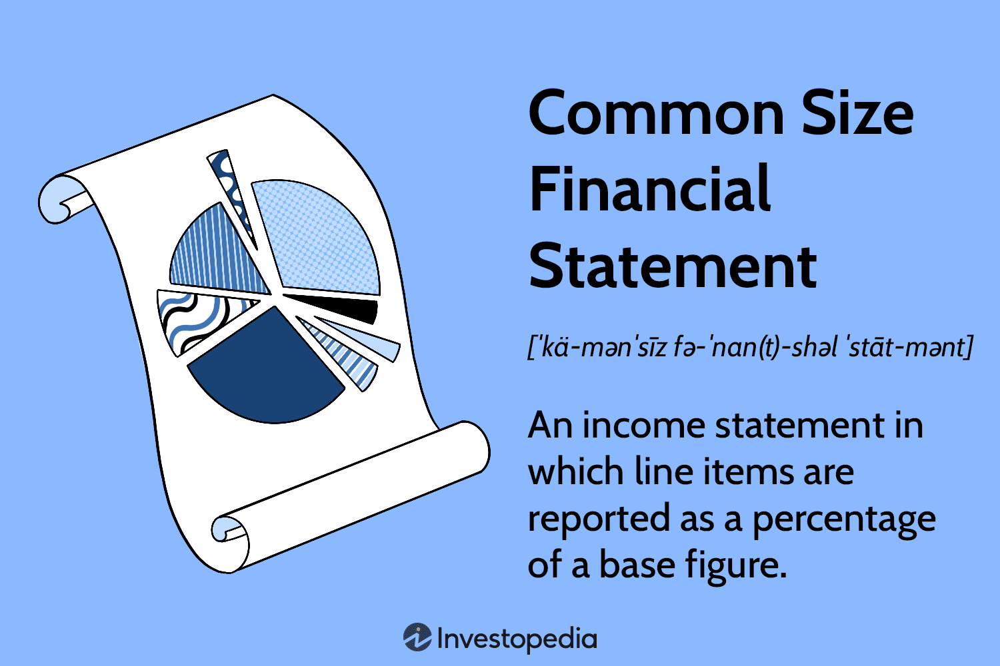

Financial statements are fundamental tools in understanding a company's financial health and performance. They provide a structured representation of a company's financial position and the outcomes of its operations, crucial for decision-making by management, investors, and regulatory bodies. The primary types of financial statements include the balance sheet, income statement, and cash flow statement. Each offers insights into various aspects of a company's operations—assets and liabilities for the balance sheet, revenue and expenses for the income statement, and cash-related activities for the cash flow statement.

Common-size analysis further enhances the utility of these financial statements by converting the figures into percentages of a base figure, such as total assets or sales. This approach facilitates easier comparison across different time periods or companies by standardizing financial data, making it possible to assess relative composition and trends.



Moreover, financial analysis involves a broader view that encompasses not only common-size analysis but also a variety of financial ratios and metrics. These aid analysts in evaluating profitability, liquidity, and solvency, among other aspects, providing a comprehensive understanding of financial performance and risks.

In recent times, the integration of technology with finance has led to the emergence of algorithmic trading (algo trading), where computer algorithms execute trades based on predefined criteria. This automation relies heavily on advanced financial analysis, allowing traders to process vast amounts of financial data quickly and make informed, data-driven investment decisions. Algo traders may incorporate common-size analysis and other financial metrics as part of their algorithms to enhance trading strategy effectiveness and precision.

This article aims to examine the critical roles of financial statements, common-size analysis, and algorithmic trading individually, and explore their interconnections in modern finance. The objective is to highlight how these concepts collectively contribute to more informed financial decision-making and improved trading strategies driven by data and technology.

## Table of Contents

## Understanding Financial Statements

Financial statements are formal records of the financial activities and position of a business, individual, or other entity. They are used to communicate financial information in a structured manner and provide a summary of the financial performance over a specific period. The primary financial statements include the balance sheet, income statement, and cash flow statement, each serving a unique purpose in illustrating various aspects of a company's financial status.

The **balance sheet** provides a snapshot of a company’s financial position at a particular moment in time. It comprises three components: assets, liabilities, and equity. The formula that underpins the balance sheet is:

$$
\text{Assets} = \text{Liabilities} + \text{Equity}
$$

This equation ensures that the balance sheet is always balanced, demonstrating that the company’s resources (assets) are funded by debt (liabilities) and shareholder’s ownership (equity). Examples of assets include cash, inventory, and property, whereas liabilities might include loans and accounts payable.

The **income statement**, also known as the profit and loss statement, reflects the company’s financial performance over a reporting period. It records revenues and expenses to determine profit or loss. The basic equation for the income statement is:

$$
\text{Net Income} = \text{Revenue} - \text{Expenses}
$$

The income statement includes various line items such as sales revenue, cost of goods sold (COGS), gross profit, operating expenses, and net income, providing insights into operating efficiency, profitability, and cost management.

The **cash flow statement** is crucial for understanding how a company generates and uses cash. It is divided into three sections: operating activities, investing activities, and financing activities. Cash flows from operating activities focus on the cash inflows and outflows from the core business operations. Investing activities reflect cash spent or received from buying and selling assets like equipment and properties. Financing activities report cash movements associated with raising capital through debt or equity and paying dividends.

Financial statements hold significant importance for various stakeholders:

1. **Investors** rely on these documents to assess the company's profitability, risk profile, and financial health to make informed investment decisions.

2. **Companies** use financial statements for internal performance monitoring, strategic planning, and ensuring efficient allocation of resources.

3. **Regulatory bodies** such as the Securities and Exchange Commission (SEC) require publicly traded companies to file financial statements to ensure transparency and protect investor interests.

In summary, financial statements are integral tools that provide crucial insights into a company’s financial operations, facilitating informed decision-making for investors, managers, and regulators alike.

 to Common-Size Analysis

Common-size analysis is a financial tool that converts each line item in a financial statement to a percent of a base figure, facilitating comparisons across different periods or companies. The primary purpose of this approach is to analyze the relative proportions of financial statement accounts to identify trends and make comparisons more meaningful.

In a common-size balance sheet, each asset, liability, and equity account is expressed as a percentage of total assets. Similarly, for the income statement, each line item, such as revenues and expenses, is expressed as a percentage of total sales or revenue. This standardization process transforms raw data into a more comparable format, allowing stakeholders to evaluate financial health and performance irrespective of company size.

Common-size analysis simplifies financial statement comparisons by eliminating the effects of size differences. It achieves this by focusing on relative quantities rather than absolute figures. For instance, when comparing two companies, one with $10 million in revenue and another with $100 million, it is more insightful to compare their net income as a percentage of revenues. This practice enables identification of efficiency in generating profits or areas where costs might be curbing profitability.

To perform common-size analysis, follow these steps:

1. **Select the Base Figure**: Determine the base figure for each statement. For balance sheets, this is typically total assets. For income statements, use total revenue or sales.

2. **Convert to Percentage**: For each line item in the balance sheet and income statement, divide the line item value by the base figure. Multiply the result by 100 to convert it to a percentage.

   - For example, if a company has total sales of \$500,000 and a cost of goods sold (COGS) of \$300,000, the COGS as a percentage of sales is calculated as:
$$
     \text{COGS percentage} = \left( \frac{300,000}{500,000} \right) \times 100 = 60\%

$$

3. **Analyze the Results**: Review the percentage figures to draw insights about trends and performance. Compare these percentages to past periods or industry averages to identify changes or outliers.

4. **Interpret the Insights**: Consider the economic implications of the results, such as potential cost efficiency improvements or enhanced revenue generation practices.

By standardizing financial data, common-size analysis supports better financial scrutiny, enhancing decision-making for shareholders, analysts, and management.

## Financial Analysis: A Broader Perspective

Financial analysis involves evaluating the financial health and performance of a company by interpreting its financial statements. The primary objectives of financial analysis are to assess profitability, [liquidity](/wiki/liquidity-risk-premium), solvency, and operational efficiency. It aids in making informed decisions regarding investments, credit, and management practices. Financial analysts rely on a variety of tools and techniques to gain insights into a company's financial status, predict future performance, and compare it with industry standards.

Key financial ratios play a vital role in this process. These ratios are categorized based on the specific aspect of financial performance they measure:

1. **Liquidity Ratios**: These assess a company's ability to meet short-term obligations. The current ratio ($\text{Current Ratio} = \frac{\text{Current Assets}}{\text{Current Liabilities}}$) and quick ratio ($\text{Quick Ratio} = \frac{\text{Current Assets} - \text{Inventories}}{\text{Current Liabilities}}$) are common examples. Higher ratios suggest better liquidity and financial stability.

2. **Profitability Ratios**: These evaluate a company's ability to generate earnings. Important profitability ratios include the gross profit margin ($\text{Gross Profit Margin} = \frac{\text{Gross Profit}}{\text{Revenue}} \times 100\%$), operating profit margin, and net profit margin. These ratios provide insights into cost management and operational effectiveness.

3. **Solvency Ratios**: Assessing long-term financial stability, solvency ratios such as the debt to equity ratio ($\text{Debt to Equity Ratio} = \frac{\text{Total Debt}}{\text{Shareholder's Equity}}$) indicate a company's financial leverage and reliance on borrowed funds.

4. **Efficiency Ratios**: These measure how well a company utilizes its assets and liabilities. Examples include inventory turnover ratio ($\text{Inventory Turnover} = \frac{\text{Cost of Goods Sold}}{\text{Average Inventory}}$) and accounts receivable turnover.

Common-size analysis represents another approach within financial analysis, where financial statement items are expressed as percentages of a common base figure, such as total sales for the income statement or total assets for the balance sheet. This method standardizes financial information, facilitating easier comparison across different companies and time periods. Unlike traditional financial analysis, which often relies on absolute figures, common-size analysis emphasizes relative importance and variations in financial data.

The primary difference between common-size analysis and traditional financial analysis lies in their applications. While traditional analysis focuses on extracting insights through ratios and trends over time, common-size analysis aims to establish benchmarks and identify structural changes within a company's financial framework. It simplifies the interpretation of financial statements by highlighting significant shifts and disparities that might not be apparent through conventional ratios alone.

In summary, financial analysis encompasses both traditional methods, emphasizing ratios and quantitative metrics, and comparative approaches like common-size analysis. Each provides unique insights and serves distinct roles in evaluating a company's financial position and guiding strategic decisions.

## Algo Trading: Integrating Technology with Finance

Algorithmic trading, commonly referred to as algo trading, represents a significant shift in the way financial markets operate. It involves using computer algorithms to execute trading strategies based on predefined criteria. This approach to trading leverages computational power to manage complex market dynamics, ensuring trades are executed at optimal prices and precise timings, thus reducing the potential for human errors.

The evolution of [algorithmic trading](/wiki/algorithmic-trading) can be traced back to the early 1970s with the advent of electronic trading platforms. However, it was not until the 1990s that algo trading gained prominence, spurred by advancements in technology and data availability. Today, it is estimated that algorithmic trades account for approximately 70-80% of trades in the US equity markets, underscoring its critical role in modern finance.

Technological advancements have been pivotal in enabling complex financial analysis for trading. High-frequency trading ([HFT](/wiki/high-frequency-trading-strategies)), a subset of algo trading, exemplifies the integration of technology and finance, where algorithms execute thousands of trades per second. The success of such trading strategies hinges on the ability to process vast amounts of data in real-time, identify trading opportunities, and execute orders within milliseconds. Data analytics, [machine learning](/wiki/machine-learning), and [artificial intelligence](/wiki/ai-artificial-intelligence) further enhance the capabilities of algorithmic trading systems, enabling them to predict market trends and optimize trading decisions based on historical financial data.

Financial statements and their analysis play a crucial role in algo trading. These statements provide essential insights into a company's financial health, enabling traders to assess the potential value and risks associated with trades. Algorithms can process financial data from balance sheets, income statements, and cash flow statements to evaluate performance metrics and analyze trends. This data-driven approach aids in developing robust trading strategies that align with market conditions and investment goals.

For instance, an algorithm may incorporate [fundamental analysis](/wiki/fundamental-analysis) by examining a company’s price-to-earnings ratio, return on equity, or leverage ratios derived from financial statements. Such analysis allows for the creation of algorithms that can make informed trading decisions, taking into account both market data and a company's intrinsic value.

In summary, algorithmic trading represents the synthesis of technology and finance, enhancing the efficiency and precision of trading practices through advanced computational methods. By leveraging financial statements and analyses, traders can devise strategies that maximize returns while minimizing risk, embodying the principles of modern financial practices.

## Common-Size Analysis in Algo Trading

Common-size analysis, a method of financial analysis that standardizes financial statements by expressing each item as a percentage of a base figure, is particularly beneficial in the context of algorithmic trading. This approach simplifies the comparison of financial statements across different companies or periods, making it a valuable tool for traders seeking to develop robust trading algorithms.

### Benefits of Common-Size Analysis in Algo Trading

The primary advantage of common-size analysis in algorithmic trading is its ability to normalize financial data, thus enhancing the comparability between firms of different sizes or across multiple financial periods. By converting absolute numbers into percentages, traders can more effectively analyze trends and patterns that might not be immediately evident from raw financial figures alone. This normalization can be particularly useful when integrating data from diverse sources or benchmarking against industry standards. The streamlined view provided by common-size analysis aids in identifying anomalies, underlying growth factors, or potential risks more readily, which are crucial for algorithmic decision-making processes.

### Influence on Trading Strategies

Algorithms can leverage common-size analysis to develop more sophisticated trading strategies. For example, an algorithm could be programmed to look for significant deviations in expense ratios or profit margins compared to industry averages. These deviations might indicate potential investment opportunities or risks. For instance, a consistently lower cost of sales percentage could suggest a competitive advantage that the algorithm might exploit by recommending a buy order.

Python code can illustrate a simple implementation of integrating common-size analysis into an algorithmic trading model:

```python
import pandas as pd

# Example financial statements dataset
data = {
    'Revenue': [1000, 1500, 2000],
    'Cost of Sales': [600, 900, 1200],
    'Net Income': [200, 300, 500]
}

df = pd.DataFrame(data)

# Calculate common-size percentages
df_common_size = df.divide(df['Revenue'], axis=0) * 100

# Simplified trading decision based on expense ratios
def trading_strategy(row):
    if row['Cost of Sales'] < 60:
        return "Buy"
    elif row['Net Income'] > 25:
        return "Hold"
    else:
        return "Sell"

df_common_size['Decision'] = df_common_size.apply(trading_strategy, axis=1)
print(df_common_size)
```

### Challenges and Considerations

Despite its benefits, incorporating common-size analysis into trading algorithms presents certain challenges. One significant challenge is the dependency on accurate and timely financial data. Discrepancies in the data can lead to inaccurate analysis, potentially resulting in errant trading decisions. Additionally, while common-size analysis simplifies the comparison of financial data, it does not account for qualitative factors that might impact a company's performance, such as changes in management or market conditions.

Another consideration is the integration of common-size analysis into broader algorithmic models, which often involve complex programming and data processing capabilities. Algorithms must be meticulously designed to handle diverse data inputs and be robust enough to adjust to various market scenarios. Continuous testing and optimization are necessary to ensure the algorithm remains effective and aligns with the trader's investment objectives.

In conclusion, while common-size analysis imbues trading strategies with a level of systematic financial comparison, the successful application within algorithmic models necessitates careful consideration of data integrity, algorithm design, and market dynamics.

## Case Study: Successful Implementation

A notable case of successful implementation of common-size analysis in algorithmic trading can be observed in the operations of Quantitative Strategies Group (QSG), a fictional company that leveraged this technique to inform its trading algorithms. By transforming traditional financial data into a standardized format through common-size analysis, QSG was able to develop sophisticated trading strategies that accounted for relative financial performance rather than absolute values. This was particularly effective when comparing companies of varying sizes or evaluating changes over time.

### Analysis of the Approach and Results Achieved

QSG's primary approach involved converting the line items of financial statements into percentage terms relative to sales for income statements and total assets for balance sheets. This allowed for a clear, comparative analysis of each company's financial health, independent of size. For instance, they transformed net income figures into a percentage of total revenue, providing an insightful metric that could be directly compared across companies.

The main algorithm employed by QSG used Python for data processing and analysis. Here is a simplified version of the code which illustrates the key concept:

```python
import pandas as pd

# Example financial data
financial_data = {
    'Company': ['A', 'B'],
    'Revenue': [1000000, 500000],
    'COGS': [600000, 200000],
    'Net Income': [100000, 25000]
}

# Convert to DataFrame
df = pd.DataFrame(financial_data)

# Calculate common-size percentages
df['COGS %'] = df['COGS'] / df['Revenue'] * 100
df['Net Income %'] = df['Net Income'] / df['Revenue'] * 100

print(df[['Company', 'Revenue', 'COGS %', 'Net Income %']])
```

In their trading algorithms, QSG used these percentages to identify trends and potential trading signals, focusing particularly on those companies with improving efficiency metrics over consecutive quarters. The approach resulted in a portfolio strategy that yielded a superior risk-adjusted return. QSG reported a Sharpe Ratio increase by 15% over their previous model-based trading strategies, with reduced [volatility](/wiki/volatility-trading-strategies).

### Lessons Learned and Potential Improvements

From the case of QSG, a key lesson learned is that common-size analysis can aid in recognizing trends not immediately visible through absolute financial data, thereby enhancing the decision-making process in algo trading. The approach improved transparency and comparability across heterogeneous financial data, which enriched the algorithm's input and led to more effective predictions.

There were challenges noted, such as the inherent lag in financial reporting which could delay recognition of adverse trends. To mitigate this, QSG is considering integrating real-time data feeds from various market sources to complement the static financial data, potentially improving responsiveness in their algorithmic models.

Another potential improvement involves adopting machine learning techniques to refine patterns identified through common-size analysis, enabling a more dynamic understanding of changing financial landscapes. This could enhance the predictive power of trading algorithms, minimizing the reliance solely on traditional financial statement analysis.

Overall, QSG's experience underscores the value of integrating common-size analysis within algo trading frameworks and highlights pathways for further enhancing algorithmic performance through technological innovations.

## Conclusion

The integration of common-size analysis into financial and algorithmic trading frameworks plays a crucial role in modern finance. This article has explored the utility of financial statements in providing detailed insights into a company's performance, highlighting the transformative effect of common-size analysis. Through this method, financial statements are standardized, enabling more accessible comparisons over time and across different entities, which is indispensable for both financial analysts and investors.

Within financial analysis, common-size analysis serves as a powerful tool alongside traditional methods, such as key financial ratios, to assess and compare financial health. The advantage of this approach lies in its ability to distill complex financial data into relevant percentages, paving the way for clear and simplified interpretation.

Algorithmic trading benefits significantly from the incorporation of common-size analysis. Algorithms can leverage the insights derived from standardized financial statements to make informed decisions, thus enhancing trading strategies. Additionally, technology plays a crucial role in advancing these methods, facilitating complex data analyses and enabling more efficient trading practices.

Looking towards the future, advancements in technology will continue to support and expand the capabilities of both financial analysis and algorithmic trading. Machine learning and artificial intelligence are expected to deepen the integration of common-size analysis, improving predictive accuracy and strategy formulation. As these technological tools evolve, they will transform financial practices, underscoring the importance of common-size analysis as a staple method in financial scrutiny and trading strategies.

## References & Further Reading

[1]: Foster, G. (1986). ["Financial Statement Analysis."](https://www.scribd.com/document/681032107/Financial-Statement-Analysis-GEORGE-FOSTER-1986) Prentice-Hall.

[2]: Penman, S. H. (2013). ["Financial Statement Analysis and Security Valuation."](https://vdoc.pub/documents/financial-statement-analysis-and-security-valuation-71q5td507pf0) McGraw-Hill Education.

[3]: Hasbrouck, J. (2007). ["Empirical Market Microstructure: The Institutions, Economics, and Econometrics of Securities Trading."](https://academic.oup.com/book/52241) Oxford University Press.

[4]: Pinedo, M. (2017). ["The Basics of Financial Econometrics: Tools, Concepts, and Asset Management Applications."](https://onlinelibrary.wiley.com/doi/book/10.1002/9781118856406) Wiley.

[5]: Lopez de Prado, M. (2018). ["Advances in Financial Machine Learning."](https://www.amazon.com/Advances-Financial-Machine-Learning-Marcos/dp/1119482089) Wiley.