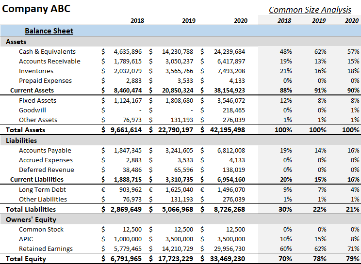

The dynamic world of finance requires a robust understanding of financial statements and their application across various sectors. One prevailing financial statement is the balance sheet, which is crucial for understanding a company's financial health. It offers a snapshot of what a company owns and owes, spotlighting its assets, liabilities, and shareholders' equity at a specific point in time.

In this article, we focus on balance sheet common size financial analysis and its significant role in algorithmic trading. Common size analysis transforms balance sheets by expressing each line item as a percentage of total assets, facilitating insightful comparisons across different companies, regardless of size. This analysis enables financial analysts to discern underlying trends and structural anomalies within a company's financial architecture.



In the context of algorithmic trading, balance sheets furnish quantitative data that fuel algorithms designed to interpret and forecast market trends. Trading strategies leverage balance sheet data to craft algorithms that predict financial outcomes, manage risks, and optimize decision-making. The precision of this approach is underpinned by rigorous mathematical models and computational techniques aimed at interpreting large datasets.

As financial markets become increasingly computerized, a profound comprehension of how balance sheets can be harnessed to automate trading processes is indispensable. This article aims to illuminate the methods by which financial analysts exploit balance sheet data to drive informed trading decisions and advance automated trading strategies.

## Table of Contents

## Understanding Balance Sheets

A balance sheet is a fundamental financial statement that provides a snapshot of a company's financial condition at a specific point in time. It is structured into three primary components: assets, liabilities, and shareholders' equity. Each of these components plays a critical role in financial analysis.

Assets represent the resources owned by the company. They are divided into current and non-current assets. Current assets are those that are expected to be converted into cash or used up within one year, such as cash, accounts receivable, and inventory. Non-current assets, also known as long-term assets, include property, plant, equipment, and intangible assets, which are intended for use over a longer period.

Liabilities are obligations that the company must settle, which are also categorized as current and non-current. Current liabilities are those debts or obligations that are due within one year, such as accounts payable, short-term debt, and other accrued liabilities. Non-current liabilities, or long-term liabilities, are obligations that are due after one year; examples include bonds payable and long-term lease obligations.

Shareholders’ equity represents the residual interest in the assets of the company after deducting liabilities. It includes components such as paid-in capital (the amount invested by shareholders), retained earnings (the accumulated profits that have not been distributed as dividends), and other equity items like treasury stock or reserves.

The balance sheet is anchored by the fundamental accounting equation: 

$$
\text{Assets} = \text{Liabilities} + \text{Shareholders' Equity}
$$

This equation must always balance, meaning the resources owned by the company (assets) are financed by its obligations (liabilities) and the investment of its owners (equity). A balance sheet's analysis provides essential insights into the company’s [liquidity](/wiki/liquidity-risk-premium), financial flexibility, and overall financial health, making it an indispensable tool for investors, creditors, and management alike.

## Common Size Balance Sheets and Financial Analysis

Common size balance sheets are a powerful tool in financial analysis, offering a normalized format where each line item is expressed as a percentage of total assets. This approach enables analysts to gain deeper insights into a company’s financial structure by highlighting trends and facilitating comparisons.

In practice, a common size balance sheet allows analysts to compare financial statements of companies regardless of their size. This is achieved because each item is scaled relative to total assets, making it easier to spot proportions and structural differences. For instance, a smaller company might have a similar percentage of current assets compared to a larger firm, even though the absolute figures differ significantly. By using a common size approach, financial analysts can observe patterns and make meaningful comparisons that transcend scale.

The advantages of using common size analysis are numerous, one of which is trend analysis. By evaluating changes in the percentages over time, analysts can detect underlying financial trends that may indicate shifts in a company’s strategy or market conditions. For example, an increasing proportion of inventories relative to total assets might suggest either a strategic initiative to increase market share or potential issues with overproduction.

Another significant advantage is cross-company comparison. Suppose an analyst is tasked with assessing two competitors in the same industry; the common size balance sheet provides a clear, normalized basis for comparison. It sheds light on how each company allocates its resources and the efficiency of their asset utilization. This comparison helps in identifying companies that are potentially better managed or strategically positioned.

Ultimately, common size balance sheets are essential in efficient financial analysis, allowing for intricate trend analyses and facilitating robust cross-company comparisons with clarity and precision.

## Applications in Financial Statement Accounting

Ratio analysis plays a crucial role in interpreting balance sheet data by providing a framework for assessing a company's financial stability, profitability, and operational efficiency. Ratios distilled from balance sheets, such as liquidity ratios, solvency ratios, and profitability ratios, help stakeholders derive meaningful insights into a company's financial performance.

Liquidity ratios, such as the current ratio and quick ratio, are derived by comparing a company's current assets to its current liabilities. The current ratio, calculated as $\text{Current Ratio} = \frac{\text{Current Assets}}{\text{Current Liabilities}}$, measures a company's ability to pay its short-term obligations. A higher ratio implies better liquidity, indicating that the company can cover its short-term liabilities with its short-term assets.

Solvency ratios, like the debt-to-equity ratio, assess a company's long-term financial sustainability by comparing its total liabilities to its shareholders' equity. The debt-to-equity ratio is given by $\text{Debt-to-Equity Ratio} = \frac{\text{Total Liabilities}}{\text{Shareholders' Equity}}$. A lower ratio suggests that a company is less reliant on debt, which is considered favorable.

Profitability ratios, such as return on equity (ROE) and return on assets (ROA), evaluate a company's ability to generate profits from its resources. ROE, calculated as $\text{ROE} = \frac{\text{Net Income}}{\text{Shareholders' Equity}}$, shows how effectively management is using shareholders' capital to generate profits. ROA, on the other hand, is defined as $\text{ROA} = \frac{\text{Net Income}}{\text{Total Assets}}$, highlighting how effectively a company's assets are used to produce net income.

Balance sheets are intrinsically linked with other financial statements like income statements and cash flow statements. The income statement provides data on revenue, expenses, and profits over a period, which ultimately affects the equity section of the balance sheet through retained earnings. Similarly, cash flow statements detail the inflows and outflows of cash, affecting both the assets and liabilities sections of the balance sheet. These interrelationships are crucial for comprehensive financial analysis, as they provide a full view of a company's financial activities.

Common practices in financial accounting emphasize the accuracy and reliability of balance sheet assessments. Accurate balance sheets are fundamental for making informed business decisions, attracting investors, and fulfilling legal requirements. Proper accounting standards, like International Financial Reporting Standards (IFRS) or Generally Accepted Accounting Principles (GAAP), ensure consistency and comparability of financial statements across different companies and jurisdictions.

Incorporating accurate balance sheet assessments helps identify potential red flags such as unmanageable debt levels or insufficient working capital, enabling companies to take necessary corrective actions. Thus, accurate balance sheet data is essential not only for internal management but also for external stakeholders like investors, creditors, and regulatory authorities, who assess a company's financial viability and investment potential.

## Role of Balance Sheets in Algorithmic Trading

Algorithmic trading integrates financial data with advanced computational algorithms to automate trading decisions and optimize investment strategies. A key input in these algorithms is balance sheet data, which provides critical insights into a company's financial health that can inform trading strategies and forecast market trends. 

Balance sheet ratios are essential in this process, especially liquidity and solvency ratios. The liquidity ratio, expressing a company's ability to meet its short-term obligations, is calculated using the formula:

$$
\text{Current Ratio} = \frac{\text{Current Assets}}{\text{Current Liabilities}}
$$

A higher current ratio often indicates a healthier liquidity position, making a company more attractive for short-term trades. Solvency ratios, such as the debt-to-equity ratio, give insight into a company's long-term sustainability and financial leverage, using the formula:

$$
\text{Debt-to-Equity Ratio} = \frac{\text{Total Liabilities}}{\text{Shareholders' Equity}}
$$

This ratio is vital in assessing how much a company relies on debt financing, which can impact its vulnerability to market [volatility](/wiki/volatility-trading-strategies).

The strategic use of balance sheet ratios in [algorithmic trading](/wiki/algorithmic-trading) is not limited to initial strategy development. These ratios also play a critical role in the back-testing phase, where trading algorithms are rigorously tested on historical data to gauge their performance before live deployment. Back-testing ensures that algorithms are not merely hypothetical constructs but rather robust models capable of operating effectively under real market conditions. Historical balance sheet data is used to simulate past scenarios, assessing how different strategies would have performed. This process helps in identifying potential weaknesses and refining algorithms to enhance their predictive accuracy and reliability.

Implementing these strategies in a systematic way can be demonstrated through programming languages like Python. Analysts can script algorithms that automatically retrieve balance sheet data, compute the necessary ratios, and make trading decisions based on predefined conditions. A simple example in Python might involve fetching data using a financial library like Pandas and computing key ratios for a large dataset:

```python
import pandas as pd

# Load balance sheet data
balance_sheet_data = pd.read_csv('balance_sheet.csv')

# Calculate current ratio
balance_sheet_data['Current Ratio'] = balance_sheet_data['Current Assets'] / balance_sheet_data['Current Liabilities']

# Calculate debt-to-equity ratio
balance_sheet_data['Debt-to-Equity Ratio'] = balance_sheet_data['Total Liabilities'] / balance_sheet_data['Shareholders Equity']

# Define a trading signal
balance_sheet_data['Trade Signal'] = balance_sheet_data.apply(lambda x: 'Buy' if x['Current Ratio'] > 1.5 and x['Debt-to-Equity Ratio'] < 1 else 'Sell', axis=1)
```

By leveraging balance sheet analysis alongside algorithmic trading, investors and financial analysts can construct a comprehensive approach that enhances decision-making processes and optimizes return on investments. Such integration not only advances trading precision but also aligns trading strategies with dynamic market conditions.

## Analyzing a Balance Sheet: A Practical Guide

Analyzing a balance sheet is a crucial skill for financial analysts aiming to assess a company's financial health and operational efficiency. This practical guide provides a systematic approach to balance sheet analysis, focusing on key financial ratios and using a well-known company as an example.

### Step-by-Step Guide

1. **Understanding the Balance Sheet Components:**
   - **Assets:** Resources owned by a company, classified as current (convertible to cash within a year) or non-current (long-term).
   - **Liabilities:** Obligations owed to outsiders, split into current (due within a year) and long-term.
   - **Shareholders’ Equity:** The residual interest in the assets of the entity after deducting liabilities. It includes common stock, retained earnings, and additional paid-in capital.

2. **Key Financial Ratios:**
   Financial ratios derived from balance sheets offer insights into a company's liquidity, leverage, and operational efficiency.

   - **Current Ratio:** Evaluates liquidity by comparing current assets to current liabilities. 
$$
     \text{Current Ratio} = \frac{\text{Current Assets}}{\text{Current Liabilities}}

$$
     A ratio above 1 indicates that the company has more assets than liabilities in the short term.

   - **Debt-to-Equity Ratio:** Measures financial leverage and risk by comparing total liabilities to shareholders' equity.
$$
     \text{Debt-to-Equity Ratio} = \frac{\text{Total Liabilities}}{\text{Shareholders’ Equity}}

$$
     A higher ratio suggests more risk, as the company relies heavily on external financing.

   - **Asset Turnover Ratio:** Assesses operational efficiency by showing the revenue generated for every dollar of assets.
$$
     \text{Asset Turnover Ratio} = \frac{\text{Net Sales}}{\text{Average Total Assets}}

$$
     A higher asset turnover indicates effective use of assets to generate sales.

3. **Practical Application Example: Analyzing Apple's Balance Sheet**

   To provide a practical understanding, let's examine Apple's balance sheet for insights:

   - **Current Ratio Analysis:**
     Suppose Apple's balance sheet shows current assets of $162 billion and current liabilities of $105 billion. The current ratio calculation would be:
$$
     \text{Current Ratio} = \frac{162}{105} \approx 1.54

$$
     This ratio indicates a comfortable liquidity position, suggesting Apple can cover its short-term obligations.

   - **Debt-to-Equity Ratio Analysis:**
     If Apple's total liabilities are $258 billion and shareholders’ equity is $90 billion, the debt-to-equity ratio would be:
$$
     \text{Debt-to-Equity Ratio} = \frac{258}{90} \approx 2.87

$$
     This higher ratio reflects significant leverage, which may imply risk but also potential for higher returns.

   - **Asset Turnover Ratio Analysis:**
     Assuming net sales are $260 billion and average total assets are $320 billion, the asset turnover ratio is:
$$
     \text{Asset Turnover Ratio} = \frac{260}{320} \approx 0.81

$$
     This lower ratio suggests room for improvement in generating sales from assets, perhaps indicating overinvestment or inefficiencies.

### Conclusion

Analyzing a balance sheet involves more than computing ratios; it requires contextual understanding of industry norms and company strategies. Financial analysts must interpret these ratios in light of broader economic conditions and company-specific factors to make informed decisions. This guide illustrates how consistent application of balance sheet analysis can lead to actionable insights and strategic advantages.

## Conclusion

Balance sheets play a crucial role in financial analysis and algorithmic trading by providing a comprehensive overview of a company's financial health. These financial statements detail the assets, liabilities, and shareholders' equity at a specific point in time, forming the foundation for evaluating a company’s ability to generate future economic benefits. Understanding and interpreting balance sheet data allows investors and financial analysts to assess solvency, liquidity, and capital structure, thereby informing more strategic investment decisions.

An in-depth analysis of balance sheet data, particularly through common size and ratio analyses, enables the comparison of companies of different sizes, facilitating more accurate benchmarking and trend projections. Ratios derived from the balance sheet, such as the current ratio or debt-to-equity ratio, are pivotal in evaluating the firm's financial stability and efficiency, particularly in the context of structuring algorithmic trading strategies. These ratios help in predicting market behavior and executing trades based on predefined criteria.

With the advent of sophisticated financial technologies, the future of balance sheet analysis is set to become more analytical and precise. Emerging trends include the use of [machine learning](/wiki/machine-learning) algorithms to predict financial outcomes based on pattern recognition and historical data analysis. Advanced data analytics platforms are being developed to provide real-time balance sheet interpretation, offering dynamic risk assessment and more responsive trading strategies. As these technologies evolve, the ability to automate data collection and integrate multiple financial metrics will significantly enhance the depth and accuracy of financial analysis and algorithmic trading. 

Understanding the integral aspects of balance sheets will remain essential, ensuring that investors and algorithm designers can leverage these documents for better decision-making and optimized trading performances. As the field progresses, staying abreast of financial technology advancements will be critical to harnessing the full potential of balance sheet analysis techniques.

## FAQs

### FAQs

**What are the differences between balance sheets and other financial statements like income and cash flow statements?**

Financial statements provide insights into different aspects of a company’s financial performance and health. A balance sheet is a financial statement that summarizes a company's assets, liabilities, and shareholders' equity at a specific point in time. It represents the financial position of the company and follows the equation:

$$
\text{Assets} = \text{Liabilities} + \text{Shareholders' Equity}
$$

In contrast, an income statement details the company’s revenues and expenses over a specific period, illustrating how the revenues transform into net income or loss, following the equation:

$$
\text{Net Income} = \text{Revenue} - \text{Expenses}
$$

The cash flow statement provides a summary of cash inflows and outflows from operations, financing, and investing activities over a period. It reconciles the beginning and ending cash balances:

$$
\text{Cash Flow} = \text{Operational Cash} + \text{Investing Cash} + \text{Financing Cash}
$$

Together, these financial statements offer a comprehensive overview of a company's financial health but focus on different financial dimensions: balance sheets provide a static snapshot, income statements depict performance over time, and cash flow statements track cash movements.

**What is the significance of balance sheet analysis in predicting market movements and risk management?**

Balance sheet analysis is instrumental in assessing a company’s financial stability and capacity to manage debts and operations effectively, which can, in turn, influence stock valuations and investor sentiment. By evaluating key metrics such as liquidity ratios (e.g., current ratio) and leverage ratios (e.g., debt-to-equity ratio), investors can gauge a firm's ability to meet short-term obligations and overall debt burden respectively. 

Conducting a thorough balance sheet analysis allows analysts to anticipate potential risks and opportunities. For example:

- **Liquidity analysis** helps in understanding how well the company can handle financial distress.
- **Solvency analysis** provides insights into long-term financial viability, which is crucial for risk management.
- **Asset management ratios**, like asset turnover, give an idea of operational efficiency, which may impact future earnings.

In algorithmic trading, balance sheets are used to generate predictive models for stock prices. Algorithms may incorporate financial ratios derived from balance sheets to forecast market trends or volatility:

```python
def calculate_ratios(balance_sheet):
    current_ratio = balance_sheet['current_assets'] / balance_sheet['current_liabilities']
    debt_to_equity = balance_sheet['total_liabilities'] / balance_sheet['shareholders_equity']
    return current_ratio, debt_to_equity

balance_sheet = {'current_assets': 500000, 'current_liabilities': 300000, 'total_liabilities': 200000, 'shareholders_equity': 100000}
current_ratio, debt_to_equity = calculate_ratios(balance_sheet)
```

This data-driven approach enhances risk management by providing data-backed insights into financial stability, allowing traders to make informed decisions to minimize potential losses and maximize gains.

## References & Further Reading

1. **"Financial Statement Analysis" by Martin S. Fridson and Fernando Alvarez**: This comprehensive text provides a thorough introduction to financial statement analysis, offering insights into interpreting balance sheets and other financial documents to evaluate a company's performance. It's a valuable resource for understanding the nuances of financial data and how it impacts decision-making in finance.

2. **"Fundamentals of Corporate Finance" by Richard A. Brealey, Stewart C. Myers, and Alan J. Marcus**: A staple in finance education, this book covers the essential concepts of corporate finance, including financial statements and their analysis. It is particularly useful for understanding the theoretical and practical aspects of financial management.

3. **"Algo Trading: Winning Strategies and Their Rationale" by Ernest P. Chan**: This book demystifies the complexities of algorithmic trading, offering practical strategies and the rationale behind them. It discusses the role of financial statements, including balance sheets, in developing trading algorithms that can predict and capitalize on market movements.

4. **"Python for Finance: Analyze Big Financial Data" by Yves Hilpisch**: As Python has become a leading programming language in finance, this book is an essential guide to applying Python in financial data analysis and algorithmic trading. It offers insights into using balance sheet data to automate trading decisions and enhance financial analysis.

5. **"Analysis of Financial Statements" by Leopold A. Bernstein and John J. Wild**: This book provides a strong foundation in analyzing financial statements to assess a company's financial health and performance components. It includes tools and techniques useful in identifying trends and making cross-company comparisons.

6. **"Algorithmic Trading and DMA: An Introduction to Direct Access Trading Strategies" by Barry Johnson**: This resource covers the principles of algorithmic trading, including statistical models and back-testing methods. It emphasizes incorporating financial ratios from balance sheets into trading strategies for more informed decision-making.

7. **Articles from the Journal of Financial and Quantitative Analysis**: This peer-reviewed journal publishes cutting-edge research on various aspects of financial analysis, including studies on the applications of balance sheets in trading and investment strategies.

8. **"Financial Modeling" by Simon Benninga**: This book covers practical aspects of financial modeling using Excel and VBA, offering case studies and examples that incorporate balance sheet data. It's an excellent resource for those looking to apply balance sheet analysis in realistic financial scenarios.

By exploring these resources, readers can expand their knowledge of financial analysis and enhance their understanding of how balance sheets play a critical role in both traditional and algorithmic trading strategies.