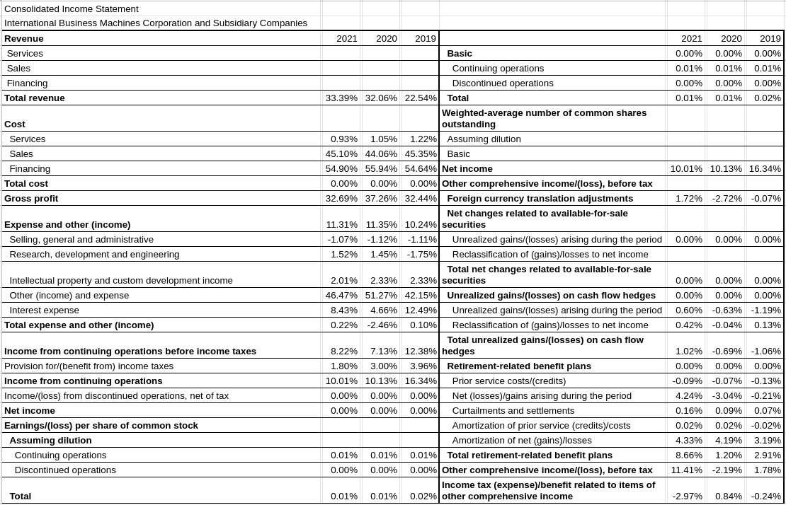

## Table of Contents

## What is a common size financial statement?

A common size financial statement is a way to compare the financial performance of different companies or the same company over different periods. It does this by converting each line of the financial statement into a percentage of a base figure. For example, in an income statement, each line item is shown as a percentage of total sales. This makes it easier to see what parts of the business are growing or shrinking compared to the whole.

These statements are useful for spotting trends and making comparisons. For instance, if you want to compare two companies in the same industry, common size statements help you see which company spends more on research or has higher profit margins. They are also helpful for investors and analysts who want to understand a company's financial health without getting bogged down in large numbers. By using percentages, it's easier to focus on the important parts of the financial data.

## How does a common size financial statement differ from a traditional financial statement?

A common size financial statement and a traditional financial statement show the same financial information but in different ways. A traditional financial statement lists the actual numbers for things like sales, costs, and profits. For example, it might show that a company made $1 million in sales and had $600,000 in costs. This gives you the exact amounts, which can be useful for understanding the total size of the business.

On the other hand, a common size financial statement turns these numbers into percentages. Instead of showing $1 million in sales, it might show that sales are 100%, and costs are 60% of sales. This makes it easier to compare different companies or different years for the same company. You can quickly see that costs are 60% of sales no matter how big the company is, which helps in understanding the business's structure and efficiency.

## Why are common size financial statements useful for financial analysis?

Common size financial statements are useful for financial analysis because they make it easier to compare businesses of different sizes or the same business over different years. By turning all the numbers into percentages, you can see how much each part of the business contributes to the whole. For example, if you want to compare two companies, you can see that one spends 30% of its sales on research while the other spends only 20%. This helps you understand their strategies and where they focus their money.

Another reason they are helpful is that they highlight trends and changes within a company. If you look at common size statements over several years, you might notice that the percentage of sales spent on costs is going up. This could mean the company is becoming less efficient or facing higher costs. By using percentages, it's easier to spot these trends without getting lost in big numbers. This makes it simpler for investors and analysts to make decisions based on the financial health of a company.

## How do you prepare a common size income statement?

To prepare a common size income statement, you start with a regular income statement that shows the actual dollar amounts for things like sales, costs, and profits. Then, you take each line item and divide it by the total sales. For example, if sales are $100,000 and costs are $60,000, you would divide $60,000 by $100,000 to get 60%. You do this for every line on the income statement. The result is that each line item is now shown as a percentage of total sales.

Once you have converted all the numbers into percentages, you have a common size income statement. This new statement makes it easy to see what part of the business is doing well or not so well. For example, if you see that the percentage of sales spent on costs is going up over time, it might mean the business is facing higher costs or becoming less efficient. This type of statement helps you compare your business with others or look at how your business is doing over time, without getting confused by big numbers.

## How do you prepare a common size balance sheet?

To prepare a common size balance sheet, you start with a regular balance sheet that shows the actual dollar amounts for things like assets, liabilities, and equity. Then, you take each line item and divide it by the total assets. For example, if total assets are $500,000 and cash is $50,000, you would divide $50,000 by $500,000 to get 10%. You do this for every line on the balance sheet. The result is that each line item is now shown as a percentage of total assets.

Once you have converted all the numbers into percentages, you have a common size balance sheet. This new statement makes it easy to see what part of the company's assets are tied up in different things, like cash, inventory, or property. It also shows what part of the company is financed by debt versus equity. This type of statement helps you compare your company with others or look at how your company is doing over time, without getting confused by big numbers.

## What are the key components analyzed in a common size financial statement?

In a common size financial statement, the key components analyzed are the percentages of different line items compared to a base figure. For an income statement, the base figure is total sales, so you look at the percentage of sales that goes to costs, expenses, and profits. This helps you see how much of the company's revenue is spent on different things and how much is left as profit. For example, if costs are 60% of sales, it means the company keeps 40% before other expenses.

For a balance sheet, the base figure is total assets, so you analyze the percentages of different assets, liabilities, and equity. This shows you what part of the company's assets are in cash, inventory, or property, and how much of the company is financed by debt or by the owners' equity. By looking at these percentages, you can understand the company's financial structure and see if it's relying more on debt or equity to fund its operations.

These percentages help you compare companies of different sizes or see how one company changes over time. It makes it easier to spot trends, like if costs are going up as a percentage of sales, or if the company is using more debt. This information is useful for investors and managers to make decisions about the company's financial health and strategy.

## How can common size financial statements help in comparing companies of different sizes?

Common size financial statements help in comparing companies of different sizes by turning all the numbers into percentages. When you use percentages, you don't have to worry about how big or small a company is. For example, if one company has sales of $1 million and another has sales of $10 million, it's hard to compare them directly. But if you turn those numbers into percentages, you can see that both companies might spend 60% of their sales on costs. This makes it easy to see how they are similar or different, even though they are different sizes.

Using common size statements, you can also see where each company is spending its money. Maybe one company spends a lot more on research than another, or maybe one company has higher profits as a percentage of sales. These percentages help you understand the business better and see which company might be a better investment. By focusing on the percentages instead of the actual numbers, you can make better comparisons and decisions.

## What are the limitations of using common size financial statements?

Common size financial statements are useful, but they have some limitations. One big problem is that they don't show you the actual dollar amounts. This can be a problem if you need to know the exact size of a company or how much money it's making. For example, if two companies both have costs that are 60% of sales, but one company's sales are $1 million and the other's are $10 million, the second company is spending a lot more money on costs, even though the percentages are the same.

Another limitation is that common size statements can hide important details. They focus on percentages, which can make it hard to see if a small change in a big number is actually important. For example, if a company's sales go up by 1%, that might not seem like a big deal on a common size statement. But if the company's sales are $1 billion, that 1% is actually $10 million, which is a lot of money. So, while common size statements are good for comparing companies, they might not give you the full picture of a company's financial health.

## How can common size financial statements be used to identify trends over time?

Common size financial statements are great for spotting trends over time because they show each part of the business as a percentage of a bigger number. For example, if you look at a company's income statements over several years, you can see if the percentage of sales spent on costs is going up or down. If it's going up, it might mean the company is facing higher costs or becoming less efficient. On the other hand, if the percentage of profits is going up, it could mean the company is doing better at making money.

You can also use common size balance sheets to see how a company's financial structure changes over time. If you notice that the percentage of total assets that is cash is getting smaller, it might mean the company is investing more in other things like property or inventory. Or if the percentage of total assets financed by debt is going up, it could mean the company is borrowing more money. By looking at these percentages over time, you can see how the company is changing and make better decisions about its future.

## What advanced techniques can be applied to common size financial statements for deeper analysis?

One advanced technique for deeper analysis of common size financial statements is trend analysis. This involves looking at the percentages over several years to see how they change. For example, if you see that the percentage of sales spent on costs is slowly going up each year, it might mean the company is facing higher costs or becoming less efficient. You can use graphs or charts to make these trends easier to see. By doing this, you can predict where the company might be headed and make better decisions about its future.

Another technique is ratio analysis. This means using the percentages from the common size statements to calculate different ratios that give you more information about the company's health. For example, you can calculate the profit margin by looking at the percentage of sales that is profit. Or you can find the debt-to-equity ratio by comparing the percentage of total assets financed by debt to the percentage financed by equity. These ratios can help you compare the company to others in the same industry or see how it's doing over time. By using these advanced techniques, you can get a deeper understanding of the company's financial situation.

## How do common size financial statements assist in ratio analysis?

Common size financial statements help in ratio analysis by making it easy to see the percentages of different parts of the business. When you have these percentages, you can use them to calculate important ratios. For example, if you want to know the profit margin, you can look at the percentage of sales that is profit on the common size income statement. This helps you see how much of each dollar in sales turns into profit. You can also find the debt-to-equity ratio by comparing the percentage of total assets financed by debt to the percentage financed by equity on the common size balance sheet. These ratios give you a quick way to understand the company's financial health.

Using common size statements for ratio analysis also helps you compare the company to others in the same industry. If you know the average profit margin for companies in the industry, you can see if the company you're looking at is doing better or worse. This can help you decide if it's a good investment. By looking at these ratios over time, you can also see if the company is getting better or worse at making money or managing its debt. This makes common size financial statements a powerful tool for deeper financial analysis.

## Can common size financial statements be used effectively in different industries, and if so, how?

Common size financial statements can be used effectively in different industries because they help you compare companies no matter their size or the industry they are in. When you turn the numbers into percentages, you can see how much of the company's money goes to different things like costs, profits, or assets. This makes it easier to understand how a company in the tech industry spends its money compared to a company in the retail industry. For example, a tech company might spend a lot more on research and development than a retail company, and common size statements show you this as a percentage of sales.

These statements are also useful for spotting trends within an industry. If you look at common size statements for several companies in the same industry over time, you can see if costs are going up for everyone or if one company is doing better at making profits. This helps you understand the industry better and make smarter decisions about which companies to invest in or how to manage your own business. By focusing on percentages instead of actual numbers, common size financial statements give you a clear picture of how different industries work and how companies within those industries compare to each other.

## What is the key to understanding financial statements?

Financial statements are formal records that convey the business activities and financial performance of an organization. They provide a structured overview of its financial position, including its assets, liabilities, revenue streams, income, and cash flows. These statements are crucial for investors, companies, and regulatory bodies to assess the financial health and performance of an organization over a particular period.

### Balance Sheet

The balance sheet, also known as the statement of financial position, presents the company's financial standing at a specific point in time. It comprises three major components: assets, liabilities, and shareholders' equity.

1. **Assets**: These are the resources owned by the company that are expected to generate future economic benefits. Assets can be classified into current assets, such as cash and accounts receivable, which can be converted into cash within a year, and non-current assets, such as property, plant, and equipment, which are long-term resources.

2. **Liabilities**: These represent the company's obligations to pay debts or provide services in the future. Liabilities can be current, such as accounts payable, due within a year, or long-term, such as bonds payable, due after one year.

3. **Shareholders' Equity**: This is the residual interest in the assets of the company after deducting liabilities. It includes common stock, retained earnings, and additional paid-in capital. The balance sheet follows the accounting equation:
$$
   \text{Assets} = \text{Liabilities} + \text{Shareholders' Equity}

$$

### Income Statement

The income statement, also referred to as the profit and loss statement, outlines the company’s financial performance over a specific period. It highlights revenues, expenses, and net income.

- **Revenues**: These are the total amount of money generated from the company’s operational activities, including sales of goods and services.

- **Expenses**: These encompass all costs incurred during the operation, such as cost of goods sold (COGS), selling and administrative expenses, and depreciation. 

- **Net Income**: This is the profit remaining after all expenses have been deducted from revenues. It is calculated as:
$$
   \text{Net Income} = \text{Revenues} - \text{Expenses}

$$

The income statement is essential for evaluating a company's ability to generate profit from its operations.

### Cash Flow Statement

The cash flow statement provides insights into the cash inflows and outflows from operating, investing, and financing activities over a period. It is vital for understanding how the company generates cash to fund its operations and growth.

- **Operating Activities**: Cash flows from transactions affecting net income, such as cash received from customers and cash paid to suppliers and employees.

- **Investing Activities**: Includes cash flows associated with buying and selling long-term assets and investments.

- **Financing Activities**: Reflects cash flows from transactions with the company’s owners and creditors, such as issuing shares or repaying loans.

### Importance for Stakeholders

Financial statements are indispensable tools for different stakeholders:

- **Investors** use financial statements to assess the profitability, risk, and future prospects of an investment, thus making informed decisions about buying, selling, or holding equity.

- **Companies** rely on these statements for internal planning, performance evaluation, and strategic decision-making. They offer managers insights into operational effectiveness and financial strategy.

- **Regulatory Bodies** ensure financial transparency and adherence to accounting standards, fostering trust and stability in financial markets.

In summary, financial statements are foundational documents that provide a comprehensive view of a company’s financial performance, aiding in effective decision-making for a broad spectrum of stakeholders.

## References & Further Reading

1. **Books and Articles:**
   - Damodaran, A. (2012). *Investment Valuation: Tools and Techniques for Determining the Value of Any Asset*. Wiley. This book provides a comprehensive guide to valuation techniques, essential for understanding financial analysis and investment strategies.
   - Poterba, J. M., & Summers, L. H. (1988). "Mean Reversion in Stock Prices: Evidence and Implications." *Journal of Financial Economics, 22*(1), 27-59. This paper explores statistical behaviors in stock returns, useful for algorithmic trading strategies.
   - Murphy, J. J. (1999). *Technical Analysis of the Financial Markets: A Comprehensive Guide to Trading Methods and Applications*. New York Institute of Finance. An essential resource for understanding market trends and technical indicators in trading.

2. **Academic Journals and Industry Reports:**
   - Lo, A. W. (2004). "The Adaptive Markets Hypothesis: Market Efficiency from an Evolutionary Perspective." *Journal of Portfolio Management, 30*(5), 15-29. This paper presents a new perspective on market efficiency, relevant to algorithmic trading.
   - Arnott, R. D., & Asness, C. S. (2003). "Surprise! Higher Dividends = Higher Earnings Growth." *Financial Analysts Journal, 59*(1), 70-87. This study investigates the relationship between dividend yields and earnings growth.

3. **Online Courses and Educational Platforms:**
   - Coursera offers a course titled "Financial Markets" by Yale University. This course covers basics and advanced concepts in financial analysis.
   - edX offers "Algorithmic Trading and Stocks Essential Training" by the University of California, Berkeley, suitable for those interested in applying financial analysis in trading strategies.
   - Khan Academy provides free resources on financial analysis and economics, laying a strong foundation for beginners.

4. **Further Exploration:**
   - Explore QuantInsti's Executive Programme in Algorithmic Trading (EPAT), which gives comprehensive insights into financial modeling and strategy development.
   - Use the Python library `pandas` for common-size analysis in financial modeling. The standardization of financial statements via pandas can enhance analytical functionality in algorithmic trading:
     ```python
     import pandas as pd

     # Assume df is a DataFrame with financial statement data
     df_common_size = df.apply(lambda x: x / x.sum(), axis=1)
     print(df_common_size.head())
     ```
   - Invest in learning machine learning techniques with platforms like DataCamp or Kaggle to design and optimize trading algorithms, enhancing the potential of automated strategies in financial markets.

