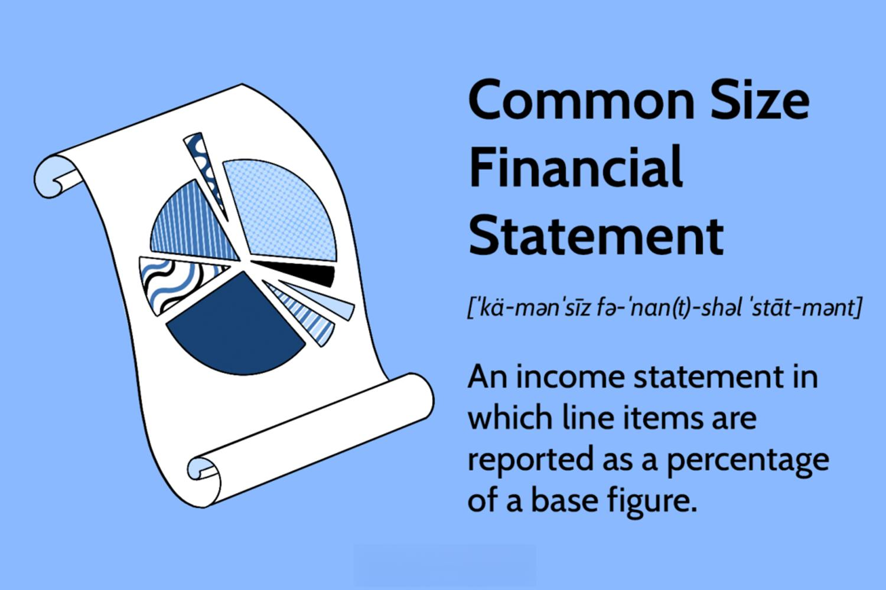

Financial statements, common size analysis, and algorithmic trading are three critical elements shaping the landscape of modern finance. Financial statements serve as foundational documents in financial analysis, providing a structured summary of a company's financial position and performance over a specific period. Typically comprising the balance sheet, income statement, and cash flow statement, these documents are essential for stakeholders such as investors, regulatory bodies, and internal management to assess a company's health and make informed decisions.

Common size analysis is a vital tool for financial analysts seeking to compare different financial periods or companies on an equal footing. By expressing each line item as a percentage of a base figure—such as total assets for a balance sheet or net sales for an income statement—it allows analysts to remove the influence of size differences and focus on underlying trends and disparities. This method enhances the comparability of financial data across time and between different businesses, providing a clearer picture of financial performance and strategic positioning.



Algorithmic trading leverages technology to automate financial trades, capitalizing on speed, precision, and computational power to outperform traditional trading methods. Algorithms rely heavily on advanced financial analysis techniques and make extensive use of data from financial statements to evaluate company value, identify trends, and assess risks. The integration of financial statement analysis into trading algorithms is crucial to crafting effective trading strategies, which can adjust quickly to market movements.

This article explores the interplay between financial statements, common size analysis, and algorithmic trading in modern finance. It highlights how these concepts converge to enhance the efficacy of financial decision-making and trading strategies, contributing significantly to more informed and strategic financial management practices.

## Table of Contents

## Understanding Financial Statements

Financial statements are formal records that convey the business activities and financial performance of an organization. They provide a structured overview of its financial position, including its assets, liabilities, revenue streams, income, and cash flows. These statements are crucial for investors, companies, and regulatory bodies to assess the financial health and performance of an organization over a particular period.

### Balance Sheet

The balance sheet, also known as the statement of financial position, presents the company's financial standing at a specific point in time. It comprises three major components: assets, liabilities, and shareholders' equity.

1. **Assets**: These are the resources owned by the company that are expected to generate future economic benefits. Assets can be classified into current assets, such as cash and accounts receivable, which can be converted into cash within a year, and non-current assets, such as property, plant, and equipment, which are long-term resources.

2. **Liabilities**: These represent the company's obligations to pay debts or provide services in the future. Liabilities can be current, such as accounts payable, due within a year, or long-term, such as bonds payable, due after one year.

3. **Shareholders' Equity**: This is the residual interest in the assets of the company after deducting liabilities. It includes common stock, retained earnings, and additional paid-in capital. The balance sheet follows the accounting equation:
$$
   \text{Assets} = \text{Liabilities} + \text{Shareholders' Equity}

$$

### Income Statement

The income statement, also referred to as the profit and loss statement, outlines the company’s financial performance over a specific period. It highlights revenues, expenses, and net income.

- **Revenues**: These are the total amount of money generated from the company’s operational activities, including sales of goods and services.

- **Expenses**: These encompass all costs incurred during the operation, such as cost of goods sold (COGS), selling and administrative expenses, and depreciation. 

- **Net Income**: This is the profit remaining after all expenses have been deducted from revenues. It is calculated as:
$$
   \text{Net Income} = \text{Revenues} - \text{Expenses}

$$

The income statement is essential for evaluating a company's ability to generate profit from its operations.

### Cash Flow Statement

The cash flow statement provides insights into the cash inflows and outflows from operating, investing, and financing activities over a period. It is vital for understanding how the company generates cash to fund its operations and growth.

- **Operating Activities**: Cash flows from transactions affecting net income, such as cash received from customers and cash paid to suppliers and employees.

- **Investing Activities**: Includes cash flows associated with buying and selling long-term assets and investments.

- **Financing Activities**: Reflects cash flows from transactions with the company’s owners and creditors, such as issuing shares or repaying loans.

### Importance for Stakeholders

Financial statements are indispensable tools for different stakeholders:

- **Investors** use financial statements to assess the profitability, risk, and future prospects of an investment, thus making informed decisions about buying, selling, or holding equity.

- **Companies** rely on these statements for internal planning, performance evaluation, and strategic decision-making. They offer managers insights into operational effectiveness and financial strategy.

- **Regulatory Bodies** ensure financial transparency and adherence to accounting standards, fostering trust and stability in financial markets.

In summary, financial statements are foundational documents that provide a comprehensive view of a company’s financial performance, aiding in effective decision-making for a broad spectrum of stakeholders.

## Financial Analysis: A Broader Perspective

Financial analysis is a critical aspect of evaluating the economic viability and operational efficiency of companies. Its primary objectives include assessing profitability, [liquidity](/wiki/liquidity-risk-premium), solvency, and operational efficiency. Profitability analysis focuses on the ability of a company to generate earnings relative to its revenue, expenses, assets, and equity over a specified period. Liquidity analysis examines a company's ability to meet its short-term obligations, while solvency analysis evaluates the capacity to meet long-term debts. Operational efficiency assesses how well a company utilizes its resources to generate income.

### Key Financial Ratios

Key financial ratios play an instrumental role in financial analysis by providing quantifiable metrics that facilitate the evaluation of a company's performance. Common ratios include:

- **Profitability Ratios**: These measure the ability of a company to generate profit relative to its sales, assets, and equity. Examples are the net profit margin, return on assets (ROA), and return on equity (ROE).

- **Liquidity Ratios**: These assess a company's capacity to cover short-term liabilities with short-term assets. Examples include the current ratio and quick ratio.

- **Solvency Ratios**: These evaluate a company's ability to meet its long-term obligations. Key examples are the debt to equity ratio and interest coverage ratio.

- **Efficiency Ratios**: These measure how effectively a company utilizes its assets and manages its liabilities. Examples include the inventory turnover ratio and accounts receivable turnover ratio.

### Traditional Financial Analysis vs. Common-Size Analysis

Traditional financial analysis typically involves examining these absolute figures and ratios. However, common-size analysis offers a different approach by standardizing financial statement data into percentages of a base figure, such as total assets for a balance sheet or total sales for an income statement. This transformation allows for easy comparison across financial periods or companies of different sizes.

For example, in a common-size income statement, every line item is expressed as a percentage of total sales, providing insight into the cost structure and profit margins. This mode of analysis facilitates comparison by eliminating the distortions caused by scale differences.

### Advantages of Common-Size Analysis

Common-size analysis enhances the understanding of a company's financial performance by providing a relative scale for evaluation. Standardizing data in this manner allows analysts to:

- **Identify Trends**: By comparing how each line item changes over time relative to a baseline, it becomes easier to spot trends in costs, revenues, and profitability.

- **Benchmark Performance**: Companies can be benchmarked against industry standards or competitors, regardless of absolute size differences.

- **Pinpoint Weaknesses**: Areas where a company may underperform relative to peers or industry averages become apparent, guiding strategic decision-making.

### Relative vs. Absolute Figures

The comparison of financial performance using relative figures, as offered by common-size analysis, provides a clearer picture of operational dynamics free from distortions that may arise from changes in scale or inflation. Absolute figures offer vital quantitative data, but relative figures deliver insight into underlying performance patterns, enabling stakeholders to make more informed decisions.

In conclusion, while traditional financial analysis provides valuable insight through absolute measures and ratios, common-size analysis complements it by offering a standardized framework for comparison, leading to a more profound understanding of financial performance. As financial landscapes evolve and companies grow or shrink, the ability to compare figures in relative terms becomes increasingly vital for accurate analysis and strategic planning.

## Algo Trading: Integrating Technology with Finance

Algorithmic trading, often referred to as algo trading, is the use of computer systems to execute large orders in financial markets with high speed and minimal human intervention. The concept has reshaped trading processes significantly, facilitating the execution of trades by using mathematical models and algorithms. Initially popularized in the 1970s when the New York Stock Exchange introduced designated order turnaround (DOT) systems, [algorithmic trading](/wiki/algorithmic-trading) has since evolved with advancements in technology.

### Definition and History

Algorithmic trading involves implementing computerized models to make trading decisions based on predefined criteria. It began gaining traction in the late 20th century, largely due to regulatory changes and technological advancements that allowed faster and more efficient trading. With the introduction of electronic trading in the 1980s and the proliferation of decimal-based pricing, the scope and capability of algorithmic trading vastly expanded, reducing human error and increasing market liquidity.

### Role of Technology

The technology underpinning algorithmic trading plays a crucial role, with emphasis on speed and accuracy. High-frequency trading ([HFT](/wiki/high-frequency-trading-strategies)), a subset of algorithmic trading, showcases the importance of technology by executing numerous trades within microseconds. Cutting-edge telecommunication infrastructure, high-performance computing (HPC), and network technology such as microwave and fiber-optic cables are utilized to achieve ultra-low latency, ensuring that traders can respond instantaneously to market changes.

### Importance of Financial Statements

Financial statements are vital for algorithmic trading as they provide structured information about a company's financial performance. These documents—comprising balance sheets, income statements, and cash flow statements—help algorithms assess company valuation and risk factors. An algorithm might, for instance, analyze a company's earnings per share (EPS) or debt-to-equity ratio to determine buy or sell signals. The data extracted can guide strategies that leverage these insights for optimal trade execution.

### Incorporation of Financial Data in Algorithms

Algorithms incorporate vast amounts of financial data for comprehensive market analysis. A common approach is to use indicators such as moving averages, price-earnings ratios, and return on equity. Algorithms are designed to identify patterns or anomalies in financial [statistics](/wiki/bayesian-statistics) that might indicate profitable trading opportunities. For example, a trading algorithm might be coded to execute a trade whenever the 50-day moving average crosses above the 200-day moving average—an indicator known as the "golden cross."

```python
# Example Python code snippet for a simple moving average crossover strategy
# using pandas to access financial data

import pandas as pd

def moving_averages(data, short_window=50, long_window=200):
    data['Short_MA'] = data['Close'].rolling(window=short_window, min_periods=1).mean()
    data['Long_MA'] = data['Close'].rolling(window=long_window, min_periods=1).mean()
    data['Signal'] = 0
    data['Signal'][short_window:] = np.where(data['Short_MA'][short_window:] > data['Long_MA'][short_window:], 1, 0)
    data['Position'] = data['Signal'].diff()
    return data

# Example usage
# Assume 'df' is a pandas DataFrame containing stock data with 'Close' prices.
# df_trading_strategy = moving_averages(df)
```

### Impact of Machine Learning and Artificial Intelligence

The integration of [machine learning](/wiki/machine-learning) (ML) and [artificial intelligence](/wiki/ai-artificial-intelligence) (AI) into algorithmic trading has further enhanced strategic development. By employing sophisticated algorithms capable of learning from historical data, traders can develop models that adapt to changing market conditions. Machine learning techniques such as neural networks, support vector machines, and [reinforcement learning](/wiki/reinforcement-learning) algorithms facilitate the creation of predictive models that can identify complex patterns in large datasets, making trading strategies smarter and more adaptive.

In conclusion, the fusion of algorithmic trading with modern technology illustrates a significant evolution in financial markets. By integrating traditional methods such as financial statement analysis with cutting-edge innovations like AI, traders can increase the efficiency and success rate of their trading strategies. This ongoing synergy exemplifies the transformative power of technology within the financial sector.

## Common-Size Analysis in Algo Trading

Common-size analysis is a financial analysis technique that involves expressing each line item in a financial statement as a percentage of a base figure, thereby transforming data into a standardized format. This method allows for straightforward comparisons across different time periods or different companies by eliminating the effects of size. In an income statement, for instance, each item is typically expressed as a percentage of total revenue, while in a balance sheet, items are expressed as a percentage of total assets.

The benefits of incorporating common-size analysis into algorithmic trading lie in its ability to enhance data comparability. By standardizing financial metrics, algorithmic models can more effectively detect trends and discrepancies that may signal trading opportunities. Common-size analysis allows traders to compare companies of varying sizes on an equal footing, aiding the development of strategies based on relative financial performance rather than absolute figures.

Incorporating common-size analysis into trading algorithms involves several considerations. One primary challenge is ensuring the accuracy and consistency of financial data across different sources. Algorithms need to be designed to handle the nuances and variations present in financial reporting standards. Additionally, integrating common-size analysis requires careful attention to data preparation and normalization processes to maintain the integrity of the analytical comparisons.

A practical illustration can be done with Python, a preferred language for algorithmic trading. Python provides powerful libraries such as Pandas for data handling and NumPy for numerical computations, making it suitable for implementing common-size analysis. The following code snippet demonstrates how to perform common-size analysis on an income statement using Python:

```python
import pandas as pd

# Sample income statement data
data = {'Revenue': [100000, 110000, 105000],
        'Cost of Goods Sold': [40000, 45000, 42000],
        'Operating Expenses': [20000, 22000, 21000],
        'Net Income': [15000, 18000, 16000]}

# Create a DataFrame
df = pd.DataFrame(data)

# Calculate common-size percentages
common_size_df = df.div(df['Revenue'], axis=0) * 100

# Display the common-size income statement
print(common_size_df)
```

This simple process converts the income statement data into a common-size format, where each item is expressed as a percentage of revenue. Traders can extend this methodology to analyze balance sheets and cash flow statements, integrating the results into algorithms that make equities trading decisions based on comprehensive financial insights.

The integration of common-size analysis with trading algorithms presents challenges such as maintaining the accuracy and reliability of data and ensuring that algorithms are adaptable to various reporting standards. However, overcoming these challenges can yield significant benefits by providing a more nuanced understanding of financial data, thereby enhancing the sophistication and effectiveness of algorithmic trading strategies.

## Case Study: Successful Implementation

In this section, we examine the implementation of common-size analysis in algorithmic trading through a fictional company, TechTrade Inc., specializing in leveraging innovative financial analysis techniques to enhance trading strategies.

### Approach and Results

TechTrade Inc. embarked on integrating common-size analysis within its algorithmic trading framework. The primary objective was to improve the comparability of financial data across different companies and time periods, facilitating better trading decisions. The approach involved:

1. **Data Standardization**: Common-size analysis standardizes financial statement data by converting each line item to a percentage of a base figure, such as total assets for the balance sheet or sales for the income statement. This was applied programmatically to financial data before feeding it into the trading algorithms.

2. **Algorithm Design**: The algorithms were modified to process common-size data, enhancing their capability to identify undervalued or overvalued stocks relative to industry and market averages. Python was the preferred language due to its extensive libraries for financial data manipulation like pandas and NumPy.

```python
import pandas as pd

# Sample financial data
data = {
    'Revenue': [1000, 1200, 1500],
    'Cost_of_Goods_Sold': [700, 800, 900],
    'Net_Income': [50, 60, 80]
}

df = pd.DataFrame(data)
# Common-size conversion: Income Statement as a percentage of Revenue
common_size_df = df.div(df['Revenue'], axis=0) * 100
print(common_size_df)
```

3. **Performance Metrics**: The company employed metrics such as Sharpe ratio, alpha, and beta pre and post the integration of common-size analysis to gauge performance enhancement. The results indicated a notable increase in risk-adjusted returns and reduced portfolio volatility.

### Lessons Learned

The implementation revealed several insights:

- **Data Quality and Consistency**: Pre-processing financial data into a common-size format significantly improved comparison accuracy. However, ensuring data quality and consistency remained crucial, requiring constant updates and validation checks to avoid discrepancies.

- **Algorithm Adaptability**: Integrating common-size analysis necessitated modifications in the trading algorithms to handle percentage-based data effectively, highlighting the need for flexible algorithm designs.

- **Latency Considerations**: Although computational latency slightly increased due to additional data processing steps, the trade-off was justified by improved decision-making capabilities.

### Real-World Application and Outcomes

The success of TechTrade Inc.'s implementation extends beyond theoretical gains, influencing real-world trading outcomes. By adopting common-size analysis:

- **Market Comparisons**: Traders gained enhanced clarity in comparing financial health across companies and sectors, enabling more precise valuation models and portfolio selections.

- **Adaptive Strategies**: The system's adaptability allowed for strategies responsive to market changes, driven by macroeconomic factors reflected in scaled financial data.

- **Enhanced Accuracy**: The integration reduced biases stemming from absolute data analysis, supporting a more robust evaluation framework within algorithmic trading.

The experience with common-size analysis at TechTrade Inc. underscores its potential as a valuable tool in algorithmic trading landscapes, promoting more nuanced financial analysis and impactful investment strategies.

## Conclusion

Financial statements, common-size analysis, and algorithmic trading serve pivotal roles in modern finance by enhancing transparency, comparability, and efficiency. Financial statements, such as the balance sheet, income statement, and cash flow statement, provide foundational data crucial for understanding a company's financial position and performance. These documents enable investors, companies, and regulatory bodies to make informed assessments about a company's economic health and potential.

Common-size analysis complements this by standardizing financial data, allowing for more effective comparisons across different financial periods or companies. This technique expresses each line item in financial statements as a percentage of a base item, such as sales or total assets, facilitating the evaluation of financial structure and performance trends. Financial analysts leverage common-size analysis to uncover insights that absolute figures might obscure, thereby improving decision-making.

Algorithmic trading integrates technology with finance, using complex algorithms to automate trading processes. By incorporating financial statement data, algorithms can swiftly assess company value and associated risks, making split-second trade decisions that human traders cannot match in speed. Machine learning and artificial intelligence further augment these capabilities, enabling the development of sophisticated trading strategies that can dynamically adapt to market conditions.

As the financial industry evolves, these concepts are likely to become even more interconnected. Financial analysis may increasingly rely on automated tools that incorporate common-size analysis, providing analysts with the ability to discern patterns and trends more efficiently. Algorithmic trading is poised to benefit from advancements in computational technology, AI, and machine learning, leading to even more precise and complex trading strategies.

The interplay between financial statements, common-size analysis, and algorithmic trading underscores the importance of integrating advanced analytical techniques in financial practice. Stakeholders in finance are encouraged to further explore and develop these methods to enhance decision-making processes. Such integration promises to drive innovation, efficiency, and accuracy in financial activities, ultimately contributing to a more robust financial ecosystem.

## References & Further Reading

1. **Books and Articles:**
   - Damodaran, A. (2012). *Investment Valuation: Tools and Techniques for Determining the Value of Any Asset*. Wiley. This book provides a comprehensive guide to valuation techniques, essential for understanding financial analysis and investment strategies.
   - Poterba, J. M., & Summers, L. H. (1988). "Mean Reversion in Stock Prices: Evidence and Implications." *Journal of Financial Economics, 22*(1), 27-59. This paper explores statistical behaviors in stock returns, useful for algorithmic trading strategies.
   - Murphy, J. J. (1999). *Technical Analysis of the Financial Markets: A Comprehensive Guide to Trading Methods and Applications*. New York Institute of Finance. An essential resource for understanding market trends and technical indicators in trading.

2. **Academic Journals and Industry Reports:**
   - Lo, A. W. (2004). "The Adaptive Markets Hypothesis: Market Efficiency from an Evolutionary Perspective." *Journal of Portfolio Management, 30*(5), 15-29. This paper presents a new perspective on market efficiency, relevant to algorithmic trading.
   - Arnott, R. D., & Asness, C. S. (2003). "Surprise! Higher Dividends = Higher Earnings Growth." *Financial Analysts Journal, 59*(1), 70-87. This study investigates the relationship between dividend yields and earnings growth.

3. **Online Courses and Educational Platforms:**
   - Coursera offers a course titled "Financial Markets" by Yale University. This course covers basics and advanced concepts in financial analysis.
   - edX offers "Algorithmic Trading and Stocks Essential Training" by the University of California, Berkeley, suitable for those interested in applying financial analysis in trading strategies.
   - Khan Academy provides free resources on financial analysis and economics, laying a strong foundation for beginners.

4. **Further Exploration:**
   - Explore QuantInsti's Executive Programme in Algorithmic Trading (EPAT), which gives comprehensive insights into financial modeling and strategy development.
   - Use the Python library `pandas` for common-size analysis in financial modeling. The standardization of financial statements via pandas can enhance analytical functionality in algorithmic trading:
     ```python
     import pandas as pd

     # Assume df is a DataFrame with financial statement data
     df_common_size = df.apply(lambda x: x / x.sum(), axis=1)
     print(df_common_size.head())
     ```
   - Invest in learning machine learning techniques with platforms like DataCamp or Kaggle to design and optimize trading algorithms, enhancing the potential of automated strategies in financial markets.

