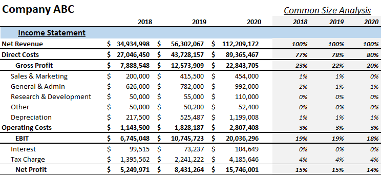

In the continuously changing field of finance, understanding financial statements and utilizing advanced technologies for trading have become essential competencies. Financial statements such as income statements are vital for gaining insights into a company’s revenues, expenses, and profits. Analyzing these components allows assessing profitability and operational efficiency, forming the backbone of strategic investment decisions. Concurrently, algorithmic trading, which uses complex algorithms to execute trades based on various market indicators, has emerged as a powerful tool for investors. The integration of common-size financial metrics into algorithmic trading models enhances decision-making by standardizing and normalizing financial data, thus allowing for better comparability across different entities and time periods. This convergence of financial analysis and algorithmic execution aids in generating actionable insights and strategic trades, promising more accurate and responsive investment strategies. By exploring the interaction between common-size analysis and algorithmic trading, the article aims to highlight how these methodologies can drive strategic, data-driven investments.

## Table of Contents

## Understanding Financial Statements

Financial statements serve as fundamental tools for stakeholders, including investors, managers, and creditors, to analyze and understand a company's financial health and strategic decision-making framework. These documents consolidate financial data into structured formats, enabling stakeholders to gain insights into a company's operations, financial performance, and cash position. The primary financial statements include the balance sheet, income statement, and cash flow statement, each offering distinct perspectives on a company's fiscal status.

The balance sheet provides a snapshot of a company's financial standing at a given point in time. It is divided into three main sections: assets, liabilities, and shareholders' equity. Assets are resources controlled by the company and can be classified into current (e.g., cash, inventory) and non-current (e.g., property, equipment). Liabilities represent the company's obligations, including debts and other financial commitments. Shareholders' equity, calculated as the residual interest in the assets after deducting liabilities, indicates the net worth attributable to shareholders.

The income statement, also known as the profit and loss statement, details the company’s performance over a specific period, usually a quarter or a year. It outlines revenues generated, expenses incurred, and profits earned. The basic formula capturing the income statement's essence is:

$$
\text{Net Income} = \text{Total Revenue} - \text{Total Expenses}
$$

Revenues encompass sales and other income-generating activities, while expenses include costs such as cost of goods sold, administrative expenses, and taxes. The resulting net income or profit serves as a measure of a company's operational efficiency and profitability, offering critical data for investment and strategic planning.

The cash flow statement provides insights into the cash inflows and outflows from operational, investing, and financing activities. It highlights the company’s ability to generate cash to meet its obligations and fund operations. The operations section adjusts net income for non-cash items and changes in working capital, the investing section tracks cash used in acquiring or selling long-term assets, and the financing section reveals cash flows from debt and equity transactions.

Understanding these financial statements' components and implications is vital for strategic financial planning and investment assessments. For investors, these documents aid in evaluating the return on investment potential and risks associated with investing in a company. For managers, they provide the information required for internal decision-making and performance monitoring. Creditors use these statements to assess a company's creditworthiness, ensuring that it can meet its financial obligations.

Mastery of financial statement analysis allows stakeholders to make informed decisions, capitalize on investment opportunities, and engage in effective resource allocation. By thoroughly understanding how these statements interact and reflect a company's fiscal health, stakeholders can better navigate the complexities of business finance and strategic investments.

## Common-Size Analysis in Financial Statements

Common-size analysis is a financial tool that converts all items in a financial statement into percentages of a base figure. This approach allows for straightforward comparisons both across different companies and within a single company over time, providing a clearer view of financial trends and operational health. 

In practice, common-size analysis involves the normalization of financial data by expressing each line item as a percentage of a significant total. For example, in the income statement, all items are typically expressed as a percentage of total sales, transforming raw figures into a relative format. This method enables analysts to evaluate how much each expense or revenue category contributes to overall sales, thus simplifying trend identification and peer benchmarking. A typical expression might look like:

$$
\text{Common-size percentage} = \left( \frac{\text{Line item value}}{\text{Total sales}} \right) \times 100\%
$$

By utilizing this relative format, common-size analysis provides insight into the proportion of each financial component in relation to overall company performance, aiding in the detection of inefficiencies or potential issues. For instance, if a company's cost of goods sold, when expressed as a percentage of sales, is significantly higher than that of its competitors, it can signal inefficiencies or unnecessary expenses in the production process.

Common-size analysis is particularly beneficial for income statements, as it allows investors, analysts, and other stakeholders to easily assess the financial health and operational efficiency. By examining revenues, operating expenses, and net income as proportions of total sales, stakeholders can quickly identify areas that deviate from industry norms or that might require strategic attention. Furthermore, this analysis assists in understanding shifts in a company’s financial strategy by observing changes in expense allocation or revenue generation over time.

In summary, common-size analysis serves as a powerful tool to provide valuable insights into financial statements, allowing for enhanced comparison across different companies or time periods. This approach not only aids in identifying areas of concern but also supports strategic financial planning and performance evaluation.

## Integrating Common-Size Analysis with Algorithmic Trading

Algorithmic trading, a method of executing orders using automated pre-programmed trading instructions, leverages large volumes of data and complex algorithms to optimize trading outcomes. Integrating common-size analysis into [algorithmic trading](/wiki/algorithmic-trading) processes provides a standardized approach to financial data, which enhances the precision and efficiency of trades.

Common-size analysis involves expressing all financial statement items as a percentage of a base figure, such as sales, to facilitate comparisons across different companies or time periods. This normalization process is crucial in algorithmic trading as it allows models to process data uniformly, eliminating scale-related distortions and focusing on relative changes and trends. By converting various financial entries into relative percentages, common-size analysis helps in distilling complex data into insights that can be seamlessly integrated into trading algorithms.

Incorporating common-size analysis within algorithmic models allows for the identification of patterns that could indicate lucrative investment opportunities or potential market risks. These patterns result from deviations in financial metrics that would not be apparent when analyzing absolute figures alone. For instance, a sudden increase in expense as a percentage of sales in a company could signal operational inefficiency, whereas a consistent decrease over time might suggest enhanced profitability and cost control measures. Such insights are invaluable for algorithmic traders aiming to predict market movements and adjust positions accordingly.

This integration also supports more sophisticated trading decisions. By standardizing the financial inputs, algorithmic models can function with higher precision, allowing for more responsive trading strategies. Real-time decisions become more feasible since data interpretations align closely with the underlying market dynamics, leaving less room for misinterpretation or noise. The integration leverages deep-seated financial insights, optimizing trading outcomes by guiding strategic positioning and execution.

Furthermore, algorithms embedded with common-size analytical capabilities can adapt to various market conditions, providing traders with a competitive edge. They can swiftly incorporate new data, recalibrate benchmarks, and update trading parameters, making them exceptionally responsive to market changes. Such adaptability ensures that the trading strategies remain aligned with current market realities, thus preserving the integrity and effectiveness of investment decisions.

In summary, the alignment of common-size analysis with algorithmic trading enriches the data-driven framework, enabling standardized, precise, and adaptable trading practices. It translates complex financial data into actionable intelligence, fostering an environment of informed and dynamic trading engagements.

## Benefits and Challenges of Common-Size Analysis in Algo Trading

Common-size analysis offers significant advantages in algorithmic trading, primarily through improved comparability and trend visualization. By expressing financial statement items as a percentage of a common base, such as sales in the income statement, traders can easily compare companies of different sizes or compare financial performance over different periods. This comparability facilitates the identification of deviations from industry norms or expected financial behaviors, helping traders recognize anomalous patterns or opportunities for strategic trades.

For instance, if a common-size income statement reveals that a company has higher-than-average operating expenses relative to its peers, it might signal inefficiencies or potential areas for cost optimization. Conversely, if a company maintains a lower cost of goods sold (COGS) percentage compared to competitors, it could indicate strong operational efficiency, potentially calling for investment consideration.

### Challenges

The integration of common-size analysis into algorithmic trading does face challenges, primarily revolving around data accuracy and complexity. The precision of this analysis is contingent on high-quality, accurate financial data. Inaccuracies in data can lead to misleading common-size percentages, significantly impacting trading decisions.

Additionally, incorporating common-size analysis into complex algorithms can be technically demanding. Algorithms must be capable of not only processing raw financial data but also converting it into standardized common-size formats in real time. This requires sophisticated programming skills and robust computational resources to ensure algorithms can handle large datasets efficiently.

Qualitative financial factors present another noteworthy challenge. While common-size analysis excels at providing quantitative insights, it often overlooks qualitative factors such as management expertise, brand strength, or market conditions, which can be equally crucial in investment decisions. Algorithms need to be enhanced with qualitative data inputs or supplementary analytical techniques to offer a more comprehensive view.

Despite these obstacles, common-size analysis remains an invaluable component of algorithmic trading. By normalizing financial inputs, it enhances the clarity and precision of trading models, thus supporting more informed decision-making. As technology advances, the continued refinement of these analytical techniques is expected to yield even more sophisticated and responsive trading strategies, potentially integrating elements like [machine learning](/wiki/machine-learning) for further enhancement of predictive accuracy.

Overall, the synergy between common-size analysis and algorithmic trading underscores the growing importance of data-driven approaches in financial markets, offering an avenue for more refined analysis and ultimately more strategic investment decisions.

## Case Study: Successful Implementation

A case study on integrating common-size analysis within an algorithmic trading framework highlights its impact on improving portfolio performance. This integration involved transforming normalized financial data into actionable insights, leading to more informed trade decisions and ultimately, increased financial returns.

The study revealed that common-size analysis aided in better comparative analysis and trend recognition across large datasets. By interpreting financial data as a percentage of total sales, traders were able to identify patterns and anomalies that might have been obscured in raw data formats. In practice, this meant identifying undervalued stocks or potential market risks with greater accuracy and speed.

A crucial element of this success was data integrity. Ensuring the reliability and accuracy of financial data was paramount. Without trustworthy data, the analysis could lead to erroneous conclusions and misguided trading practices. This necessitated robust data cleaning and verification processes, ensuring that only high-quality data fed into the algorithmic models.

The integration of real-time data also enhanced algorithm responsiveness. With constant market fluctuations, the ability to process and respond to new information swiftly could differentiate between profitable and unproductive trades. The framework's capability to adjust strategies based on real-time financial metrics provided an agile edge in executing trades aligned with current market conditions.

Furthermore, the case study highlighted pathways for incorporating machine learning technologies to augment this analytical approach. Machine learning models could bolster the algorithm by predicting financial trends or detecting subtle data patterns that traditional methodologies might miss. For instance, clustering algorithms or neural networks could be employed to classify financial instruments based on historical common-size metrics, enabling more predictive and proactive trading strategies.

Overall, the case study demonstrated the critical advantages of common-size analysis in enriching algorithmic trading strategies. It not only optimized trade decisions but also offered a scalable method to integrate complex financial metrics into a systematic trading approach. As financial technologies evolve, the inclusion of advanced analytical methods like common-size analysis is expected to continue transforming trading strategies, fostering an environment of more data-driven investment methodologies.

## Conclusion

The convergence of income statement analysis, common-size financial metrics, and algorithmic trading is significantly enhancing the precision of financial decision-making processes. Income statement analysis provides crucial insights into a company's profitability and operational efficiency by breaking down revenues, expenses, and net income. This granular view enables stakeholders to understand the financial performance in absolute terms.

Common-size financial metrics complement this by converting absolute numbers into relative terms, expressed as percentages. This standardization allows for clearer comparisons across different time periods and companies, helping analysts and traders to gauge performance effectively. By highlighting the proportional structure of revenues, costs, and other financial indicators relative to total sales, common-size analysis reveals trends and anomalies that might otherwise remain obscured in raw figures. 

Integrating these analyses with algorithmic trading systems amplifies their effectiveness. Algorithmic trading, defined by the use of computer programs to follow a defined set of instructions for trade execution, benefits from the standardization common-size analysis offers. By utilizing standardized inputs, trading algorithms can more precisely model and predict market movements. This leads to more responsive and nuanced trading decisions, unlocking opportunities while managing risks efficiently.

As technological advancements continue to reshape financial markets, the incorporation of these analytical methods within trading frameworks is set to refine investment strategies further. Advanced computational techniques, including machine learning, allow for real-time data analysis and model adaptation, enhancing the responsiveness and accuracy of investment decisions.

This synergy of financial analysis and technology signifies a pivotal evolution in financial methodologies, reflecting a shift towards more data-driven and strategic investment practices. As the financial industry continues to embrace these innovations, the resultant methodologies promise improved financial outcomes, leveraging the confluence of detailed financial analysis and cutting-edge technology.

## References & Further Reading

Foster, G. "Financial Statement Analysis." Prentice-Hall. This foundational text provides a comprehensive understanding of financial statement analysis, offering detailed explanations of income statement evaluation, balance sheet analysis, and cash flow assessment. It serves as an essential resource for grasping the fundamental principles underlying financial reporting and analysis.

Penman, S. H. "Financial Statement Analysis and Security Valuation." McGraw-Hill Education. This book explores the intersection of financial statement analysis and security valuation, providing frameworks for assessing company performance and valuing securities. It emphasizes the importance of integrating financial data into valuation models and making informed investment decisions.

Hasbrouck, J. "Empirical Market Microstructure: The Institutions, Economics, and Econometrics of Securities Trading." Oxford University Press. A detailed examination of market microstructure, this publication provides insights into the mechanics of securities trading, including the roles of various market participants and factors influencing market efficiency. It is particularly relevant for understanding the data-driven dynamics underpinning algorithmic trading strategies.

Pinedo, M. "The Basics of Financial Econometrics: Tools, Concepts, and Asset Applications." Wiley. This text introduces the key tools and concepts of financial econometrics, focusing on their application to asset pricing and risk management. It covers econometric techniques essential for analyzing financial data and developing predictive models, supporting enhanced decision-making in trading and investment.

Lopez de Prado, M. "Advances in Financial Machine Learning." Wiley. A pioneering work on the application of machine learning techniques in finance, this book offers insights into developing machine learning models tailored for financial applications. It covers topics such as pattern recognition, feature engineering, and model validation, empowering traders and analysts to harness machine learning's potential for improving trading systems and strategies.

