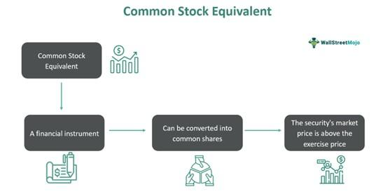

In today's fast-paced financial markets, the advancement of technology has led to the rise of algorithmic trading, transforming the way trades are executed, with unparalleled speed and precision. This form of trading relies on sophisticated computer algorithms that can process a vast amount of data and execute trades at microsecond intervals, outperforming traditional manual trading methods. At the heart of this technological evolution lies the concept of 'stock equivalent common stock', a critical component in the algorithmic trading landscape.

Stock equivalent common stock refers to securities like options, convertible bonds, or warrants that possess the ability to be converted into shares of common stock under favorable market conditions. These financial instruments offer unique advantages, presenting both investors and companies with opportunities to capitalize on their intrinsic value and potential for increased profits. Their impact is increasingly observed in financial statements, particularly affecting diluted earnings per share (EPS), providing insights into the potential for dilution.



As we explore the integration of stock equivalents within algorithmic trading, we find a compelling intersection of traditional finance principles with cutting-edge technology. The algorithms employed in this type of trading are designed to assess market conditions rapidly and determine the optimal timing for conversion of stock equivalents into common stock. This strategic advantage allows traders to maximize profit margins and reduce risks that are typically associated with manual trading processes.

The synergy between stock equivalents and algorithmic trading presents a dynamic fusion, offering both liquidity and flexibility within financial markets. This article aims to investigate the significance of stock equivalents in financial operations and their pivotal role in enhancing algorithmic trading strategies. By understanding this interplay, traders and financial institutions can harness these tools effectively, creating a bridge between the conventional practices of finance and the promising prospects offered by modern, technology-driven trading methodologies.

## Table of Contents

## Understanding Common Stock Equivalent

A common stock equivalent is a versatile type of financial security that carries the potential to be converted into common stock. Among the typical examples of these instruments are options, convertible bonds, and warrants. These financial tools become particularly significant when market conditions favor their conversion into actual shares, presenting strategic opportunities for both investors and issuing companies.

Options are contractually established rights that grant the holder the ability to buy or sell an underlying security at a predetermined price within a specific time frame. Convertible bonds, on the other hand, are fixed-income securities that give the bondholder the right to convert the debt into a predetermined number of common shares of the issuing company, usually at specific times during the bond's life. Warrants are similar in that they offer the right to purchase a company's stock at a specific price before expiration.

The appeal of these stock equivalents largely stems from their intrinsic value and the potential for increased profits. For investors, they represent an opportunity to capitalize on favorable market movements with relatively limited initial investments. For companies, issuing these instruments can attract capital without immediate dilution of shares, as conversion happens at the discretion of the holder and often under favorable conditions for the issuer.

A crucial aspect of common stock equivalents is their influence on financial statements, particularly concerning diluted earnings per share (EPS). Diluted EPS is a performance metric that provides a comprehensive view of a company's potential share dilution. It accounts for all possible conversions that could result in additional common shares, which is essential for a realistic assessment of a company's earnings available to each share of common stock. In formulaic terms, diluted EPS is calculated as:

$$
\text{Diluted EPS} = \frac{\text{Net Income} - \text{Preferred Dividends}}{\text{Weighted Average Shares Outstanding} + \text{Dilutive Securities}}
$$

This formula illustrates how common stock equivalents can expand the denominator, thus potentially lowering the EPS and offering investors and analysts a realistic view of [earning](/wiki/earning-announcement) performance when these instruments might convert.

Understanding the dynamics of common stock equivalents is vital for investors and financial analysts alike, as it provides them with tools for strategic decision-making and valuation assessment, especially within contexts that highly value potential market efficiencies and capital structure management.

## The Role in Algorithmic Trading

Algorithmic trading utilizes sophisticated computer algorithms to execute trades based on predefined criteria, allowing for rapid and accurate trading decisions. These algorithms are particularly adept at analyzing market conditions to determine the optimal timing for converting stock equivalents, such as options or convertible bonds, into common stock. This strategic conversion is crucial for traders aiming to maximize profit margins while minimizing risks that are commonly associated with manual trading processes.

The algorithms used in [algorithmic trading](/wiki/algorithmic-trading) can efficiently process vast amounts of market data to evaluate potential opportunities for conversion and execution. They incorporate variables such as market [volatility](/wiki/volatility-trading-strategies), trading [volume](/wiki/volume-trading-strategy), and historical price movements to predict the best conversion strategies. This capability not only ensures timely decision-making but also reduces the likelihood of human error, leading to more reliable outcomes.

A key advantage of using algorithmic trading with stock equivalents is the ability to account for potential stock dilution. Dilution occurs when new shares are issued, potentially reducing the value of existing shares. By incorporating potential dilution into their calculations, algorithms can adapt trading strategies dynamically. For example, when a convertible bond is converted into common stock, the algorithm adjusts its trading strategy to mitigate any impact on the portfolio's overall performance.

Moreover, algorithms can provide insights into market trends and dynamics that might not be immediately obvious through traditional analysis. This can include identifying [arbitrage](/wiki/arbitrage) opportunities or predicting market shifts before they are evident to human traders. By continuously learning from new data, these algorithms can refine their predictions over time, further enhancing trading strategies.

The integration of stock equivalents in algorithmic trading systems enables traders to achieve higher efficiency in their operations. This is particularly valuable in high-frequency trading environments where seconds can mean the difference between substantial gains and losses. As these algorithms evolve, they will continue to offer significant advantages, pushing the boundaries of what is achievable in modern financial markets.

## Benefits of Stock Equivalents in Algo Trading

Stock equivalents, such as options, convertible bonds, and warrants, are pivotal in enhancing the effectiveness of algorithmic trading strategies, which often rely on high-frequency trading ([HFT](/wiki/high-frequency-trading-strategies)) to maximize gains. These financial instruments inherently offer enhanced [liquidity](/wiki/liquidity-risk-premium) by providing the flexibility to convert into common stock, which is a crucial characteristic for any trading system aiming to swiftly adjust to market fluctuations. For instance, during periods of high volatility, stock equivalents enable algorithms to promptly realign their trading strategies, thereby maintaining the efficiency of trading operations even in rapidly changing market conditions.

Furthermore, algorithmic trading systems utilizing stock equivalents benefit from reduced human error, as these systems are driven by data and pre-set criteria, which facilitates more informed and timely decision-making processes. By eliminating the psychological biases and emotional reactions commonly associated with manual trading, algorithms can leverage data-driven insights to execute trades that align closely with the strategic objectives set forth by traders. This precision is particularly significant in HFT environments, where even the slightest delay or error can lead to substantial financial repercussions.

In addition to liquidity and precision, stock equivalents in algo trading significantly bolster financial risk management. Algorithms are adept at predicting potential market downturns and can adjust trading volumes proactively based on these predictions. For example, using historical data and [machine learning](/wiki/machine-learning) models, an algorithm could identify patterns indicative of an impending market correction. Consequently, it may decide to reduce exposure by converting some stock equivalents into cash assets, thereby mitigating potential losses.

Python, a popular programming language for developing algorithmic trading strategies, provides robust libraries such as NumPy and Pandas for handling large datasets, which are essential for real-time analysis and decision-making. Here's a simple Python snippet demonstrating how a basic trading algorithm might utilize stock equivalent data to inform trading decisions:

```python
import numpy as np
import pandas as pd

# Assume df is a DataFrame containing stock equivalent prices and market indicators
def trade_decision(df):
    df['signal'] = np.where((df['equiv_price'] < df['market_indicator']), 'Buy', 'Hold')
    return df

# Example DataFrame structure
data = {'equiv_price': [100, 102, 98, 105], 'market_indicator': [101, 100, 99, 104]}
df = pd.DataFrame(data)

# Execute trading decision
trade_decision(df)

# Output: 
#    equiv_price  market_indicator signal
# 0          100               101    Buy
# 1          102               100   Hold
# 2           98                99    Buy
# 3          105               104   Hold
```

In this example, the algorithm identifies buying opportunities by analyzing the relationship between current stock equivalent prices and market indicators, thereby optimizing timing and execution of trades. As technology progresses, the integration of more sophisticated models and [artificial intelligence](/wiki/ai-artificial-intelligence) techniques holds the potential to further refine these capabilities, paving the way for even more dynamic and responsive trading strategies.

## Challenges and Considerations

Algorithmic trading, while offering a suite of advantages, is not devoid of its own set of challenges. One of the foremost issues is the inherent volatility of financial markets. Algorithms must be capable of adapting to rapid shifts in market conditions, but during periods of extreme fluctuations, even sophisticated algorithms can struggle to maintain optimal performance. This volatility can lead to significant financial losses if not managed properly, emphasizing the need for robust risk management strategies.

The complexity of writing effective algorithms is another significant challenge. Creating algorithms that can accurately predict market movements and execute trades at the right moments requires a deep understanding of not only programming and data analysis but also financial market theory. The algorithms must integrate data from multiple sources, analyze vast datasets in real-time, and execute trades with precision. Errors in coding or logic can result in flawed algorithms, leading to diminished returns or losses.

Regulatory compliance poses yet another critical issue. Algorithmic trading is situated within a tightly regulated industry, and financial laws are continually evolving. Traders must ensure their algorithms comply with current regulations, which can vary significantly across jurisdictions. Non-compliance can result in severe penalties, including fines and restrictions on trading practices. Keeping up-to-date with these regulatory changes is essential for legal and operational sustainability.

Technological failures represent a practical risk for algorithmic trading operations. System outages, software bugs, or network disruptions can halt trading activities, often during pivotal market moments. Such failures can lock traders into unfavorable positions, leading to financial losses. Continuous monitoring and regular testing are crucial to ensure system reliability and robustness.

Implementing algorithmic trading systems also involves substantial initial costs. Developing, deploying, and maintaining high-performance algorithms require sophisticated hardware, advanced software solutions, and skilled personnel. Moreover, these systems need to be regularly updated and optimized to keep pace with market innovations and technological advancements. Traders must balance these costs with potential benefits to justify the investment.

Overall, while algorithmic trading transforms how trading activities are conducted by offering significant efficiencies and opportunities, it also demands a careful consideration of potential challenges and a commitment to continuous adaptation and improvement.

## Future of Stock Equivalents in Finance

As technology continues to progress, the future of stock equivalents in finance appears promising, marked by a surge in sophisticated tools for stock equivalent trading. Key to this evolution is the integration of machine learning and artificial intelligence (AI), which are set to redefine the predictive capabilities of trading algorithms. These advanced technologies can analyze vast datasets more efficiently than ever before, providing traders with precise, actionable insights into market trends and stock equivalent valuations. The use of AI and machine learning in crafting algorithms enhances their ability to forecast price movements, uncover hidden patterns, and adjust trading strategies in real-time, ultimately optimizing trade execution and profitability.

Globally, there is a growing recognition of the efficiencies offered by algorithmic trading utilizing stock equivalents. As financial markets around the world acknowledge these advantages, the adoption of such trading practices is poised to expand. This widespread acceptance is likely driven by the realization that algorithmic trading, with the integration of stock equivalents, ensures faster, more reliable execution of trades, thereby enhancing market liquidity and reducing transaction costs.

Emerging technologies continue to disrupt traditional trading paradigms, presenting opportunities for traders to gain strategic advantages. Blockchain, for example, offers the potential for increased transparency and security in trading operations. By leveraging distributed ledger technology, the validation and settlement of trades become more efficient and secure, minimizing risks associated with fraudulent activities.

Furthermore, quantum computing represents another frontier with the potential to impact stock equivalent trading substantially. Although still in the early stages, quantum computing promises to process complex computations at unprecedented speeds, thus offering the possibility of revolutionizing algorithmic trading by solving optimization problems and executing strategies that are far beyond the capabilities of classical computers.

In conclusion, the integration of advanced technologies in finance heralds a future where stock equivalent trading is more efficient, secure, and globally adopted. As innovative solutions become increasingly sophisticated, they hold the capacity to enhance trading strategies, offering traders strategic advantages in a dynamic financial landscape.

## Conclusion

Stock equivalents are critical assets in algorithmic trading, providing both liquidity and adaptability. These instruments, such as options or convertible bonds, allow traders to navigate complex market environments with enhanced strategic precision. They offer unique opportunities to optimize trading strategies for achieving peak efficiency and profitability, especially in high-frequency trading scenarios where rapid execution is essential.

Grasping the dynamic relationship between stock equivalents and algorithmic trading is crucial for traders and financial institutions aiming to capitalize on these tools. By understanding how to effectively integrate stock equivalents into algorithmic models, traders can design strategies that automatically react to market signals, thus improving decision-making processes and reducing human error.

As technological advancements continue, the role of stock equivalents in algorithmic trading is set to expand significantly. The integration of machine learning and artificial intelligence into trading algorithms promises even greater predictive accuracy and decision-making capability. Future developments are likely to enhance the strategic advantages stock equivalents provide, revolutionizing traditional trading paradigms and offering innovative solutions to complex market challenges. This evolution will likely see an increased global adoption of algorithmic trading strategies utilizing stock equivalents, marking a profound transformation in financial markets.

## References & Further Reading

[1]: ["Advances in Financial Machine Learning"](https://www.amazon.com/Advances-Financial-Machine-Learning-Marcos/dp/1119482089) by Marcos Lopez de Prado

[2]: ["Quantitative Trading: How to Build Your Own Algorithmic Trading Business"](https://www.amazon.com/Quantitative-Trading-Build-Algorithmic-Business/dp/1119800064) by Ernest P. Chan

[3]: ["Machine Learning for Algorithmic Trading"](https://github.com/stefan-jansen/machine-learning-for-trading) by Stefan Jansen

[4]: Hull, J. C. (2009). ["Options, Futures, and Other Derivatives"](https://www.amazon.com/Options-Futures-Other-Derivatives-9th/dp/0133456315). Prentice Hall.

[5]: ["Evidence-Based Technical Analysis: Applying the Scientific Method and Statistical Inference to Trading Signals"](https://www.amazon.com/Evidence-Based-Technical-Analysis-Scientific-Statistical/dp/0470008741) by David Aronson