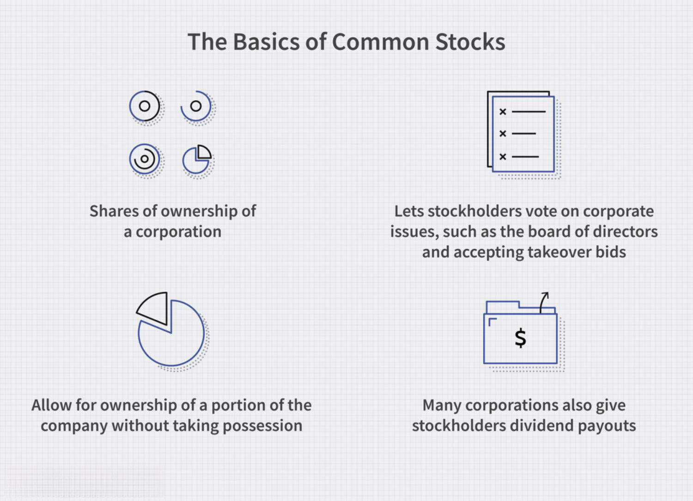

In today's fast-paced financial markets, the landscape of common stock fund investment types and algorithmic trading has become integral for both novice and experienced investors. Common stock funds, which include mutual funds and exchange-traded funds (ETFs), provide investors with the opportunity for diversified investments in the equity of publicly traded companies. These funds simplify the investment process by enabling investors to avoid the complexities of analyzing and selecting individual stocks. The primary benefits of such funds lie in their diversification potential, simplicity, cost-effectiveness, and reduced time commitment, making them attractive to a broad range of investors.

Conversely, algorithmic trading harnesses the power of computer algorithms to execute trades based on predefined criteria, offering speed and precision that surpasses traditional human trading methods. These algorithms utilize price movements, market conditions, or complex mathematical models to perform high-frequency trades, reducing human error and emotional bias. This technological advancement has transformed trading, making the execution process faster and more precise, while also introducing risks such as technical failures or the need for sophisticated infrastructure and expertise.

This article explores the various types of common stock funds available and how stock market algorithms operate. It will discuss the ways these distinct investment strategies intersect and how their integration is reshaping the investment approach of both individuals and institutions. By understanding these components, investors can craft informed strategies for their portfolios, optimizing potential returns while adapting to evolving financial technologies.

## Table of Contents

## Understanding Common Stock Funds

Common stock funds are investment vehicles that focus on acquiring shares in publicly traded companies, offering investors the potential to benefit from the growth and success of these businesses. Two primary types of common stock funds are mutual funds and exchange-traded funds (ETFs), both of which serve the purpose of pooling investors' resources to invest in a diversified portfolio of stocks.

These funds offer an efficient method to achieve diversification within a portfolio, thereby mitigating risk. Instead of having to individually select and purchase a broad range of stocks, investors can allocate their capital into a stock fund and gain exposure to various companies and industries. This approach significantly reduces the need for extensive research and analysis of each potential stock investment, making it particularly attractive to those with limited time or investment expertise.

The primary advantages of investing in common stock funds include diversification, simplified investment processes, cost efficiency, and reduced time commitments. Diversification is achieved as the funds typically hold a large number of different stocks, which can help cushion the impact of poor performance in any single investment. Simplicity is another key benefit, as investors can access a structured portfolio managed by professionals who make informed decisions based on market conditions and economic forecasts.

Cost savings are realized as common stock funds can take advantage of economies of scale, spreading out the operational and transaction costs among numerous investors. This often results in lower costs compared to executing individual stock trades. The reduced time commitment is particularly appealing to those who wish to participate in the stock market but have limited resources to constantly monitor market developments and manage their holdings actively.

Investors have various options within common stock funds, allowing them to select funds that align with their financial goals and risk tolerance. Some funds focus on growth by investing in companies with high potential, while others may prioritize income through shares in dividend-paying firms. Understanding these options can help investors tailor their portfolios to achieve desired returns while managing risk appropriately.

## Types of Common Stock Funds

Index funds are designed to emulate the performance of a specific market index, making them a popular choice for investors seeking a passive investment strategy. The premise is to match the returns of a particular index, such as the S&P 500 or the Nasdaq Composite, by holding a portfolio of securities in the same proportions as the index. This approach minimizes the need for active management, resulting in lower fees and expenses compared to actively managed funds. Additionally, index funds offer transparency and predictability due to their structured approach to investment.

Broad-based funds aim for extensive diversification by investing across multiple industries and sectors. This wide-ranging approach helps mitigate risk by reducing exposure to the [volatility](/wiki/volatility-trading-strategies) of any single industry. Investors in broad-based funds typically benefit from consistent long-term growth aligned with the overall market performance, as their portfolios are less susceptible to sector-specific downturns.

Sector funds concentrate investments within specific sectors or industries, such as technology, healthcare, or utilities. These funds allow investors to capitalize on the growth potential of high-performing industries or focus on sectors they anticipate will experience above-average growth. While sector funds can offer significant returns, they also involve higher risk due to the lack of diversification across different industries. As a result, these funds are more sensitive to sector-specific events and economic shifts.

Small-, mid-, and large-cap funds categorize their investments based on the market capitalization of companies. Small-cap funds invest in smaller, potentially high-growth companies, and typically entail higher volatility and risk. Mid-cap funds strike a balance by investing in companies with moderate market capitalization, offering a blend of growth potential and stability. Large-cap funds focus on well-established companies with significant market capitalization, providing reduced risk but potentially lower growth compared to smaller companies. 

Each type of common stock fund presents distinct risk and return profiles, allowing investors to tailor their investments according to their objectives and risk tolerance. Index funds offer cost-efficiency and consistent market-aligned returns, broad-based funds provide extensive diversification, sector funds offer targeted exposure with high risk and reward, and capitalization-specific funds cater to investors' varying risk appetites across company sizes.

## Basics of Algorithmic Trading

Algorithmic trading, often referred to as algo-trading, involves the use of computer algorithms to automatically execute trading orders based on pre-set criteria. This approach leverages the computational power of computers to analyze market data at speeds unattainable for humans, making it possible to execute trades with remarkable accuracy and efficiency. At its core, [algorithmic trading](/wiki/algorithmic-trading) is designed to capitalize on specific patterns and opportunities that are identified through quantitative analysis and mathematical models.

One of the primary advantages of algorithmic trading is its ability to exploit price movements and market conditions with [high frequency](/wiki/high-frequency-trading). For instance, algorithms can be programmed to execute trades within milliseconds of detecting favorable conditions, allowing traders to take advantage of minute fluctuations in asset prices. This high-frequency trading ([HFT](/wiki/high-frequency-trading-strategies)) aspect is particularly effective in markets where [liquidity](/wiki/liquidity-risk-premium) is abundant and spreads are tight.

Algorithmic trading also significantly reduces human error and emotional biases. By adhering to a strict set of rules, algorithms ensure that trades are executed without hesitation or emotional interference, which typically plagues manual trading. Automated systems ensure that all trades adhere strictly to predefined parameters, optimizing execution speed and precision.

Despite its advantages, algorithmic trading is not without risks. Technical failures present a significant challenge; any issues with the trading algorithm itself, or with the physical hardware and network infrastructure supporting it, can lead to costly errors. Furthermore, the design and implementation of sophisticated trading algorithms require substantial technical expertise, as well as access to advanced infrastructure capable of handling vast amounts of data streaming in real time.

The intricate nature of algorithmic trading strategies demands a high level of customization and adaptation to ever-evolving market conditions. As such, successful adoption of algo-trading often necessitates ongoing investment in technology and analytics capabilities to maintain a competitive edge. Overall, while offering tremendous potential for efficiency and profit enhancement, algorithmic trading requires careful consideration of its technological and operational demands.

## Types of Algorithmic Trading Strategies

Algorithmic trading strategies are essential tools in modern financial markets, designed to optimize trade execution and harness market opportunities. Among the most widely used strategies are trend-following, [arbitrage](/wiki/arbitrage), mean reversion, and [volume](/wiki/volume-trading-strategy) and time-weighted average price (VWAP and TWAP) strategies.

**Trend-Following Strategy** leverages technical indicators to capitalize on market trends, identifying buying or selling opportunities when prices demonstrate sustained momentum. This strategy relies on the principle that assets moving in a particular direction will continue to do so for a period. Traders utilizing this strategy often employ tools like moving averages, relative strength index (RSI), and MACD (Moving Average Convergence Divergence) to gauge trends. For example, a simple moving average crossover might signal a buying opportunity when a short-term moving average crosses above a long-term moving average.

**Arbitrage Strategy** seeks to exploit price discrepancies of the same asset across different markets, aiming for risk-free profits. This could involve buying an asset on one exchange where it is undervalued and simultaneously selling it on another where it is overvalued, capitalizing on the price difference. While theoretically risk-free, this strategy requires sophisticated infrastructure and rapid execution to capture fleeting opportunities before prices converge.

**Mean Reversion Strategy** operates on the assumption that prices will revert to their historical averages over time. Traders using this strategy identify points where an asset's price deviates significantly from its average, indicating potential buy or sell signals. If $P_t$ is the current price, and $\mu$ is the historical average, a significant deviation where $|P_t - \mu| > \epsilon$ (ε being a pre-defined threshold) may trigger a trade, expecting prices to revert closer to $\mu$.

**Volume-Weighted Average Price (VWAP) and Time-Weighted Average Price (TWAP) Strategies** involve executing trades to achieve average prices. VWAP calculates the average price an asset was traded at during the day, weighted by volume. It's commonly used to execute large orders without significantly affecting the market price. The formula for VWAP is:

$$
VWAP = \frac{\sum{(Price_i \times Volume_i)}}{\sum{Volume_i}}
$$

TWAP divides larger blocks of trades into smaller ones over time, aiming to minimize market impact. Both methods ensure that large transactions are executed more strategically, preserving the order's anonymity and impact on the market.

Algorithmic trading strategies evolve continuously, driven by technological advancements and market dynamics. They require comprehensive market understanding and robust computational infrastructure, presenting investors with opportunities to enhance their trading efficiency and effectiveness.

## Integration of Common Stock Funds and Algo Trading

The integration of common stock funds and algorithmic trading represents a sophisticated investment strategy that merges the benefits of diversification with the precision and efficiency of technology-driven trading. Algorithms, or computer programs, are designed to perform specific tasks and, when applied to investing, can manage and optimize diversified funds by analyzing vast amounts of data to predict trends, execute trades, and automate rebalancing in line with benchmark indices.

Algorithms can exploit statistical methods and [machine learning](/wiki/machine-learning) models to process massive datasets, identify patterns, and forecast security price movements. By employing predictive analytics, these systems can adjust investment positions dynamically to optimize portfolio performance. For instance, Python libraries such as NumPy and Pandas can be utilized to ingest financial data, while machine learning libraries like scikit-learn enable the development of predictive models.

One practical aspect of integrating algorithmic trading with common stock funds is automated portfolio rebalancing. This refers to the periodic adjustment of asset weights within the fund to maintain the desired asset allocation. Algorithms can be coded to automatically rebalance portfolios when certain conditions are met, such as deviations from a predefined benchmark index. This reduces the manual oversight traditionally required and minimizes transaction costs through optimal timing.

Further, high-speed computational ability enables investors to rapidly adapt to market changes. Algorithms swiftly process new information, including economic indicators or market sentiment, allowing funds to exploit fleeting market inefficiencies. As a result, investors can achieve a better risk-return profile on their investment.

By blending these strategies, investors gain the ability to enhance portfolio performance via meticulous execution and strategic alignment with macroeconomic trends. The capacity to respond quickly to market shifts ensures flexibility, which is crucial in today's volatile market environment.

The use of mathematical models in algorithmic trading facilitates the identification and capitalization of arbitrage opportunities, enhancing the overall efficiency of investment operations. As these trading systems evolve, the integration of cutting-edge technologies promises to continue transforming the way common stock funds are managed, providing investors with a competitive edge.

## The Future of Investments: Tech-Driven Strategies

The integration of [artificial intelligence](/wiki/ai-artificial-intelligence) (AI) and machine learning into algorithmic trading is poised to revolutionize investment strategies, enabling more sophisticated and adaptive approaches to market dynamics. AI algorithms can analyze vast datasets to identify complex patterns and trends that were previously beyond human capability. Machine learning models continually evolve by learning from market data, thereby refining their predictive power and enhancing decision-making processes.

Robo-advisors and technology-driven portfolio management firms are increasingly utilizing AI-based strategies. These automated platforms provide personalized investment advice by analyzing an individual's financial goals and risk tolerance, then dynamically adjusting the portfolio composition to optimize performance. The simplicity and affordability of robo-advisors democratize access to advanced investment strategies, allowing retail investors to benefit from techniques traditionally reserved for institutional investors. This transition is supported by the widespread availability of data and computational resources, making it viable for smaller investors to engage in sophisticated trading practices.

As these technologies become more prevalent, staying informed and adaptive is crucial for investors. Continual advancements in machine learning and AI could lead to the development of more autonomous trading systems, capable of operating with minimal human intervention. This shift requires investors to maintain a keen awareness of technological progress and its implications for market behavior. Active education in these new technologies will be vital for exploiting the opportunities they present while mitigating associated risks.

In conclusion, the intersection of AI, machine learning, and algorithmic trading marks a significant evolutionary step in investment management. It promises to transform traditional practices, offering greater efficiency, precision, and access to cutting-edge strategies. As the investment landscape continues to evolve, investors must remain proactive in understanding and leveraging these technological advancements to optimize their portfolios and achieve their financial goals.

## Conclusion

Both common stock funds and algorithmic trading present distinct advantages that appeal to varied investment goals and preferences. Common stock funds, with their inherent diversification and simplicity, allow investors to spread risk across a wide array of assets while enjoying the ease of collective management. Alternatively, algorithmic trading offers precision and speed, executing trade decisions based on predefined criteria and minimizing human error.

Combining these two strategies can forge a robust, technologically advanced investment approach, maximizing efficiency and potentially enhancing returns. Algorithms can be utilized to manage common stock funds by predicting trends and automatically rebalancing portfolios to ensure alignment with set benchmarks. This integration enables investors to quickly respond to market fluctuations and exploit opportunities with minimal manual intervention.

However, to truly capitalize on these strategies, continuous education and awareness of market dynamics are essential. The investment landscape is rapidly evolving, driven by advancements in artificial intelligence and machine learning, providing more sophisticated and accessible tools for investment. Investors must, therefore, remain informed and flexible, adapting to emerging trends and technologies.

As technology further transforms the investment arena, understanding new developments will be crucial for not only navigating challenges but also for leveraging emerging opportunities. This ongoing engagement will be critical for investors to achieve optimal portfolio performance and capture the potential benefits of innovation-driven investment strategies.

## References & Further Reading

[1]: ["Advances in Financial Machine Learning"](https://www.amazon.com/Advances-Financial-Machine-Learning-Marcos/dp/1119482089) by Marcos Lopez de Prado

[2]: Bergstra, J., Bardenet, R., Bengio, Y., & Kégl, B. (2011). ["Algorithms for Hyper-Parameter Optimization."](https://dl.acm.org/doi/10.5555/2986459.2986743) Advances in Neural Information Processing Systems 24.

[3]: ["Machine Learning for Algorithmic Trading"](https://github.com/stefan-jansen/machine-learning-for-trading) by Stefan Jansen

[4]: ["Evidence-Based Technical Analysis: Applying the Scientific Method and Statistical Inference to Trading Signals"](https://www.amazon.com/Evidence-Based-Technical-Analysis-Scientific-Statistical/dp/0470008741) by David Aronson

[5]: ["Quantitative Trading: How to Build Your Own Algorithmic Trading Business"](https://www.amazon.com/Quantitative-Trading-Build-Algorithmic-Business/dp/1119800064) by Ernest P. Chan