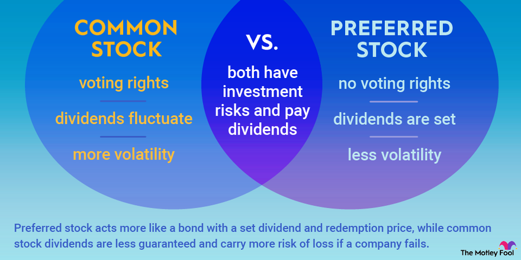

## Table of Contents

## What is a common stock fund?

A common stock fund is a type of investment fund that mainly invests in the stocks of different companies. When you put your money into a common stock fund, you are buying shares of the fund, and the fund uses that money to buy stocks. This way, you own a small piece of many different companies, which can help spread out the risk. Stock funds are managed by professionals who choose which stocks to buy and sell, trying to make the fund grow in value over time.

These funds can focus on different things, like big companies, small companies, or companies in certain industries. Some funds might try to grow quickly by picking stocks that they think will go up a lot in value, while others might focus on paying regular dividends to their investors. Because stock prices can go up and down a lot, common stock funds can be riskier than other types of investments, but they also have the potential to give you higher returns over the long term.

## How does a common stock fund differ from other types of investment funds?

A common stock fund is different from other investment funds because it mainly invests in stocks of companies. Other types of funds might invest in bonds, real estate, or a mix of different things. For example, a bond fund focuses on buying bonds, which are like loans to companies or governments, and they usually pay interest. A real estate fund invests in properties or real estate companies. A common stock fund, on the other hand, aims to grow by buying pieces of different companies and hoping their stock prices go up.

Another way common stock funds differ is in how they manage risk and returns. Because stock prices can change a lot, common stock funds can be riskier than bond funds or money market funds, which are usually more stable but don't grow as much. Some funds, like balanced funds, mix stocks and bonds to try to balance risk and return. Also, index funds are a type of common stock fund that tries to match the performance of a big group of stocks, like the S&P 500, instead of picking individual stocks. This can be less risky than actively managed stock funds, where managers pick stocks they think will do well.

In summary, common stock funds focus on stocks, while other funds might focus on different investments like bonds or real estate. They can be riskier but have the potential for higher returns. The way they are managed, whether actively picking stocks or following an index, also sets them apart from other types of funds.

## What are the main benefits of investing in common stock funds?

One big benefit of investing in common stock funds is that they help you spread out your risk. When you buy into a common stock fund, you're not just putting your money into one company. Instead, the fund owns a bunch of different stocks, so if one company does badly, it won't hurt your whole investment. This is called diversification, and it's like not putting all your eggs in one basket. Also, common stock funds are run by professionals who know a lot about picking good stocks. They do the hard work of deciding which companies to invest in, so you don't have to.

Another benefit is the potential for growth. Over time, stocks can go up in value, and common stock funds let you be part of that growth. While there are no guarantees, history shows that stocks can grow more than things like bonds or savings accounts over the long term. This means your money could grow faster in a common stock fund. Plus, many common stock funds pay dividends, which are like little payments from the companies the fund owns. These dividends can give you extra income or be reinvested to buy more shares of the fund, helping your investment grow even more.

## What are the risks associated with common stock funds?

One big risk with common stock funds is that the value of the stocks they own can go down. Stocks can be pretty unpredictable, and if a lot of the companies in the fund do badly, the value of your investment can drop. This is called market risk. If you need to take your money out when the market is down, you might lose some of what you put in. Also, common stock funds can be affected by things like economic downturns, changes in interest rates, or big events like a global crisis. These things can make the whole stock market go down, and your fund goes down with it.

Another risk is that the people running the fund might not pick the best stocks. Even though they're professionals, they can make mistakes or have different ideas about what will do well. This is called management risk. If the fund managers pick stocks that don't do well, your investment won't grow as much as you hoped. Also, common stock funds can have fees that you have to pay, like management fees or other costs. These fees can eat into your returns, making your investment grow slower than if you didn't have to pay them.

## What are the different types of common stock funds available to investors?

There are several types of common stock funds that investors can choose from, each with its own way of picking stocks and managing risk. One type is growth funds, which focus on companies that are expected to grow a lot in the future. These funds aim to increase in value quickly, but they can be riskier because they invest in newer or smaller companies. Another type is value funds, which look for companies that seem to be underpriced. They try to find good deals on stocks, hoping that the market will eventually recognize their true value and the stock price will go up. Then there are blend funds, which mix growth and value strategies, trying to get the best of both worlds.

Income funds are another type of common stock fund. These funds focus on companies that pay regular dividends, which can give you a steady income from your investment. They're often less risky than growth funds because they invest in more stable, established companies. Sector funds focus on specific parts of the economy, like technology, health care, or energy. These can be riskier because they put all their eggs in one basket, but they can also do really well if that sector does well. Finally, there are index funds, which try to match the performance of a big group of stocks, like the S&P 500. They're usually less risky than other types of stock funds because they're more diversified and have lower fees.

Each type of common stock fund has its own set of benefits and risks. Growth funds and sector funds can offer big rewards but come with higher risk. Value funds and income funds might be safer but might not grow as quickly. Blend funds try to balance these risks and rewards, while index funds offer a more predictable and often cheaper way to invest in the stock market. Choosing the right type of fund depends on what you're looking for in an investment, how much risk you're willing to take, and how long you plan to keep your money invested.

## How do growth stock funds differ from value stock funds?

Growth stock funds and value stock funds have different ways of choosing which stocks to buy. Growth stock funds look for companies that are growing quickly. They want to find businesses that are expected to make more money in the future. These companies might be newer or smaller, and they usually don't pay big dividends because they're using their money to grow even more. Because growth stock funds focus on companies that could grow a lot, they can be riskier. If the companies don't grow as expected, the stock prices might drop, and the fund could lose value.

On the other hand, value stock funds look for companies that they think are underpriced. They try to find good deals on stocks, thinking that the market has not recognized how much these companies are really worth. These companies are often more established and might pay dividends. Value stock funds aim to buy these stocks at a low price and then sell them later when their true value is recognized, and the price goes up. While value stock funds can be less risky than growth stock funds, they might not grow as quickly, and it can take a long time for the market to see the true value of these companies.

## What is the role of sector-specific stock funds in a diversified portfolio?

Sector-specific stock funds focus on one part of the economy, like technology or health care. They can be a good addition to a diversified portfolio because they let you put some of your money into a specific area that you think will do well. For example, if you believe that technology will keep growing, you might want to have some of your money in a technology sector fund. These funds can help you take advantage of trends or big changes in certain parts of the economy.

However, sector-specific funds can also make your portfolio riskier. Because they focus on just one area, if that sector does badly, your whole investment in that fund could go down a lot. This is why it's important to use sector funds carefully and not put all your money into them. By mixing sector funds with other types of investments, like funds that cover many different sectors, you can balance out the risk and still have a chance to benefit from the growth in specific areas of the economy.

## How can an investor evaluate the performance of a common stock fund?

To evaluate the performance of a common stock fund, an investor should look at how much the fund has grown over time. This is usually shown as the fund's return, which can be measured over different periods like one year, three years, or five years. Comparing the fund's return to a benchmark, like the S&P 500, can help see if the fund is doing better or worse than the overall market. It's also important to check the fund's risk, which can be measured by looking at how much the fund's value goes up and down. A fund with a lot of ups and downs might be riskier, but it could also have the chance for bigger returns.

Another thing to consider is the fees the fund charges. These fees can eat into your returns, so a fund with high fees needs to do a lot better than one with low fees to be worth it. Looking at the fund's expense ratio, which shows the percentage of your investment that goes to fees each year, can help you understand this. Also, it's good to see if the fund pays dividends and how those dividends have grown over time. Dividends can give you extra income or be reinvested to buy more shares, helping your investment grow. By looking at all these things together, an investor can get a good idea of how well a common stock fund is doing and if it fits their investment goals.

## What are the tax implications of investing in common stock funds?

When you invest in common stock funds, you need to think about taxes. If the fund makes money by selling stocks for more than they paid for them, it has to pay capital gains taxes. These gains are passed on to you, the investor, and you have to pay taxes on them too. The tax rate depends on how long the fund held the stocks before selling them. If it was more than a year, it's called a long-term capital gain, and the tax rate is usually lower. If it was less than a year, it's a short-term capital gain, and you pay your regular income tax rate on it.

Also, if the fund gets dividends from the companies it owns, those dividends are passed on to you. Dividends can be taxed at a special rate, which is usually lower than your regular income tax rate. But if you sell your shares in the fund for more than you paid, you'll have to pay capital gains tax on that profit too. The tax rules can be different depending on where you live, so it's a good idea to talk to a tax advisor to understand how investing in common stock funds will affect your taxes.

## How do expense ratios and management fees impact the returns of common stock funds?

Expense ratios and management fees can eat into the returns of common stock funds. The expense ratio is a yearly fee that the fund charges, shown as a percentage of your investment. For example, if a fund has an expense ratio of 1%, that means you pay $10 for every $1,000 you have in the fund each year. Management fees are part of the expense ratio and pay for the professionals who run the fund and pick the stocks. These fees can add up over time and make your investment grow slower than if you didn't have to pay them.

Even small differences in expense ratios can make a big difference in your returns over many years. Let's say you invest $10,000 in two funds that both grow by 6% each year, but one has an expense ratio of 0.5% and the other has an expense ratio of 1%. After 20 years, the fund with the lower expense ratio would be worth about $32,000, while the one with the higher expense ratio would be worth about $29,000. That's a difference of $3,000 just because of the fees. So, when choosing a common stock fund, it's important to look at the expense ratio and think about how those fees will affect your returns over time.

## What strategies can be used to mitigate risks when investing in common stock funds?

One way to lower the risks when investing in common stock funds is to spread your money around. This means not putting all your money into one fund but instead investing in several different funds that focus on different things. For example, you might have some money in a growth fund, some in a value fund, and some in a sector fund. This way, if one type of fund does badly, the others might still do well, and your overall investment won't be hurt as much. It's like not putting all your eggs in one basket. Another way to reduce risk is to invest for the long term. Stocks can go up and down a lot in the short term, but over many years, they tend to grow. If you keep your money in the funds for a long time, you're more likely to see good returns.

Another strategy is to look at the fees of the funds you're thinking about. Funds with lower fees can help you keep more of your returns, which means less risk of losing money to fees. Also, it's a good idea to check the fund's past performance and see how it's done compared to the overall market. While past performance doesn't guarantee future results, it can give you an idea of how the fund handles different market conditions. Lastly, staying informed about the economy and the sectors the fund invests in can help you make better decisions. If you know what's going on, you can adjust your investments to avoid big risks.

## How do global and international common stock funds compare in terms of investment opportunities and risks?

Global common stock funds and international common stock funds both give investors a chance to put money into companies from around the world. A global fund invests in stocks from any country, including the investor's home country. So, if you live in the United States, a global fund would include U.S. stocks along with stocks from other countries. An international fund, on the other hand, only invests in stocks from outside the investor's home country. For example, if you're in the U.S., an international fund would not include any U.S. stocks. Both types of funds let you spread your money across different countries and industries, which can help you take advantage of growth in different parts of the world.

But there are also risks to think about. Global funds might be less risky because they include stocks from the investor's home country, which can be more familiar and stable. International funds can be riskier because they don't include any home country stocks, so all your money is in foreign companies. These companies might be affected by things like changes in currency values, different economic conditions, or political problems in their countries. Both types of funds can go up and down a lot because of these risks, but international funds might have more ups and downs. So, when choosing between global and international funds, it's important to think about how much risk you're okay with and how much you want to invest in your home country versus other countries.

## What are the types of algorithmic trading strategies?

Algorithmic trading strategies are essential tools in modern financial markets, designed to optimize trade execution and harness market opportunities. Among the most widely used strategies are trend-following, [arbitrage](/wiki/arbitrage), mean reversion, and [volume](/wiki/volume-trading-strategy) and time-weighted average price (VWAP and TWAP) strategies.

**Trend-Following Strategy** leverages technical indicators to capitalize on market trends, identifying buying or selling opportunities when prices demonstrate sustained momentum. This strategy relies on the principle that assets moving in a particular direction will continue to do so for a period. Traders utilizing this strategy often employ tools like moving averages, relative strength index (RSI), and MACD (Moving Average Convergence Divergence) to gauge trends. For example, a simple moving average crossover might signal a buying opportunity when a short-term moving average crosses above a long-term moving average.

**Arbitrage Strategy** seeks to exploit price discrepancies of the same asset across different markets, aiming for risk-free profits. This could involve buying an asset on one exchange where it is undervalued and simultaneously selling it on another where it is overvalued, capitalizing on the price difference. While theoretically risk-free, this strategy requires sophisticated infrastructure and rapid execution to capture fleeting opportunities before prices converge.

**Mean Reversion Strategy** operates on the assumption that prices will revert to their historical averages over time. Traders using this strategy identify points where an asset's price deviates significantly from its average, indicating potential buy or sell signals. If $P_t$ is the current price, and $\mu$ is the historical average, a significant deviation where $|P_t - \mu| > \epsilon$ (ε being a pre-defined threshold) may trigger a trade, expecting prices to revert closer to $\mu$.

**Volume-Weighted Average Price (VWAP) and Time-Weighted Average Price (TWAP) Strategies** involve executing trades to achieve average prices. VWAP calculates the average price an asset was traded at during the day, weighted by volume. It's commonly used to execute large orders without significantly affecting the market price. The formula for VWAP is:

$$
VWAP = \frac{\sum{(Price_i \times Volume_i)}}{\sum{Volume_i}}
$$

TWAP divides larger blocks of trades into smaller ones over time, aiming to minimize market impact. Both methods ensure that large transactions are executed more strategically, preserving the order's anonymity and impact on the market.

Algorithmic trading strategies evolve continuously, driven by technological advancements and market dynamics. They require comprehensive market understanding and robust computational infrastructure, presenting investors with opportunities to enhance their trading efficiency and effectiveness.

## References & Further Reading

[1]: ["Advances in Financial Machine Learning"](https://www.amazon.com/Advances-Financial-Machine-Learning-Marcos/dp/1119482089) by Marcos Lopez de Prado

[2]: Bergstra, J., Bardenet, R., Bengio, Y., & Kégl, B. (2011). ["Algorithms for Hyper-Parameter Optimization."](https://dl.acm.org/doi/10.5555/2986459.2986743) Advances in Neural Information Processing Systems 24.

[3]: ["Machine Learning for Algorithmic Trading"](https://github.com/stefan-jansen/machine-learning-for-trading) by Stefan Jansen

[4]: ["Evidence-Based Technical Analysis: Applying the Scientific Method and Statistical Inference to Trading Signals"](https://www.amazon.com/Evidence-Based-Technical-Analysis-Scientific-Statistical/dp/0470008741) by David Aronson

[5]: ["Quantitative Trading: How to Build Your Own Algorithmic Trading Business"](https://www.amazon.com/Quantitative-Trading-Build-Algorithmic-Business/dp/1119800064) by Ernest P. Chan