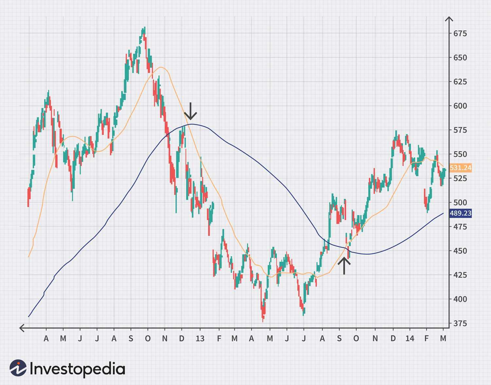

The integration of technology and data-driven insights has significantly transformed the trading landscape. This modernization has empowered traders with sophisticated tools and methodologies that enhance their capabilities in the financial markets. Key elements of contemporary trading involve the understanding and application of stock indicators, trend trading, technical analysis, and algorithmic trading. Each of these components plays a vital role in enabling traders to make informed decisions.

Stock indicators, derived from mathematical calculations based on price and volume data, serve as essential tools for analyzing market conditions. Common indicators like Moving Averages, Relative Strength Index (RSI), and Moving Average Convergence Divergence (MACD) help traders predict future price movements. Trend trading builds on this by focusing on capitalizing on the directional movement of stocks, aiming to profit from upward or downward trends. Indicators such as Supertrend and Average Directional Index (ADX) facilitate the identification of these trends.



Technical analysis complements the use of indicators by employing historical market data to forecast future price directions. This involves examining charts and patterns, such as candlestick formations and trend lines, to make strategic trading decisions. Meanwhile, algorithmic trading automates these processes through pre-programmed strategies, using technical indicators to quickly execute buy and sell orders with high precision. Platforms like uTrade Algos enable traders to leverage these algorithmic frameworks effectively, enhancing their operational efficiency.

By combining these components, traders can develop robust strategies that improve the accuracy and profitability of their trades. However, these tools and strategies must be used judiciously, taking into consideration their potential limitations and the dynamic nature of financial markets. As traders continue to adapt and refine their approaches, the fusion of data-driven insights and technology stands as a cornerstone of modern trading success.

## Table of Contents

## Understanding Stock Indicators

Stock indicators are mathematical tools that help traders interpret market conditions and predict future price movements. They rely primarily on a security’s price, volume, and open interest. By applying different formulas to these data points, traders can gain insights into market trends and make informed decisions.

One of the most commonly used stock indicators is the Moving Average (MA). Moving Averages smooth out price data to identify trend directions over specific periods. There are several types of moving averages, with the Simple Moving Average (SMA) and the Exponential Moving Average (EMA) being the most popular. The formula for a Simple Moving Average over $n$ periods is:

$$
SMA = \frac{\text{Price}_1 + \text{Price}_2 + \ldots + \text{Price}_n}{n}
$$

An Exponential Moving Average gives more weight to recent prices, thus being more responsive to new information. The EMA calculation involves a multiplier, $\alpha$, which is determined as follows:

$$
\alpha = \frac{2}{n+1}
$$

The updated EMA is calculated with the formula:

$$
EMA_{\text{today}} = \text{Price}_{\text{today}} \times \alpha + EMA_{\text{yesterday}} \times (1-\alpha)
$$

Another critical indicator is the Relative Strength Index (RSI), which measures the speed and change of price movements and is used to identify overbought or oversold conditions in a market. The RSI is calculated using the average of gains and losses over a specified period, often 14 days. The RSI is expressed as:

$$
RSI = 100 - \frac{100}{1 + \frac{\text{Average Gain}}{\text{Average Loss}}}
$$

A common interpretation is that an RSI above 70 indicates an overbought situation, while an RSI below 30 suggests an oversold condition.

The Moving Average Convergence Divergence (MACD) is another valuable tool that highlights changes in the strength, direction, [momentum](/wiki/momentum), and duration of a trend in a stock's price. It is calculated by subtracting a 26-day EMA from a 12-day EMA. The result is the MACD line. From this, a 9-day EMA of the MACD line, known as the signal line, is plotted to generate buy and sell signals:

$$
MACD = EMA_{12-day} - EMA_{26-day}
$$

When the MACD crosses above the signal line, it is a bullish signal indicating that it may be a good time to buy. Conversely, when the MACD crosses below the signal line, it is a bearish signal suggesting that it may be a suitable time to sell.

These indicators, when utilized effectively, assist traders in making informed decisions by providing a systematic approach to evaluate securities. However, combining multiple indicators often gives a more comprehensive understanding of market conditions, reducing the risk of false signals.

## Trend Trading Explained

Trend trading is a popular investment strategy that aims to capitalize on the momentum of a stock moving in a particular direction. This approach is grounded in the principle of identifying and following the price trend of a stock, which can manifest as either an upward or downward trajectory. Traders who employ this strategy typically buy stocks that are trending upward and sell them when the market shows signs of reversing.

To effectively implement trend trading, certain indicators are essential. One widely used tool is the Supertrend indicator, which provides buy or sell signals based on price action and [volatility](/wiki/volatility-trading-strategies). The Supertrend is calculated using the Average True Range (ATR) to assess market volatility and set trailing stop-loss levels. This helps traders determine entry and [exit](/wiki/exit-strategy) points, maintaining positions as long as the price sustains the trend.

Another vital indicator in trend trading is the Average Directional Index (ADX), developed by J. Welles Wilder. The ADX quantifies the strength of a trend, ranging from 0 to 100, with higher values indicating stronger trends. A typical approach might involve considering values above 25 as a strong trend, where traders might favor taking positions. The ADX does not indicate the direction of the trend but its intensity, making it a critical tool for confirming the presence of a significant trend before executing trades.

Trend trading strategies rely on a strong understanding of market dynamics and demand constant alertness to changes in prices and market sentiment. By leveraging these indicators, traders can make informed decisions that align with prevailing market trends, increasing the potential for profitable outcomes.

## Role of Technical Analysis

Technical analysis serves as a fundamental approach in financial markets, focusing on utilizing historical data and technical indicators to predict future price movements. This method relies on the premise that all relevant market information has already been reflected in the price, hence the analysis of price changes over time can provide insights into future trends.

One critical aspect of technical analysis is chart analysis, which involves examining various types of charts that represent price movements over a certain period. Popular chart types include line charts, bar charts, and candlestick charts. Candlestick patterns, in particular, are crucial as they provide visual insights into price actions. These patterns, such as “Doji”, “Hammer”, and “Engulfing” patterns, can indicate potential reversals or continuations in the market trend.

Trend lines are another essential tool used in technical analysis. They are drawn on charts to illustrate the general direction of the price movement—either upward, downward, or sideways. By connecting significant highs or lows, trend lines help identify areas of potential support or resistance. These lines are pivotal in determining entry and exit points for trades, as they can signal when a trend is likely to continue or reverse.

Support and resistance levels are also integral to technical analysis. Support levels are where the price tends to stop falling and may start rising due to increased buying interest. Conversely, resistance levels are where the price tends to stop rising and may start to decline due to increased selling pressure. Recognizing these levels allows traders to predict potential price movements and make informed trading decisions.

Additionally, technical indicators such as Moving Averages (MA), Relative Strength Index (RSI), and Moving Average Convergence Divergence (MACD) complement these charts and patterns. These mathematical calculations convert price information into signals that help traders anticipate shifts in market behavior.

In conclusion, technical analysis is a valuable tool that combines various analytical methods to understand historical price behavior, thereby aiding traders in making strategic trading decisions. Understanding and effectively implementing these elements enhance the ability to predict market trends and improve trading outcomes.

 to Algo Trading

Algorithmic trading, often referred to as algo trading, involves the use of computer programs and algorithms to execute trades automatically. This method is designed to perform trading activities at speeds and frequencies that are impossible for human traders. By leveraging pre-programmed strategies, [algorithmic trading](/wiki/algorithmic-trading) can accurately and swiftly generate buy and sell signals based on various technical indicators and market data.

One of the key advantages of algo trading is its ability to eliminate the emotional and psychological biases typically associated with manual trading. Algorithms are objectively programmed to respond to specific market conditions, thus ensuring consistent execution of trades irrespective of market volatility.

Algo trading extensively uses technical indicators such as Moving Averages, Relative Strength Index (RSI), and Moving Average Convergence Divergence (MACD) to make informed trading decisions. These indicators are integrated into algorithms that continuously monitor and analyze market data, identifying opportunities with precision and executing trades at optimal times.

Popular platforms like uTrade Algos serve as conduits for traders to implement complex trading strategies. These platforms provide the necessary infrastructure and tools for designing, [backtesting](/wiki/backtesting), and deploying automated trading algorithms that cater to the specific needs of traders. For instance, a trader using uTrade Algos can write a Python script to implement a trading strategy based on the crossover of short-term and long-term moving averages:

```python
# Example of a simple moving average crossover strategy
def moving_average_crossover_strategy(data, short_window=40, long_window=100):
    signals = pd.DataFrame(index=data.index)
    signals['signal'] = 0.0

    # Calculate short and long moving averages
    signals['short_mavg'] = data['Close'].rolling(window=short_window, min_periods=1, center=False).mean()
    signals['long_mavg'] = data['Close'].rolling(window=long_window, min_periods=1, center=False).mean()

    # Generate signals
    signals['signal'][short_window:] = np.where(signals['short_mavg'][short_window:] > signals['long_mavg'][short_window:], 1.0, 0.0)

    # Calculate trading orders
    signals['positions'] = signals['signal'].diff()

    return signals

# Usage example
# signals = moving_average_crossover_strategy(stock_data)
```

This code snippet outlines a basic moving average crossover strategy that generates signals when a short-term moving average exceeds a long-term moving average, indicating a potential buy opportunity.

The effectiveness of algorithmic trading lies not only in its speed and accuracy but also in the ability to backtest trading strategies, optimize parameters, and minimize transaction costs. However, it is essential to recognize the potential risks and challenges, such as system failures and market mispricing, which necessitate thorough testing and continuous monitoring of algorithmic performance. Overall, algorithmic trading has transformed the landscape of financial markets, offering traders unparalleled efficiency and precision.

## Combining Indicators for Success

Successful traders often integrate various indicators to construct robust trading strategies, enhancing both accuracy and the probability of successful trades. By combining indicators, traders can filter out market noise and reduce the likelihood of false signals, creating a more reliable framework for decision-making.

One common approach is pairing the Moving Average Convergence Divergence (MACD) with the Relative Strength Index (RSI). The MACD is a trend-following momentum indicator that reveals the relationship between two moving averages of a security’s price. It is composed of the MACD line, signal line, and histogram. Traders typically interpret signals from the MACD when the MACD line crosses above or below the signal line, indicating potential buy or sell signals.

On the other hand, RSI is a momentum oscillator that measures the speed and change of price movements on a scale of 0 to 100, typically assessing whether a security is overbought or oversold. An RSI below 30 is generally considered oversold, while an RSI above 70 is regarded as overbought.

By combining MACD with RSI, traders can confirm trade signals. For instance, if the MACD indicates a bullish crossover (where the MACD line crosses above the signal line), simultaneously having an RSI rise above the 30 level can confirm a potential buy signal. This dual validation reduces the potential for reacting to false positives, thus providing a more robust trading framework.

To ensure these combinations work effectively across different market conditions, backtesting is vital. Backtesting involves applying a trading strategy to historical data to evaluate its effectiveness. This process helps traders assess how the combination of indicators would have performed in past market environments, allowing them to identify patterns, refine strategies, and understand possible risks.

Here is a simple example of how one might set up a backtest in Python using historical price data with MACD and RSI:

```python
import pandas as pd
import numpy as np
import talib

# Load historical price data
data = pd.read_csv('historical_data.csv')

# Calculate MACD
data['MACD'], data['MACD_signal'], _ = talib.MACD(data['Close'])

# Calculate RSI
data['RSI'] = talib.RSI(data['Close'])

# Define conditions for buy and sell signals
conditions_buy = (data['MACD'] > data['MACD_signal']) & (data['RSI'] < 30)
conditions_sell = (data['MACD'] < data['MACD_signal']) & (data['RSI'] > 70)

# Execute backtest
data['position'] = np.where(conditions_buy, 1, np.where(conditions_sell, -1, 0))
data['strategy_returns'] = data['position'].shift(1) * data['Returns']

# Calculate cumulative returns from strategy
data['cumulative_strategy_returns'] = (1 + data['strategy_returns']).cumprod()

# Evaluate performance
print(data[['Date', 'cumulative_strategy_returns']])
```

In this script, the strategy buys when both MACD indicates a bullish crossover, and RSI is below 30, and sells when the signals are inverse. This example helps in evaluating how the strategy performs across various market conditions. By refining these strategies through testing and validation, traders can significantly enhance their trading accuracy and profitability.

## Challenges and Considerations

While indicators provide critical insights into market trends and potential trading opportunities, relying solely on them can be misleading. This is because most stock indicators are based on past price data and are inherently lagging. For instance, indicators such as moving averages or the Moving Average Convergence Divergence (MACD) reflect what has already occurred rather than predicting future movements. This lag can result in missed opportunities or entry and exit points that are less than optimal.

One primary challenge traders face when using indicators is the risk of lagging signals. Lagging indicators, while helpful in confirming trends, can also lead to delayed responses to market changes. For example, a moving average crossover may signal a buy or sell several price points after a new trend has begun, potentially causing traders to lose part of the profit by entering or exiting a trade late.

To address these challenges, traders must adapt their strategies to current market conditions. This involves not only relying on historical data but also considering real-time market factors, such as economic news, geopolitical events, and changes in market sentiment. For example, integrating leading indicators or real-time data feeds can enhance the responsiveness of a trading strategy.

Continual learning and adaptation are crucial in navigating the ever-changing trading landscape. The dynamic nature of financial markets necessitates constant reevaluation and adjustment of trading strategies. Educating oneself about new tools, techniques, and technologies in trading can provide a competitive edge. Traders should engage in activities such as backtesting new strategies on historical data and participating in trading seminars or workshops to stay informed about the latest market trends and technologies.

Here is a basic Python script for backtesting a simple moving average crossover strategy, illustrating how traders can test the effectiveness of their strategies before applying them in real-life trading scenarios:

```python
import pandas as pd
import numpy as np

# Importing historical data
data = pd.read_csv('historical_stock_data.csv')

# Calculating moving averages
data['SMA50'] = data['Close'].rolling(window=50).mean()
data['SMA200'] = data['Close'].rolling(window=200).mean()

# Generating trading signals
data['Signal'] = 0
data.loc[data['SMA50'] > data['SMA200'], 'Signal'] = 1
data.loc[data['SMA50'] < data['SMA200'], 'Signal'] = -1

# Calculating strategy returns
data['Strategy Returns'] = data['Signal'].shift(1) * data['Returns']
cumulative_returns = np.cumprod(data['Strategy Returns'] + 1) - 1

# Output the results
print(f'Cumulative Strategy Returns: {cumulative_returns.iloc[-1]:.2%}')
```

This script helps evaluate how the strategy would have performed in past market conditions, allowing traders to refine their approach for better future performance. By understanding and adapting to the limitations and benefits of stock indicators, traders can create more robust and effective trading strategies.

## Conclusion

The integration of stock indicators, trend trading, and technical analysis with algorithmic trading technologies has profoundly changed trading strategies. The synergy of these components provides traders with sophisticated tools to enhance decision-making, optimize trade execution, and improve profitability. However, an adept understanding of their complex nature and inherent limitations is essential.

Stock indicators serve as a foundation for gauging market conditions through mathematical calculations derived from price, [volume](/wiki/volume-trading-strategy), or open interest. These tools can help in identifying trends and potential reversals, thereby forming the bedrock of informed trading decisions. However, relying solely on indicators may result in misleading conclusions, especially if they are not adapted to current market contexts.

Trend trading allows investors to align with the predominant direction of a stock, promising rewards from established momentum. Nonetheless, the dynamic and often unpredictable nature of market trends demands a vigilant approach, balancing between engagement and restraint.

Technical analysis, which involves the examination of historical data and patterns, remains indispensable for forecasting price movements. This method complements algorithmic trading, where pre-programmed strategies execute trades based on real-time data. Platforms such as uTrade Algos facilitate these automated trades, enabling swift and precise market engagement.

To harness the full potential of these technologies, traders must combine various indicators to form comprehensive strategies. For instance, merging the Moving Average Convergence Divergence (MACD) with the Relative Strength Index (RSI) can provide more reliable signals, reducing the risk of false positives. The effectiveness of these combinations can be validated through rigorous backtesting, ensuring their reliability in diverse market scenarios.

While technology offers remarkable advantages, its application requires continuous learning and adaptation. The market is ever-evolving, and traders must remain vigilant, adjusting their strategies to align with emerging trends and conditions. By fusing these powerful trading tools with thoughtful consideration and strategic insight, one can achieve greater precision and profitability in trading ventures.

## References & Further Reading

[1]: Wilder, J. Welles. (1978). ["New Concepts in Technical Trading Systems."](https://archive.org/details/newconceptsintec00wild) Trend Research. 

[2]: Murphy, John J. (1999). ["Technical Analysis of the Financial Markets."](https://archive.org/details/technicalanalysi0000murp) New York Institute of Finance.

[3]: Pring, Martin J. (2002). ["Technical Analysis Explained: The Successful Investor's Guide to Spotting Investment Trends and Turning Points."](https://www.amazon.com/Technical-Analysis-Explained-Fifth-Successful/dp/0071825177) McGraw-Hill.

[4]: Kaufman, Perry J. (2013). ["Trading Systems and Methods."](https://onlinelibrary.wiley.com/doi/book/10.1002/9781119202561) Wiley.

[5]: Chan, Ernest P. (2008). ["Quantitative Trading: How to Build Your Own Algorithmic Trading Business."](https://github.com/ftvision/quant_trading_echan_book) Wiley.