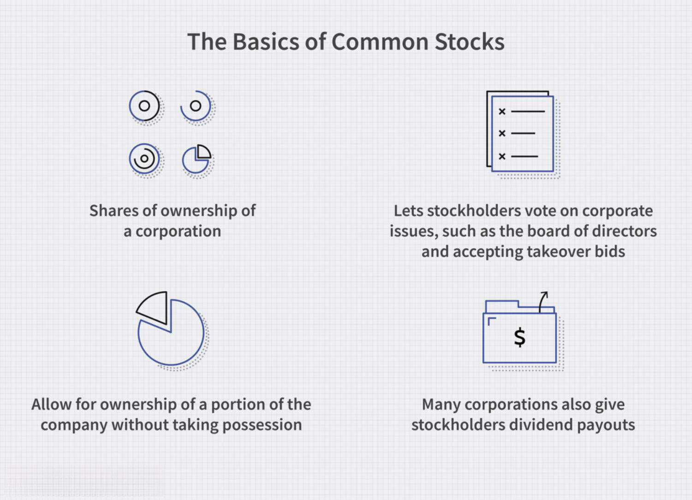

In the world of investment, understanding the different types of stock—common stock and preferred stock—is vital. These financial instruments provide a gateway for individuals and institutions to participate in the equity of a company, offering varied rights and privileges. Common stock represents ownership stakes, allowing shareholders to influence corporate decisions through voting, while preferred stock often prioritizes dividend payments over voting rights, presenting a more stable income stream.

With advancements in technology, trading stocks has evolved, particularly through the growth of algorithmic trading. This method employs complex algorithms to execute trades at speeds and frequencies that are impossible for human traders. As a result, algorithmic trading has altered the dynamics of the stock market, influencing how both common and preferred stocks are traded.



This article will explore the essential characteristics of common and preferred stock, their respective pros and cons, and how algorithmic trading plays an influential role in modern stock markets. By understanding these concepts, investors can make informed decisions and better navigate the complexities of today's financial environment.

## Table of Contents

## What is Common Stock?

Common stock denotes equity ownership in a corporation, granting shareholders a fractional claim on the company's assets and profits. When an investor buys common stock, they gain various rights, most significantly the ability to vote on key corporate issues. These issues often include the election of board directors, approval of major corporate policies, and decisions pertaining to mergers and acquisitions. This voting power is typically distributed on a 'one share, one vote' basis, meaning the influence of a shareholder is proportional to their level of investment in the company.

In addition to voting rights, common stockholders often benefit from the potential appreciation in stock value, which provides opportunities for long-term capital gains. Unlike preferred stock, which offers a fixed dividend, common stock dividends can vary and are issued at the discretion of the company's board. As such, common stockholders are subject to higher risk, particularly in the event of company liquidation, as they are ranked below preferred shareholders when claims on assets are settled.

While common stock does not guarantee dividends, many corporations opt to distribute portions of their profits as dividends to stockholders as a means to attract and retain investors. This potential for profit-sharing, coupled with voting rights, makes common stock an attractive option for investors seeking capital growth and influence within a corporation.

## What is Preferred Stock?

Preferred stock is a class of ownership in a corporation that grants shareholders certain rights and privileges. One of the defining characteristics of preferred stock is its preferential treatment concerning dividends and asset claims. Typically, preferred stockholders receive dividend payments before common shareholders, giving them a more predictable income stream. These dividends are usually fixed, meaning they remain constant over time, providing a level of income stability to investors.

Additionally, in scenarios such as liquidation, preferred stockholders have a higher claim on the company’s assets compared to common stockholders. This means that if a company is dissolved and its assets are liquidated, preferred stockholders are prioritized over common stockholders when it comes to asset distribution. However, this enhanced claim does not guarantee full recovery of their investment should the company have insufficient assets to cover all its liabilities and shareholder equity.

Notably, preferred stockholders typically do not possess voting rights, which is a key distinction from common stockholders. This lack of voting power implies that preferred shareholders have little influence over corporate governance matters, such as electing the board of directors or approving major corporate policies and transactions.

Preferred stock can also come with other features such as convertibility into common shares, redemption options, and callability. Convertible preferred stock grants the holder the right to convert their preferred shares into a predetermined number of common shares, potentially allowing them to participate in the equity appreciation of the company. Callable preferred stock can be redeemed by the issuing company after a certain period or specific conditions, allowing the company flexibility to manage its capital structure.

Overall, preferred stock serves as a hybrid financial instrument that combines elements of debt and equity, offering fixed returns similar to bonds while representing ownership in the issuing company. This makes it an attractive option for investors seeking a balance between income and equity investment.

## Common Stock vs. Preferred Stock

When considering an investment in the stock market, understanding the distinction between common stock and preferred stock is essential. These two types of equity securities differ significantly in terms of voting rights, dividends, and risk levels, each offering distinct benefits and drawbacks to investors.

**Voting Rights:** One of the primary differences between common and preferred stocks lies in voting rights. Common stockholders are granted the power to vote on significant corporate matters, such as electing the board of directors and approving major corporate policies. This voting capability gives common shareholders a voice in the management and strategic direction of the company. In contrast, preferred stockholders typically do not have voting rights, which means they have limited influence on the company's decisions.

**Dividends:** Dividends are another area where common and preferred stocks diverge. Preferred stock is generally associated with fixed dividend payments, making it an attractive option for investors seeking steady income. These dividends are typically paid out before any dividends are distributed to common shareholders, making preferred stock a preferred choice for income-focused investors. On the other hand, common stock dividends are not guaranteed. They can vary based on the company's profitability and dividend distribution policies, offering potentially higher returns but also presenting more uncertainty.

**Risk Levels:** In terms of risk, common stock is generally considered to have a higher risk profile compared to preferred stock. Common stock investors face the possibility of greater capital appreciation, but they also bear the downside risk of price volatility and potential losses. Additionally, in the event of corporate bankruptcy or liquidation, common stockholders are among the last to be compensated, following the settlement of debts and preferred stockholders. Preferred stock, being less volatile, comes with a lower risk level, particularly concerning dividend payments and asset claims. Preferred shareholders have a higher claim on assets than common shareholders if the company is liquidated, providing them with an added layer of security.

In summary, the choice between common and preferred stock depends on an investor's financial goals, risk tolerance, and preference for specific benefits, such as voting rights or fixed income. Understanding these differences is crucial for making informed investment decisions in the stock market.

## Pros and Cons of Common Stock

Common stock is a fundamental component of the stock market, offering various pros and cons that investors must consider. **Higher potential returns** form one of the most significant advantages of common stock. As shareholders, individuals benefit from the company's growth and profitability. When a corporation performs well, the value of its common stock tends to increase, enabling shareholders to earn capital gains. Combined with dividends, these capital gains can provide a substantial return on investment, making common stock an attractive option for many investors seeking growth in their portfolios.

Additionally, common stockholders typically enjoy **voting rights**, allowing them to have a say in corporate matters. This includes voting on directives such as mergers and acquisitions, as well as electing the board of directors. These voting rights offer investors a degree of influence over the strategic direction of the company, aligning shareholder interests with management's decisions.

However, investing in common stock does come with its set of drawbacks. One notable con is **dividend uncertainty**. Unlike preferred stock, which generally pays fixed dividends, common stock dividends are often variable and dependent on the company's financial performance and profit allocation decisions. This variability means that dividend payouts may fluctuate or even be suspended during periods of financial hardship or reinvestment, causing potential issues for investors relying on dividends for income.

Furthermore, common stocks inherently [carry](/wiki/carry-trading) a **higher risk profile**, especially in scenarios involving corporate liquidation. In the event of liquidation, common stockholders stand last in the priority sequence for asset distribution. This means that they are least likely to recover their initial investment, as creditors and preferred shareholders receive payouts first. Consequently, common stock investments are subject to greater [volatility](/wiki/volatility-trading-strategies) and vulnerability to the company's financial health and market dynamics, which requires a thorough analysis by the investor.

These factors necessitate a balanced approach when considering common stock investments. While the potential returns and governance rights can be appealing, investors must weigh these benefits against the inherent risks and uncertainties associated with common stock ownership.

## Pros and Cons of Preferred Stock

Preferred stock represents a unique class of equity that offers several distinct advantages and disadvantages when compared to common stock. 

**Pros of Preferred Stock**

One of the primary benefits of preferred stock is the receipt of fixed dividends. Unlike common stock, where dividends are contingent upon a company's profitability and discretion, preferred stockholders are entitled to a predetermined dividend amount. This provides a more predictable income stream, which can be particularly appealing to income-focused investors. The fixed dividend feature makes preferred stock resemble debt instruments like bonds in its risk-return profile.

Another significant advantage of preferred stock is its higher claim on a company’s assets during liquidation. In the event of bankruptcy, preferred shareholders are prioritized over common shareholders, meaning they have a better chance of recovering their investment. This higher liquidation preference reduces the potential loss in scenarios where a company faces financial distress.

**Cons of Preferred Stock**

Despite these advantages, preferred stock comes with several limitations. A notable disadvantage is the lack of voting rights. Unlike common shareholders who can influence corporate governance through voting on critical issues and electing the board of directors, preferred shareholders typically do not have a say in these matters. This lack of influence in corporate decision-making can be a drawback for those who wish to have an active role in the management and strategic direction of the company.

Furthermore, preferred stock generally offers lower growth potential compared to common stock. Common shares have the potential for capital appreciation, especially in rapidly growing companies. In contrast, preferred shares tend to have less price volatility and limited upside, given their fixed dividend nature. As a result, preferred stock may not be the ideal choice for investors seeking substantial capital gains.

In summary, preferred stock can be a valuable investment vehicle for those seeking stable income and lower risk, especially in bankruptcy situations. However, the trade-offs include giving up voting rights and accepting a potentially lower return on investment compared to common stock.

## How to Invest in Common Stock

Investing in common stock involves purchasing shares directly through stock exchanges. This ownership stake in a corporation is accessible through various trading platforms, enabling investors to potentially benefit from the company’s growth and profitability. When considering investment in common stock, assessing several key factors is essential to making informed decisions.

One critical consideration is the market capitalization of the company, which is calculated by multiplying the current share price by the total number of outstanding shares. Market capitalization provides insight into the company’s size and overall market value, categorizing it into large-cap, mid-cap, or small-cap stocks. Typically, large-cap stocks belong to well-established companies with stable earnings, while small-cap stocks may offer higher growth potential but come with increased volatility and risk.

Another important [factor](/wiki/factor-investing) is the growth potential of the company. This involves evaluating the company’s business model, competitive advantages, financial health, and potential market or industry trends. Investors might analyze financial statements, earnings reports, and future earnings projections to gauge the growth trajectory of the company. Moreover, understanding the industry dynamics and how the company positions itself within its sector can provide valuable insights into growth prospects.

To aid in investment decisions, many investors conduct a [fundamental analysis](/wiki/fundamental-analysis), which includes assessing the company's price-to-earnings (P/E) ratio, return on equity (ROE), and debt-to-equity ratio. These metrics help in determining whether the stock is fairly valued and its efficiency in generating profits relative to shareholder equity.

Finally, investors often diversify their portfolios to mitigate risk, spreading investments across various stocks, sectors, and asset classes. This strategy is aimed at minimizing the impact of poor performance in one particular area, thereby stabilizing the potential return on the overall investment.

Thorough research and strategic planning are crucial when investing in common stock, as these practices enable investors to optimize their opportunities while managing risks effectively.

## How to Invest in Preferred Stock

When investing in preferred stock, it is important to understand its unique features compared to common stock. Preferred stock typically offers fixed dividends, making it appealing to investors seeking stable income. However, unlike common stockholders, preferred stockholders usually do not have voting rights. 

To begin investing in preferred stock, it is crucial to conduct thorough research on various factors. One major consideration is the dividend yield, which indicates the income return from an investment in preferred stock. The dividend yield can be calculated using the formula:

$$
\text{Dividend Yield} = \frac{\text{Annual Dividends per Share}}{\text{Price per Share}}
$$

A higher yield often appeals to income-focused investors, but it is also essential to balance considerations of risk and return.

Another key aspect is the convertibility of preferred stock. Some preferred stocks are convertible into common shares, providing potential for capital appreciation. When evaluating convertible preferred stocks, investors should assess the conversion ratio and conversion price, which determine the relative value of the conversion feature compared to the fixed dividends.

An essential factor in preferred stock investment is the issuing company's financial stability and creditworthiness. Preferred stockholders have a higher claim on assets than common stockholders in the event of liquidation, but they must still consider the issuer's ability to maintain its dividend payments and overall financial health. Reviewing credit ratings and financial statements can offer insights into a company's stability.

Preferred stocks can be purchased through stock exchanges using brokerage accounts. Investors may also consider preferred stock ETFs or mutual funds, which provide diversified exposure to a variety of preferred stocks, allowing for risk mitigation.

In summary, investing in preferred stock involves scrutinizing dividend yields, convertibility options, and the financial stability of the issuing company. These elements help ensure that investments align with an investor's financial goals and risk tolerance. Understanding these components is crucial for making informed decisions in preferred stock investments.

## Algorithmic Trading and Stock Types

Algorithmic trading, also known as algo trading, involves the use of computer algorithms to automate and execute trades. These algorithms are designed to make trading decisions, submit orders, and manage positions based on various sets of instructions which could range from simple conditions to complex mathematical models. The primary advantage is efficiency—it enables the execution of orders at speeds and frequencies impossible for a human trader, thus minimizing the impact of human emotions and biases.

One of the critical influences of [algorithmic trading](/wiki/algorithmic-trading) is on [liquidity](/wiki/liquidity-risk-premium) and market efficiency. By automating the process, a high [volume](/wiki/volume-trading-strategy) of stocks—both common and preferred—can be traded instantly, thereby contributing significantly to the liquidity of markets. This liquidity facilitates smoother and more efficient market operations, narrowing bid-ask spreads and potentially reducing trading costs for investors.

For common stock, which is typically characterized by higher volatility and potential returns, algorithmic trading can exploit short-term price fluctuations, thereby enhancing the ability to capitalize on market inefficiencies. These algorithms can be programmed to execute a variety of strategies such as [trend following](/wiki/trend-following), [arbitrage](/wiki/arbitrage), and [statistical arbitrage](/wiki/statistical-arbitrage), each tailored to leverage specific opportunities within common stock trading.

In the context of preferred stock, algorithmic trading is effective in executing strategies that capitalize on the fixed income-like features of these securities. Algo trading strategies can be designed to identify optimal entry and [exit](/wiki/exit-strategy) points based on changing interest rates or volatility forecasts, providing stability and precision in managing investments with fixed dividends.

Algorithmic trading in both stock types also aids in risk management. By utilizing stop-loss and take-profit targets, algorithms can automatically mitigate potential losses and secure gains, ensuring that portfolios remain aligned with an investor's risk tolerance. These risk management strategies are particularly valuable in managing the unique risk profiles of common and preferred stocks.

Python, with its comprehensive libraries such as NumPy, pandas, and libraries specifically designed for algorithmic trading like QuantConnect and Zipline, provides an efficient environment for developing and testing trading algorithms. Below is an example of a simple moving average strategy implemented in Python:

```python
import pandas as pd
import numpy as np

# Load stock data
data = pd.read_csv('stock_data.csv')

# Calculate short-term and long-term moving averages
short_window = 40
long_window = 100

data['Short_MA'] = data['Close'].rolling(window=short_window, min_periods=1).mean()
data['Long_MA'] = data['Close'].rolling(window=long_window, min_periods=1).mean()

# Define the trading signals
data['Signal'] = 0
data['Signal'][short_window:] = np.where(data['Short_MA'][short_window:] > data['Long_MA'][short_window:], 1, 0)

# Generate trading orders
data['Position'] = data['Signal'].diff()

# Output signals
print(data[['Close', 'Short_MA', 'Long_MA', 'Signal', 'Position']])
```

The role of algorithmic trading in modern financial markets cannot be overstated. Its ability to process vast amounts of data and execute trades in milliseconds transforms the landscape for trading common and preferred stocks, offering a plethora of opportunities and complexities for today's investors.

## Conclusion

Both common and preferred stocks have their unique advantages and disadvantages that cater to different investor preferences and risk appetites. Common stocks are attractive for investors seeking higher potential returns and a say in corporate governance through voting rights. However, they come with increased risks due to dividend variability and lower priority in asset claims during liquidation.

Preferred stocks, on the other hand, appeal to investors who prioritize income stability and reduced risk. These stocks typically offer fixed dividends and have a senior claim on assets, providing a buffer in financial downturns. However, they generally lack the voting rights associated with common stock and offer limited potential for capital appreciation.

Algorithmic trading is significantly reshaping stock market dynamics by introducing new efficiencies and complexities. It allows for high-speed trading, superior liquidity management, and volume handling beyond human capabilities. For both common and preferred stocks, algorithmic trading can facilitate tighter spreads and improved market efficiency. Nonetheless, it also introduces challenges like increased market fragility and the potential for algorithm-led flash crashes, requiring investors to remain vigilant and informed about the technology's impacts. As the landscape evolves, staying informed about these stock types and the influence of algorithmic strategies will be crucial for making informed investment decisions.

## References & Further Reading

[1]: ["Common Stocks and Uncommon Profits and Other Writings"](https://www.amazon.com/Common-Stocks-Uncommon-Profits-Writings/dp/0471445509) by Philip A. Fisher

[2]: ["Preferred Stock Investing"](https://www.kiplinger.com/investing/602804/preferred-stock-should-i-buy-it) by Doug K. Le Du

[3]: Hendershott, T., Jones, C. M., & Menkveld, A. J. (2011). ["Does Algorithmic Trading Improve Liquidity?"](https://onlinelibrary.wiley.com/doi/full/10.1111/j.1540-6261.2010.01624.x) The Review of Financial Studies, 24(8), 2247-2276.

[4]: Narang, R. K. (2013). ["Inside the Black Box: A Simple Guide to Quantitative and High-Frequency Trading"](https://onlinelibrary.wiley.com/doi/book/10.1002/9781118662717) 

[5]: Hasbrouck, J., & Saar, G. (2013). ["Low-latency trading."](https://papers.ssrn.com/sol3/papers.cfm?abstract_id=1695460) The Review of Financial Studies, 26(9), 2094-2139.

[6]: ["The Intelligent Investor: The Definitive Book on Value Investing"](https://www.amazon.com/Intelligent-Investor-Third-Definitive-Investing/dp/0063423537) by Benjamin Graham

[7]: Aldridge, I. (2013). ["High-Frequency Trading: A Practical Guide to Algorithmic Strategies and Trading Systems"](https://www.amazon.com/High-Frequency-Trading-Practical-Algorithmic-Strategies/dp/1118343506)