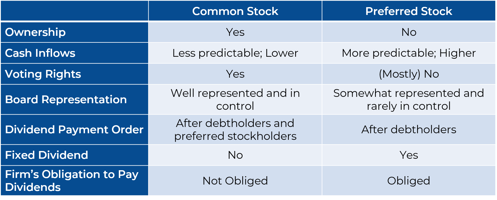

## Table of Contents

## What is common stock?

Common stock is a type of stock that companies offer to the public. When you buy common stock, you become a part-owner of the company. This means you have a say in how the company is run, usually by voting at shareholder meetings. Common stock is different from other types of stock because it comes with voting rights and the chance to earn dividends, which are payments companies make to shareholders from their profits.

However, owning common stock also comes with risks. If the company does well, the value of your stock can go up, and you might earn more dividends. But if the company does poorly, the value of your stock can go down, and you might not get any dividends at all. In the worst case, if the company goes bankrupt, common stockholders are the last to get any money back, after everyone else like creditors and bondholders have been paid.

## What is preferred stock?

Preferred stock is another type of stock that companies can issue. It's different from common stock because it usually doesn't give you voting rights. This means you can't vote on company decisions like common stockholders can. But, preferred stock has some advantages. It usually pays a fixed dividend, which means you get a regular payment from the company. This can be nice because it's more predictable than the dividends from common stock, which can change or stop altogether.

Another big advantage of preferred stock is that it gets paid before common stock if the company has money to share. If the company goes bankrupt, preferred stockholders get their money back before common stockholders, but after creditors and bondholders. This makes preferred stock a bit safer than common stock, but it also means it might not grow in value as much as common stock if the company does really well. So, preferred stock is like a middle ground between common stock and bonds.

## What are the key differences between common stock and preferred stock?

Common stock and preferred stock are two different types of stocks that companies can offer to investors. Common stock gives you the right to vote on company decisions, like who should be on the board of directors. This means you have a say in how the company is run. On the other hand, preferred stock usually doesn't come with voting rights, so you don't get to vote on these decisions. Instead, preferred stock often pays a fixed dividend, which means you get a regular payment from the company. This can be more predictable than the dividends from common stock, which can change or stop.

Another big difference is how they are treated if the company runs into trouble. If a company goes bankrupt, preferred stockholders get paid back before common stockholders, but after creditors and bondholders. This makes preferred stock a bit safer than common stock. However, if the company does really well, common stock can grow in value more than preferred stock. So, common stock has more potential for big gains, but it also comes with more risk. Preferred stock is like a middle ground between common stock and bonds, offering more stability but less chance for big growth.

## How does common stock contribute to company ownership?

When you buy common stock, you become a part-owner of the company. This means you have a share in the company and can have a say in how it's run. The more common stock you own, the bigger your ownership in the company. Common stockholders get to vote on important decisions, like who should be on the board of directors or if the company should make big changes. This voting power gives you a voice in the company's future.

However, owning common stock also comes with risks. If the company does well, the value of your stock can go up, and you might get dividends, which are payments from the company's profits. But if the company does poorly, the value of your stock can go down, and you might not get any dividends. In the worst case, if the company goes bankrupt, common stockholders are the last to get any money back, after everyone else like creditors and bondholders have been paid. So, common stock can make you a part-owner, but it also means you share in the company's ups and downs.

## What are the voting rights associated with common stock?

When you own common stock, you get to vote on important decisions about the company. This is called having voting rights. The number of votes you have usually depends on how many shares of common stock you own. For example, if you have 100 shares, you get 100 votes. Common stockholders often vote on things like who should be on the board of directors, which is a group of people who help run the company. They might also vote on big changes the company wants to make, like merging with another company or making big investments.

Voting rights are a big part of owning common stock because they let you have a say in how the company is run. This is different from preferred stock, which usually doesn't come with voting rights. At shareholder meetings, which are like big meetings where all the owners come together, common stockholders can vote on the issues that come up. This gives them a way to influence the company's future and make sure their interests are taken care of.

## What are the dividend characteristics of preferred stock?

Preferred stock usually pays a fixed dividend. This means you get a regular payment from the company, and it stays the same unless the company changes it. This is different from common stock, where dividends can go up or down or even stop. With preferred stock, you know how much money you'll get, which can make it easier to plan your finances.

Another thing about preferred stock dividends is that they get paid before common stock dividends. If the company has money to share, it pays preferred stockholders first. This makes preferred stock a bit safer than common stock because you're more likely to get your dividend, even if the company is having a tough time. But, if the company can't pay all its dividends, preferred stockholders might miss out too, though they would still get paid before common stockholders.

## Can preferred stock be converted into common stock? If so, how?

Yes, some preferred stock can be converted into common stock. This type of preferred stock is called convertible preferred stock. When you have convertible preferred stock, you have the option to exchange it for a certain number of common shares. The company will tell you how many common shares you get for each preferred share. This can be a good thing if the value of the common stock goes up a lot, because you can trade your preferred stock for common stock and maybe make more money.

To convert your preferred stock into common stock, you usually just need to tell the company you want to do it. There might be a form to fill out or a process to follow, but it's usually pretty simple. Sometimes, the company might set a date when you can convert your stock, or they might let you do it anytime. It's important to read the rules that come with your preferred stock so you know how and when you can convert it.

## What are the risks and benefits of investing in common stock versus preferred stock?

Investing in common stock can be a good way to own a piece of a company and maybe make a lot of money if the company does well. Common stockholders get to vote on big decisions, like who runs the company, which means you have a say in how things go. If the company makes a lot of profit, the value of your stock can go up, and you might get dividends, which are like bonus payments from the company's earnings. But, common stock also comes with big risks. If the company does badly, the value of your stock can go down, and you might not get any dividends. In the worst case, if the company goes bankrupt, common stockholders are the last to get any money back, after everyone else gets paid.

On the other hand, preferred stock can be a safer bet. Preferred stockholders usually don't get to vote on company decisions, but they often get a fixed dividend, which means you know how much money you'll get and when. This can make it easier to plan your finances. If the company runs into trouble, preferred stockholders get paid before common stockholders, which makes it a bit less risky. But, the downside is that preferred stock might not grow in value as much as common stock if the company does really well. So, while preferred stock can give you more stability, it might not offer the big gains that common stock can.

In summary, choosing between common stock and preferred stock depends on what you're looking for. If you want the chance to make a lot of money and are okay with taking more risk, common stock might be for you. If you want something safer with a more predictable income, preferred stock could be a better fit. Both have their own risks and rewards, so it's important to think about what matches your goals and how much risk you're willing to take.

## What are the different types of preferred stock, such as cumulative and non-cumulative?

There are different types of preferred stock, and two common ones are cumulative and non-cumulative preferred stock. Cumulative preferred stock means if the company can't pay you your dividend one year, they have to pay it to you later. It adds up, so you get all the missed dividends before the common stockholders get anything. This can be good because it's like the company owes you that money, and you'll get it eventually. Non-cumulative preferred stock is different. If the company misses a dividend payment, you don't get it later. You just miss out on that dividend, and the company doesn't have to pay it to you in the future. This makes non-cumulative preferred stock a bit riskier than cumulative, but it might come with a higher dividend to make up for that risk.

Another type of preferred stock is convertible preferred stock. This kind lets you trade your preferred stock for common stock if you want to. It's good if the value of the common stock goes up a lot because you can switch and maybe make more money. Participating preferred stock is another type. With this, you might get extra dividends if the company does really well. It's like getting a bonus on top of your regular dividend. Each type of preferred stock has its own rules and benefits, so it's important to know what you're getting into before you buy.

## How do liquidation preferences affect preferred stockholders?

Liquidation preferences are important for preferred stockholders because they decide who gets paid first if a company goes bankrupt or gets sold. Preferred stockholders usually have a liquidation preference, which means they get their money back before common stockholders. This makes preferred stock a bit safer because you're more likely to get something back if the company runs into trouble. The liquidation preference might say that preferred stockholders get back the money they paid for their stock, or maybe even more, before common stockholders get anything.

But, not all preferred stock is the same. Some preferred stock might have a higher liquidation preference than others. This means some preferred stockholders might get paid before others. It's important to know what kind of liquidation preference your preferred stock has because it can make a big difference in how much money you might get back if the company goes under. So, when you're thinking about buying preferred stock, make sure to check the liquidation preference to understand your place in line if things go wrong.

## What role do callable and convertible features play in preferred stock?

Callable preferred stock means the company can buy back your stock from you at a certain price after a set time. This is good for the company because it lets them get rid of the stock if they want to. But for you, it can be risky because the company might call back your stock when you don't want them to, like if the stock is paying you a good dividend. If the company calls back your stock, you get the money they pay you, but then you don't get those dividends anymore. So, it's important to know if your preferred stock is callable and what that might mean for you.

Convertible preferred stock lets you trade your preferred stock for common stock. This can be a good thing if the value of the common stock goes up a lot because you can switch and maybe make more money. The company will tell you how many common shares you get for each preferred share. To convert your stock, you usually just need to tell the company you want to do it, but there might be a form to fill out or a process to follow. Knowing if your preferred stock is convertible and how it works can help you decide if it's the right investment for you.

## How do market conditions influence the valuation of common and preferred stock?

Market conditions can really change how much common and preferred stock are worth. When the economy is doing well and people feel good about investing, the value of common stock often goes up. This is because more people want to buy it, and the company might be making more money, which can lead to higher dividends. But if the economy is bad or people are worried about the future, the value of common stock can drop. This is because fewer people want to buy it, and companies might not be making as much money, so they might cut dividends or not pay them at all. Common stock can go up and down a lot because it depends a lot on what's happening in the market.

Preferred stock is usually a bit more stable because it has a fixed dividend and a higher place in line if the company goes under. But market conditions can still affect it. If interest rates go up, new preferred stock might pay higher dividends, which can make the value of older preferred stock go down because people might want to buy the new stock instead. On the other hand, if interest rates go down, the value of preferred stock can go up because its fixed dividend looks better compared to other investments. So, even though preferred stock is safer than common stock, market conditions like interest rates can still change how much it's worth.

## How do you invest in preferred stock?

When investing in preferred stock, it is important to understand its unique features compared to common stock. Preferred stock typically offers fixed dividends, making it appealing to investors seeking stable income. However, unlike common stockholders, preferred stockholders usually do not have voting rights. 

To begin investing in preferred stock, it is crucial to conduct thorough research on various factors. One major consideration is the dividend yield, which indicates the income return from an investment in preferred stock. The dividend yield can be calculated using the formula:

$$
\text{Dividend Yield} = \frac{\text{Annual Dividends per Share}}{\text{Price per Share}}
$$

A higher yield often appeals to income-focused investors, but it is also essential to balance considerations of risk and return.

Another key aspect is the convertibility of preferred stock. Some preferred stocks are convertible into common shares, providing potential for capital appreciation. When evaluating convertible preferred stocks, investors should assess the conversion ratio and conversion price, which determine the relative value of the conversion feature compared to the fixed dividends.

An essential [factor](/wiki/factor-investing) in preferred stock investment is the issuing company's financial stability and creditworthiness. Preferred stockholders have a higher claim on assets than common stockholders in the event of liquidation, but they must still consider the issuer's ability to maintain its dividend payments and overall financial health. Reviewing credit ratings and financial statements can offer insights into a company's stability.

Preferred stocks can be purchased through stock exchanges using brokerage accounts. Investors may also consider preferred stock ETFs or mutual funds, which provide diversified exposure to a variety of preferred stocks, allowing for risk mitigation.

In summary, investing in preferred stock involves scrutinizing dividend yields, convertibility options, and the financial stability of the issuing company. These elements help ensure that investments align with an investor's financial goals and risk tolerance. Understanding these components is crucial for making informed decisions in preferred stock investments.

## References & Further Reading

[1]: ["Common Stocks and Uncommon Profits and Other Writings"](https://www.amazon.com/Common-Stocks-Uncommon-Profits-Writings/dp/0471445509) by Philip A. Fisher

[2]: ["Preferred Stock Investing"](https://www.kiplinger.com/investing/602804/preferred-stock-should-i-buy-it) by Doug K. Le Du

[3]: Hendershott, T., Jones, C. M., & Menkveld, A. J. (2011). ["Does Algorithmic Trading Improve Liquidity?"](https://onlinelibrary.wiley.com/doi/full/10.1111/j.1540-6261.2010.01624.x) The Review of Financial Studies, 24(8), 2247-2276.

[4]: Narang, R. K. (2013). ["Inside the Black Box: A Simple Guide to Quantitative and High-Frequency Trading"](https://onlinelibrary.wiley.com/doi/book/10.1002/9781118662717) 

[5]: Hasbrouck, J., & Saar, G. (2013). ["Low-latency trading."](https://papers.ssrn.com/sol3/papers.cfm?abstract_id=1695460) The Review of Financial Studies, 26(9), 2094-2139.

[6]: ["The Intelligent Investor: The Definitive Book on Value Investing"](https://www.amazon.com/Intelligent-Investor-Third-Definitive-Investing/dp/0063423537) by Benjamin Graham

[7]: Aldridge, I. (2013). ["High-Frequency Trading: A Practical Guide to Algorithmic Strategies and Trading Systems"](https://www.amazon.com/High-Frequency-Trading-Practical-Algorithmic-Strategies/dp/1118343506)