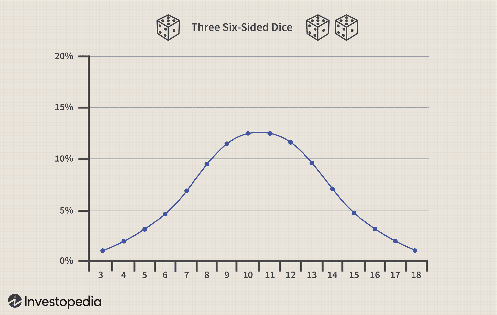

## Table of Contents

## What is common stock and why is it important?

Common stock is a type of security that represents ownership in a company. When you buy common stock, you become a shareholder, which means you own a small piece of the company. This ownership gives you certain rights, like voting on important company decisions and receiving a portion of the company's profits, called dividends. Common stock is different from other types of stocks, like preferred stock, because it usually has more voting rights but might have less priority when it comes to receiving dividends or assets if the company goes bankrupt.

Common stock is important for several reasons. First, it's a way for companies to raise money. When a company sells its common stock to the public, it gets the money people pay for the shares. This money can be used to grow the business, pay off debts, or invest in new projects. Second, common stock is important for investors. It gives them a chance to own a part of a company and potentially make money if the company does well. The value of common stock can go up or down, so investors can buy and sell shares to try to make a profit. Overall, common stock helps companies grow and gives investors a way to participate in that growth.

## What is a probability distribution in the context of common stock?

A probability distribution in the context of common stock is a way to show how likely different stock prices or returns might be in the future. Imagine you have a bunch of different possible prices that a stock could be at tomorrow. A probability distribution helps you see which of those prices are more likely to happen and which are less likely. It's like a map that shows you the chances of the stock going up, going down, or staying the same.

This is important for investors because it helps them understand the risk of owning the stock. If the probability distribution shows that the stock price could go up a lot but could also go down a lot, then the stock is riskier. On the other hand, if the distribution shows that the stock price is likely to stay pretty stable, then the stock is less risky. By looking at the probability distribution, investors can make better decisions about which stocks to buy and how much to invest.

## What are the basic types of probability distributions used for common stock analysis?

In the world of common stock analysis, there are a few basic types of probability distributions that people use to understand how stock prices might move. One common type is the normal distribution, also known as the bell curve. It looks like a bell and shows that most of the time, the stock price will be close to the average, with fewer chances of it being much higher or much lower. This is useful because it helps investors see what's likely to happen most of the time, and it's easy to work with because there are a lot of tools and formulas for the normal distribution.

Another type is the lognormal distribution, which is a bit more complicated but often used for stock prices because stock prices can't be negative. The lognormal distribution is skewed to the right, meaning there's a long tail on the right side of the curve. This shows that while stock prices are more likely to stay close to the current price, there's also a chance they could go up a lot more than they could go down. This type of distribution is helpful for understanding the potential for big gains or losses in stock prices.

Lastly, there's the binomial distribution, which is used when you want to model the stock price going up or down over a series of time periods, like days or weeks. It's like flipping a coin multiple times, where each flip represents a time period and the outcome is either up or down. This helps investors see how likely different paths of the stock price are over time, which can be useful for planning and making investment decisions.

## How does the normal distribution apply to common stock returns?

The normal distribution, often called the bell curve, is a common way to look at stock returns. It shows that most of the time, stock returns will be close to the average. The average return is right in the middle of the bell curve. The curve gets smaller as you move away from the middle, showing that it's less likely for returns to be a lot higher or a lot lower than the average. This helps investors understand that big gains or big losses don't happen as often as smaller changes in stock prices.

Using the normal distribution for stock returns is useful because it's easy to work with. There are a lot of tools and formulas that help investors figure out the chances of different returns happening. For example, if you know the average return and how spread out the returns are, you can use the normal distribution to guess how likely it is that the stock will go up or down by a certain amount. This can help investors make better decisions about buying or selling stocks based on what they think is most likely to happen.

## What is the lognormal distribution and how is it used in stock price modeling?

The lognormal distribution is a way to model stock prices that makes sense because stock prices can't be negative. Imagine you're looking at a graph of stock prices. With the lognormal distribution, the graph is not symmetrical like a bell curve. Instead, it's skewed to the right, meaning there's a long tail on the right side. This shows that while stock prices are more likely to stay close to where they are now, there's also a chance they could go up a lot more than they could go down.

In stock price modeling, the lognormal distribution is useful because it matches how stock prices actually behave in the real world. If you're trying to predict where a stock price might go in the future, using the lognormal distribution helps you see that big jumps up are possible, but big drops down are less likely. This can help investors understand the risks and rewards of owning a stock. By using the lognormal distribution, they can make better guesses about how much a stock might be worth in the future and plan their investments accordingly.

## Can you explain the binomial model for stock price movements?

The binomial model is a way to guess how a stock's price might change over time. Imagine you're playing a game where you flip a coin for each day or week. If the coin lands heads, the stock price goes up a little bit. If it lands tails, the stock price goes down a little bit. By doing this many times, you can see all the different paths the stock price could take. This helps investors see how likely it is that the stock will be at different prices in the future.

The binomial model is simple but powerful because it breaks down the future into small steps. Each step is like a coin flip, and over many steps, you can see a lot of possible outcomes. This is helpful for investors because it lets them see not just one guess about where the stock price might go, but many different guesses. They can use this information to decide if they want to buy, sell, or hold onto the stock based on what they think is most likely to happen.

## What role does the Black-Scholes model play in stock option pricing?

The Black-Scholes model is a special math formula that helps people figure out how much a stock option should cost. A stock option is like a bet on whether a stock's price will go up or down. The Black-Scholes model looks at things like how much the stock's price moves around, how long until the option expires, and what people expect the stock to do in the future. By putting all these pieces together, the model gives a number that says what the option should be worth right now.

This model is really important because it helps people make smarter choices about buying and selling options. Before the Black-Scholes model, it was hard to know if an option was a good deal or not. Now, with this model, investors can see if the price they're being asked to pay for an option makes sense. It's like having a map that shows you the best path to take when you're trying to make money with options.

## How do Monte Carlo simulations help in predicting stock price distributions?

Monte Carlo simulations are a way to guess how stock prices might change in the future by playing out lots of different scenarios. Imagine you're trying to predict where a stock might be in a month. Instead of just making one guess, you use a computer to make thousands of guesses. Each guess is like a different path the stock price could take, based on things like how much the stock usually moves up or down and what might happen in the world. By looking at all these paths, you can see which prices are more likely to happen and which are less likely.

This method is helpful because it lets you see a big picture of what could happen with the stock price. Instead of just one prediction, you get a whole bunch of them, which helps you understand the risk better. If most of the paths show the stock price going up a little bit, but some paths show it going down a lot, you know there's a chance of a big drop. This can help investors decide if they want to buy, sell, or hold onto the stock based on what they see in the simulation.

## What are the limitations of using traditional probability distributions for stock analysis?

Using traditional probability distributions like the normal or lognormal distribution for stock analysis has some limits. These models assume that stock prices move in a certain way, but real life is more complicated. For example, the normal distribution says that big changes in stock prices are rare, but sometimes big changes happen more often than the model expects. This can make the model less accurate when there are big events like economic crises or company news that shake up the market.

Another problem is that these traditional models don't always account for things like how people feel about the market or sudden news that can change everything. The models are based on math and past data, but they can't predict the future perfectly. They might miss out on the way people's emotions and unexpected events can make stock prices jump around in ways the models didn't expect. So, while these models are helpful, they're not perfect and investors need to be careful and use other tools too.

## How can advanced statistical methods like GARCH models improve stock return forecasts?

GARCH models, which stands for Generalized Autoregressive Conditional Heteroskedasticity, are fancy tools that help predict how much stock prices might jump around in the future. They're better than simpler models because they pay attention to how the ups and downs of stock prices change over time. For example, if a stock has been moving a lot lately, a GARCH model will notice that and guess that it might keep moving a lot. This is useful because it helps investors understand not just where the stock price might go, but also how much it might change along the way.

Using GARCH models can make stock return forecasts more accurate because they take into account the way stock prices can get more or less volatile. Imagine you're trying to guess how much a stock will move tomorrow. A simple model might just use the average movement from the past, but a GARCH model will look at recent ups and downs to make a smarter guess. This can help investors make better decisions about buying or selling stocks, because they'll have a better idea of the risks involved.

## What are the implications of fat tails in stock return distributions for risk management?

Fat tails in stock return distributions mean that big jumps in stock prices, either up or down, happen more often than what simple models like the normal distribution expect. This is important for risk management because it shows that there's a bigger chance of losing a lot of money than you might think. If you're managing risk, you need to be ready for these big changes, even if they don't happen all the time. It's like knowing that a storm could come and blow your umbrella away, so you need to have a stronger one or be ready to run for cover.

Understanding fat tails helps people in charge of risk to plan better. They might decide to keep more money in safe places, like bonds, to protect against those big drops in stock prices. Or they might use special tools, like options, to limit how much they could lose if the stock market goes crazy. By knowing that big changes are more likely than simple models say, risk managers can make smarter choices to keep their investments safe and still try to make money.

## How do machine learning techniques enhance the prediction of stock price distributions?

Machine learning techniques help predict stock price distributions by learning from a lot of data. They can look at things like past stock prices, news, and even what people are saying on social media. By finding patterns in all this information, machine learning can guess where stock prices might go next better than simpler models. It's like having a smart friend who can see things you might miss and use that to make better guesses about the future.

One big advantage of machine learning is that it can change its mind as it learns more. If something new happens, like a big company news or a change in the economy, the machine learning model can update its predictions. This makes it more accurate over time because it keeps learning and getting better. So, investors can use these models to make smarter choices about buying and selling stocks, knowing that the predictions are based on the latest and most complete information available.

## What is the role of understanding probability distributions in stock analysis?

Probability distributions are fundamental tools in stock analysis, providing a structured approach to understanding and predicting stock performance. These distributions offer a quantitative method by which traders and investors can estimate the probabilities of different outcomes concerning stock returns. By analyzing historical stock performance data, probability distributions help in assessing the likelihood of various potential future returns, which is crucial for risk management and investment decision-making.

A probability distribution is essentially a function that describes the likelihood of different outcomes in a random variable, which, in stock analysis, can often be the return of a stock over a specific period. For example, if we denote the return of a stock by a random variable $X$, the probability distribution of $X$ would map each possible return outcome to its probability of occurrence. This mapping is critical as it enables the understanding of risks (downside potential) and expected returns (upside potential).

Two main categories exist: discrete and continuous distributions. Discrete distributions deal with finite or countable outcomes, while continuous distributions apply to uncountably infinite possible outcomes. In stock analysis, continuous distributions, such as the normal distribution, are often more applicable because stock returns can take any value within a range.

The normal distribution is frequently used in stock market analysis because of its properties and the central limit theorem, which suggests that the distribution of stock returns approaches normality as more independent factors contribute to the returns. The normal distribution is characterized by its bell-shaped curve, defined by its mean $\mu$ (which represents the expected return) and standard deviation $\sigma$ (which indicates the [volatility](/wiki/volatility-trading-strategies) or risk). The probability density function (pdf) of a normal distribution is expressed as:

$$

f(x) = \frac{1}{\sigma \sqrt{2\pi}} e^{-\frac{1}{2}\left(\frac{x-\mu}{\sigma}\right)^2}
$$

For the practical application of probability distributions in predicting stock performance, traders often use software tools and programming languages such as Python. For instance, using Python's `numpy` and `scipy` libraries, one can simulate stock returns under a normal distribution and calculate the probabilities of different outcomes. Here is an example in Python of generating a normal distribution of stock returns:

```python
import numpy as np
import matplotlib.pyplot as plt
from scipy.stats import norm

# Parameters for the normal distribution
mu = 0.05  # expected return
sigma = 0.2  # volatility (standard deviation)

# Generate returns
returns = np.random.normal(mu, sigma, 1000)

# Plotting the distribution
plt.hist(returns, bins=30, density=True, alpha=0.6, color='g')

# Plot the probability density function
xmin, xmax = plt.xlim()
x = np.linspace(xmin, xmax, 100)
p = norm.pdf(x, mu, sigma)
plt.plot(x, p, 'k', linewidth=2)
plt.title('Normal Distribution of Stock Returns')
plt.xlabel('Stock Return')
plt.ylabel('Probability Density')
plt.show()
```

This code snippet illustrates how traders and analysts can visualize the probability distribution of stock returns, gaining insights into expected risks and potential returns. Such statistical methods allow investors to make informed decisions by quantifying uncertainties in stock performance, thus playing a pivotal role in strategic stock analysis.

## What are the types of probability distributions?

Probability distributions are essential in the analysis of stock market behaviors and are used to model and simulate various financial phenomena. This section discusses several types of probability distributions prevalent in stock market analysis, each with unique attributes suited to specific financial modeling needs.

### Uniform Distribution

The uniform distribution is characterized by having constant probability across all outcomes within a defined range. It is mainly used for modeling situations where all outcomes are equally likely. In stock analysis, the uniform distribution might be used in scenarios where there is no prior bias toward any particular price within a set range, although its application is generally limited in finance.

$$
f(x) = \frac{1}{b-a}, \quad \text{for } a \leq x \leq b
$$

where $a$ and $b$ define the range of the distribution.

### Binomial Distribution

The binomial distribution is discrete and is used to model the number of successes in a fixed number of trials, where each trial has two possible outcomes. In stock markets, it can be used to model binary outcomes like rise/fall in prices on a given day. The probability mass function is given by:

$$
P(X = k) = \binom{n}{k} p^k (1-p)^{n-k}
$$

where $n$ is the number of trials, $k$ is the number of successes, and $p$ is the probability of success on an individual trial.

### Lognormal Distribution

The lognormal distribution applies to financial contexts where the underlying process is multiplicative rather than additive, such as stock prices. If a variable follows a lognormal distribution, its logarithm will follow a normal distribution. Thus, the lognormal distribution is often used for modeling stock price behavior, which cannot be negative. The probability density function is:

$$
f(x|\mu,\sigma) = \frac{1}{x\sigma\sqrt{2\pi}} \exp\left(-\frac{(\ln x - \mu)^2}{2\sigma^2}\right), \quad x > 0
$$

where $\mu$ and $\sigma^2$ are the mean and variance of the variable's natural logarithm.

### Poisson Distribution

The Poisson distribution is applicable for modeling the number of times an event occurs within a fixed interval of time or space. This is particularly relevant in trading for modeling the number of trades or transactions in a given time frame, assuming these events are independent. The distribution's probability mass function is:

$$
P(X = k) = \frac{\lambda^k e^{-\lambda}}{k!}
$$

where $\lambda$ is the average rate of occurrence.

### Student's T Distribution

The Student's T distribution is continuous and resembles the normal distribution but with heavier tails, making it useful when dealing with small sample sizes or when the data exhibit more outliers. It is commonly used in stock returns analysis to model returns that do not conform well to a normal distribution due to higher kurtosis. The probability density function is:

$$
f(t|\nu) = \frac{\Gamma\left(\frac{\nu+1}{2}\right)}{\sqrt{\nu\pi}\, \Gamma\left(\frac{\nu}{2}\right)} \left(1+\frac{t^2}{\nu}\right)^{-\frac{\nu+1}{2}}
$$

where $\nu$ is the degrees of freedom.

### Discrete vs. Continuous Distributions

Discrete distributions, such as the binomial and Poisson, concern countable outcomes, like the number of stock price increases in a time period. Continuous distributions, such as the lognormal and Student's T, deal with ranges of values and model phenomena like stock prices and returns.

### Probability Density vs. Cumulative Distribution Functions

The probability density function (PDF) describes the likelihood of a random variable to take on a particular value. The cumulative distribution function (CDF) gives the probability that a random variable is less than or equal to a certain value. These functions are essential in quantifying and understanding the behavior of stock-related phenomena.

In financial analysis, selecting the appropriate probability distribution depends on the specific characteristics of the data and the financial phenomena being modeled. Proper application allows analysts to more accurately predict and manage market behaviors and associated risks.

## References & Further Reading

[1]: Bergstra, J., Bardenet, R., Bengio, Y., & Kégl, B. (2011). ["Algorithms for Hyper-Parameter Optimization."](https://dl.acm.org/doi/10.5555/2986459.2986743) Advances in Neural Information Processing Systems 24.

[2]: ["Advances in Financial Machine Learning"](https://www.amazon.com/Advances-Financial-Machine-Learning-Marcos/dp/1119482089) by Marcos Lopez de Prado

[3]: ["Evidence-Based Technical Analysis: Applying the Scientific Method and Statistical Inference to Trading Signals"](https://www.amazon.com/Evidence-Based-Technical-Analysis-Scientific-Statistical/dp/0470008741) by David Aronson

[4]: ["Machine Learning for Algorithmic Trading"](https://github.com/stefan-jansen/machine-learning-for-trading) by Stefan Jansen

[5]: ["Quantitative Trading: How to Build Your Own Algorithmic Trading Business"](https://www.amazon.com/Quantitative-Trading-Build-Algorithmic-Business/dp/1119800064) by Ernest P. Chan