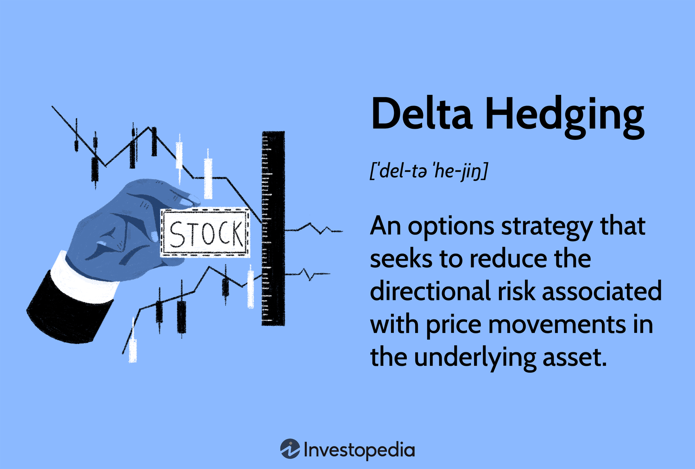

## Table of Contents

## What is delta hedging and why is it important in options trading?

Delta hedging is a strategy used in options trading to reduce the risk of price movements in the underlying asset. It involves buying or selling the underlying asset to offset the delta of an options position. Delta is a measure that shows how much the price of an option is expected to change for every one-point move in the price of the underlying asset. By adjusting the position in the underlying asset, traders can make their overall position less sensitive to small price changes, helping to protect against losses.

This strategy is important in options trading because it helps traders manage risk more effectively. Options can be very sensitive to changes in the price of the underlying asset, and without delta hedging, traders could face significant losses if the market moves against them. By using delta hedging, traders can create a more stable position, which can lead to more predictable outcomes and better control over their investments. This makes it a valuable tool for both individual and institutional traders looking to mitigate risk in their options portfolios.

## How does the delta of an option affect hedging strategies?

The delta of an option tells you how much the price of the option will change when the price of the stock changes. For example, if a call option has a delta of 0.5, it means the option's price will go up by $0.50 if the stock price goes up by $1.00. When you're trying to hedge, you want to use the delta to figure out how many shares of the stock you need to buy or sell to balance out your option position. If you have a call option with a delta of 0.5, you would need to sell 50 shares of the stock for every 100 options you own to make your overall position neutral to small changes in the stock price.

This is important because it helps you manage risk. By keeping your position delta-neutral, you're less likely to lose money if the stock price moves a little bit. But remember, delta changes as the stock price and time to expiration change, so you need to keep adjusting your hedge. This means you might need to buy or sell more shares of the stock as the delta of your option changes. Doing this well can help you protect your investment and make your trading strategy more stable.

## What are the basic steps to implement delta hedging?

To start delta hedging, first, you need to figure out the delta of your option. Delta tells you how much the option's price will change if the stock price changes by one dollar. If you have a call option with a delta of 0.5, it means the option's price will go up by 50 cents if the stock price goes up by a dollar. To hedge, you need to sell shares of the stock. For every 100 call options you own with a delta of 0.5, you would sell 50 shares of the stock. This makes your position "delta-neutral," which means small changes in the stock price won't affect your overall position much.

But delta changes over time and as the stock price moves, so you need to keep adjusting your hedge. If the delta of your option goes up to 0.6, you need to sell more shares to stay delta-neutral. If it goes down to 0.4, you need to buy back some of the shares you sold. This process of buying and selling shares to keep your hedge in balance is called "rebalancing." By doing this, you can manage the risk of your options position and protect your investment from small price movements in the stock.

## Can you explain the concept of delta-neutral hedging?

Delta-neutral hedging is a way to protect your investment from small changes in the price of a stock. When you have an option, its delta tells you how much the option's price will change if the stock price changes by one dollar. For example, if you have a call option with a delta of 0.5, the option's price will go up by 50 cents if the stock price goes up by a dollar. To make your position delta-neutral, you need to sell shares of the stock. If you own 100 call options with a delta of 0.5, you would sell 50 shares of the stock. This way, the gains and losses from the option and the stock balance each other out, so small changes in the stock price won't affect your overall position much.

But delta changes over time and as the stock price moves, so you need to keep adjusting your hedge. This process is called rebalancing. If the delta of your option goes up to 0.6, you need to sell more shares to stay delta-neutral. If it goes down to 0.4, you need to buy back some of the shares you sold. By doing this, you can keep your position delta-neutral and protect your investment from small price movements in the stock. Delta-neutral hedging is a useful tool for managing risk in options trading.

## How often should one rebalance a delta hedge?

How often you should rebalance a delta hedge depends on how much you want to manage your risk and how much the stock price changes. If the stock price moves a lot, you might need to rebalance more often to keep your position delta-neutral. This means you'll need to buy or sell more shares of the stock to match the new delta of your option. If you're okay with taking a bit more risk, you might not need to rebalance as often. But if you want to keep your position very stable, you might need to check and adjust your hedge every day or even more often.

It's also important to think about the cost of rebalancing. Every time you buy or sell shares, you might have to pay fees or commissions. So, you need to balance the benefits of keeping your hedge delta-neutral with the costs of making those trades. Some traders might choose to rebalance at certain times, like at the end of each trading day, while others might do it whenever the delta changes by a certain amount. The key is to find a schedule that works for you and helps you manage your risk without costing too much.

## What are the common tools and software used for delta hedging?

Traders use different tools and software to help them with delta hedging. Some popular ones are trading platforms like Thinkorswim by TD Ameritrade and [Interactive Brokers](/wiki/interactive-brokers-api)' Trader Workstation. These platforms have built-in tools that show you the delta of your options and help you figure out how many shares you need to buy or sell to keep your position delta-neutral. They also let you set up alerts so you know when it's time to rebalance your hedge.

Another useful tool is Excel or Google Sheets. Many traders use spreadsheets to keep track of their options and calculate their delta hedge manually. They can set up formulas to automatically update the delta and tell them how many shares to trade. There are also special software programs like OptionVue and Volatility Trading, which are made just for options trading and have advanced features for delta hedging. These programs can help you manage your hedges more easily and make sure you're always on top of your risk.

## How do changes in market volatility impact delta hedging?

Changes in market [volatility](/wiki/volatility-trading-strategies) can affect delta hedging because they change the delta of an option. When the market gets more volatile, the delta of an option can change more quickly. This means you might need to rebalance your hedge more often to keep your position delta-neutral. If you don't adjust your hedge, your position might become too sensitive to small changes in the stock price, which can lead to bigger losses if the market moves against you.

Volatility also affects how much you need to buy or sell to stay delta-neutral. When volatility goes up, the delta of an option can move around a lot, making it harder to keep your hedge balanced. This can mean more trading and higher costs because you're buying and selling shares more often. So, when the market is volatile, you need to pay close attention to your delta hedge and be ready to make more adjustments to manage your risk properly.

## What are the differences between delta hedging in equity options versus index options?

Delta hedging works a bit differently for equity options compared to index options, mainly because of how the underlying assets behave. With equity options, you're dealing with the stock of a single company. The stock price can move a lot based on news about the company, earnings reports, or other company-specific events. This means the delta of an equity option can change quickly, so you might need to rebalance your hedge more often to keep it delta-neutral. Also, because you're trading shares of a single stock, the costs of buying and selling can add up, especially if you're making a lot of trades to keep your hedge balanced.

On the other hand, index options are based on a basket of stocks, like the S&P 500. The price of an index option moves based on the overall market, which tends to be less volatile than a single stock. This can make delta hedging a bit easier because the delta of an index option might not change as quickly. However, when you're delta hedging index options, you're usually trading futures contracts instead of individual stocks. Futures contracts can be more complex to trade and might have different costs and risks compared to trading single stocks. So, while the process of delta hedging is similar, the specifics can be quite different depending on whether you're dealing with equity or index options.

## How can one incorporate gamma into delta hedging strategies?

When you're delta hedging, you're trying to balance out the risk of your options by buying or selling the stock. But there's another thing to think about, called gamma. Gamma tells you how fast the delta of your option changes when the stock price moves. If you ignore gamma, your delta hedge might not work as well because the delta can change quickly, especially if the stock price moves a lot. So, to make your hedge better, you need to think about gamma too.

To use gamma in your delta hedging, you need to keep an eye on how the delta changes and adjust your hedge more often. If the gamma is high, the delta can change a lot, so you might need to buy or sell more shares of the stock to keep your position balanced. This means you'll have to rebalance your hedge more often, which can be more work but can help you manage your risk better. By paying attention to gamma, you can make your delta hedge more accurate and protect your investment from big swings in the stock price.

## What are the advanced techniques for delta hedging in a portfolio with multiple options?

When you have a portfolio with lots of different options, delta hedging gets a bit trickier. You need to look at the delta of each option and figure out how they all work together. If you have some call options and some put options, the deltas might cancel each other out a bit. For example, if you have a call option with a delta of 0.5 and a put option with a delta of -0.5, they might balance each other out. But the deltas can change as the stock price moves, so you need to keep an eye on all of them and adjust your hedge often. This means you might need to buy or sell more shares of the stock to keep your whole portfolio delta-neutral.

Another thing to think about is gamma, which tells you how fast the delta changes. If you have options with high gamma, the deltas can change quickly, so you might need to rebalance your hedge more often. You can use a technique called "gamma [scalping](/wiki/gamma-scalping)" to help with this. Gamma scalping means you buy or sell shares of the stock to take advantage of the changes in delta. This can help you make money from the small price movements in the stock while keeping your portfolio balanced. By paying attention to both delta and gamma, you can make your hedge more accurate and protect your whole portfolio from big swings in the stock price.

## How does transaction cost affect the effectiveness of delta hedging?

Transaction costs can make delta hedging less effective because every time you buy or sell shares to keep your hedge balanced, you might have to pay fees or commissions. These costs can add up, especially if you need to rebalance your hedge often. If the costs of buying and selling shares are high, it might not be worth it to keep your position perfectly delta-neutral. You might decide to let your hedge be a bit off to save on costs, but this means you're taking on more risk because your position won't be as protected from changes in the stock price.

To manage transaction costs, you can try to rebalance your hedge less often, but this means you need to be okay with taking a bit more risk. Another way is to use options with lower transaction costs or trade in larger amounts to reduce the impact of fees. By finding a balance between keeping your hedge accurate and keeping costs down, you can make your delta hedging strategy more effective.

## What are the potential pitfalls and risks associated with delta hedging?

Delta hedging can be tricky because it's not perfect. One big problem is that the delta of an option changes all the time, especially when the stock price moves a lot. This means you have to keep buying and selling shares to keep your hedge balanced, which can be a lot of work. Plus, every time you trade, you might have to pay fees or commissions, and these costs can add up. If you don't rebalance often enough, your hedge might not work well, and you could lose money if the stock price moves against you.

Another risk is that delta hedging only protects you from small changes in the stock price. If the stock price jumps a lot, your hedge might not be enough to protect you. Also, there's something called gamma, which tells you how fast the delta changes. If you ignore gamma, your hedge might not be as good as you think. So, you have to keep an eye on both delta and gamma, which can be hard to do. In the end, while delta hedging can help manage risk, it's not a perfect solution and you need to be careful and keep adjusting your hedge to make it work well.

## What is the role of Delta in options trading?

Delta is one of the essential Greeks in options trading, which gauges the sensitivity of an option's price to a $1 change in the price of its underlying asset. Specifically, it reflects the degree to which an option's premium would shift as the market price of the associated asset moves. Understanding delta is crucial for both gauging potential profit outcomes and implementing trading strategies like delta hedging.

For call options, delta values typically range from 0 to 1. A delta of 0.5, for instance, indicates that for every $1 increase in the price of the underlying asset, the option's price would rise by approximately $0.50. Conversely, put options [carry](/wiki/carry-trading) a delta between 0 and -1, reflecting that their value diminishes as the underlying asset's price increases. Hence, a put option with a delta of -0.4 would see its value decrease by about $0.40 for a $1 rise in the asset's price.

A higher delta value implies a greater likelihood of an option expiring in-the-money, meaning the option has intrinsic value at expiration. Consequently, traders look to delta not only for risk management purposes but also to assess the leverage and exposure embedded in an options contract.

Mathematically, delta ($\Delta$) can be expressed as:

$$
\Delta = \frac{\partial C}{\partial S}
$$

where:
- $C$ represents the option's price,
- $S$ indicates the price of the underlying stock or asset.

Investors employ delta to forecast how an option's price will react relative to movements in its underlying asset's price. This sensitivity analysis allows traders to adjust positions to maintain desired levels of market exposure, whether to pursue profit opportunities or mitigate risk.

## What are Common Delta Hedging Strategies?

Basic delta hedging involves taking a counter-position in the underlying asset based on the delta of the options held. This means that for a portfolio to achieve delta neutrality, a trader needs to offset the positive or negative delta of the options with an appropriate number of shares in the underlying asset. For instance, if a trader holds a call option with a delta of 0.6, they would sell 60 shares of the underlying asset to neutralize the position.

Advanced strategies further enhance this basic approach by considering higher-order Greeks such as gamma and vega. Gamma hedging is used to adjust for changes in delta over time. This strategy involves maintaining a portfolio where the gamma is as close to zero as possible, reducing the rate at which delta changes as the underlying asset's price changes. Gamma ($\Gamma$) is mathematically defined as the second derivative of the option’s price with respect to the price of the underlying asset:

$$
\Gamma = \frac{\partial^2C}{\partial S^2}
$$

where $C$ represents the option's price and $S$ is the current price of the underlying asset.

Vega hedging, on the other hand, focuses on managing changes in an option's value based on volatility, without being impacted by movements in the underlying asset's price. Vega measures an option’s sensitivity to volatility:

$$
\text{Vega} = \frac{\partial C}{\partial \sigma}
$$

where $\sigma$ represents volatility. Traders implementing vega hedging look to stabilize their portfolio's exposure to volatility shifts by entering into positions that counter their vega risks.

Each of these strategies comes with advantages and challenges. Mitigating risk through gamma or vega hedging allows a trader to handle non-linearities in price changes and fluctuations in market volatility, respectively. Nonetheless, these strategies can incur significant transaction costs due to the necessity of frequent adjustments. Thus, the trader is required to balance between risk reduction and cost management, which necessitates a robust understanding of market dynamics and the greeks involved. Effective delta hedging, combined with gamma and vega adjustments, often requires advanced computational tools or algorithms to execute efficiently in fast-moving markets.

## What is the conclusion?

Delta hedging remains a cornerstone strategy for managing risk within options trading. This approach is pivotal in maintaining portfolio stability by compensating for potential losses due to unfavorable price movements of the underlying asset. By mastering delta hedging techniques, traders can significantly mitigate risks associated with market volatility and optimize their trading strategies to enhance returns.

A central aspect of successful delta hedging is the ability to adjust positions to achieve a delta-neutral portfolio. This involves maintaining a balance between the options' deltas and the number of underlying shares held, which can be calculated using:

$$
\Delta_{\text{portfolio}} = \sum (\Delta_{\text{option}} \times \text{Number of Options}) + (\Delta_{\text{underlying}} \times \text{Number of Underlying Shares})
$$

The goal is to keep $\Delta_{\text{portfolio}}$ as close to zero as possible, indicating that the portfolio is less sensitive to small movements in the price of the underlying asset.

Continual learning and applying delta hedging strategies are crucial for traders aiming to navigate the complexities of options trading. As markets evolve, staying informed about new tools and techniques in [algorithmic trading](/wiki/algorithmic-trading) can further enhance the efficiency of maintaining delta-neutral positions. This involves a commitment to understanding the dynamics of options pricing and the external factors influencing market conditions.

Practical implementation involves not just theoretical knowledge but also the use of technological tools to automate and monitor positions. Platforms such as ThinkorSwim and Interactive Brokers provide advanced features for real-time data analysis and automated execution, helping traders maintain the optimal balance for their portfolios.

In conclusion, delta hedging is an indispensable method for traders seeking to manage risk effectively. Through disciplined practice and leveraging technological advancements, traders can significantly enhance their ability to respond to market changes, ultimately achieving more predictable and consistent trading outcomes.

## References & Further Reading

[1]: Hull, J. C. (2018). ["Options, Futures, and Other Derivatives"](https://www.semanticscholar.org/paper/Options%2C-Futures%2C-and-Other-Derivatives-Hull/89bdee500c8623864fc9eb7a471546aa713acc44). Pearson.

[2]: Wilmott, P. (2019). ["Paul Wilmott Introduces Quantitative Finance"](https://www.amazon.com/Paul-Wilmott-Quantitative-Finance-Set/dp/0470018704). Wiley.

[3]: Taleb, N. N. (2010). ["Dynamic Hedging: Managing Vanilla and Exotic Options"](https://www.amazon.com/Dynamic-Hedging-Managing-Vanilla-Options/dp/0471152803). Wiley.

[4]: Jabbour, R. and Faden, B. (2014). ["The World of Hedging in Delta One"](https://pubmed.ncbi.nlm.nih.gov/24552325/). Risk.net.

[5]: Savine, A. (2018). ["Modern Computational Finance: A AD & Parallel Simulations"](https://papers.ssrn.com/sol3/papers.cfm?abstract_id=3281877). Wiley.

[6]: Black, F. and Scholes, M. (1973). ["The Pricing of Options and Corporate Liabilities"](https://www.cs.princeton.edu/courses/archive/fall09/cos323/papers/black_scholes73.pdf). The Journal of Political Economy, 81(3), 637-654.

[7]: Lipton, A. (2001). ["Mathematical Methods for Foreign Exchange"](https://books.google.com/books/about/Mathematical_Methods_for_Foreign_Exchang.html?id=tid8NeRwQFwC). World Scientific Publishing.