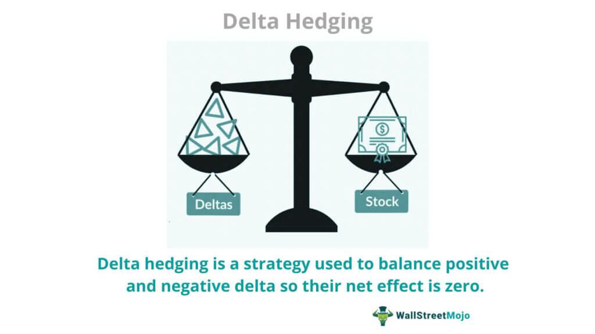

Options trading in financial markets offers substantial opportunities for returns. However, this potential for profit comes with significant risk. Delta hedging is a crucial concept within options trading that helps manage such risks by focusing on reducing the directional risk associated with options positions. This strategy aims to make a portfolio more resilient to changes in the underlying asset's price by maintaining a delta-neutral stance.

In essence, delta measures the sensitivity of an option's price to a $1 change in the price of the underlying asset. For call options, delta ranges from 0 to 1, indicating the option's responsiveness to price shifts; for put options, delta ranges from 0 to -1. By understanding and implementing delta hedging, traders can offset long and short positions, ensuring that the portfolio's overall exposure to price movement is minimized.



This article provides a comprehensive exploration of delta hedging basics, strategies to implement it effectively, the integration of algorithmic trading in enhancing these strategies, and practical tips for successful execution. It is designed to cater to both novice and experienced traders, offering valuable insights into how delta hedging can be a critical component of a trading strategy aimed at risk mitigation and optimized returns.

## Table of Contents

## Understanding Delta in Options Trading

Delta is one of the essential Greeks in options trading, which gauges the sensitivity of an option's price to a $1 change in the price of its underlying asset. Specifically, it reflects the degree to which an option's premium would shift as the market price of the associated asset moves. Understanding delta is crucial for both gauging potential profit outcomes and implementing trading strategies like delta hedging.

For call options, delta values typically range from 0 to 1. A delta of 0.5, for instance, indicates that for every $1 increase in the price of the underlying asset, the option's price would rise by approximately $0.50. Conversely, put options carry a delta between 0 and -1, reflecting that their value diminishes as the underlying asset's price increases. Hence, a put option with a delta of -0.4 would see its value decrease by about $0.40 for a $1 rise in the asset's price.

A higher delta value implies a greater likelihood of an option expiring in-the-money, meaning the option has intrinsic value at expiration. Consequently, traders look to delta not only for risk management purposes but also to assess the leverage and exposure embedded in an options contract.

Mathematically, delta ($\Delta$) can be expressed as:

$$
\Delta = \frac{\partial C}{\partial S}
$$

where:
- $C$ represents the option's price,
- $S$ indicates the price of the underlying stock or asset.

Investors employ delta to forecast how an option's price will react relative to movements in its underlying asset's price. This sensitivity analysis allows traders to adjust positions to maintain desired levels of market exposure, whether to pursue profit opportunities or mitigate risk.

## The Essence of Delta Hedging

Delta hedging is a strategy employed in options trading with the primary goal of achieving a delta-neutral position. This neutrality effectively minimizes the sensitivity of an investment portfolio to small price fluctuations in the underlying asset. A delta-neutral position is achieved when the portfolio's total delta, which measures the change in an option's price for a $1 change in the price of the underlying asset, equals zero. This means that the portfolio's overall value will not change for marginal price movements of the underlying asset.

To reach a delta-neutral state, traders engage in offsetting long and short positions. Typically, a trader who holds a long position in an option will offset this with a short position in the underlying asset, or vice versa. For instance, if a trader owns a call option for a stock with a delta of 0.6, acquiring a short position in 60 shares of the stock can make the position delta-neutral. This is achieved by balancing the positive delta of the option with the negative delta of the underlying asset.

The dynamic nature of financial markets dictates that the delta of options is not static but varies with changes in the underlying asset's price, time, and [volatility](/wiki/volatility-trading-strategies). Consequently, maintaining a delta-neutral position necessitates frequent rebalancing. Traders must regularly adjust the quantities of their short and long positions to sustain delta neutrality as the market conditions evolve. For example, if the delta of an option changes due to market movements, the trader would need to buy or sell the underlying asset in proportion to the new delta value to reestablish neutrality.

In practice, delta hedging allows traders to manage risk effectively, making it a valuable tool in minimizing potential losses from adverse price movements. However, this approach requires diligent monitoring and timely execution, as missed adjustments could lead to unanticipated exposure to price fluctuations. The iterative process of delta hedging exemplifies the intricate balance of risk management and market opportunity, requiring both strategic insight and tactical execution.

## Common Delta Hedging Strategies

Basic delta hedging involves taking a counter-position in the underlying asset based on the delta of the options held. This means that for a portfolio to achieve delta neutrality, a trader needs to offset the positive or negative delta of the options with an appropriate number of shares in the underlying asset. For instance, if a trader holds a call option with a delta of 0.6, they would sell 60 shares of the underlying asset to neutralize the position.

Advanced strategies further enhance this basic approach by considering higher-order Greeks such as gamma and vega. Gamma hedging is used to adjust for changes in delta over time. This strategy involves maintaining a portfolio where the gamma is as close to zero as possible, reducing the rate at which delta changes as the underlying asset's price changes. Gamma ($\Gamma$) is mathematically defined as the second derivative of the option’s price with respect to the price of the underlying asset:

$$
\Gamma = \frac{\partial^2C}{\partial S^2}
$$

where $C$ represents the option's price and $S$ is the current price of the underlying asset.

Vega hedging, on the other hand, focuses on managing changes in an option's value based on volatility, without being impacted by movements in the underlying asset's price. Vega measures an option’s sensitivity to volatility:

$$
\text{Vega} = \frac{\partial C}{\partial \sigma}
$$

where $\sigma$ represents volatility. Traders implementing vega hedging look to stabilize their portfolio's exposure to volatility shifts by entering into positions that counter their vega risks.

Each of these strategies comes with advantages and challenges. Mitigating risk through gamma or vega hedging allows a trader to handle non-linearities in price changes and fluctuations in market volatility, respectively. Nonetheless, these strategies can incur significant transaction costs due to the necessity of frequent adjustments. Thus, the trader is required to balance between risk reduction and cost management, which necessitates a robust understanding of market dynamics and the greeks involved. Effective delta hedging, combined with gamma and vega adjustments, often requires advanced computational tools or algorithms to execute efficiently in fast-moving markets.

## Algorithmic Trading and Delta Hedging

Algorithmic trading has significantly transformed the landscape of delta hedging by employing sophisticated technology to automate many of its processes. These trading tools enable the dynamic adjustment of positions, ensuring a more efficient and precise maintenance of delta-neutral portfolios without the need for constant manual intervention. The automation provided by [algorithmic trading](/wiki/algorithmic-trading) is pivotal in reacting to market changes, as it can continuously track the delta of options and implement necessary trades to sustain the hedge.

One of the primary benefits of utilizing algorithmic trading in delta hedging is the substantial reduction in the manual workload associated with frequent rebalancing. Maintaining a delta-neutral position requires periodic adjustments as the delta value changes due to movements in the underlying asset's price or the passage of time. Algorithmic systems can be programmed to react immediately to these trigger points, executing trades to realign the portfolio's delta without delays that could introduce risks or inefficiencies.

Moreover, certain platforms provide specific tools and features to support this automated process. For instance, ThinkorSwim and [Interactive Brokers](/wiki/interactive-brokers-api) offer a suite of advanced functionalities that can be tailored to execute delta-hedging strategies seamlessly. These platforms may provide APIs that allow the integration of custom trading algorithms, enabling traders to set predefined rules and conditions for rebalancing. 

As an example, a simple Python script using Interactive Brokers' API might look like this:

```python
from ib_insync import IB, Option
import numpy as np

# Connect to Interactive Brokers
ib = IB()
ib.connect('127.0.0.1', 7496, clientId=1)

# Define the option and target delta
option = Option(symbol='AAPL', lastTradeDateOrContractMonth='20231117', strike=150, right='C', exchange='SMART')
target_delta = 0.0  # Delta-neutral

# Monitor current delta
def get_current_delta(option):
    ib.reqMarketDataType(4)  # Use delayed data if necessary
    ib.qualifyContracts(option)
    option_data = ib.reqMktData(option, '', False, False)
    return option_data.delta

# Adjust position to maintain delta-neutral
def adjust_position(current_delta):
    delta_difference = current_delta - target_delta
    # Logic to buy/sell underlying asset to balance delta
    # This could involve using np.sign(delta_difference) to decide buy/sell
    # Example: ib.placeOrder(contract, handle delta_difference appropriately)

# Main trading loop
while True:
    current_delta = get_current_delta(option)
    if abs(current_delta - target_delta) > 0.01:  # Sensitivity threshold
        adjust_position(current_delta)
    ib.sleep(300)  # Check every 5 minutes
```

Algorithmic trading not only enhances the execution speed and accuracy but also allows for complex strategies that might be impossible to manage manually. This includes the ability to integrate other forms of hedging, like gamma or vega hedging, into the core delta hedging strategy as conditions warrant, further refining risk management. Overall, the incorporation of algorithmic tools in delta hedging represents a significant advancement, promoting greater precision, efficiency, and risk control in options trading.

## Benefits and Challenges of Delta Hedging

Delta hedging represents a fundamental approach to mitigating risk in options trading by offsetting potential adverse price movements, which in turn offers the possibility of a smoother return profile. The primary benefit of delta hedging is its ability to protect investors against small fluctuations in the price of the underlying asset, thereby maintaining the value of an options portfolio more consistently. By keeping a portfolio delta-neutral, where the delta is maintained at zero, traders can effectively nullify price risk. This neutrality is achieved by holding a position in the underlying asset that counteracts the delta of the options held. 

Despite its benefits, delta hedging presents several challenges. One of the most prominent is the incurrence of transaction costs from frequent rebalancing of the portfolio. Since the delta of an option changes with variations in the underlying asset's price, time decay, and changes in implied volatility, maintaining a delta-neutral position requires constant monitoring and frequent adjustment of the portfolio. These adjustments lead to transaction costs that can erode the potential profits from delta hedging.

Another significant challenge is the intrinsic complexity in understanding and implementing a delta-neutral strategy. Given that delta is not a static metric, but rather one that changes with market conditions, traders must possess a sophisticated understanding of options pricing and the factors influencing delta. This involves a strong grasp of the Greek parameters and their interrelations, as well as an understanding of market dynamics that could influence the underlying asset's price.

Effective delta hedging also demands comprehensive monitoring mechanisms and tools to track the delta and other Greeks accurately. In practice, many traders use algorithmic trading systems to automate the process of maintaining a delta-neutral position. Such systems can promptly execute trades when the delta drift deviates beyond certain thresholds, reducing the manual burden on traders. Nevertheless, even with automation, understanding the nuances of options pricing and risk management remains critical for successful implementation.

In conclusion, while delta hedging offers traders a powerful tool to manage risk effectively in an options trading strategy, the challenges it presents require careful consideration and a deep understanding of the intricacies involved in options trading.

## Practical Implementation of Delta Hedging

Calculating delta and consistently monitoring for adjustments are pivotal actions in implementing a successful delta hedging strategy. The delta ($\Delta$) of an option represents the rate of change of the option's price with respect to a $1 change in the price of the underlying asset. For an effective delta hedging approach, it's crucial to begin by accurately calculating the delta of the options in your portfolio. This can be done using options pricing models such as the Black-Scholes model for European options or the Binomial model for American options.

In Python, the delta for a call option using the Black-Scholes formula can be calculated as follows:

```python
from scipy.stats import norm
import math

def call_delta(S, K, T, r, sigma):
    """
    Calculate the Black-Scholes delta for a call option.

    Parameters:
    S : float : Current stock price
    K : float : Strike price
    T : float : Time to expiration in years
    r : float : Risk-free interest rate
    sigma : float : Volatility of the underlying asset

    Returns:
    float : Option delta
    """
    d1 = (math.log(S / K) + (r + 0.5 * sigma**2) * T) / (sigma * math.sqrt(T))
    return norm.cdf(d1)

# Example usage
S = 100  # current stock price
K = 100  # strike price
T = 1    # time to expiration in years
r = 0.05 # risk-free interest rate
sigma = 0.2 # volatility

delta = call_delta(S, K, T, r, sigma)
print(f"Call Option Delta: {delta}")
```

Tracking delta adjustments is essential due to the dynamic nature of markets. As prices fluctuate and time to expiration decreases, the delta values change, necessitating frequent recalibration of the hedged position to maintain delta neutrality. This process involves buying or selling the underlying asset in quantities that counterbalance the options' delta exposure.

Traders should consider transaction costs and market [liquidity](/wiki/liquidity-risk-premium), as these factors can notably impact the practicality and efficiency of a delta hedging strategy. High transaction costs can erode the benefits of frequent adjustments, while low liquidity might prevent executing trades at desired prices.

The iterative nature of delta hedging is well-illustrated with real-time adjustments. For instance, a trader with a portfolio of call options might begin the day delta-neutral but, due to a rapid increase in the underlying asset's price, find that their portfolio's delta shifts. In response, they might sell a proportionate quantity of the underlying asset to counteract the increased positive delta.

In conclusion, the practical implementation of delta hedging involves precise calculation, vigilant monitoring, and regular adjustments. Such dynamic management helps traders effectively mitigate risk and navigate the intricacies of options trading.

## Conclusion

Delta hedging remains a cornerstone strategy for managing risk within options trading. This approach is pivotal in maintaining portfolio stability by compensating for potential losses due to unfavorable price movements of the underlying asset. By mastering delta hedging techniques, traders can significantly mitigate risks associated with market volatility and optimize their trading strategies to enhance returns.

A central aspect of successful delta hedging is the ability to adjust positions to achieve a delta-neutral portfolio. This involves maintaining a balance between the options' deltas and the number of underlying shares held, which can be calculated using:

$$
\Delta_{\text{portfolio}} = \sum (\Delta_{\text{option}} \times \text{Number of Options}) + (\Delta_{\text{underlying}} \times \text{Number of Underlying Shares})
$$

The goal is to keep $\Delta_{\text{portfolio}}$ as close to zero as possible, indicating that the portfolio is less sensitive to small movements in the price of the underlying asset.

Continual learning and applying delta hedging strategies are crucial for traders aiming to navigate the complexities of options trading. As markets evolve, staying informed about new tools and techniques in algorithmic trading can further enhance the efficiency of maintaining delta-neutral positions. This involves a commitment to understanding the dynamics of options pricing and the external factors influencing market conditions.

Practical implementation involves not just theoretical knowledge but also the use of technological tools to automate and monitor positions. Platforms such as ThinkorSwim and Interactive Brokers provide advanced features for real-time data analysis and automated execution, helping traders maintain the optimal balance for their portfolios.

In conclusion, delta hedging is an indispensable method for traders seeking to manage risk effectively. Through disciplined practice and leveraging technological advancements, traders can significantly enhance their ability to respond to market changes, ultimately achieving more predictable and consistent trading outcomes.

## References & Further Reading

[1]: Hull, J. C. (2018). ["Options, Futures, and Other Derivatives"](https://www.semanticscholar.org/paper/Options%2C-Futures%2C-and-Other-Derivatives-Hull/89bdee500c8623864fc9eb7a471546aa713acc44). Pearson.

[2]: Wilmott, P. (2019). ["Paul Wilmott Introduces Quantitative Finance"](https://www.amazon.com/Paul-Wilmott-Quantitative-Finance-Set/dp/0470018704). Wiley.

[3]: Taleb, N. N. (2010). ["Dynamic Hedging: Managing Vanilla and Exotic Options"](https://www.amazon.com/Dynamic-Hedging-Managing-Vanilla-Options/dp/0471152803). Wiley.

[4]: Jabbour, R. and Faden, B. (2014). ["The World of Hedging in Delta One"](https://pubmed.ncbi.nlm.nih.gov/24552325/). Risk.net.

[5]: Savine, A. (2018). ["Modern Computational Finance: A AD & Parallel Simulations"](https://papers.ssrn.com/sol3/papers.cfm?abstract_id=3281877). Wiley.

[6]: Black, F. and Scholes, M. (1973). ["The Pricing of Options and Corporate Liabilities"](https://www.cs.princeton.edu/courses/archive/fall09/cos323/papers/black_scholes73.pdf). The Journal of Political Economy, 81(3), 637-654.

[7]: Lipton, A. (2001). ["Mathematical Methods for Foreign Exchange"](https://books.google.com/books/about/Mathematical_Methods_for_Foreign_Exchang.html?id=tid8NeRwQFwC). World Scientific Publishing.