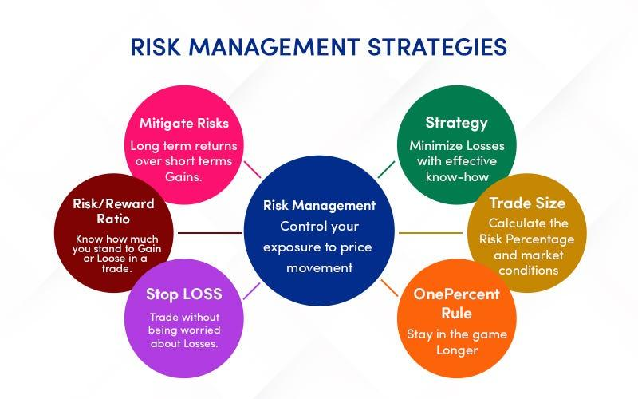

## Table of Contents

## What is investment risk management?

Investment risk management is about understanding and controlling the dangers that come with investing money. When you invest, you want your money to grow, but there's always a chance you could lose some or all of it. Risk management helps you figure out how much risk you're willing to take and how to spread your investments to lower the chances of big losses. It's like a safety net that keeps your investments safer.

To manage investment risks, you need to know what kinds of risks there are, like market risk, where the whole market goes down, or credit risk, where a company might not pay back its loans. Once you know these risks, you can use different strategies to handle them. For example, you might diversify your investments by putting your money into different types of assets, like stocks, bonds, and real estate. This way, if one investment does badly, the others might do well and balance things out. By managing risks well, you can feel more secure about your investments and aim for better returns over time.

## Why is managing investment risk important for beginners?

Managing investment risk is really important for beginners because it helps them protect their money. When you start investing, you might not know much about the different risks involved. By learning about risk management, you can make smarter choices and avoid big losses. It's like wearing a seatbelt when you drive; it doesn't stop you from driving, but it keeps you safer if something goes wrong.

Another reason risk management is crucial for beginners is that it helps them feel more confident. Investing can be scary because there's always a chance you could lose money. But if you know how to manage risks, you won't feel as nervous. You can start with small steps, like spreading your money across different investments, which can make the whole process less stressful. Over time, as you learn more and get better at managing risks, you'll become a more successful investor.

## What are the basic types of investment risks?

There are several basic types of investment risks that you should know about. One type is market risk, which is when the whole market goes up or down. This can happen because of things like economic changes or big events in the world. Another type is credit risk, where a company or person you lend money to might not be able to pay it back. This often happens with bonds. Liquidity risk is another kind, where you might not be able to sell your investment quickly without losing money.

Then there's inflation risk, which is when the value of money goes down over time. This means the money you get back from your investments might not be worth as much as when you first put it in. Interest rate risk is about how changes in interest rates can affect the value of your investments, especially bonds. Lastly, there's currency risk, which comes into play if you invest in foreign markets and the value of one currency changes compared to another.

Understanding these different types of risks can help you make better choices when you invest. Each type of risk can affect your investments in different ways, so knowing about them helps you plan and protect your money. As a beginner, it's important to learn about these risks so you can start managing them right from the beginning.

## How can diversification help in managing investment risk?

Diversification is like not putting all your eggs in one basket. When you invest, you can spread your money across different types of investments, like stocks, bonds, and real estate. This way, if one type of investment does badly, the others might do well and help balance things out. For example, if the stock market goes down, your bonds might still be doing okay. By having a mix of investments, you lower the chance that a big loss in one area will hurt your whole portfolio.

This strategy helps manage risk because it reduces the impact of any single investment going wrong. Imagine you only invest in one company's stock, and that company has a bad year. You could lose a lot of money. But if you have money in many different companies, industries, and even countries, a problem in one place won't affect your whole investment plan. Diversification doesn't get rid of all risk, but it makes your investments safer and more stable over time. It's a smart way for beginners to start investing without feeling too worried about losing everything.

## What is asset allocation and how does it reduce risk?

Asset allocation is about deciding how to spread your money across different types of investments, like stocks, bonds, and cash. It's like planning a meal where you choose a bit of this and a bit of that to make sure you get a balanced diet. By choosing the right mix of assets, you can match your investment plan to your goals, how much risk you're okay with, and how long you plan to keep your money invested. For example, if you're young and can wait a long time for your money to grow, you might put more in stocks because they can offer bigger returns over time, even if they're riskier.

Asset allocation helps reduce risk by balancing out the ups and downs of different investments. If you only invest in stocks and the stock market crashes, you could lose a lot of money. But if you also have some money in bonds and cash, those parts of your portfolio might not go down as much, or might even go up, helping to cushion the blow. This way, even if one type of investment does badly, the others can help keep your overall investment safer. It's like having a safety net that catches you if you fall, making your investment journey smoother and less scary.

## Can you explain the concept of risk tolerance in investment?

Risk tolerance is all about how much risk you're okay with when you invest your money. It's like deciding how much you're willing to lose before you start feeling too worried. Everyone has a different level of risk tolerance. Some people might be fine with their investments going up and down a lot, hoping for bigger rewards. Others might get nervous even with small changes and prefer safer investments that grow more slowly but steadily.

Understanding your own risk tolerance is super important because it helps you pick the right investments for you. If you're someone who can handle more risk, you might put more money into stocks, which can go up and down a lot but also offer the chance for bigger gains. But if you don't like taking chances, you might choose bonds or savings accounts, which are safer but grow more slowly. Knowing your risk tolerance helps you stay calm and stick to your investment plan, even when the market gets bumpy.

## What are stop-loss orders and how do they help manage risk?

A stop-loss order is like a safety net for your investments. It's an instruction you give to your broker to sell a stock or other investment if it drops to a certain price. This helps you limit how much money you could lose on that investment. For example, if you bought a stock at $50 and set a stop-loss order at $45, the stock would automatically be sold if its price fell to $45, stopping you from losing more money if the price keeps going down.

Using stop-loss orders can help manage risk by setting a clear limit on potential losses. It's especially useful for beginners who might not be watching the market all the time. By setting a stop-loss, you don't have to worry about checking your investments every day. It takes some of the emotion out of investing, helping you make decisions based on your plan rather than panic. However, remember that stop-loss orders aren't perfect; sometimes the price can drop so fast that you might still sell at a lower price than you wanted.

## How does hedging work as a risk management strategy?

Hedging is like buying insurance for your investments. It's a way to protect yourself from losing too much money if things go wrong. Imagine you own a stock, but you're worried it might go down in price. To hedge, you could buy another investment that would go up if your stock goes down. This way, any losses from your stock could be balanced out by gains from your hedge. Common ways to hedge include buying options or futures, which are special types of investments that let you bet on whether a stock or market will go up or down.

Hedging can be a bit tricky because it costs money to set up, kind of like paying for insurance. But if it works, it can save you from big losses. For example, if you think the whole stock market might drop, you could buy an option that pays off if the market goes down. If the market does fall, your option would make money, helping to cover the losses from your stocks. Hedging isn't perfect and doesn't always work, but it's a tool that can make investing feel safer, especially during uncertain times.

## What role does rebalancing play in managing investment portfolios?

Rebalancing is like keeping your investment plan on track. Over time, some of your investments might grow faster than others, which can change the mix of your portfolio. For example, if you started with half your money in stocks and half in bonds, but the stocks did really well, you might end up with more money in stocks than you planned. Rebalancing means selling some of the stocks that grew a lot and buying more of the ones that didn't, to get back to your original plan. This helps make sure your investments still match your goals and how much risk you're okay with.

By rebalancing, you're also managing risk. If you let your portfolio get too heavy in one type of investment, like stocks, you could be taking on more risk than you want. Rebalancing helps you keep a good balance, so you're not too exposed to any one type of risk. It's like checking your car's tires to make sure they're all at the right pressure. Doing this regularly can help your investments perform better over time and keep you feeling more secure about your money.

## How can advanced investors use derivatives for risk management?

Advanced investors can use derivatives like options and futures to manage risk in their portfolios. Derivatives are financial tools that get their value from something else, like a stock or a market index. For example, an investor might buy a put option on a stock they own. This option gives them the right to sell the stock at a set price, even if the stock's market price drops lower. This can protect them from big losses if the stock goes down a lot. Similarly, futures contracts can be used to lock in prices for commodities or currencies, helping investors avoid big swings in value.

Using derivatives for risk management can be tricky and comes with its own risks, but it can also be very powerful. For instance, an investor might use interest rate swaps to manage the risk of changing interest rates affecting their bond investments. By swapping a variable interest rate for a fixed one, they can make their income more predictable. However, derivatives can be complex and require a good understanding of how they work. Advanced investors need to be careful and make sure they fully understand the risks and costs involved. When used correctly, derivatives can be a useful tool to help manage and reduce the risks in an investment portfolio.

## What are the latest trends in algorithmic risk management for investments?

In the world of investing, one big trend in algorithmic risk management is using artificial intelligence (AI) and machine learning. These technologies help investors make better decisions by analyzing huge amounts of data really quickly. They can spot patterns and predict what might happen next in the market. This means investors can adjust their portfolios to lower risks before big changes happen. For example, AI can look at news, social media, and economic reports to figure out if the market might go up or down soon.

Another trend is using robo-advisors for risk management. These are computer programs that manage your investments for you. They use algorithms to keep your investments in line with your goals and how much risk you're okay with. Robo-advisors can automatically rebalance your portfolio, which means they buy and sell investments to keep your mix just right. This helps manage risk without you having to do anything. More and more people are using robo-advisors because they're easy to use and can be cheaper than hiring a human advisor.

Overall, these trends show how technology is making risk management easier and more effective. By using AI, machine learning, and robo-advisors, investors can get a better handle on their risks and make smarter choices. This is especially helpful for people who don't have a lot of time to watch the markets every day.

## How do expert investors assess and adjust their risk management strategies over time?

Expert investors always keep an eye on their risk management strategies and change them as things in the market and their own lives change. They look at how their investments are doing and think about what might happen next in the market. They also check if their own goals or how much risk they're okay with has changed. For example, if they're getting closer to needing the money for something like retirement, they might want to take less risk. They use tools like stop-loss orders, hedging, and diversification to keep their investments safe. By doing this regularly, they can make sure their plan still fits what they want and how the world is changing.

Another way expert investors adjust their risk management is by using new information and technology. They might use AI and machine learning to get better at predicting market changes and managing risk. They also learn from past mistakes and successes, which helps them make smarter choices in the future. For example, if a certain type of investment didn't work out well before, they might decide to use it less or find a better way to manage the risk it brings. By staying flexible and learning all the time, expert investors can keep their money safer and reach their goals even when the market is unpredictable.

## What is Understanding Investment Risk?

Investment risk pertains to the uncertainty inherent in financial market activities, where the potential for financial loss or returns that fall short of expectations is always present. Recognizing and managing these risks is essential for any investor looking to achieve their financial objectives. 

Investment risks can be broadly categorized into systematic and unsystematic risks. Systematic risk, also known as market risk, affects virtually all investments within a market and cannot be eliminated through diversification. This type of risk arises from macroeconomic factors such as [interest rate](/wiki/interest-rate-trading-strategies) changes, political instability, and economic recessions. Because these factors impact the entire market, systematic risk is often referred to as undiversifiable risk.

Conversely, unsystematic risk is specific to a particular company or industry and can be mitigated through diversification. Examples of unsystematic risk include changes in management, product recalls, or competitive pressures. By diversifying a portfolio across different assets, industries, or geographic regions, an investor can reduce the impact of unsystematic risks on their overall portfolio performance.

Quantifying these risks is a fundamental part of effective risk management. Several statistical measures are utilized to evaluate the degree of investment risk associated with different assets or portfolios. These measures include:

1. **Standard Deviation**: 
   This measure quantifies the amount of variation or [dispersion](/wiki/dispersion-trading) of a set of values. In finance, standard deviation is often used to assess the [volatility](/wiki/volatility-trading-strategies) of an investment. A higher standard deviation indicates a wider distribution of returns, suggesting greater volatility and risk.
$$
   \sigma = \sqrt{\frac{1}{N}\sum_{i=1}^{N}(x_i - \mu)^2}

$$

   where $\sigma$ is the standard deviation, $N$ is the number of observations, $x_i$ represents each individual return, and $\mu$ is the mean return of the dataset.

2. **Beta**: 
   Beta measures the sensitivity of an asset's returns relative to the overall market. A beta greater than 1 implies that the asset is more volatile than the market, while a beta less than 1 indicates lower volatility. Beta is calculated as:
$$
   \beta = \frac{\text{Cov}(R_i, R_m)}{\text{Var}(R_m)}

$$

   where $\text{Cov}(R_i, R_m)$ is the covariance between the asset's returns and the market returns, and $\text{Var}(R_m)$ is the variance of the market returns.

3. **Value at Risk (VaR)**: 
   VaR quantifies the potential loss in value of a portfolio with a given confidence interval over a specified time period. It provides a probabilistic estimate of the maximum expected loss. For instance, if a portfolio has a one-day VaR of $1 million at a 95% confidence level, there is a 5% chance that the portfolio will lose more than $1 million in a single day.

   Calculating VaR can be done using historical simulation, the variance-covariance method, or Monte Carlo simulation, depending on the complexity and requirements of the analysis.

By employing these measures, investors gain insight into the volatility and potential losses associated with their investments, which aids in constructing a well-balanced portfolio aligned with their risk tolerance and financial goals. Understanding and managing both systematic and unsystematic risks are crucial to crafting investment strategies that withstand varying market conditions.

## What are Risk Management Techniques?

Effective risk management is a fundamental component of successful investment strategies, involving the careful evaluation of an investment’s expected return against its accompanying risks. This evaluation employs various statistical methods, ensuring that investors make informed decisions that align with their financial goals and risk tolerance.

One of the key techniques in risk management is the use of the Sharpe Ratio. This is a measure of risk-adjusted return, calculated as:

$$
\text{Sharpe Ratio} = \frac{R_p - R_f}{\sigma_p}
$$

where $R_p$ is the expected portfolio return, $R_f$ is the risk-free rate, and $\sigma_p$ is the standard deviation of the portfolio's excess return. A higher Sharpe Ratio indicates a more attractive risk-adjusted return, making it a vital tool for investors seeking to optimize their portfolios.

Another important tool is R-squared, a statistical measure that indicates the proportion of a fund's performance that can be attributed to its benchmark index. An R-squared value ranges from 0 to 1, where higher values suggest that the performance of the investment is closely correlated with the benchmark. This can help investors understand the degree to which market movements dictate portfolio performance, informing decisions on diversification and risk exposure.

For a more advanced assessment of potential risks, Value at Risk (VaR) and Conditional Value at Risk (CVaR) are commonly employed. VaR provides a probabilistic estimate of the maximum potential loss over a defined period at a specific confidence level. For instance, a daily VaR of $1 million at a 95% confidence level suggests there is a 5% chance of losing more than $1 million in a single day. 

CVaR, on the other hand, provides a more comprehensive risk assessment by calculating the expected loss exceeding the VaR threshold, offering deeper insight into extreme loss situations. These metrics enable investors to understand potential losses under specific scenarios, aiding in the alignment of investment strategies with risk tolerance and broader financial objectives.

Incorporating these techniques into the investment process allows for a balanced approach, where investors can optimize returns while effectively managing risks. By leveraging statistical measures, investors can better navigate the complexities of financial markets, enhancing portfolio resilience and potential for long-term success.

## References & Further Reading

[1]: Bergstra, J., Bardenet, R., Bengio, Y., & Kégl, B. (2011). ["Algorithms for Hyper-Parameter Optimization."](https://proceedings.neurips.cc/paper/2011/file/86e8f7ab32cfd12577bc2619bc635690-Paper.pdf) Advances in Neural Information Processing Systems 24.

[2]: ["Advances in Financial Machine Learning"](https://www.amazon.com/Advances-Financial-Machine-Learning-Marcos/dp/1119482089) by Marcos Lopez de Prado

[3]: ["Evidence-Based Technical Analysis: Applying the Scientific Method and Statistical Inference to Trading Signals"](https://www.amazon.com/Evidence-Based-Technical-Analysis-Scientific-Statistical/dp/0470008741) by David Aronson

[4]: ["Machine Learning for Algorithmic Trading"](https://github.com/stefan-jansen/machine-learning-for-trading) by Stefan Jansen

[5]: ["Quantitative Trading: How to Build Your Own Algorithmic Trading Business"](https://books.google.com/books/about/Quantitative_Trading.html?id=j70yEAAAQBAJ) by Ernest P. Chan