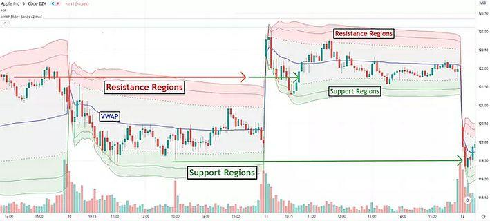

In today's fast-paced trading environment, mastering advanced trading strategies is essential for achieving success. Among the myriad of trading tools, Volume Weighted Average Price (VWAP) distinguishes itself as a favored analytical tool, particularly in algorithmic trading. VWAP stands out because it considers both price movements and trade volume, providing a more nuanced understanding of market dynamics. This characteristic makes VWAP especially useful for day traders aiming to optimize their trades.

VWAP is a valuable resource for traders due to its ability to offer insights into the average price level of a security throughout a trading session. It is used extensively as a benchmark for trade execution, aiding traders in evaluating whether their trades are favorable compared to market activity. VWAP's practicality is heightened by its dynamic nature, adjusting in real-time to reflect ongoing market developments. This real-time adjustment makes it an indispensable tool for traders who need precise and timely information to make informed trading decisions.



The significance of VWAP is further highlighted by its application in various trading strategies. For instance, while simple moving averages (SMA) are typically used for analyzing longer-term trends, VWAP excels in short-term, intraday trading scenarios. This distinction arises because VWAP integrates trade volume into its calculation, providing a volume-adjusted price average that is more aligned with real-time market conditions. Traders can leverage VWAP to inform their trading strategies, potentially leading to improved trade execution and reduced market impact. 

In this article, we explore the intricacies of VWAP, its calculation, and its strategic advantages compared to traditional indicators like the SMA. This exploration will equip traders with the knowledge needed to enhance their trading effectiveness, enabling them to navigate the complexities of the modern trading landscape with greater confidence.

## Table of Contents

## Understanding Volume-Weighted Average Price (VWAP)

Volume-Weighted Average Price (VWAP) is a sophisticated trading indicator that provides the average price at which a security has traded over the course of a trading session, factoring in both price and volume data. Its primary function is to offer traders, particularly institutional ones, a nuanced understanding of the market by integrating both elements—price movements and trade volume—into its calculations. This dual consideration allows VWAP to deliver a realistic depiction of the market sentiment and is thus valued for its comprehensive nature.

VWAP is designed as an intraday measure, resetting with each new trading session, which makes it a valuable tool for assessing trade execution quality. Institutional traders often use VWAP as a benchmark to evaluate how well their trades have been executed compared to the day's average market price. This characteristic of VWAP is crucial because it aids in determining whether trades were executed at favorable prices relative to the broader market activity. The ability to benchmark trades against the VWAP is instrumental in minimizing the market impact, especially for large trades.

By incorporating the entire trading session's [volume](/wiki/volume-trading-strategy) and price data, VWAP provides an effective metric for understanding the true market dynamics. Unlike simple price averages, VWAP’s incorporation of volume provides a more weighted and therefore realistic representation of a security's trading performance throughout a single day. This comprehensive approach makes VWAP a preferred tool among institutional traders who require precise insights into the trading landscape to make informed decisions.

## How VWAP is Calculated

The calculation of the Volume-Weighted Average Price (VWAP) can be broken down into a straightforward formula that reflects the weighted average price a security has traded at during a given day, adjusted by trading volume. The formula for VWAP is expressed as:

$$
\text{VWAP} = \frac{\sum_{i=1}^{n} (P_i \times V_i)}{\sum_{i=1}^{n} V_i}
$$

Where:
- $P_i$ is the typical price in a given period $i$
- $V_i$ is the volume traded during that period
- $n$ represents each time interval for which VWAP is calculated

The typical price for each period can be defined using the following formula:

$$
P_i = \frac{\text{High}_i + \text{Low}_i + \text{Close}_i}{3}
$$

Where:
- $\text{High}_i$ is the highest price during the period
- $\text{Low}_i$ is the lowest price
- $\text{Close}_i$ is the closing price

This calculation is repeated for each time increment — typically every minute, hour, or whatever period is relevant for the trader's strategy. VWAP is distinctive because it incorporates trade volume into the price calculation, ensuring that periods with higher trading volumes influence the price more significantly.

VWAP is continually updated throughout the trading day, rendering it an indispensable tool for intraday analysis. The dynamic nature of VWAP allows traders to visualize how the weighted average price evolves as market participants buy and sell the security. This real-time updating provides a valuable reference point against which traders can compare transaction prices, ultimately aiding in the decision-making process of buying or selling relative to the VWAP.

## Significance of VWAP in Trading

Volume-Weighted Average Price (VWAP) is a significant tool in the trading landscape, especially for intraday market participants. By providing a volume-adjusted average price, VWAP serves as a benchmark, allowing traders to assess the quality of trade executions. If a trader's buy order is below the VWAP, it indicates an advantageous position since the trader paid a price lower than the average. Conversely, selling above the VWAP signifies an advantageous [exit](/wiki/exit-strategy), as the selling price exceeds the average trading price. This makes VWAP a critical metric for evaluating trade efficiency.

VWAP also offers insights into intraday price trends, effectively assisting traders in identifying potential support and resistance levels. When the market price hovers above the VWAP, it suggests a bullish sentiment, whereas a market price below the VWAP indicates bearish sentiment. This dual function of VWAP as both a trend indicator and a price benchmark is crucial in formulating trading strategies.

Institutional traders, in particular, place considerable emphasis on VWAP during large trade executions. Large trades can inadvertently 'move the market', affecting prices unfavorably if not executed judiciously. By aiming to execute trades close to the VWAP, institutional traders can minimize their market impact. This approach ensures that trades do not significantly distort the market price, thereby enhancing execution efficiency while maintaining fairness in pricing. Such strategic use of VWAP is vital for maintaining order in high-volume trading environments.

VWAP's role as a benchmark extends beyond the advantage of trade execution alone. It informs traders about prevailing market conditions, enhancing their ability to make informed decisions. Integrating VWAP with additional technical indicators augments its utility, enabling a comprehensive trading strategy that accounts for both price and volume dynamics.

## VWAP Strategies for Trading

Common VWAP (Volume Weighted Average Price) strategies play a crucial role in enhancing trade execution and market analysis. These strategies primarily focus on leveraging the relationship between the security's price and the VWAP line throughout the trading day, offering traders insights for effective decision-making. 

A prevalent strategy involves exploiting the concept of mean reversion. Under this approach, traders look to buy when the price dips below the VWAP and sell when it exceeds the VWAP. This tactic is based on the assumption that prices will revert to the mean over time, making positions below the VWAP potentially undervalued and those above it overvalued. For example, if a stock's price tends to oscillate around its VWAP during the day, traders can capitalize on these fluctuations by anticipating a return to the VWAP line.

Another effective strategy incorporates the use of VWAP alongside additional technical indicators, such as Bollinger Bands. Bollinger Bands provide a dynamic range by plotting standard deviations above and below a simple moving average, which can be adapted using the VWAP as the moving average basis. By using these bands, traders can identify potential overbought or oversold conditions, enhancing trade signals. The synergy of VWAP with Bollinger Bands augments the trader's ability to discern valuable entry and exit points, offering a clearer picture of market conditions.

These strategies underscore the adaptability and utility of VWAP. By using VWAP for benchmarking, trend confirmation, and aligning with technical indicators, traders can potentially improve their market timing and execution efficiency.

## VWAP vs. Moving Averages

VWAP, or Volume Weighted Average Price, presents a distinct difference from traditional moving averages, such as the Simple Moving Average (SMA), primarily through its integration of trade volume into its calculation. This adjustment makes VWAP a volume-adjusted price average, providing a more nuanced reflection of price movements within the trading day.

The calculation for VWAP is generally given by:

$$
\text{VWAP} = \frac{\sum (\text{Price}_t \times \text{Volume}_t)}{\sum \text{Volume}_t}
$$

where $\text{Price}_t$ is typically the average of the high, low, and close prices during a specific time period $t$, and $\text{Volume}_t$ is the trading volume during that period.

Moving averages, like the SMA, are calculated simply by averaging a set of prices over a specific number of periods:

$$
\text{SMA} = \frac{\sum \text{Price}_t}{n}
$$

where $n$ is the number of periods in consideration and $\text{Price}_t$ is the closing price for each period.

While moving averages are integral in identifying longer-term price trends by smoothing out price data over time, VWAP is particularly effective for short-term and intraday trading decisions. This is because VWAP provides a benchmark that reflects the weighted average price of a security during the trading day, factoring in the volume of trades. As a result, VWAP offers a more precise indicator of real-time market sentiment compared to moving averages that do not account for trade volume.

Traders leverage VWAP to assess whether their trades have been executed at a favorable price compared to the overall market activity. A trade executed at a price lower than the VWAP is often considered advantageous, indicating the purchase was made at a cost below the average price weighted by volume. Conversely, selling above VWAP is viewed similarly.

VWAP's capacity to integrate volume data makes it a compelling tool for traders who require immediate feedback on market conditions during the trading day. This contrasts with the SMA, which is more apt for traders focusing on longer-term price trends without the granularity of volume information. Hence, VWAP serves as a critical real-time guideline for evaluating trade performance and market fairness.

## Advanced VWAP Techniques

Incorporating a VWAP standard deviation into trading strategies can enhance its utility by creating dynamic support and resistance levels. These levels are calculated by taking the standard deviation of the VWAP line, which can then be added or subtracted from the original VWAP value to form upper and lower bands. These bands act as thresholds where price action is likely to reverse or encounter support and resistance.

Advanced traders leverage VWAP deviations to formulate sophisticated [algorithmic trading](/wiki/algorithmic-trading) strategies. By identifying the boundaries created by these bands, traders can define trading zones that provide low-risk entry points. For instance, a trader may set up a strategy where they initiate long positions when prices hover near the lower band, anticipating a reversal towards the VWAP. Conversely, they might consider initiating short positions as prices approach the upper band.

The adaptability of VWAP strategies allows for modifications that can suit different trading styles and market conditions. Traders can adjust the standard deviation multiplier used to determine the width of the bands to better fit the [volatility](/wiki/volatility-trading-strategies) of the market or their own risk tolerance. Here is a sample Python code illustrating how to calculate VWAP bands:

```python
import pandas as pd

def calculate_vwap_bands(data, window_size=14):
    # Typical price
    data['Typical Price'] = (data['High'] + data['Low'] + data['Close']) / 3
    # VWAP calculation
    data['Cumulative TPV'] = (data['Typical Price'] * data['Volume']).cumsum()
    data['Cumulative Volume'] = data['Volume'].cumsum()
    data['VWAP'] = data['Cumulative TPV'] / data['Cumulative Volume']

    # Standard deviation of the typical price
    data['TP_Std'] = data['Typical Price'].rolling(window=window_size).std()

    # VWAP bands
    data['VWAP Upper Band'] = data['VWAP'] + data['TP_Std']
    data['VWAP Lower Band'] = data['VWAP'] - data['TP_Std']

    return data[['VWAP', 'VWAP Upper Band', 'VWAP Lower Band']]

# Example usage with a DataFrame 'df' containing 'High', 'Low', 'Close', and 'Volume' columns
df_with_vwap_bands = calculate_vwap_bands(df)
```

The VWAP technique's flexibility is advantageous, as it can be tailored to varying market scenarios, accommodating traders' unique strategies and risk profiles. Whether in volatile scenarios or trending markets, adjusting the VWAP deviations ensures that these strategies remain relevant and effective.

## Limitations of VWAP

VWAP, while providing valuable insights into trading dynamics, is not without its limitations. One primary limitation stems from its nature as a lagging indicator, largely due to its reliance on historical data. This characteristic implies that VWAP cannot predict future price movements, but instead, it reflects past and current trading activity—making it reactive rather than predictive. Consequently, traders relying solely on VWAP might miss more immediate market shifts.

In markets characterized by low [liquidity](/wiki/liquidity-risk-premium), VWAP can also become less reliable. In these environments, the impact of large trades is more pronounced, which may skew the VWAP value significantly. For instance, a single large trade can disproportionately affect the VWAP calculation, resulting in a misleading representation of the average trading price. This makes VWAP a less effective tool in such market conditions where liquidity is a concern.

Moreover, an overreliance on VWAP without supplementing it with additional market context and indicators can result in suboptimal trading outcomes. VWAP, while useful, does not consider external factors such as market news, economic events, or broader market sentiment, which are crucial for making informed trading decisions. Traders who base their strategies solely on VWAP without incorporating other technical or fundamental analyses may find themselves at a disadvantage, especially in volatile market conditions. Therefore, while VWAP offers significant insights, it should be used as one component of a broader, multifaceted trading strategy to ensure more comprehensive market evaluation.

## Conclusion

Volume Weighted Average Price (VWAP) remains a staple analytical tool for traders focusing on intraday strategies. By providing a clear picture of an average transaction price, weighted by volume, VWAP aids traders in evaluating whether trades have been executed advantageously relative to the broader market activity. Its capacity to detail intraday market trends and establish potential support and resistance levels renders it invaluable for both novice and experienced traders seeking to refine their execution quality.

VWAP's real value emerges when integrated with additional trading indicators and strategies. It can enhance decision-making processes by confirming market trends and timing trades more accurately. For instance, combining VWAP with Bollinger Bands or moving averages can provide a robust framework for identifying potential trade opportunities. The integration of VWAP within algorithmic trading systems further underscores its utility, as it can assist in minimizing market impact and aligning trades closer to the mean market activity.

Despite its numerous advantages, traders need to remain aware of VWAP's limitations. As with any lagging indicator, VWAP can face challenges in low-liquidity markets, where large trades disproportionately affect prices. This can sometimes lead to less reliable signals. Therefore, relying solely on VWAP without considering other market indicators or contextual data may result in suboptimal decisions.

In conclusion, while VWAP is a powerful tool for intraday trading, its effectiveness increases significantly when used alongside other strategies that account for its inherent limitations. Traders aiming to optimize their intraday approaches should consider VWAP's insights but remain cautious to balance its use with a broader spectrum of market analytics.

## References & Further Reading

[1]: ["Algorithmic Trading: Winning Strategies and Their Rationale"](https://www.wiley.com/en-us/Algorithmic+Trading%3A+Winning+Strategies+and+Their+Rationale-p-9781118460146) by Ernest P. Chan

[2]: Madhavan, A., & Cheng, M. (1997). ["In Search of Liquidity: Block Trades in the Upstairs and Downstairs Markets."](https://www.jstor.org/stable/2962260) The Review of Financial Studies, 10(1), 175-204.

[3]: Collins-Dufresne, P., & Fos, V. (2015). ["Do Prices Reveal the Presence of Informed Trading?"](https://www.jstor.org/stable/43612930) Review of Financial Studies, 28(5), 1260-1308.

[4]: Gould, M. D., & Quartz, S. R. (2012). ["Trends in Mobile Technology and Trading: An Algorithmic Review."](https://link.springer.com/book/10.1007/978-3-642-22161-3) Decision Support Systems, 54(1), 164-172.

[5]: ["Technical Analysis of the Financial Markets"](https://drive.google.com/file/d/1OcDrGakDhaejT7J7xGEE3HHKy7xmrafy/preview) by John J. Murphy