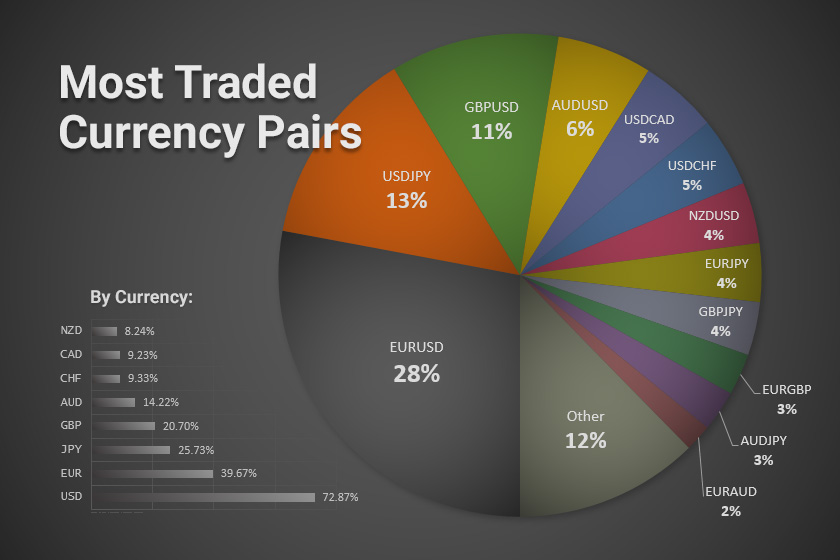

## Table of Contents

## What is a currency pair?

A currency pair is a way to show the value of one country's money compared to another country's money. It is written with two letters for each currency, like USD for the US dollar and EUR for the Euro. The first currency in the pair is called the base currency, and the second one is the quote currency. For example, in the pair USD/EUR, the US dollar is the base currency and the Euro is the quote currency.

When you see a currency pair, the number next to it tells you how much of the quote currency you need to buy one unit of the base currency. If USD/EUR is 0.85, it means you need 0.85 Euros to buy one US dollar. People use currency pairs a lot in the foreign exchange market, where they trade different currencies. This helps them understand how strong or weak one currency is compared to another.

## Why are some currency pairs more commonly traded than others?

Some currency pairs are more commonly traded than others because they involve the world's biggest economies. For example, the US dollar (USD) is used in many trades because the United States has a big economy. When people trade the USD with other major currencies like the Euro (EUR) or the Japanese Yen (JPY), these pairs are called major pairs. They are popular because lots of people and businesses need to buy and sell these currencies for their daily work.

Another reason is that some currency pairs have more stable and predictable exchange rates. This makes them safer for traders to buy and sell. For example, the EUR/USD pair is very stable because both the Eurozone and the United States have strong economies. Traders feel more comfortable trading these pairs because they can predict the prices better. This stability and predictability make these pairs more popular in the market.

## What are the major currency pairs?

The major currency pairs are the ones that people trade the most around the world. They always have the US dollar (USD) on one side because the US has a big economy. The other side of the pair is usually from another big economy. The most common major pairs are USD with the Euro (EUR), the Japanese Yen (JPY), the British Pound (GBP), the Australian Dollar (AUD), the Canadian Dollar (CAD), and the Swiss Franc (CHF). These pairs are called EUR/USD, USD/JPY, GBP/USD, AUD/USD, USD/CAD, and USD/CHF.

These pairs are popular for a few reasons. First, they are easy to trade because they are from big economies with lots of money moving around. Second, they have stable prices, which makes them safer for people to buy and sell. Traders like to use these pairs because they can predict how the prices will change better than with other pairs. This makes trading easier and less risky.

## What is the difference between major, minor, and exotic currency pairs?

Major currency pairs are the most popular ones that people trade all over the world. They always have the US dollar (USD) on one side because the US has a big economy. The other side of the pair is usually from another big economy like the Euro (EUR), the Japanese Yen (JPY), or the British Pound (GBP). These pairs are called EUR/USD, USD/JPY, GBP/USD, and others. They are easy to trade because they are from big economies with lots of money moving around, and they have stable prices, which makes them safer for people to buy and sell.

Minor currency pairs, also called cross currency pairs, do not have the US dollar in them. They are made up of other major currencies like the Euro, the British Pound, and the Japanese Yen. Examples of minor pairs include EUR/GBP, EUR/JPY, and GBP/JPY. These pairs are less traded than the major pairs, but they are still popular because they involve big economies. They can be a bit less stable than major pairs, but they are still easier to trade than exotic pairs.

Exotic currency pairs include one major currency and one from a smaller or less developed economy. Examples are USD/PLN (US dollar and Polish zloty) or EUR/TRY (Euro and Turkish lira). These pairs are not traded as much because they can be very unpredictable and hard to trade. The economies of these countries might not be as stable, so the exchange rates can change a lot. This makes them riskier for traders, but some people still trade them to try to make more money because of the big changes in price.

## How does the liquidity of a currency pair affect trading?

Liquidity is how easy it is to buy or sell a currency pair. If a currency pair is very liquid, it means lots of people are trading it, and you can quickly buy or sell it without changing the price much. The major currency pairs, like EUR/USD or USD/JPY, are very liquid because they involve big economies and lots of people want to trade them. When you trade a liquid pair, you can get in and out of trades easily, and the price stays stable, which makes trading safer and more predictable.

If a currency pair is not very liquid, it means fewer people are trading it, and it can be hard to buy or sell it quickly. Exotic pairs, like USD/PLN or EUR/TRY, are usually less liquid because they involve smaller economies. When you trade these pairs, you might have to wait longer to find someone to trade with, and the price can change a lot while you wait. This can make trading riskier because the price can move against you before you can make your trade.

## What are the most commonly traded currency pairs and why?

The most commonly traded currency pairs are called the major pairs. These include EUR/USD, USD/JPY, GBP/USD, AUD/USD, USD/CAD, and USD/CHF. They are popular because they always have the US dollar on one side, and the US has a big economy. The other side of the pair is usually from another big economy like Europe, Japan, or the UK. Lots of people and businesses need to use these currencies every day, so they are traded a lot.

These major pairs are also popular because they are very liquid. This means it's easy to buy and sell them quickly without changing the price much. They have stable prices because they come from big economies that don't change a lot. Traders like to use these pairs because they can predict how the prices will change better than with other pairs. This makes trading easier and less risky.

## How do economic indicators influence the trading of currency pairs?

Economic indicators are important pieces of information that tell us how well a country's economy is doing. Things like the unemployment rate, inflation rate, and gross domestic product (GDP) are examples of economic indicators. When these numbers change, they can affect how much people want to buy or sell a country's currency. For example, if a country's unemployment rate goes down, it means more people have jobs, and the economy might be doing well. This could make people want to buy that country's currency more, which would make it stronger compared to other currencies.

Traders pay close attention to these economic indicators because they help them decide when to buy or sell a currency pair. If an economic report shows that a country's economy is doing better than expected, traders might buy that country's currency because they think it will get stronger. On the other hand, if the report shows the economy is doing worse, traders might sell that currency because they think it will get weaker. This buying and selling based on economic indicators can cause the exchange rates of currency pairs to change a lot, which is why traders always keep an eye on them.

## What role do interest rates play in the valuation of currency pairs?

Interest rates are important because they can change how much people want to buy or sell a country's currency. When a country's central bank raises interest rates, it makes saving money in that country more attractive. People and businesses might want to keep their money in that country's banks to get a higher return. This demand for the currency can make it stronger compared to other currencies. On the other hand, if a country lowers its interest rates, it might make people want to move their money somewhere else where they can get a better return. This can make the currency weaker.

Traders watch interest rates closely because they can affect the value of currency pairs. If one country raises its interest rates and another keeps theirs the same, traders might buy the currency from the country with higher rates. This can make the currency pair that includes the higher-rate currency go up in value. For example, if the US raises interest rates and Europe keeps them the same, the USD/EUR pair might go up because more people want to buy US dollars. This is why interest rates are a big deal in the world of currency trading.

## How can geopolitical events impact the volatility of currency pairs?

Geopolitical events, like wars, elections, or trade disagreements, can make currency pairs change a lot. When something big happens in a country, people might start to worry about its economy. If they think the economy will get worse because of the event, they might sell the country's currency. This can make the currency weaker and cause the currency pair to move up and down a lot. For example, if there is a war in a country, people might sell its currency because they are worried about the future, which can make the currency pair very unstable.

On the other hand, if a geopolitical event makes people think a country's economy will do better, they might buy its currency. This can make the currency stronger and cause the currency pair to be less volatile. For example, if a country signs a good trade deal, people might buy its currency because they think the economy will grow. Traders watch these events closely because they can cause big changes in currency pairs, making them go up and down quickly.

## What are the best times to trade specific currency pairs?

The best times to trade currency pairs depend on when the markets are open in different parts of the world. The foreign exchange market is open 24 hours a day from Monday to Friday, but some times are busier than others. The most active times are when the major markets in London and New York are both open, which is usually from 8 AM to 12 PM Eastern Time. During these hours, there are lots of people trading, so the currency pairs are more liquid and the prices can change a lot. This can be a good time to trade if you want to take advantage of big price movements.

For specific currency pairs, it's also important to know when the markets of the countries involved are open. For example, if you are trading the EUR/USD pair, you might want to trade when both the European and US markets are open because this is when the pair is most active. If you are trading the USD/JPY pair, you should look at the times when the US and Japanese markets overlap, which is usually from 7 PM to 2 AM Eastern Time. Trading during these times can help you get better prices and more opportunities to make trades.

## How do traders use technical analysis to predict movements in currency pairs?

Traders use technical analysis to look at past price movements and patterns on charts to guess where a currency pair might go next. They use things like trend lines, support and resistance levels, and different kinds of charts to see if the price is going up or down. For example, if they see a pattern that often leads to a price going up, they might decide to buy the currency pair. Technical analysis helps traders make decisions based on what they see happening on the charts, rather than just guessing.

Another important part of technical analysis is using indicators like moving averages, the Relative Strength Index (RSI), and the Moving Average Convergence Divergence (MACD). These tools help traders see if a currency pair is overbought or oversold, which can tell them if the price might change soon. For instance, if the RSI shows that a currency pair is overbought, traders might think the price will go down soon and decide to sell. By using these indicators, traders can make more informed guesses about future price movements and plan their trades better.

## What advanced strategies can be used to trade less common currency pairs effectively?

Trading less common currency pairs, like exotic pairs, can be tricky because they are not traded as much and can be less predictable. One advanced strategy to trade these pairs effectively is to use a combination of fundamental and technical analysis. Fundamental analysis involves looking at the economic health of the countries involved, like their GDP, inflation rates, and political stability. By understanding these factors, traders can guess how strong or weak a currency might become. Technical analysis, on the other hand, involves studying past price movements on charts to spot patterns and trends. Using both types of analysis together can help traders make better decisions about when to buy or sell these less common pairs.

Another strategy is to use a [carry](/wiki/carry-trading) trade, which involves borrowing money in a currency with a low [interest rate](/wiki/interest-rate-trading-strategies) and investing it in a currency with a higher interest rate. This can be especially useful with exotic pairs because the interest rate differences can be big. However, carry trades can be risky because the exchange rates of these pairs can change a lot. To manage this risk, traders can use stop-loss orders, which automatically sell the currency if it drops to a certain price. This helps protect their money if the trade doesn't go as planned. By carefully choosing the right times to enter and [exit](/wiki/exit-strategy) these trades, traders can take advantage of the potential profits while managing the risks of trading less common currency pairs.

## What are the strategies for successful Forex and Algo trading?

Successful [forex](/wiki/forex-system) trading requires a comprehensive strategy that integrates market trends, economic indicators, and currency pair correlations. At its core, a robust trading strategy aims to navigate the complexities of the forex market, maximize returns, and manage risks efficiently.

**Market Trends and Economic Indicators**

Understanding and analyzing market trends and economic indicators are fundamental to formulating a successful forex trading strategy. Market trends provide insights into the potential direction of currency movements. By studying price patterns and historical data, traders can identify bullish or bearish trends, aiding in decision-making processes. Economic indicators, such as GDP growth rates, inflation, employment figures, and central bank policies, offer crucial insights into the economic health of a country, directly influencing currency valuations.

**Currency Pair Correlations**

Currency pair correlations represent the extent to which two currency pairs move in relation to each other. Positive correlation indicates that the pairs move in the same direction, while negative correlation suggests opposite movement. Understanding these correlations allows traders to diversify their portfolios and manage risk more effectively. For instance, if EUR/USD and GBP/USD are positively correlated, placing simultaneous trades in the same direction can amplify risk or reward accordingly.

**Algorithmic Trading Strategies**

Algorithmic trading, or algo trading, employs computer programs to execute trades based on pre-defined criteria. These algorithms range from simple rule-based systems to advanced [machine learning](/wiki/machine-learning) models capable of adapting to dynamic market conditions.

1. **Rule-Based Systems**: These involve straightforward trading rules such as moving averages or breakout strategies. For example, a simple moving average crossover strategy may be implemented as follows:

   ```python
   if short_term_moving_average > long_term_moving_average:
       execute_buy_order()
   else:
       execute_sell_order()
   ```

2. **Machine Learning Models**: These employ sophisticated techniques to identify patterns and predict market movements. Models such as decision trees, neural networks, and support vector machines can analyze vast amounts of data, optimizing trading decisions.

**Risk Management**

Risk management represents a critical aspect of any trading strategy, particularly within the volatile forex markets. Techniques such as stop-loss orders, position sizing, and diversification are employed to mitigate potential losses. A common risk management formula employed by traders is the position size calculation:

$$
\text{Position Size} = \frac{\text{Account Risk} \times \text{Account Balance}}{\text{Stop Loss in Pips} \times \text{Value Per Pip}}
$$

This formula helps traders determine the appropriate trade size based on their risk tolerance and market [volatility](/wiki/volatility-trading-strategies).

**Balancing Human Intuition and Algorithmic Precision**

While algorithms offer precision and efficiency, human intuition plays a valuable role in forex trading. Traders often leverage their experience and market understanding to complement algorithmic analyses. By combining human insight with algorithmic strategies, traders can better navigate market nuances and capitalize on emerging opportunities.

In summary, successful forex and [algorithmic trading](/wiki/algorithmic-trading) strategies blend the analysis of market trends, economic indicators, and currency correlations with rigorous risk management and advanced algorithmic techniques. Balancing these elements facilitates optimal trading outcomes in the ever-evolving forex market.

## References & Further Reading

[1]: ["Advances in Financial Machine Learning"](https://www.amazon.com/Advances-Financial-Machine-Learning-Marcos/dp/1119482089) by Marcos Lopez de Prado

[2]: Bergstra, J., Bardenet, R., Bengio, Y., & Kégl, B. (2011). ["Algorithms for Hyper-Parameter Optimization."](https://dl.acm.org/doi/10.5555/2986459.2986743) Advances in Neural Information Processing Systems 24.

[3]: ["Machine Learning for Algorithmic Trading"](https://github.com/PacktPublishing/Machine-Learning-for-Algorithmic-Trading-Second-Edition) by Stefan Jansen

[4]: ["Quantitative Trading: How to Build Your Own Algorithmic Trading Business"](https://books.google.com/books/about/Quantitative_Trading.html?id=j70yEAAAQBAJ) by Ernest P. Chan

[5]: ["Evidence-Based Technical Analysis: Applying the Scientific Method and Statistical Inference to Trading Signals"](https://www.amazon.com/Evidence-Based-Technical-Analysis-Scientific-Statistical/dp/0470008741) by David Aronson