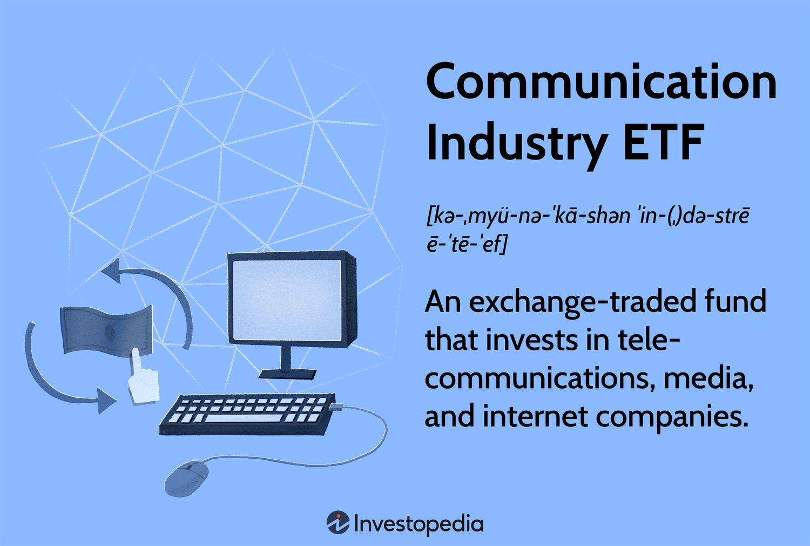

## Table of Contents

## What is an ETF?

An ETF, or Exchange-Traded Fund, is a type of investment that holds a collection of assets like stocks, bonds, or commodities. It's like a basket where you can put different things inside. You can buy and sell shares of an ETF on a stock exchange, just like you would with a single stock. This makes it easy for people to invest in a variety of assets without having to buy each one separately.

ETFs are popular because they offer diversification, which means spreading out your investments to reduce risk. Instead of putting all your money into one company's stock, you can own a small piece of many different companies through one ETF. They also tend to have lower fees than mutual funds, making them a cost-effective way to invest. Overall, ETFs are a convenient and flexible tool for building a well-rounded investment portfolio.

## What is the communication sector?

The communication sector is a part of the economy that includes companies that help people share information. This includes telephone companies, internet service providers, and media companies like TV and radio stations. These companies make it possible for people to talk to each other, watch shows, and use the internet.

This sector is very important because it helps keep people connected. Without it, it would be hard to call friends, watch your favorite shows, or even use the internet to learn new things. Companies in this sector are always working to make their services faster and better, so people can communicate more easily.

## Why invest in communication sector ETFs?

Investing in communication sector ETFs can be a smart choice because this sector is always growing and changing. People need to communicate more than ever, whether it's for work, school, or just staying in touch with friends and family. This means that companies in the communication sector, like phone companies and internet providers, are likely to do well. When you invest in a communication sector [ETF](/wiki/etf-trading-strategies), you're investing in a group of these companies all at once, which can be less risky than [picking](/wiki/asset-class-picking) just one company.

Another reason to invest in these ETFs is that they can help you spread out your money. Instead of putting all your money into one company, you can own a little bit of many different companies in the communication sector. This is called diversification, and it can help protect your money if one company doesn't do well. Plus, ETFs usually have lower fees than other types of investments, so you get to keep more of your money. Overall, communication sector ETFs can be a good way to grow your savings while staying connected to the world.

## How do communication sector ETFs work?

Communication sector ETFs work by holding a bunch of different companies that are all part of the communication industry. This includes companies that help people talk to each other, like phone companies, internet providers, and even TV and radio stations. When you buy shares of a communication sector ETF, you're basically buying a small piece of all these companies at once. This makes it easier for you to invest in the whole communication industry without having to pick and choose individual companies.

The price of the ETF goes up and down based on how well the companies inside it are doing. If the communication companies are doing well, the ETF's price will go up, and if they're not doing so well, the price will go down. You can buy and sell shares of the ETF on a stock exchange, just like you would with a single stock. This makes it easy to get in and out of your investment whenever you want. Plus, because the ETF holds a lot of different companies, it can help spread out your risk, making it a safer way to invest in the communication sector.

## What are some popular communication sector ETFs?

Some popular communication sector ETFs are the Communication Services Select Sector SPDR Fund (XLC) and the Vanguard Communication Services ETF (VOX). The XLC ETF follows the performance of the communication services sector of the S&P 500, which includes big companies like Verizon, AT&T, and Netflix. This ETF is a good choice if you want to invest in well-known companies in the communication industry. The VOX ETF, on the other hand, tries to match the performance of the MSCI US Investable Market Communication Services 25/50 Index. This ETF includes a wider range of companies, which can help spread out your risk even more.

Both of these ETFs are easy to buy and sell on a stock exchange, just like a regular stock. They offer a way to invest in the communication sector without having to pick individual companies. By owning shares in these ETFs, you get a piece of many different communication companies, which can help your investment grow while keeping your risk lower. These ETFs are popular because they are simple to use and can help you stay connected to the growing communication industry.

## What are the risks associated with investing in communication sector ETFs?

Investing in communication sector ETFs can be risky because the whole sector might not do well. If people start using less phone, internet, or TV services, the companies in the ETF could lose money. This would make the price of the ETF go down, and you could lose money too. Also, new technology can change the communication industry very fast. If a new way of communicating comes along that the companies in the ETF don't use, they might fall behind and lose value.

Another risk is that ETFs can be affected by things happening all over the world. If there's a big problem in another country, it might hurt the communication companies in the ETF, even if they are based in your country. Plus, even though ETFs help spread out your risk, they can still go up and down a lot. If the stock market has a bad day, the ETF's price could drop suddenly. It's important to think about these risks before you decide to invest in a communication sector ETF.

## How do communication sector ETFs perform compared to other sector ETFs?

Communication sector ETFs can perform differently from other sector ETFs because each sector of the economy grows at its own pace. For example, if people are using more internet and phone services, communication sector ETFs might do better than ETFs in sectors like energy or finance. But if there's a big new technology that changes how we communicate, and the companies in the ETF don't use it, the ETF might not do as well as others. So, the performance of communication sector ETFs depends a lot on what's happening in the communication industry.

Compared to other sector ETFs, communication sector ETFs can be more volatile because technology changes quickly. For instance, a tech sector ETF might do really well if new gadgets are popular, but a communication sector ETF might not do as well if people start using less traditional phone services. On the other hand, if the communication sector is stable and growing, these ETFs might outperform ETFs in sectors that are struggling, like retail or real estate. It's important to keep an eye on trends in the communication industry to understand how these ETFs might perform compared to others.

## What factors should be considered when choosing a communication sector ETF?

When choosing a communication sector ETF, one important thing to think about is what companies are inside the ETF. Different ETFs might have different mixes of phone companies, internet providers, and media companies. You want to pick an ETF that has companies you believe will do well in the future. Also, look at the fees the ETF charges. Some ETFs cost more than others, and lower fees mean you get to keep more of your money.

Another [factor](/wiki/factor-investing) to consider is how the ETF has done in the past. While past performance doesn't tell you exactly what will happen in the future, it can give you an idea of how the ETF has handled good and bad times. You should also think about how much risk you're okay with. Communication sector ETFs can go up and down a lot because technology changes quickly. If you don't like a lot of risk, you might want to pick an ETF that's more stable, even if it might not grow as fast.

## How can communication sector ETFs be used in a diversified investment portfolio?

Communication sector ETFs can be a great way to add variety to your investment portfolio. When you invest in a communication sector ETF, you're putting your money into a group of companies that help people talk to each other, like phone companies and internet providers. By including this ETF in your portfolio, you're not putting all your eggs in one basket. Instead, you're spreading your money across different parts of the economy, which can help protect your savings if one sector doesn't do well.

Adding a communication sector ETF to your portfolio can also help you take advantage of the growth in the communication industry. People are using more and more internet and phone services every day, which means the companies in these ETFs might do well in the future. By having a piece of this growing sector, you can balance out other investments that might not be growing as fast. This way, you can build a strong and balanced portfolio that can help your money grow over time.

## What are the tax implications of investing in communication sector ETFs?

When you invest in communication sector ETFs, you need to think about taxes. ETFs can be a bit tricky because they might give you money in different ways. One way is through dividends, which are payments the ETF makes from the money it earns. These dividends are usually taxed as regular income, which can be higher than other types of taxes. Another way you might owe taxes is if you sell your ETF shares for more money than you paid for them. This is called a capital gain, and it's taxed at a lower rate if you held the shares for more than a year.

The good news is that ETFs are often more tax-efficient than other types of investments like mutual funds. This is because of how they are set up. ETFs usually don't have to sell their holdings as often, which means they don't create as many taxable events. This can help you keep more of your money. But, it's always a good idea to talk to a tax advisor to understand how investing in communication sector ETFs will affect your taxes. They can help you make smart choices and plan for any tax bills you might have to pay.

## How do global events impact the performance of communication sector ETFs?

Global events can really change how communication sector ETFs do. If something big happens in the world, like a new law or a big technology change, it can affect the companies inside the ETF. For example, if a country passes a new rule that makes it harder for internet companies to work there, the ETF's price might go down. Or, if there's a new way of talking to each other that becomes popular, like a new app, the ETF could do better if the companies inside it use that new technology.

Also, if there's a big problem in another country, it can hurt the communication companies in the ETF, even if they are based in your country. For example, if there's a war or a big economic problem somewhere else, it might make people use less internet or phone services, which would be bad for the ETF. But, if a global event makes people need to communicate more, like a big health crisis where everyone has to stay home, the ETF might do better because more people are using communication services. So, it's important to keep an eye on what's happening around the world when you're investing in communication sector ETFs.

## What advanced strategies can be used to optimize returns from communication sector ETFs?

One advanced strategy to optimize returns from communication sector ETFs is to use a technique called sector rotation. This means you move your money between different sectors of the economy based on which ones are doing well at different times. For example, if you think the communication sector is going to grow because of new technology, you might put more of your money into communication sector ETFs. Then, if another sector starts doing better, you can move some of your money there. This can help you take advantage of the ups and downs in the market and make more money over time.

Another strategy is to use options to hedge your bets. Options are like contracts that give you the right to buy or sell an ETF at a certain price. If you're worried that the communication sector might go down, you can buy a put option, which lets you sell your ETF at a set price even if the market drops. This can help protect your money. On the other hand, if you think the communication sector is going to go up a lot, you can buy a call option, which lets you buy more of the ETF at a set price. This can help you make more money if the ETF's price goes up a lot. Using options can be tricky, so it's a good idea to learn a lot about them before you start.

## What is the understanding of Communication Industry ETFs?

Communication Industry Exchange-Traded Funds (ETFs) are financial instruments that primarily invest in stocks from the communication sector, encompassing telecommunications, media, and internet companies. These ETFs aim to replicate the performance of a communication-focused index, providing investors with a means to gain exposure to this dynamic sector. 

The principal structure of Communication ETFs involves diversifying investments across various companies within the communication space. This diversification often follows an underlying index designed specifically to capture the breadth and depth of communication-related activities. For instance, an index might include major telecommunications companies like Verizon and AT&T, alongside media giants such as Disney and Netflix, and influential internet companies like Alphabet and Facebook. The index acts as a benchmark that the ETF seeks to mirror in its performance. An example of this can be expressed mathematically through the formula:

$$

ETF_{return} \approx Index_{return} 
$$

The transformation of Communication ETFs is largely a response to evolving market trends and industry reclassifications, such as those introduced by the Global Industry Classification Standard (GICS) in 2018. Originally centered around traditional telecommunications, these ETFs have expanded to include media and technology stocks, reflecting the growing convergence between telecommunications and digital media landscapes. The reclassification acknowledged the significant impact of internet conglomerates and digital content in shaping modern communication industries.

The broadening of scope to include media and technology has enhanced the appeal of these ETFs, as it allows investors to participate in both the stability associated with established telecom companies and the growth potential from innovative media and tech enterprises. This dual exposure aligns with the evolving consumer preferences and technological advancements that characterize current market environments. 

Overall, Communication Industry ETFs provide a strategic way for investors to engage with a high-growth sector, leveraging an index-based approach to capture the intricate dynamics of communication, media, and internet companies.

## References & Further Reading

[1]: ["KPMG's GICS reclassification to impact portfolios."](https://home.kpmg/us/en/home/insights/2018/09/gics-reclassifications-impact-portfolios-us.html) KPMG (2018).

[2]: ["Communication Services Sector Explained."](https://www.morningstar.com/sectors/communication-services) MSCI.

[3]: Fabozzi, F. J., Gupta, F., & Markowitz, H. M. (2002). ["The Legacy of Modern Portfolio Theory."](https://www.semanticscholar.org/paper/The-Legacy-of-Modern-Portfolio-Theory-Fabozzi-Gupta/6619eebc6957d7c101112a041942c4df61783616) Journal of Investing, 11(3), 7-22.

[4]: ["Indexing the Digital World: The Communication Services Reclassification."](https://www.msci.com/www/research-report/the-new-gics-communication/01107886967) S&P Global (2018).

[5]: BlackRock. ["Understanding FAANGs and the Growth of Technology."](https://en.wikipedia.org/wiki/BlackRock) 

[6]: ["Evidence-Based Technical Analysis: Applying the Scientific Method and Statistical Inference to Trading Signals"](https://www.amazon.com/Evidence-Based-Technical-Analysis-Scientific-Statistical/dp/0470008741) by David Aronson

[7]: ["Advances in Financial Machine Learning"](https://www.quantresearch.org/Lectures.htm) by Marcos Lopez de Prado