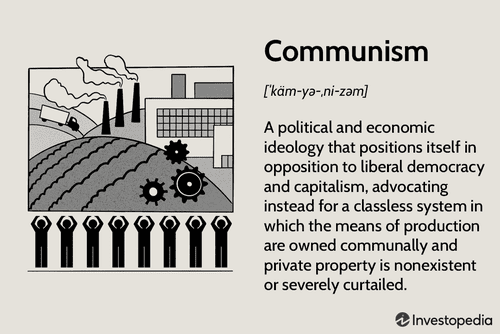

## Table of Contents

## What is communism?

Communism is a type of government and economic system where everything is shared equally among people. In a communist society, there is no private ownership of things like land, businesses, or factories. Instead, the government owns everything and makes sure that everyone has what they need, like food, housing, and healthcare. The idea is that if everyone shares, there won't be big differences between rich and poor people.

The idea of communism was developed by Karl Marx and Friedrich Engels in the 1800s. They wrote about it in a book called "The Communist Manifesto." They believed that workers were being treated unfairly by the people who owned businesses and factories. They thought that if workers took control and shared everything, it would create a fairer society. However, in practice, countries that have tried communism, like the Soviet Union and China, have faced many challenges and problems.

## Who are the key figures associated with the development of communist theory?

The main people who helped develop communist ideas were Karl Marx and Friedrich Engels. They worked together and wrote a very important book called "The Communist Manifesto" in 1848. In this book, they explained that society was divided into two groups: the workers, who they called the proletariat, and the owners of businesses and factories, who they called the bourgeoisie. They believed that the workers were treated badly and that they should take control of everything to make society fairer. Their ideas became the foundation for communism.

Another important person in the development of communist theory was Vladimir Lenin. He was a Russian leader who took Marx and Engels' ideas and applied them in Russia. Lenin believed that a small group of dedicated revolutionaries could lead the workers to overthrow the government. He led the Bolshevik Party and successfully took control of Russia in 1917, creating the first communist state, which later became the Soviet Union. Lenin's ideas about how to actually make communism work in a country added a lot to the theory.

Other thinkers like Leon Trotsky and Mao Zedong also contributed to communist theory. Trotsky, who worked with Lenin, had ideas about how to spread communism to other countries. Mao Zedong led the Communist Party in China and developed his own version of communism, called Maoism, which focused on the role of peasants in the revolution. These figures all helped shape and expand the ideas that Marx and Engels started.

## What are the main principles of communism?

Communism is based on the idea that everyone should share everything equally. In a communist society, there is no private ownership of things like land, businesses, or factories. Instead, the government owns everything and makes sure that everyone has what they need, like food, housing, and healthcare. The goal is to create a society where there are no big differences between rich and poor people. This means that everyone works together for the good of the whole community, and no one is left behind.

The main ideas of communism were developed by Karl Marx and Friedrich Engels. They believed that workers were being treated unfairly by the people who owned businesses and factories. They thought that if the workers took control and shared everything, it would create a fairer society. In communism, the government would plan the economy to make sure that everyone's needs are met. This is different from capitalism, where people can own businesses and make money for themselves. Marx and Engels wanted to get rid of the class system and make a world where everyone is equal.

## How does communism differ from socialism?

Communism and socialism are both ideas about how to make society fairer, but they are different in some important ways. In communism, there is no private ownership of things like land, businesses, or factories. Everything is owned by the government, and the goal is to make sure everyone has what they need, like food, housing, and healthcare. In a perfect communist society, there wouldn't be any big differences between rich and poor people because everyone shares everything equally.

Socialism is a bit different. In socialism, there can still be some private ownership, but the government plays a big role in making sure everyone is taken care of. The government might own some important businesses, like healthcare or transportation, but people can still own their own homes and small businesses. The main idea of socialism is to make sure that wealth and resources are shared more equally than in capitalism, but it doesn't go as far as communism in trying to get rid of private ownership completely.

So, while both communism and socialism want to make society more equal, communism aims for a world where everything is shared and there is no private property at all. Socialism, on the other hand, tries to balance some private ownership with a strong role for the government in making sure everyone's needs are met.

## What was the first country to adopt communism and when did it happen?

The first country to adopt communism was Russia. It happened in 1917 during the Russian Revolution. A group called the Bolsheviks, led by Vladimir Lenin, took over the government. They believed in the ideas of Karl Marx and Friedrich Engels, who wrote about communism. The Bolsheviks wanted to create a society where everything was shared equally and there was no private ownership of things like land and factories.

After the revolution, Russia became the first communist country in the world. It was called the Soviet Union, or the USSR. The Soviet Union tried to make communism work by having the government control the economy and make sure everyone had what they needed. But it faced many challenges and problems over the years. Even though it was the first to try communism, the Soviet Union eventually collapsed in 1991.

## What were the major events leading to the spread of communism in the 20th century?

The spread of communism in the 20th century was influenced by several big events. One of the most important was the Russian Revolution in 1917. This is when the Bolsheviks, led by Vladimir Lenin, took over the government in Russia. They believed in the ideas of Karl Marx and Friedrich Engels, who wrote about communism. After the revolution, Russia became the first communist country and was called the Soviet Union. This event inspired other groups around the world who also wanted to create fairer societies. The success of the revolution showed that it was possible for workers to take control and try to make communism work.

Another major event was World War II. After the war, many countries were weak and looking for new ways to rebuild. The Soviet Union helped some of these countries, like those in Eastern Europe, to set up communist governments. This was part of a bigger struggle between the United States and the Soviet Union, which was called the Cold War. During this time, the Soviet Union and the United States were competing to spread their ideas around the world. The Soviet Union supported communist movements in places like China, Cuba, and Vietnam. In 1949, China became a communist country after a long civil war. These events helped communism spread to more parts of the world in the 20th century.

## How did the Cold War influence the global perception and implementation of communism?

The Cold War was a big fight between the United States and the Soviet Union that lasted from the end of World War II until the early 1990s. It wasn't a war with guns and bombs, but a competition over ideas, like communism and capitalism. During this time, the Soviet Union tried to spread communism to other countries, especially in Eastern Europe and parts of Asia. They supported groups that wanted to start communist governments, like in Cuba and Vietnam. This made many people around the world see communism as a powerful and scary idea that was trying to take over. Countries that were friendly with the United States often saw communism as a threat and worked hard to stop it from spreading.

At the same time, the Cold War also showed the problems with communism. In places like the Soviet Union and Eastern Europe, people often didn't have as much freedom as they wanted. They couldn't choose their leaders or speak out against the government. This made some people think that communism was not a good way to run a country. When the Soviet Union collapsed in 1991, it showed that communism could fail. This changed how people around the world thought about communism. Many countries that had been communist started to try different ways of doing things, like moving toward capitalism and democracy. The Cold War helped shape the global view of communism, showing both its power to spread and its weaknesses.

## What were the economic impacts of communism in countries that adopted it?

When countries adopted communism, they tried to make sure everyone had what they needed by having the government control the economy. In theory, this meant the government would plan everything, like how much food to grow and how many factories to build. But in practice, it often led to problems. For example, in the Soviet Union, the government decided what to make and how much, but they didn't always get it right. Sometimes there were shortages of things like food and clothes because the government's plans didn't match what people really needed. This made life hard for many people, and the economy didn't grow as fast as in countries with different systems.

Another big impact was on how people worked. In a communist system, everyone was supposed to work for the good of the whole country, not just to make money for themselves. But this sometimes made people less motivated to work hard because they knew they would get the same things no matter how much they worked. In China, for example, during the time of Mao Zedong, the government tried to make everyone work on big projects like farming and industry. But these projects often failed because people weren't as motivated as they could have been. Over time, many communist countries realized they needed to change their economic systems to make them work better, leading some to try different ways of mixing communism with other ideas.

## What are some examples of successful and unsuccessful implementations of communism?

Cuba is an example of a country where communism has been somewhat successful. After the revolution in 1959 led by Fidel Castro, Cuba became a communist country. The government took over businesses and made sure everyone had healthcare and education. While life in Cuba can be hard because of money problems and not having enough things, many people there feel that the government takes care of them. They have free healthcare and education, which is better than many other places. But Cuba also faces challenges, like not having as much freedom and dealing with economic problems because of trade restrictions from other countries.

On the other hand, the Soviet Union is an example of where communism was not successful in the long run. After the Russian Revolution in 1917, the Soviet Union tried to make communism work by having the government control everything. But this led to big problems. There were often shortages of food and other things people needed. People didn't always have the freedom to say what they thought or choose their leaders. Over time, these problems made the Soviet Union weaker, and it collapsed in 1991. After that, many of the countries that were part of the Soviet Union tried different ways of running their economies and governments.

Another example of unsuccessful communism is Cambodia under the Khmer Rouge in the 1970s. They tried to create a perfect communist society by forcing everyone to work on farms and getting rid of money and private property. But their leader, Pol Pot, made very harsh rules. Many people were killed or died because of hard work, lack of food, and violence. The attempt to make communism work in Cambodia led to one of the worst times in its history, showing how trying to force communism can go very wrong.

## How has the fall of the Soviet Union affected the global communist movement?

The fall of the Soviet Union in 1991 was a big deal for the global communist movement. Before that, the Soviet Union was the biggest and most powerful communist country. Many other countries looked up to it and tried to copy its way of doing things. When the Soviet Union fell apart, it showed that communism could fail. This made a lot of people around the world lose faith in communism. Countries that were communist started to try different ways of running their economies and governments, like moving toward capitalism and democracy. This change made the global communist movement weaker.

But even though the fall of the Soviet Union hurt the communist movement, it didn't end it completely. Some countries, like China and Cuba, kept being communist, but they also made changes to their economies. China, for example, started to let people own businesses and make money, which is more like capitalism. This helped their economy grow a lot. In other parts of the world, some groups still believe in communism and try to start communist movements. So, while the fall of the Soviet Union was a big blow to communism, the idea is still alive in some places and continues to influence people's thinking about how to make society fairer.

## What are the current views and practices of communism in different parts of the world?

In different parts of the world, communism is seen and practiced in different ways. In China, the government still calls itself communist, but it has mixed some communist ideas with capitalism. This means that while the government controls a lot, people can also own businesses and make money. This has helped China's economy grow a lot. In Cuba, communism is still the main way of doing things. The government owns most businesses and tries to make sure everyone has healthcare and education. But life in Cuba can be hard because of money problems and not having enough things.

In some countries, communism is not in charge, but there are still groups and people who believe in it. In places like India and Nepal, there are communist parties that try to change things by working within the government. In other places, like some parts of Latin America, there are groups that want to start communist movements. They often focus on helping poor people and making society more equal. But in many countries, especially in Europe and North America, communism is not very popular. People often see it as an old idea that didn't work well in the past. They prefer other ways of running their countries and economies.

Overall, communism is still around, but it's not as strong as it used to be. Some countries have kept parts of it but mixed it with other ideas. In other places, it's more of a dream for the future, something that people hope will help make the world fairer. But the fall of the Soviet Union and other problems with communism in the past have made many people think twice about it.

## What are the ongoing debates and criticisms regarding communism from both supporters and detractors?

People who support communism believe it can make society fairer. They say that in a communist system, everyone would share everything equally, so there wouldn't be big differences between rich and poor people. They think that if the government controls the economy, it can make sure everyone has what they need, like food, housing, and healthcare. Supporters often point to problems in capitalist countries, like inequality and poverty, as reasons why communism could be better. They believe that if everyone works together for the good of the whole community, it would create a happier and more just world.

On the other hand, people who criticize communism say it doesn't work well in practice. They point out that in countries that tried communism, like the Soviet Union and Cambodia, there were big problems. Critics say that when the government controls everything, it can lead to shortages of things people need, and people might not have as much freedom. They argue that communism often leads to less motivation to work hard because everyone gets the same things no matter how much they work. Critics also say that communist governments can become too powerful and not listen to what people want, leading to unfair treatment and even violence. They believe that other systems, like capitalism and democracy, give people more freedom and a better chance to improve their lives.

## References & Further Reading

[1]: Marx, Karl, and Friedrich Engels. ["The Communist Manifesto."](https://www.marxists.org/admin/books/manifesto/Manifesto.pdf) 1848.

[2]: Service, Robert. ["The Russian Revolution"](https://link.springer.com/book/10.1007/978-1-349-27651-6) (Routledge, 2017).

[3]: Deng, Xiaoping. ["Selected Works of Deng Xiaoping."](https://archive.org/details/selectedworksofd0000deng) Foreign Languages Press, 1994.

[4]: Satyanath, Shanker, and Patrick M. Emerson. ["Regulation and Deregulation: The Political Economy of Financial Market Trading."](https://scholar.google.com/citations?user=QyFLE7IAAAAJ) Journal of International Economics, 2006.

[5]: Vasudev, P. M. "[Algorithmic Trading and Securities Regulation: A Primer](https://www.degruyter.com/document/doi/10.1515/9783110749472-005/pdf)." SSAA Legal Scholarship Network.