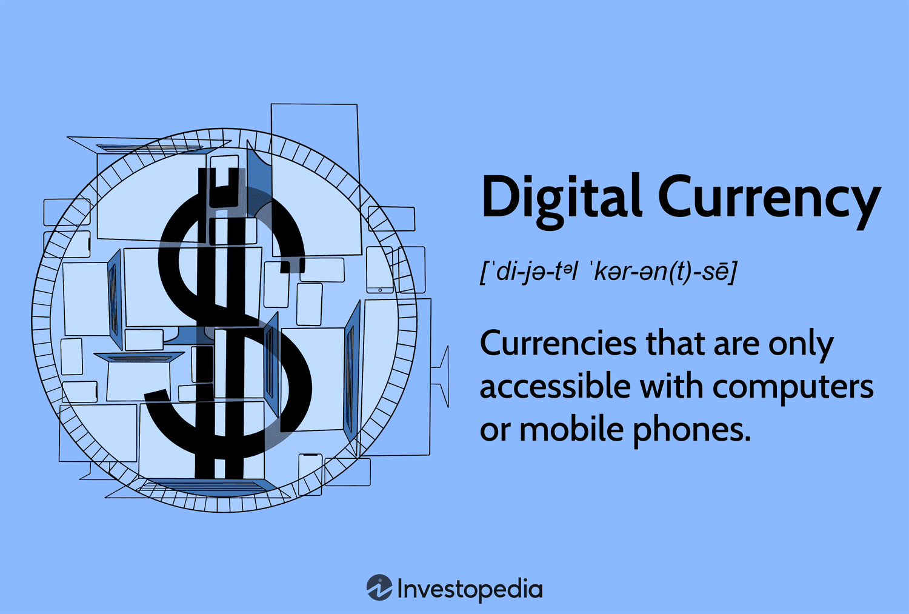

In an era where financial systems face numerous challenges, communities worldwide are exploring alternative currencies. The instability of global markets, coupled with the limitations of traditional monetary policies, has sparked interest in innovative financial solutions. One such innovation is the development of community currencies, also known as local currencies. These are gaining traction as sustainable financial mechanisms aimed at boosting local economic resilience.

Community currencies operate on the principle of encapsulating economic activity within a defined geographical area. This form of scrip is issued by community groups or local businesses, with an overarching goal to stimulate economic activity by retaining monetary flow within the community. By exchanging regular currency for community currency, often at favorable rates, participants are encouraged to engage in local spending, thereby fostering a more robust and self-reliant economy.

This article will examine the interplay between community currencies and algorithmic trading, a novel concept marrying traditional economic initiatives with advanced technological strategies. Algorithmic trading, which leverages complex algorithms to make trading decisions, can be applied to enhance the liquidity and efficiency of community currency systems. The relevance of this interaction is paramount, as it could redefine how these local systems function and scale in today's economy.

Furthermore, we will explore how these currencies work, highlighting their inherent benefits such as increased local economic activity, reduced dependency on centralized financial systems, and strengthened community ties. However, the limitations cannot be overlooked. Issues such as regulatory challenges, acceptance barriers, and scalability concerns present significant hurdles that need to be addressed for widespread adoption.

By understanding these concepts, readers can gain insight into how local economies might leverage tools like community currencies and algorithmic trading to empower and sustain their growth. This exploration will also shed light on the potential of these systems to offer resilience against global economic pressures, potentially transforming how communities perceive and engage with their financial environments.

## Table of Contents

## Understanding Community and Local Currencies

Community currencies are specific types of localized financial tools designed to promote economic activity within defined geographical areas, typically managed by community groups or private entities. These currencies operate as alternative or complementary monetary systems to official national currencies, with a core function of retaining money circulation within the community. Their strategic implementation often involves exchanging national currencies for the community variant at a discount, which provides an incentive for local spending and, subsequently, bolsters economic interactions within the community.

There are several successful implementations of community currencies globally, each reflecting the unique economic ecosystem it operates within. One notable example is the Bristol Pound in the United Kingdom, introduced to foster spending at independent businesses in Bristol. Similarly, the BerkShares in Western Massachusetts, USA, has been designed to support local businesses and encourage a vibrant community economy by allowing customers to purchase goods and services from participating merchants. Additionally, the Chiemgauer in Germany serves as another interesting model where participants can exchange euros for Chiemgauer notes, which must be spent within regional businesses, further demonstrating the potential benefits of such systems.

Despite their advantages, these currencies also have certain drawbacks that could affect their viability and widespread adoption. On the positive side, community currencies can significantly stimulate local trade and business, support small enterprises, and increase local economic resilience. Furthermore, they can strengthen social networks as they encourage cooperation among community members and businesses.

However, adopting a community currency system is not without challenges. One significant hurdle is the initial setup and operational costs associated with developing and maintaining the currency infrastructure. Moreover, these currencies can face issues of trust and acceptance among residents and businesses, as conventional currency tends to enjoy a stable and recognized value across larger markets. This issue may be compounded by potential regulatory oversight by national financial authorities, which could limit the currency's utility and acceptance.

In summary, community currencies serve as an innovative solution with the potential to revitalize local economies by promoting localized spending and retaining economic value within communities. While they offer distinct advantages, such as bolstering local businesses and fostering economic resilience, potential pitfalls like regulatory challenges and acceptance must be carefully considered. These currencies exemplify creative economic strategies aimed at enhancing community wealth and engagement.

## The Rise of Alternative Currencies

Alternative currencies, notably cryptocurrencies, are fundamentally altering our understanding and use of money in modern economies. Unlike traditional currencies, which are issued and regulated by central authorities such as governments or financial institutions, alternative currencies are characterized by their decentralized nature. This decentralization is primarily achieved through blockchain technology, which ensures transparency, security, and the potential for financial privacy. 

Cryptocurrencies like Bitcoin and Ethereum exemplify this decentralized model, offering users autonomy over their financial transactions without the need for intermediaries. This autonomy is underpinned by cryptographic protocols that secure transaction data and enable the verification of ownership and the transfer of assets. The decentralization feature of alternative currencies presents significant advantages, such as resisting censorship, reducing transaction costs, and providing access to financial systems for unbanked populations.

Comparing alternative currencies to community currencies reveals clear distinctions and potential synergies between the two systems. While community currencies are designed to function within a localized financial ecosystem, promoting economic activity in specific regions, alternative currencies operate on a global scale, transcending geographical boundaries. The two systems are not mutually exclusive. In fact, alternative currencies can augment the functionality of community currencies. For instance, the integration of blockchain technology could enhance the transparency and traceability of community currency transactions, thereby increasing trust and participation within the local economy.

However, both community and alternative currencies face significant regulatory challenges. The lack of central oversight, although an advantage for decentralization, raises concerns about their use in illegal activities, such as money laundering and tax evasion. Governments and regulatory bodies worldwide are grappling with establishing frameworks that can effectively regulate these currencies without stifling innovation. Laws governing alternative currencies vary widely, with some countries adopting crypto-friendly policies, while others impose strict regulations or outright bans. This regulatory diversity creates an environment of uncertainty that can hinder the widespread adoption of alternative currencies.

Despite these challenges, the potential for collaboration between alternative and community currencies remains strong. By leveraging the strengths of alternative currencies—such as secure digital transactions and wide accessibility—community currencies can enhance their robustness and utility. This collaborative approach could foster greater economic inclusivity and resilience, empowering communities to navigate the complexities of modern financial systems effectively. As both forms of currency continue to evolve, they may pave the way for innovative financial solutions that cater to a broad spectrum of societal needs.

## Algorithmic Trading in Local Currencies

Algorithmic trading is a well-established practice in global financial markets, where it leverages complex algorithms to execute trades at high speeds and volumes. This approach can also be effectively adapted for use in community currencies. In local currency systems, [algorithmic trading](/wiki/algorithmic-trading) can enhance [liquidity](/wiki/liquidity-risk-premium) and operational efficiency, ultimately supporting the stability and circulation of the currency within the community.

Algorithmic trading in this context involves using predefined rules and quantitative models to automate the buying and selling of community currencies. By doing so, it helps maintain equilibrium between supply and demand, reduces transaction costs, and enables more efficient price discovery. This can be particularly beneficial for local currencies that might experience periods of illiquidity or [volatility](/wiki/volatility-trading-strategies) due to their limited circulation and user base.

### Benefits of Algorithmic Trading for Local Currencies

1. **Liquidity Enhancement**: Algorithmic trading can ensure that there is always a market for buying and selling the community currency, thereby increasing its liquidity. It achieves this by continuously placing buy and sell orders at varying price levels, thus narrowing the spread and facilitating smoother exchanges.

2. **Improved Pricing Efficiency**: Algorithms can assimilate real-time data to adjust prices more accurately and quickly, reflecting the current market conditions. This leads to more accurate pricing and prevents significant deviations that might impact users’ confidence in the currency.

3. **Cost Reduction**: Automating trading processes reduces the need for human intervention and lowers transaction costs. This is particularly crucial for local currencies, as high operational costs could otherwise limit their adoption and sustainability.

### Case Studies of Algorithmic Trading in Community Currencies

While traditional financial markets routinely employ algorithmic trading, its application in local currencies is still emerging. However, there are a few experimental usage instances that highlight its potential:

- In Europe, some community currency initiatives have implemented basic algorithmic protocols to manage currency exchanges, optimizing the flow of currency between participants.
- A local currency system in Japan experimented with machine learning algorithms to predict transaction patterns and adjust currency supply dynamically, achieving more consistent currency circulation.

### Technological Requirements and Expertise

Implementing algorithmic trading in a community context necessitates certain technological infrastructures and expertise:

- **Data Acquisition**: A continuous feed of transactional data is essential. This data is used to inform the algorithms about current market conditions.

- **Algorithm Development**: Requires expertise in financial modeling and programming to design algorithms capable of making efficient trading decisions.

- **High-Performance Computing**: Given that algorithmic trading relies on rapid execution, systems should be equipped with sufficient computing resources to manage the trades effectively.

### Challenges and Risks

Despite its advantages, integrating algorithmic trading with local currencies presents several challenges:

- **Technical Complexity**: Developing and maintaining advanced algorithms require skills that may not be readily available in smaller communities.

- **Volatility and Control Risks**: Over-reliance on automated systems can lead to unintended market fluctuations, especially in thinly traded local currencies. Algorithms might amplify trends, leading to instability.

- **Regulatory Concerns**: Algorithmic trading in community currencies could attract regulatory scrutiny, particularly concerning transparency and fairness in automated decision-making processes.

In conclusion, while algorithmic trading offers promising improvements for local currency systems, successful implementation depends on careful consideration of both technological and regulatory landscapes. Communities must weigh these factors against the potential efficiencies and liquidity enhancements to effectively harness the benefits of this innovative approach.

## Challenges and Opportunities

Community currencies, despite their promise, encounter several hurdles that impede their widespread adoption. One of the primary challenges lies in the legal and regulatory frameworks governing their issuance and use. These currencies often exist in complex legal environments where they might be mistaken for unauthorised money or securities. For a community currency to thrive, it must be compliant with local and national laws, which can vary significantly between regions. Navigating this legal landscape demands diligence and often legal counsel, which can be costly and complex for community groups.

Moreover, aligns these currencies with existing financial systems presents both a challenge and an opportunity. By collaborating with established banks and financial institutions, community currencies can gain the credibility and infrastructure necessary for broader acceptance. Such partnerships might involve backing community currencies with reserves in national currency, enabling seamless exchange and fostering trust among users. For instance, local banks could facilitate the conversion of community currency into regular currency, providing users with a safety net and enhancing the currency’s legitimacy. 

Technological innovations play a crucial role in the potential success of community currencies. Blockchain technology, for instance, can provide transparency, security, and ease of transaction—a trifecta crucial for any currency striving for acceptance. Digital platforms can streamline the issuance, exchange, and monitoring of these currencies, making them more accessible and efficient. Similarly, mobile applications can facilitate real-time transactions and offer users ease of use, further embedding the currency in everyday community life.

Community engagement is another essential element for the adoption and longevity of community currencies. These systems thrive when there is robust local participation, as the currencies are designed to circulate within a defined geographical area. Engaging local businesses and residents through educational initiatives can be instrumental. Initiatives that illuminate the benefits and mechanisms of community currencies can demystify them for potential users. Workshops, seminars, and online resources can empower communities by providing information that builds trust and encourages participation.

Education not only aids in understanding but also in addressing misconceptions that these currencies might somehow undermine local economies or legal tender. By promoting transparency and simplifying operations, educational campaigns can alleviate skepticism and bolster community confidence. In conclusion, overcoming these challenges requires a multifaceted approach that includes legal navigation, partnerships with existing financial entities, technological advancements, and comprehensive community engagement. By addressing these facets, community currencies can be well-positioned to enhance local economic resilience and empowerment.

## Conclusion

Community and alternative currencies are increasingly viewed as viable tools for fostering local economic empowerment. By enabling communities to retain and circulate wealth within a localized area, these currencies help mitigate economic leakage, where funds [exit](/wiki/exit-strategy) local economies and diminish their prosperity. The introduction of algorithmic trading into these currency systems can significantly bolster their effectiveness by enhancing liquidity and operational efficiency. This process, driven by data and computational strategies, allows for the real-time adaptation of currency policies and trading mechanisms, ensuring that local currencies remain dynamic and responsive to community needs.

However, the path to successfully integrating community currencies and algorithmic trading is fraught with challenges. A major obstacle lies in achieving widespread acceptance among both consumers and businesses. People must perceive these currencies as trustworthy and beneficial over traditional financial systems. This requires not only intricate marketing efforts but also strategic educational initiatives that articulate the tangible benefits of such currencies. Additionally, regulatory challenges loom large as governments and financial institutions may impose stringent measures to control or stifle currency innovations due to concerns about economic stability or competition with national currencies.

Despite these challenges, there are significant opportunities for communities willing to embrace these innovative financial instruments. By understanding the mechanics and benefits of community currencies, along with the operational efficiencies algorithmic trading offers, local economies can devise robust strategies that leverage these tools to their full potential. Collaboration with larger financial entities may also enhance credibility and facilitate scalability, allowing community currencies to serve as complementary rather than competing monetary systems.

The promising future of community currencies hinges on technological advancements and cooperative community efforts. As technology evolves, tools such as blockchain and [artificial intelligence](/wiki/ai-artificial-intelligence) may offer unprecedented capability in managing and scaling local currencies. This technological foundation, coupled with community-driven engagement, can lead to sustainable economic models that align closely with local values and needs, empowering regions to remain economically resilient in an increasingly globalized world.

## References & Further Reading

[1]: Seyfang, G., & Longhurst, N. (2013). Local Currencies and the Social Economy: The Case of the Bristol Pound. International Journal of Community Currency Research, 17(D), 1-11. [Read here](https://base.socioeco.org/docs/seyfang-longhurst-green-money-scorai-2013.pdf).

[2]: North, P. (2010). Local Money: How to Make it Happen in Your Community. Green Books.

[3]: Dittmer, K. (2013). Local currencies for purposive degrowth? A quality check of some proposals for changing money-as-usual. Journal of Cleaner Production, 54, 3-13. [Read here](https://www.sciencedirect.com/science/article/abs/pii/S0959652613001820).

[4]: Greco, T. H. (2009). The End of Money and the Future of Civilization. Chelsea Green Publishing.

[5]: Blanc, J. and Fare, M. (2013). Understanding the Role of the Local Arena in the Market-Oriented Transformation of the Social Economy: Insights from the Belgian and French cases. Environmental Policy and Governance, 23(3), 151-162. [Read here](https://www.researchgate.net/profile/Jerome-Blanc/publication/256046211_Understanding_the_Role_of_Governments_and_Administrations_in_the_Implementation_of_Community_and_Complementary_Currencies/links/6026465245851589399af343/Understanding-the-Role-of-Governments-and-Administrations-in-the-Implementation-of-Community-and-Complementary-Currencies.pdf?origin=publication_detail).

[6]: Gomez, G. M., & Helmsing, A. H. J. (2008). Selective Spatial Closure and Local Economic Development: What Do We Learn from the Argentine Local Currency Systems? World Development, 36(11), 2489-2511. [Read here](https://www.sciencedirect.com/science/article/pii/S0305750X08001794).

[7]: Seyfang, G. (2016). Community Currencies: Small Change for a Green Economy. Environment: Science and Policy for Sustainable Development, 58(6), 12-17. [Read here](https://www.researchgate.net/publication/23539071_Community_Currencies_Small_Change_for_a_Green_Economy).