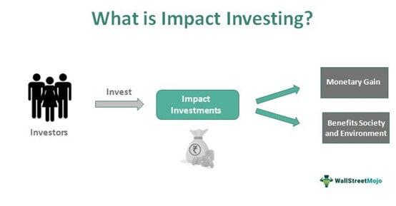

Investment strategies are undergoing significant transformation as they increasingly prioritize the integration of social impact and advanced technology. This evolution reflects a growing recognition that investments can achieve financial returns while also contributing positively to society. The convergence of community investing, socially responsible investing, and algorithmic trading exemplifies this paradigm shift, offering both new opportunities and challenges to investors and financial markets alike.

Community investing focuses on directing capital to underserved communities, fostering economic development and empowering these populations. This strategy emphasizes economic inclusion and social equity, aligning financial goals with ethical considerations. Simultaneously, socially responsible investing seeks to generate positive social or environmental impact alongside financial returns. Investors are increasingly drawn to sectors such as renewable energy, education, and healthcare, guided by principles of sustainability and corporate responsibility.



Parallelly, the advent of algorithmic trading has revolutionized the mechanics of modern finance. Using advanced computer algorithms, traders can execute orders at speeds and efficiencies far beyond human capability, optimizing market activity and reducing transaction costs. Despite benefits like enhanced liquidity and price discovery, this method also poses risks such as increased volatility and systemic instability.

This article examines these converging trends and the resulting influence on the financial landscape, highlighting the potential for innovative investment strategies that align technological efficiency with social impact. Through this fusion, investors have the opportunity to not only achieve competitive financial returns but also drive meaningful, positive changes in society. As technological advancements continue to reshape the industry, the focus remains on integrating ethical considerations with financial objectives, signaling a transformative era in investment practices.

## Table of Contents

## Understanding Community Investing

Community investing is an approach within the financial sector that focuses on directing capital to underserved and economically disadvantaged communities to foster their development and prosperity. This strategy not only aims to yield financial returns but also to create a positive social impact, promoting social equity and economic inclusion.

At the forefront of community investing are Community Development Financial Institutions (CDFIs). These are specialized organizations dedicated to providing financial services in low-income communities and to individuals who lack access to financing through traditional banks and lenders. CDFIs encompass a variety of entities including banks, credit unions, loan funds, and venture capital funds. Their primary purpose is to offer affordable loans, business advice, technical assistance, and financial counseling to those who are traditionally marginalized by the mainstream financial ecosystem. 

CDFIs operate by leveraging public and private funds to offer below-market-rate loans to community projects that would otherwise struggle to secure financing. These projects often include affordable housing development, small business loans, and community facilities financing, all of which are vital to enhancing the infrastructure and economic vitality of underserved areas. In doing so, CDFIs significantly contribute to job creation, empowerment of local entrepreneurs, and the provision of essential services in communities that need them most.

Community investing plays a crucial role in addressing economic disparities by channeling resources to areas and populations that have been historically overlooked. It facilitates the redistribution of wealth, supports sustainable community growth, and strengthens local economies. This form of investing advocates for a financial system that is more inclusive and equitable, underscoring the importance of integrating social values into economic practices to build a better future for all.

## Impact Investing: A Socially Responsible Approach

Impact investing is a financial strategy that seeks to produce both financial returns and positive social or environmental outcomes. This approach draws a clear distinction from traditional investing, which primarily aims for financial gain, and philanthropy, which focuses solely on social impact. The dual objective of impact investing is rooted in the recognition that strong financial returns and societal good are not mutually exclusive. 

Key sectors where impact investing is prominently applied include renewable energy, education, and healthcare. In the renewable energy sector, investments are directed towards projects and companies that develop and deploy clean technologies, such as solar and wind power. This not only contributes to the reduction of carbon emissions but also supports the global transition to sustainable energy sources. For instance, impact investors provide capital to solar panel manufacturers or wind farm operators, enabling these companies to expand their operations and, in turn, amplify the environmental benefits they offer.

Education is another primary sector targeted by impact investors. Investments in educational initiatives can enhance accessibility and quality of education for underserved populations. Capital can be allocated to organizations that develop innovative learning technologies or to schools and universities aiming to broaden their reach and improve outcomes. The goal is to increase educational opportunities and, ultimately, catalyze socio-economic mobility.

In healthcare, impact investing focuses on improving access to and the quality of medical services, particularly in marginalized communities. Investment strategies might support companies developing affordable healthcare solutions or those aiming to expand their reach to low-income areas. By improving healthcare delivery and outcomes, these investments generate social impact and contribute to public welfare.

Impact investing aligns closely with the principles of socially responsible investing (SRI), which integrates environmental, social, and governance ([ESG](/wiki/esg-investing)) criteria into investment decisions. Both approaches aim to ensure that capital contributes positively to society and the environment. However, impact investing is more proactive in seeking out investments that explicitly aim to achieve measurable social outcomes, whereas SRI primarily filters out investments that do not meet specific ethical criteria.

By aligning financial gains with social responsibility, impact investing enhances the role of finance in fostering social equity and environmental sustainability. Investors increasingly recognize the potential of impact investing to not only generate competitive financial returns but also to contribute meaningfully to society's most pressing challenges, thus bridging the gap between financial markets and social objectives.

## The Role of Algorithmic Trading in Modern Finance

Algorithmic trading, also known as automated trading, utilizes computer algorithms to execute trades at speeds and frequencies impossible for human traders. These algorithms analyze market data and execute orders based on pre-defined strategies, offering significant enhancements in market efficiency and [liquidity](/wiki/liquidity-risk-premium).

One of the primary advantages of [algorithmic trading](/wiki/algorithmic-trading) is its ability to reduce transaction costs. By automating trading decisions and executions, it minimizes the bid-ask spread and limits market impact. The high speed of execution ensures that traders capitalize on even the smallest price discrepancies, which can be crucial in markets where timing is everything.

Despite these benefits, algorithmic trading also introduces certain challenges, particularly concerning market [volatility](/wiki/volatility-trading-strategies). The speed and scale of algorithmic trades can sometimes amplify market movements, leading to sudden swings and, in extreme cases, market crashes. High-profile incidents, such as the Flash Crash of 2010, highlight the potential for algorithms to contribute to significant market disruptions.

Incorporating algorithmic trading into impact investment strategies offers a means to optimize decision-making processes. By creating algorithms that prioritize environmental, social, and governance (ESG) criteria, investors can efficiently identify and capitalize on sustainable investment opportunities. These algorithms process vast amounts of ESG-related data, ensuring that trades align with ethical standards and investment objectives.

Using algorithmic trading for impact investing requires the development of models that integrate traditional financial metrics with ESG factors. For example, a Python-based algorithm could be designed to rank stocks based on a combination of financial performance indicators and ESG scores retrieved via APIs. The integration empowers investors to achieve financial returns while adhering to their commitment to societal and environmental stewardship.

```python
import pandas as pd

# Sample data combining financial and ESG scores
data = {
    'stock': ['A', 'B', 'C', 'D'],
    'financial_score': [75, 85, 65, 90],
    'esg_score': [80, 70, 90, 60]
}

df = pd.DataFrame(data)

# Combining financial score and ESG score with weights for decision-making
df['combined_score'] = (0.5 * df['financial_score']) + (0.5 * df['esg_score'])
df_sorted = df.sort_values(by='combined_score', ascending=False)

print(df_sorted)
```

This simplistic algorithm sorts stocks based on equally weighted financial and ESG scores, providing a foundation for more complex trading strategies. Algorithmic trading thus serves as a vital tool in modern finance, balancing the dual goals of market efficiency and responsible investment practices.

## Integrating Sustainable Strategies with Algorithmic Trading

Combining environmental, social, and governance (ESG) criteria with algorithmic trading represents a pioneering approach to identifying sustainable investment opportunities efficiently and effectively. Historically, investment strategies focused primarily on financial returns, often sidelining the ethical implications of investments. However, the integration of ESG principles ensures that investments are not only financially rewarding but also socially conscious and environmentally responsible.

Algorithmic trading, which utilizes sophisticated computer algorithms to execute trades at high speeds and with precision, is significantly enhanced by incorporating ESG criteria. These algorithms can process an enormous [volume](/wiki/volume-trading-strategy) of ESG-related data, analyzing it to align investment selections with ethical standards. This processing capability allows traders to identify securities of companies that adhere to preferred ESG standards more precisely and promptly.

A fundamental advantage of using algorithms in this context is their ability to systematically analyze non-traditional data sources. For instance, text analysis techniques can process large datasets derived from company reports, news articles, and social media to extract sentiments and insights related to a company's ESG performance. These techniques ensure that decision-making is data-driven, reducing the subjectivity and bias that can accompany human judgment.

In practice, an algorithm could work as follows:

1. **Data Collection**: Aggregate a large dataset of firms’ ESG scores and financial data.

2. **Data Processing and Analysis**: Using Python, perform sentiment analysis and score matching:
    ```python
    import pandas as pd
    from textblob import TextBlob

    # Example data frame setup
    data = pd.DataFrame({
        'company': ['Firm A', 'Firm B', 'Firm C'],
        'esg_report': ['Sustainable energy usage...', 'Recent environmental controversies...', 'Community development projects...'],
        'score': [85, 70, 90]
    })

    # Sentiment analysis: measure subjectivity and polarity
    data['sentiment'] = data['esg_report'].apply(lambda report: TextBlob(report).sentiment.polarity)

    # Filter investment opportunities by ESG score threshold
    sustainable_firms = data[data['score'] > 75]
    ```

3. **Signal Generation**: Generate buy/sell signals based on the evaluated ESG scores and sentiments.

4. **Execution**: Place orders based on generated signals, optimizing portfolio exposure to high ESG-performing firms.

This systematic approach using algorithms enhances the precision of identifying investments that comply with sustainable practices. Moreover, the speed associated with algorithmic trading ensures that these opportunities can be acted upon swiftly, leveraging market conditions optimally.

By merging ESG criteria and algorithmic trading, investors can achieve a competitive edge, aligning portfolios with ethical standards without sacrificing financial performance. This strategy not only raises accountability and transparency in investments but also promotes broader adoption of sustainable business practices globally.

## Challenges and Considerations

Sustainable finance, characterized by the integration of environmental, social, and governance (ESG) factors into financial decision-making, faces several regulatory complexities. One of the primary challenges is the lack of standardized ESG data. This lack of standardization hinders the comparability and reliability of ESG disclosures, complicating the evaluation of sustainable investments. Current efforts by regulatory bodies, such as the European Union's Sustainable Finance Disclosure Regulation (SFDR), aim to establish more consistent reporting standards. However, achieving global uniformity remains a work in progress, necessitating a coordinated international approach.

Algorithmic trading, a significant component of modern financial systems, introduces inherent risks that need careful management. Market disruptions, such as those witnessed in the 2010 Flash Crash, highlight the potential volatility associated with automated trading systems. Such events emphasize the need for robust oversight and sophisticated risk management strategies. Regulatory frameworks, like the Markets in Financial Instruments Directive II (MiFID II) in Europe, aim to enhance market stability by imposing stricter requirements on algorithmic trading activities. These regulations necessitate effective supervision and compliance measures to mitigate systemic risks.

The successful integration of sustainable strategies with algorithmic trading depends significantly on advancements in technology and collaboration across the financial sector. Technological innovations, such as [machine learning](/wiki/machine-learning) algorithms, have the potential to improve the processing and analysis of ESG data, thereby enhancing investment decision-making. Investment institutions and technology firms are increasingly collaborating to develop tools that can efficiently manage and analyze vast datasets. Open-source platforms and shared databases could play a pivotal role in fostering transparency and facilitating the widespread adoption of sustainable investment practices.

Overall, overcoming the challenges in sustainable finance and algorithmic trading requires a multifaceted approach involving regulatory alignment, technological innovation, and cross-sector cooperation. By addressing these challenges, the financial industry can better position itself to harness the opportunities of sustainable and technologically advanced investment practices, ultimately contributing to a more resilient and equitable financial landscape.

## The Future of Sustainable Finance and Trading

Technological advancements are pivotal in propelling the future of sustainable finance and trading. As digital innovation continues to expand, these advancements provide tools and platforms that facilitate the integration of environmental, social, and governance (ESG) criteria into investment strategies. Machine learning, big data analytics, and blockchain technology are among the leading innovations poised to redefine sustainable investment practices. These technologies not only enhance the precision of financial analyses but also contribute to the transparency and traceability of ESG metrics, which are critical in assessing the sustainability of investments.

Investor interest in ESG-focused investments is rapidly increasing, driving significant changes in market dynamics. This shift is reflected in the substantial inflows of capital into ESG funds, with investors seeking to align their portfolios more closely with their ethical values. The emphasis on sustainability reflects a broader awareness and a desire for accountability regarding the social and environmental impact of investment activities. As a result, financial markets are experiencing notable shifts, as companies with strong ESG profiles often enjoy better access to capital and increased investor interest.

Emerging trends in sustainable finance suggest a promising outlook for aligning investments with ethical values while achieving competitive financial returns. Innovations such as impact investing, green bonds, and sustainability-linked loans are gaining traction, offering investors new avenues to achieve positive outcomes alongside financial gains. Moreover, regulatory pressures and stakeholder demands for greater corporate responsibility are reinforcing the integration of ESG factors into investment decision-making processes.

Overall, the future of sustainable finance and trading is set on a transformative path, driven by continued technological innovation and evolving investor preferences. This transformation offers substantial opportunities to align investment activities with ethical standards, ultimately leading to a more sustainable and responsible financial system.

## Conclusion

The integration of community investing, social impact, and algorithmic trading marks a significant transformation in the financial sector. This evolution is characterized by a shift towards aligning investment practices with broader societal goals, promoting both financial and ethical growth. By embedding social responsibility into financial objectives, investors have the potential to generate lasting positive effects on both local and global scales. 

Community investing directs funding toward underserved areas, fostering economic development and enhancing social equity. When paired with impact investing principles that prioritize generating social and environmental benefits alongside financial returns, the result is a more inclusive financial ecosystem. These strategies empower investors to achieve competitive returns while contributing to societal betterment.

The incorporation of algorithmic trading into this framework further amplifies the impact by optimizing the efficiency and precision of executing investment decisions. Algorithms that process extensive datasets—particularly those incorporating Environmental, Social, and Governance (ESG) criteria—allow for the rapid identification of sustainable opportunities. This technological advancement streamlines the process of aligning investments with ethical guidelines, promoting transparency and accountability in financial markets.

As sustainable finance continues to evolve, leveraging these combined strategies could lead to a significant redefinition of market dynamics. The escalating demand for ESG-focused investments reflects a broader investor commitment to ethics, heralding a promising era of innovation and growth. This trajectory not only enhances financial returns but also contributes meaningfully to the societal fabric, solidifying finance as a pivotal player in addressing global challenges.

Overall, the integration of community investing, social impact, and algorithmic trading signals not only an advance in financial methodologies but also heralds a shift towards a more conscientious and sustainable economic future. The finance industry stands at the threshold of substantial innovation, promising a symbiosis of profitability and responsibility that could redefine investment paradigms worldwide.

## References & Further Reading

[1]: Krosinsky, C., & Robins, N. (Eds.). (2008). ["Sustainable Investing: The Art of Long-Term Performance."](https://www.taylorfrancis.com/books/edit/10.4324/9781849773959/sustainable-investing-nick-robins-cary-krosinsky) Routledge.

[2]: Ben Dor, A. N., Dixon, C., & Sha, K. (2017). ["Equal-Weighted Portfolios, Why Invest in a Rising Rate Environment?"](https://www.nature.com/articles/ncomms14567) Financial Analysts Journal.

[3]: Social Investment Forum. (2010). ["Report on Sustainable and Responsible Investing Trends in the United States."](https://www.ussif.org/Files/Publications/2010_Annual_Report.pdf)

[4]: Crane, A., & Spence, L. J. (Eds.). (2008). ["Corporate Social Responsibility: Readings and Cases in a Global Context."](https://www.researchgate.net/publication/228123773_Corporate_Social_Responsibility_In_Global_Context) Routledge.

[5]: U.S. Department of the Treasury. (2017). ["A Financial System That Creates Economic Opportunities: Banks and Credit Unions."](https://home.treasury.gov/system/files/136/A-Financial-System-Capital-Markets-FINAL-FINAL.pdf) Financial Markets Report.

[6]: Bolton, P., Freixas, X., & Shapiro, J. (2007). ["Conflicts of Interest, Information Provision, and Competition in the Financial Services Industry."](https://www.sciencedirect.com/science/article/pii/S0304405X0600002X) Journal of Financial Economics, 85(2), 297-330.