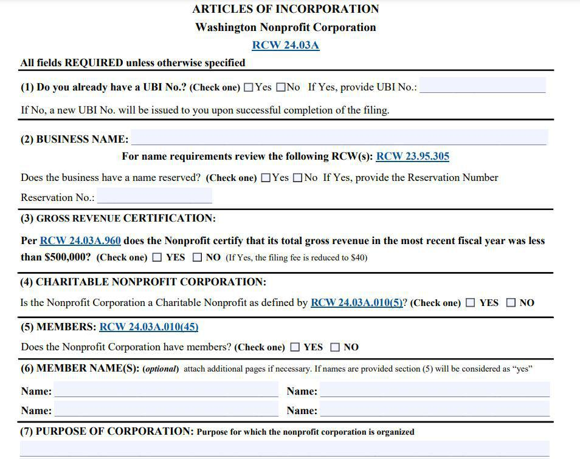

The intersection of property law and investment strategies often presents a fascinating landscape for both legal and financial professionals. Understanding marital and community property laws is crucial for those engaged in family law, estate planning, or financial planning. These laws form the backbone of how assets are managed, divided, and inherited, affecting individuals and families profoundly during life events such as marriage, divorce, or death. Additionally, these laws have significant implications for investors, particularly in areas related to algorithmic trading and asset management. Algorithmic trading, which involves using computer algorithms to execute trades, demands careful consideration in the context of property law, as profits and losses could impact both individual and marital assets.

Investment strategies must therefore incorporate an understanding of marital and community property distinctions. Community property states, for example, treat most assets acquired during a marriage as jointly owned, impacting financial decisions and strategies. The landscape becomes more intricate when these principles intersect with modern investment strategies, like algorithmic trading, which presents unique challenges in attributing profits and liabilities between spouses.

This article explores the complex interplay between property law, marital property, community property, and algorithmic trading. Various legal and financial considerations influence how these areas impact financial planning and asset management. For investors and financial planners, grasping the nuances of property law is vital to effectively navigating potential risks and opportunities, ensuring that investment strategies align with both personal and legal considerations.

## Table of Contents

## Understanding Marital and Community Property

Marital property refers to assets that are acquired by either spouse during the course of a marriage. These assets can include income, real estate, investments, and other types of property obtained after the couple has legally married. The classification of marital property is critical during legal proceedings such as divorce or estate planning, as it affects how these assets will be distributed or managed.

Community property is a legal concept of joint ownership by both spouses of assets acquired during the marriage. In community property states, the presumption is that all assets and debts incurred during the marriage belong equally to both spouses. This means that in the event of divorce, these assets and debts are typically divided equally between the parties, unless there is a legal agreement stating otherwise.

There are currently nine states in the United States that operate under community property laws: Arizona, California, Idaho, Louisiana, Nevada, New Mexico, Texas, Washington, and Wisconsin. Each of these states has its own nuances concerning how community property is defined and treated, but the overarching principle of equal ownership generally holds.

Understanding these distinctions between marital property and community property is essential for legal and financial practitioners who work with married couples. For instance, in states that follow community property laws, a spouse’s separate property—which includes assets acquired before marriage, gifts, and inheritances—remains solely theirs as long as it is not co-mingled with community property.

Legal professionals must navigate these differences to effectively manage client expectations and outcomes in matters such as divorce settlements or prenuptial agreements. Similarly, financial advisors should incorporate these considerations when helping clients plan investment strategies, as the classification of assets might influence risk assessments and portfolio management decisions.

For professionals working within these areas, a comprehensive understanding of state-specific property laws is vital. This knowledge ensures that clients are adequately advised and their interests are protected, especially in the complex financial landscapes often seen in divorce settlements and estate planning.

## The Impact of Community Property Laws on Financial Planning

Community property laws play a significant role in determining the distribution of assets and liabilities during significant life events, such as estate planning and divorce. These laws directly impact how investment and retirement accounts, as well as debts accumulated during marriage, are managed and divided.

Investment accounts, including stocks, bonds, and mutual funds acquired during a marriage, are generally considered community property in states adhering to these laws. This means they are equally owned by both spouses, regardless of whose name appears on the account. Similarly, contributions to retirement accounts made during the marriage are typically viewed as community assets, necessitating equitable division upon divorce or death, unless otherwise specified by a prenuptial or postnuptial agreement.

For investors residing in community property states, understanding these laws is critical when developing portfolio strategies. These investors must take into account the potential implications of asset-freeze orders during divorce proceedings or the equal division of returns generated from investment portfolios. Proper documentation of the origin of assets, whether they are separate or community, can markedly affect outcomes in disputes.

Financial planners advising clients in community property states must emphasize awareness of these implications. They should guide clients through the complexities of asset division ensuring compliance with relevant state laws. This includes strategic planning for future asset acquisition and understanding the tax liabilities associated with the division of community property.

A key strategy for navigating community property laws in financial planning is the establishment of clear and legally binding agreements that can outline the classification of assets and the expected division. For example, prenuptial or postnuptial agreements can redefine the division of property acquired during marriage and provide clarity and protection for specific assets deemed separate property. 

Legal professionals and financial advisors should collaborate closely, offering coordinated strategies to safeguard client interests, facilitate equitable asset management, and mitigate risks associated with community property laws. With careful planning, individuals can optimize their financial futures, even within the constraints and stipulations set by community property laws.

## Algorithmic Trading and Community Property

Algorithmic trading refers to the process of using computer algorithms to execute trades at high speed and [volume](/wiki/volume-trading-strategy) according to pre-set criteria. This innovative approach has transformed financial markets by providing increased efficiency and accuracy in trading operations. However, when it comes to community property laws, these trading activities introduce complex considerations for married investors.

In community property states, both spouses have equal ownership rights to assets and liabilities acquired during the marriage. Thus, any profits or losses generated from [algorithmic trading](/wiki/algorithmic-trading) strategies are typically regarded as community property. This means that both spouses might share equally in the financial outcomes, whether favorable or unfavorable, arising from these strategies.

For married investors utilizing algorithmic trading in community property jurisdictions, it is crucial to recognize how these activities can impact their financial standing jointly. Since algorithmic trading can lead to significant fluctuations in financial assets, understanding the implications under community property laws is essential. Profits realized from such trades enhance the collective net worth of the marriage, but, conversely, trading losses are also shared, impacting the overall financial health of the couple.

Key considerations for investors include assessing the risk tolerance of both spouses, ensuring clear communication and agreement on trading strategies, and maintaining transparency regarding trading activities. Financial planners and legal advisors should work closely with clients to ensure that algorithmic trading aligns with the couple's broader financial goals and legal obligations. For instance, establishing a dual consent mechanism for executing trades can be a strategy to ensure both spouses are engaged in the decision-making process.

Moreover, as the algorithmic trading landscape continues to advance, couples need to stay informed about the latest developments and regulatory changes that might affect their trading activities and property rights. Effective record-keeping of all transactions and thoughtful consideration of how these transactions integrate with broader estate planning can mitigate potential disputes.

In summary, algorithmic trading changes the dynamics of asset management within marriages in community property states. It requires careful consideration to ensure both parties are protected and that their financial strategies are aligned with their legal rights and objectives. An informed approach can prevent potential conflicts and promote a balanced financial portfolio reflecting the couple's collective interests.

## Legal Strategies for Managing Marital and Community Property

Effective legal strategies are essential for managing marital and community property, particularly in community property states where the default laws may not align with the individual preferences or financial objectives of the parties involved. One significant strategy involves the use of prenuptial and postnuptial agreements, which allow couples to delineate property terms that diverge from the automatic presumptions of community property laws. These legal instruments specify how assets and liabilities will be divided in the event of divorce or death, thus providing a tailored approach that can prevent future disputes and protect individual interests.

Prenuptial and postnuptial agreements are contractual in nature, requiring both parties to fully disclose their financial status and intentions. This transparency is foundational, as it ensures the validity of the agreement in the eyes of the law. These agreements can address various issues such as asset division, spousal support, and even predefined terms regarding asset management during the marriage.

Legal counsel in community property states should prioritize clear communication and thorough documentation of asset ownership. This is crucial for establishing and maintaining the separate property status of particular assets, which may otherwise fall into the category of community property. For instance, inheritances and gifts received by one spouse remain separate property if properly documented.

In drafting these agreements, lawyers must consider the statutory requirements and potential protective measures. Jurisdictions may have different mandates for the execution of prenuptial and postnuptial agreements, such as notarization or witness signatures. Legal counsel should also include provisions that account for changing circumstances, such as the birth of children or significant shifts in financial status, to ensure the agreement remains relevant and enforceable over time.

For financial advisors, understanding these legal strategies is equally important. Advisors can work in tandem with legal counsel to align the couple's financial planning with their legal agreements. This collaborative approach ensures that financial strategies, such as investment decisions and retirement planning, reflect the terms of the prenuptial or postnuptial agreements.

Navigating property laws effectively requires both legal and financial professionals to anticipate potential risks and mitigate them through strategic planning. By fostering clear communication and documentation, and by crafting detailed, adaptable agreements, clients can better protect their interests and achieve their financial and personal objectives.

## Conclusion

Navigating the complexities of property law, especially in community property states, necessitates meticulous planning and strategic foresight. The intersection of these laws with algorithmic trading introduces additional layers of complexity, requiring traders to be acutely aware of how profits and losses from their trading strategies might be classified under community property laws. This awareness is crucial because, in community property states, both earnings and debts accrued during a marriage are often deemed jointly owned by both spouses. Consequently, algorithmic trading owners should rigorously analyze and understand these legal implications to safeguard their financial and marital interests.

For legal and financial professionals, possessing a comprehensive understanding is critical to advising clients effectively. These professionals must be adept at navigating the intricacies of marital and community property laws and their impact on financial decisions and asset management. Such expertise is indispensable not only for safeguarding client assets but also for devising strategies that mitigate potential legal risks associated with community property classifications.

By gaining a thorough comprehension of these laws and their implications, individuals can adeptly manage their assets and secure their financial futures. This knowledge empowers them to make informed decisions, anticipate potential challenges, and effectively navigate the evolving landscape of financial markets and property law. As the interplay between property law and financial markets continues to evolve, it presents both challenges and opportunities for stakeholders. Staying informed and adaptable will be key to capitalizing on these advancements and safeguarding personal and shared financial interests.

## References & Further Reading

[1]: ["Community Property Law"](https://www.irs.gov/irm/part25/irm_25-018-001) – Legal Information Institute, Cornell Law School

[2]: ["Algorithmic and High-Frequency Trading"](https://www.cambridge.org/us/universitypress/subjects/mathematics/mathematical-finance/algorithmic-and-high-frequency-trading) by Álvaro Cartea, Sebastian Jaimungal, and José Penalva

[3]: ["The Laws of Marriage and Divorce"](https://lawsoup.org/legal-guides/marriage-and-divorce-law/) – Nolo

[4]: ["Financial Planning and Community Property"](https://www.financestrategists.com/estate-planning-lawyer/prenuptial-agreements/community-property-states/) – Taylor & Wells Law Offices

[5]: ["Family Law in Community Property States"](https://www.forbes.com/advisor/legal/divorce/community-property-states/) – California Law Review