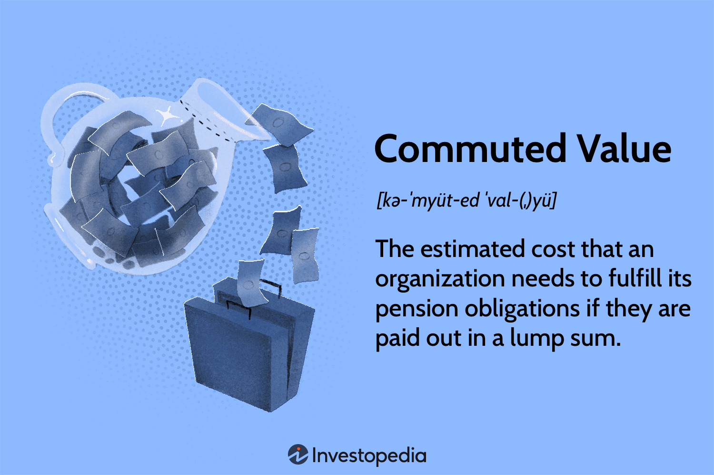

In a rapidly evolving financial landscape, gaining a comprehensive understanding of retirement benefits, pension commuted value, and algorithmic trading is crucial for developing a competitive financial strategy. These concepts collectively play a significant role in modern financial planning, impacting investment decisions, retirement security, and wealth management.

Retirement benefits are fundamental to ensuring financial security post-employment. They typically include pensions, savings plans, and sometimes insurance, functioning as pillars for long-term financial stability. Understanding different types of plans—such as defined benefit and defined contribution plans—is imperative for assessing their influence on individual financial planning.



A pension commuted value represents the lump-sum amount an employee is entitled to receive if they opt to withdraw from the pension plan. This value is determined by factors such as interest rates and life expectancy. The decision to take this lump sum in cash or to keep it within the pension plan has significant financial implications.

Algorithmic trading introduces a modern dimension to financial planning by automating the buying and selling of financial instruments. This technology enhances speed, efficiency, and accuracy, minimizing human errors and potentially optimizing investment results.

Integrating these facets—retirement benefits, commuted pension value, and algorithmic trading—into a holistic financial planning strategy can empower individuals to make informed decisions aligned with their retirement and investment goals. Navigating these options effectively necessitates a deep understanding of their interconnected nature and potential impacts on personal financial wellbeing.

## Table of Contents

## Understanding Retirement Benefits

Retirement benefits form an essential part of the financial security offered to employees, comprising a variety of financial and insurance products. The most typical components of retirement benefits are pensions and savings plans, with some packages also including insurance. The primary aim is to ensure financial stability for employees post-retirement.

Pensions are typically categorized into two main types: defined benefit plans and defined contribution plans. A defined benefit (DB) plan promises a specified monthly benefit upon retirement, which is usually calculated through a formula that considers factors such as salary history and length of employment. Employers bear the investment risk and responsibility to ensure there are sufficient funds to pay the future pension obligations.

Conversely, a defined contribution (DC) plan, such as a 401(k) in the United States, specifies the contribution to the employee’s account. In this plan, both the employee and employer may contribute, but the future benefits fluctuate based on investment performance. Employees thus bear the investment risk, and the potential retirement benefits depend on the account balance at retirement.

The impact of these types of plans on long-term financial planning varies significantly. Defined benefit plans provide a predictable and stable retirement income, which simplifies planning for post-retirement living expenses. They are particularly beneficial during periods of market [volatility](/wiki/volatility-trading-strategies) since the employer is accountable for maintaining sufficient fund reserves.

In comparison, defined contribution plans offer flexibility and potential for wealth accumulation through investments. However, this also introduces the uncertainty of market performance impacting the retirement savings amount. Employees need to actively engage in investment decisions to enhance their retirement outcomes.

From a financial planning perspective, the choice between DB and DC plans affects how individuals structure their savings, investment strategies, and retirement timelines. For those with defined contribution plans, effective financial planning is crucial, often requiring diversification of investments and regular reassessment of risk tolerance as retirement approaches.

Thus, understanding the nuances of retirement benefits is key to strategic long-term financial planning, ensuring that individuals can maintain their desired lifestyle throughout retirement. Professional financial advice is often beneficial in navigating these options and structuring a plan tailored to one's financial goals and risk profile.

## The Concept of Pension Commuted Value

Pension commuted value is a critical concept within retirement planning, representing the lump sum amount that an employee is entitled to receive in place of periodic pension payments. This value is pivotal for those considering cashing out their pension benefits or sticking with a traditional annuity-based system. 

### Calculation of Commuted Value

The calculation of the commuted value typically depends on several variables, including interest rates, life expectancy, and the vesting status of the pension plan. The basic principle is to determine the present value of future pension payments that an individual would receive, discounted at an appropriate rate. A common methodology might involve the formula:

$$
\text{Commuted Value} = \sum \left( \frac{P_n}{(1 + r)^n} \right)
$$

where $P_n$ is the pension payment in year $n$, and $r$ refers to the discount rate, which is influenced by current interest rates and economic forecasts. Life expectancy estimates are used to project the number of payment years, relying on actuarial life tables or similar statistical resources.

### Options for Employees: Cashing Out vs. Traditional Annuity

Employees generally face two choices regarding their commuted value: they can either take the lump sum in cash or leave it within the pension plan to receive regular annuity payments upon retirement. 

#### Taking the Commuted Value as Cash

Opting for the commuted value in cash can offer immediate [liquidity](/wiki/liquidity-risk-premium) and the opportunity to invest the funds per the individual's risk tolerance and financial goals. This option allows an individual direct control over their retirement funds, which can be advantageous in a favorable investment climate but risky if the funds aren't managed properly. One potential downside is the tax liability incurred from receiving a lump sum payout, as tax regulations on such distributions can significantly reduce the net amount.

#### Leaving the Commuted Value in the Pension Plan

Choosing to leave the commuted value within the pension plan means opting for regular annuity payments, typically ensuring a stable income stream during retirement. This approach provides a safety net against longevity risk—the risk of outliving your retirement savings—because the income is usually guaranteed for life. However, inflation and changes within the pension fund's management or financial health could potentially affect future payment values.

In conclusion, deciding between commuting a pension or retaining the traditional annuity structure involves careful assessment of financial needs, risk appetite, tax implications, and personal health considerations. аналибатпушкарова

## Factors Influencing Pension Commuted Value Decisions

When considering whether to opt for a pension's commuted value or regular pension income, several key factors should be examined to make an informed decision.

### Tax Liabilities

The choice between taking the commuted value of a pension and receiving periodic pension payouts can have significant tax implications. Receiving the commuted value typically results in a lump sum payout, which may subject the individual to higher tax rates due to the increased taxable income in a single year. It is crucial to understand local tax laws and potential tax shelters or deferment strategies. Using tax-advantaged accounts, such as IRAs in the United States or RRSPs in Canada, can aid in mitigating some tax burdens.

### Financial Risk Tolerance

Risk tolerance is a critical [factor](/wiki/factor-investing) when considering whether to manage a lump sum from a pension commuted value. Individuals with high-risk tolerance may prefer the flexibility and potential higher returns from investing this sum in diverse portfolios. Conversely, those with low-risk tolerance might favor the stability and predictability of a pension's regular income. Diversification strategies and risk assessment tools can help individuals align their investment choices with their personal risk profiles.

### Personal Health Considerations

Personal health and life expectancy profoundly influence the decision between a commuted value and pension income. Individuals in good health with a family history of longevity might benefit more from lifelong pension payments, which provide a steady income stream. However, those facing chronic health issues or potentially lower life expectancy might consider a commuted lump sum more advantageous, as it could allow heirs to benefit more directly.

### Mathematical Considerations

Mathematically, the commuted value is calculated based on factors such as expected lifespan, prevailing interest rates, and actuarial assumptions. For example, if life expectancy is denoted as $L$ and the annual pension payment is $P$, while the expected rate of return on investment is $r$, the future value of the pension can be estimated as:

$$
\text{Future Value of Pension} = P \times \sum_{t=1}^{L} \frac{1}{(1 + r)^t}
$$

Comparing this future value with investment opportunities should guide decision-making on whether to commute the pension.

By evaluating these factors—tax liabilities, financial risk tolerance, and personal health—individuals can make better-informed decisions on their retirement planning strategies. Seeking the consultations of financial advisers and using decision-support tools can further aid in optimizing the choice between pension commutation and income.

 to Algorithmic Trading

Algorithmic trading refers to the use of computer algorithms to automate the process of executing trades in financial markets. These algorithms are designed to follow a predefined set of rules and conditions for placing trades, enabling the execution of orders with speed and precision that would be impossible for human traders to achieve manually.

The process begins with the development of an algorithm that can scan market data, recognize trends, and execute trades based on predefined criteria. These criteria may include timing, price, and [volume](/wiki/volume-trading-strategy), among other factors. The algorithm can process vast amounts of data in real-time, allowing for rapid decision-making and execution of trades. This capability is particularly relevant in markets that operate continuously, such as [forex](/wiki/forex-system) and certain stock exchanges.

One of the primary advantages of [algorithmic trading](/wiki/algorithmic-trading) is its speed. With the ability to execute trades within milliseconds, algorithms can take advantage of fleeting market opportunities that humans might miss. This rapid response ensures traders can capitalize on short-term price movements and market inefficiencies.

Efficiency is another significant benefit of algorithmic trading. By automating the trading process, algorithms can operate continuously without the fatigue or emotional bias that can affect human traders. This consistency means the trading strategies can be executed precisely as designed, maintaining discipline in market participation.

Moreover, algorithmic trading reduces the potential for human error since trades are executed based on exact parameters. Human traders might make mistakes due to misjudgment or distractions, but an algorithm will adhere strictly to its programming. This minimization of error can result in more reliable performance, which is critical in volatile markets.

Algorithms can also perform [backtesting](/wiki/backtesting), where a trading strategy is tested using historical data to evaluate its viability. This helps in refining strategies before deploying them in actual trading, potentially improving overall returns.

Python, a popular programming language in the financial industry, can be used to develop and implement these trading algorithms. Here is an example demonstrating a simple moving average crossover strategy in Python:

```python
import numpy as np
import pandas as pd
import matplotlib.pyplot as plt

# Generate sample data
np.random.seed(42)
dates = pd.date_range('20230101', periods=100)
prices = pd.Series(np.random.randn(100).cumsum() + 100, index=dates)

# Calculate moving averages
short_window = 20
long_window = 50
short_mavg = prices.rolling(window=short_window, min_periods=1).mean()
long_mavg = prices.rolling(window=long_window, min_periods=1).mean()

# Plot prices and moving averages
plt.figure(figsize=(12, 6))
plt.plot(prices, label='Price')
plt.plot(short_mavg, label=f'{short_window}-day SMA')
plt.plot(long_mavg, label=f'{long_window}-day SMA')
plt.title('Moving Average Crossover Strategy')
plt.legend()
plt.show()
```

In summary, algorithmic trading automates decision-making processes in financial markets, leading to greater speed, efficiency, and reduced human error. These attributes make it a valuable tool in contemporary trading, offering the potential for improved returns and more disciplined investment strategies.

## Integrating Financial Planning and Algo Trading

Algorithmic trading has grown significantly in recent years due to advancements in technology and data processing capabilities. It offers the potential to enhance financial planning by optimizing investment strategies, especially when dealing with funds derived from pension commuted values. This integration leverages algorithms to align closely with individual risk profiles and retirement goals, ensuring a tailored approach to managing investments.

Algorithmic trading employs computer programs to execute trades at high speed and frequency based on predetermined criteria. These criteria are often informed by complex mathematical models and statistical analyses that can account for various market conditions and asset behaviors. By utilizing algorithmic strategies, investors can achieve diversification and spread their risk across multiple asset classes, mitigating individual asset volatility.

For individuals who choose to take the commuted value of their pension, this sum represents a significant amount of capital that requires prudent management to sustain their financial needs in retirement. Algorithms can be instrumental in developing investment strategies by assessing factors such as market trends, historical price movements, and economic indicators in real time.

### Key Features of Algorithm Use in Financial Planning:

1. **Risk Assessment and Management**: Algorithms can incorporate elements such as Monte Carlo simulations which account for risk and uncertainty in investment. This approach can simulate thousands of potential future market scenarios to determine the probability of achieving desired retirement goals. The models help adjust asset allocations dynamically based on risk tolerance and market conditions.

   ```python
   import numpy as np

   def monte_carlo_simulation(starting_balance, mean_return, volatility, periods, simulations):
       results = []
       for _ in range(simulations):
           final_balance = starting_balance
           for _ in range(periods):
               # Simulate return for a period
               random_return = np.random.normal(mean_return, volatility)
               final_balance *= (1 + random_return)
           results.append(final_balance)
       return np.mean(results), np.std(results)

   # Example usage
   mean_return = 0.07  # 7% expected return
   volatility = 0.15   # 15% volatility
   starting_balance = 100000  # initial commuted value
   periods = 20  # investment period (years)
   simulations = 10000  # number of simulations

   mean_final_balance, std_dev_final_balance = monte_carlo_simulation(starting_balance, mean_return, volatility, periods, simulations)
   ```

2. **Portfolio Optimization**: Algorithms can implement various strategies, such as mean-variance optimization, to arrange asset allocations that maximize returns for a given level of risk. This technique allows investors to construct a 'efficient frontier' of optimal portfolios suited to their preferences and constraints.

3. **Market Responsiveness**: By utilizing machine learning techniques, algorithms can detect patterns and adapt to changes in market behavior that may be driven by economic reports, geopolitical events, or investor sentiment shifts. This adaptability helps exploit market inefficiencies and protect against downturns.

4. **Customization to Retirement Goals**: Investors can customize their algorithmic strategies to align with their specific retirement timelines and income requirements. For instance, a glide path strategy can be automated, where the portfolio's risk decreases as the investor approaches retirement, ensuring capital preservation while maximizing growth opportunities in the early years.

### Conclusion

Integrating algorithmic trading into financial planning for managing funds from pension commuted values offers numerous advantages by enhancing precision, responsiveness, and suitability of investment strategies to individual needs. While the use of algorithms requires a clear understanding of the underlying models and risks, it presents powerful tools for modern financial planning, potentially yielding better long-term outcomes.

## Pros and Cons of Commuting Your Pension

Commuting your pension involves converting the future stream of pension payments into a lump sum cash amount. This choice provides certain benefits but also comes with risks that need careful consideration.

**Benefits of Commuting Your Pension**

1. **Liquidity**: By receiving a lump sum, individuals gain immediate access to a significant amount of capital. This liquidity can be advantageous in managing expenses like debt repayment, significant purchases, or investments in other financial opportunities.

2. **Control Over Investments**: Taking the commuted value allows individuals to manage their funds according to their preferences and risk appetite. This autonomy facilitates tailoring investment strategies that could potentially result in higher returns compared to the fixed income from a pension.

3. **Estate Planning**: A lump sum can be advantageous for estate planning, providing a clearer picture for inheritance and legacy planning compared to receiving monthly pension payments that cease upon death, particularly in pension plans with limited survivor benefits.

**Risks of Commuting Your Pension**

1. **Investment Risk**: Managing a lump sum introduces exposure to market volatility and investment risk. An individual may need to possess or seek considerable investment knowledge to effectively manage their funds to achieve desired retirement income levels.

2. **Potential for Lower Returns**: If investments underperform, the commuted value may not generate the equivalent income that the original pension could have provided. Poor investment decisions can lead to insufficient funds during retirement.

3. **Longevity Risk**: Outliving the savings derived from the commuted value is a critical risk. While pensions typically provide guaranteed lifetime income, the lump sum must be carefully managed to ensure long-term sufficiency.

**Case Studies**

Consider the case of Jane, who opted for the commuted value due to her comfort with managing investments and her desire for liquidity. She invested in a diversified portfolio and achieved substantial growth over a decade, surpassing the total she would have received from her pension. Jane's success demonstrates the potential benefits of control over investments.

Conversely, John chose the commuted value but faced significant investment losses during a market downturn. His returns did not recover to provide the steady income he had anticipated. John's experience illustrates the inherent risks of investing a lump sum pension, highlighting the importance of understanding market dynamics and risk management.

Ultimately, the decision to commute a pension should factor in personal financial circumstances, investment knowledge, and retirement goals. Professional financial advice is recommended to navigate the complexities of retirement planning and investment management effectively.

## Conclusion

In conclusion, navigating the complexities of retirement benefits, pension commuted values, and algorithmic trading requires careful and informed decision-making. Each of these financial components plays a critical role in shaping a secure and prosperous retirement plan. Retirement benefits, whether as defined benefit or defined contribution plans, form the bedrock of an individual's long-term financial strategy, offering varying degrees of security and future income predictability. Understanding the nuances of pension commuted value—how it's affected by factors like interest rates and life expectancy and the choice between receiving it in cash or keeping it within the pension—adds another layer of strategic consideration to financial planning.

Choosing to commute a pension involves weighing the potential liquidity and control over one's investments against the possible challenges of managing retirement funds independently. It necessitates a thorough assessment of personal circumstances, including tax liabilities, risk tolerance, and health outlook. Meanwhile, the advent of algorithmic trading presents unique opportunities to refine and optimize investment strategies, particularly when managing funds derived from pension commutations.

In this multifaceted financial landscape, the importance of seeking professional advice cannot be overstated. Financial advisors provide personalized guidance that aligns with individual circumstances, helping to navigate the complexities and nuances of retirement planning. They can offer tailored strategies that account for current financial health, future income needs, and investment preferences, ultimately enabling more informed and confident decision-making. Therefore, engaging with professionals who can offer comprehensive insights and actionable strategies is crucial for ensuring that one's retirement strategy is robust, adaptive, and geared toward achieving long-term financial objectives.

## Further Resources

1. **Retirement Benefits Overview**: To understand more about retirement benefits, the Employee Benefit Research Institute offers comprehensive insights on various retirement plans and their structure ([EBRI](https://www.ebri.org/)).

2. **Pension Commuted Value Calculation**: For detailed formulas and examples of calculating pension commuted values, "Actuarial Standards of Practice" by the American Academy of Actuaries provides valuable guidelines ([Actuarial Standards](https://www.actuary.org/)).

3. **Factors Affecting Pension Decisions**: The Financial Planning Association offers articles and case studies focusing on strategies for deciding between taking a commuted value or traditional pension income ([FPA](https://www.financialplanningassociation.org/)).

4. **Algorithmic Trading Basics**: If you're interested in algorithmic trading, Investopedia has a range of articles explaining both basic concepts and advanced strategies ([Investopedia](https://www.investopedia.com/terms/a/algorithmictrading.asp)).

5. **Algorithmic Trading Tools**: QuantConnect provides an open-source algorithmic trading platform providing resources, community forums, and tools for developing automated trading strategies ([QuantConnect](https://www.quantconnect.com/)).

6. **Integrating Algorithmic Trading with Financial Planning**: The CFA Institute offers research and guidelines on integrating algorithmic trading into financial planning and investment strategies ([CFA Institute](https://www.cfainstitute.org/)).

7. **Professional Financial Advice**: For personalized advice, Vanguard's website provides tools and access to financial advisors who can tailor plans according to individual retirement and investment needs ([Vanguard](https://investor.vanguard.com/advice/financial-advisor)).

These resources are designed to offer a comprehensive path for further exploration into the complexities of modern financial planning, retirement benefits, pension decisions, and algorithmic trading.

## References & Further Reading

[1]: McKinsey & Company. ("Information Technology in Trading and Risk.")(https://www.researchgate.net/publication/387456350_An_impact_of_Artificial_Intelligence_in_FinTech_for_financial_services)

[2]: ["Actuarial Standards of Practice"](http://www.actuarialstandardsboard.org/standards-of-practice/) by the American Academy of Actuaries

[3]: ["Advances in Financial Machine Learning"](https://www.amazon.com/Advances-Financial-Machine-Learning-Marcos/dp/1119482089) by Marcos Lopez de Prado

[4]: Lopez, J., & Hurlimann, C. (2008). ["Defined Benefit vs. Defined Contribution Pension Systems."](https://www.researchgate.net/publication/228251364_Defined_Benefit_Versus_Defined_Contribution_Pension_Plans_What_are_the_Real_Tradeoffs) OECD Journal: Financial Market Trends.

[5]: Russell, J. & Torbey, V. (2016). ["Investigation of Algorithmic Trading Performance & Risk Pricing."](https://www.sciencedirect.com/science/article/pii/S0275531920304050) SSRN Electronic Journal.