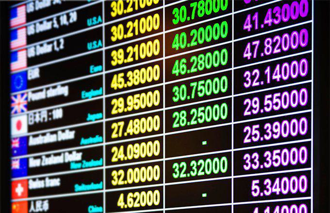

The Comoros, an archipelago located in the Indian Ocean, boasts a distinctive monetary history centered on its national currency, the Comorian Franc (KMF). This article seeks to provide an in-depth exploration of the evolution of the KMF, from its origins to its current status, while considering the potential influences of emerging financial technologies, such as algorithmic trading, on this currency. Despite being relatively lesser-known on the global stage, the Comorian Franc is pivotal to the local economy of Comoros, which faces unique challenges within international financial markets.

Comoros has undergone significant monetary transformations since its time as a French colony, when the French Franc was widely used. The introduction of the Comorian Franc in the 1960s symbolized an essential step toward economic self-identification for the nation. Since then, the KMF has been closely pegged, historically to the French Franc and currently to the Euro, offering a degree of economic stability amidst global fluctuations.

This article aids readers in understanding the KMF by examining its history, economic role, and modern influences that may shape its future. By analyzing these aspects, one gains insights into the broader economic mechanisms within Comoros and how the nation interacts with the larger international monetary systems. Ultimately, learning about the Comorian Franc not only highlights its significance but also positions it as a lens through which the dynamic economic landscape of the Comoros can be perceived.

## Table of Contents

## History of the Comorian Franc (KMF)

The Comorian Franc (KMF) has a rich history that traces back to the 1960s when Comoros, an archipelago in the Indian Ocean, transitioned from being a French colony to an autonomous state. During the colonial period, the French Franc was the legal tender. The introduction of the Comorian Franc marked a significant assertion of national identity and economic independence.

Initially, the Comorian Franc was pegged to the French Franc, establishing a stable exchange rate that provided certainty and facilitated economic transactions both locally and with foreign partners. This fixed peg system ensured that fluctuations in the French Franc directly influenced the value of the Comorian Franc, which helped stabilize the nascent economy of Comoros.

A pivotal moment in the evolution of the Comorian Franc was the creation of the central bank of Comoros, Banque Centrale des Comores, in 1981. The central bank was instrumental in regulating the currency's circulation, controlling inflation, and safeguarding the overall financial stability of the country. The bank's establishment underscored the importance of having a robust financial institution dedicated to managing and maintaining the national currency.

The historical development of the Comorian Franc cannot be separated from Comoros' broader economic and political relationships, particularly its ties with France and later the European Union. The pegging of the Comorian Franc to the Euro following the Franc's replacement by the Euro in 1999 continued the tradition of linking the currency to major, stable global economies. This link has provided Comoros with monetary stability, a critical [factor](/wiki/factor-investing) given the country's economic challenges, including limited resources and a reliance on agricultural exports like vanilla and cloves.

Understanding this historical evolution is crucial for comprehending the foundations of the Comorian economy. The currency's history reflects both the colonial legacy and the ongoing post-colonial economic adjustments that Comoros faces as it navigates its socio-economic landscape.

## Economics and Significance of the Comorian Franc

The Comorian Franc (KMF) is integral to the economic infrastructure of the Comoros, an island nation that ranks among the world's poorest countries, grappling with high unemployment rates and limited natural resources. The KMF serves as the primary medium of exchange, facilitating the majority of daily transactions and enabling the functioning of the local economy. While the Comorian Franc dominates the marketplace, larger enterprises in the nation may also engage in transactions using foreign currencies, notably the Euro and the United States Dollar (USD), especially for international trade and tourism-related activities.

A strategic monetary policy has been adopted by pegging the Comorian Franc to the Euro. This linkage has provided the Comoros with a buffer against currency [volatility](/wiki/volatility-trading-strategies), instilling a measure of economic stability and confidence in the local populace and investors. The fixed exchange rate regime aids in controlling inflation and stabilizing prices, which is crucial for a nation with restricted economic resilience and susceptibility to external economic shocks.

Central to the economic fabric of Comoros are its agricultural sectors, particularly the cultivation and exportation of crops such as vanilla and cloves. These commodities are not only significant revenue-generating exports but also pivotal to the livelihoods of a substantial portion of the Comorian population involved in agriculture. The dependency on agriculture underscores the vulnerability of Comoros to global market fluctuations and climatic conditions, which can directly impact the KMF's stability and value.

The Comorian economy, however, faces substantial challenges, one of which is its heavy reliance on food imports, which constitute approximately 70% of the country's consumption. This dependency makes currency management an essential focus for ensuring economic stability. Efficient currency management strategies are required to mitigate the adverse effects of potential exchange rate fluctuations and ensure that essential goods remain accessible to the populace.

In conclusion, the Comorian Franc is more than just a unit of currency; it is a reflection of the economic conditions and challenges faced by Comoros. Its stability, bolstered by its peg to the Euro, plays a pivotal role in sustaining the economic framework of the nation, highlighting the importance of strategic economic policies and currency management amid a landscape of limited domestic resources and significant external dependencies.

## Algorithmic Trading and Its Implications for KMF

Algorithmic trading is increasingly influencing financial markets worldwide, including those involving less prominent currencies like the Comorian Franc (KMF). This technology-driven method leverages computer programs to execute trades based on predefined strategies, aiming to capitalize on speed and data analytics for optimal trading outcomes.

One significant advantage of [algorithmic trading](/wiki/algorithmic-trading) for the KMF is the potential for enhanced market efficiency. Automated systems process data rapidly, enabling more precise price discovery and reducing bid-ask spreads. For a currency like the KMF, predominantly traded within a limited scope, improved efficiency can attract more participants and potentially increase transaction volumes.

Furthermore, algorithmic trading can boost market [liquidity](/wiki/liquidity-risk-premium) for the KMF. Increased liquidity smooths price fluctuations and reduces volatility, fostering a more stable and predictable trading environment. This stability is crucial for currencies like the KMF, whose markets are not as deep as those of major currencies. By minimizing large, sudden price changes, algorithmic trading can enhance investor confidence and encourage broader participation.

However, implementing algorithmic trading for the KMF must account for the specific challenges posed by smaller economies. The relatively low trading [volume](/wiki/volume-trading-strategy) of the KMF can lead to increased susceptibility to market manipulation and artificially induced volatility. Therefore, rigorous regulatory frameworks are essential to safeguard against potential abuses, ensuring that algorithm trading systems operate transparently and fairly.

Risk management is another critical aspect when applying algorithmic trading to the KMF. Sudden algorithmic-induced trades can result in sharp market movements, which, in smaller economies, could lead to disproportionate economic impacts. Establishing robust monitoring systems alongside algorithmic trading mechanisms can help mitigate these risks, ensuring that the benefits of increased efficiency and liquidity do not come at the cost of economic stability.

Exploring how algorithmic trading can be integrated into the current KMF market is crucial for advancing financial innovation in Comoros. This integration involves developing infrastructure that supports algorithm-based systems and nurturing expertise in financial technology. For instance, establishing trading platforms compatible with algorithmic systems and fostering educational programs in financial technology could facilitate this adoption.

In conclusion, while algorithmic trading presents a promising avenue for enhancing the market dynamics of the Comorian Franc, careful consideration of the unique characteristics of smaller economies is imperative. Balancing innovation with safeguards ensures the potential benefits are realized without exacerbating underlying risks.

## Future Prospects for the Comorian Franc

The future of the Comorian Franc (KMF) is contingent upon a range of internal and external factors that are pivotal to the currency's stability and growth. Developing robust economic infrastructure is one of the primary steps that can help fortify the currency's standing. This involves investing in transport, energy, and communication sectors that are crucial for improving the business environment in Comoros. Such developments can facilitate trade, enable faster transactions, and reduce the costs associated with currency management.

Enhancing financial literacy is another important element. Many Comorians may lack the necessary understanding of financial principles that govern daily transactions. By promoting education in this field, the populace can make more informed decisions, leading to increased savings and investments which, in turn, can spur economic growth and bolster the local currency's use.

Improvement of economic policies is crucial for maintaining confidence in the KMF. Policymakers should focus on crafting fiscal and monetary strategies that prioritize stability and growth. This includes consistent monitoring of inflation rates, maintaining a stable peg with the Euro, and ensuring that public sector spending is sustainable.

Participation in global monetary systems and trade presents significant opportunities to strengthen the KMF. By increasing exports and integrating into regional trade agreements, Comoros can enhance foreign exchange reserves, contribute to GDP growth, and reduce reliance on foreign aid. Additionally, aligning with international financial norms can attract foreign investments and offer protection against global economic volatility.

Technological integration is also poised to play a substantial role in the evolution of the Comorian Franc. Fintech innovations and algorithmic trading can lead to a more efficient financial system by minimizing human error, accelerating transactions, and improving liquidity in financial markets. While adopting new technologies, it is paramount to institute comprehensive regulatory frameworks that prevent risks such as market manipulation.

Moreover, it is vital for Comoros to monitor and adapt to regional and global economic changes actively. Shifts in global market dynamics, changes in foreign exchange rates, and fluctuations in commodity prices can impact the KMF. Therefore, timely adjustments to policies are essential to safeguard the currency's value. Establishing a currency board or a similar institution to oversee such adaptations could be beneficial in navigating these shifts.

In summary, the sustainable future of the Comorian Franc will require a multifaceted approach involving the development of key infrastructures, enhancement of financial literacy, refinement of economic policies, active participation in global trade, and strategic adoption of financial technologies. These initiatives, coupled with vigilant monitoring of economic changes, are essential for securing a prosperous path forward for the Comorian currency.

## Conclusion

The Comorian Franc (KMF) plays a pivotal role in the economy of Comoros, serving as a symbol of the nation's historical ties as well as its future aspirations. Its monetary history, rooted in the transition from the French Franc to its own currency, highlights the complexities and challenges faced by a post-colonial economy striving for stability and growth. The Comorian Franc’s pegging to the Euro has provided a degree of economic stability, which is crucial for a nation with limited resources and significant socioeconomic challenges. This historical evolution underscores the importance of sound monetary policy in maintaining economic equilibrium.

Algorithmic trading introduces both opportunities and challenges for the KMF. As a technology-driven trading approach, it has the potential to enhance market efficiency, liquidity, and price discovery. These advancements could prove beneficial in strengthening the KMF's position in the global market. However, the risks associated with algorithmic trading, such as market manipulation and volatility, require vigilant regulatory oversight and careful implementation. The integration of such innovative trading strategies needs to be balanced with traditional economic practices to ensure that the Comorian Franc remains a stable and effective tool for economic management.

The future trajectory of the KMF will depend on the strategic balance between these traditional and innovative approaches. For stakeholders, understanding the intricate dynamics of the Comorian Franc is vital. It provides insights into how the currency can navigate an evolving global economic landscape and address local economic challenges. By leveraging technological advancements and maintaining prudent economic policies, Comoros can aspire towards a more robust economic future, with the Comorian Franc at its core. This understanding is crucial for investors, policymakers, and economic analysts interested in the Comorian market and its prospects.

## References & Further Reading

[1]: Compaore, A. (2019). [“Central Banking in Developing Countries: Insights from Comoros.”](https://scholar.google.com/citations?user=L13_nBcAAAAJ) African Development Bank.

[2]: Degryse, H., De Jong, F., & Van Kervel, V. (2011). ["The Impact of Algorithmic Trading on the Market."](https://research.tilburguniversity.edu/en/publications/the-impact-of-dark-trading-and-visible-fragmentation-on-market-qu-2) Tinbergen Institute Discussion Paper.

[3]: International Monetary Fund (IMF) (2007). ["Comoros: 2007 Article IV Consultation—Staff Report."](https://www.imf.org/external/pubs/ft/scr/2007/cr07387.pdf) IMF Country Report No. 07/306.

[4]: “An Insight Into The Comorian Economy” (2020). [Focus Economics.](https://en.wikipedia.org/wiki/Luco_dei_Marsi) 

[5]: Lopez de Prado, M. (2018). ["Advances in Financial Machine Learning."](https://www.amazon.com/Advances-Financial-Machine-Learning-Marcos/dp/1119482089) John Wiley & Sons.

[6]: Rothschild, C., & Brusco, E. (2017). ["Currency Boards in Developing Countries."](https://sites.krieger.jhu.edu/iae/files/2017/06/Currency_Boards_for_Developing_Countries-1.pdf) Economics Discussion Papers, No 2017-84.

[7]: Wikipedia Contributors. (n.d.). ["Comorian Franc."](https://en.wikipedia.org/wiki/Comorian_franc) Wikipedia, The Free Encyclopedia.