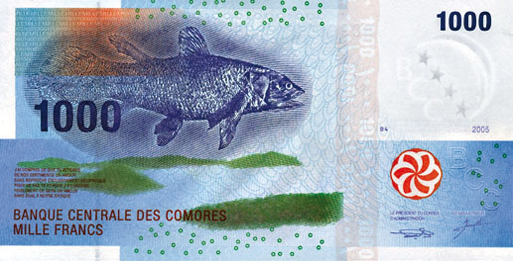

## Table of Contents

## What is the Comorian Franc?

The Comorian Franc is the money used in the Comoros, which is a country made up of islands off the east coast of Africa. It is also called KMF. The Comorian Franc is important because it helps people in the Comoros buy things and do business with each other.

The Comorian Franc is not used in many other places outside the Comoros. It is different from other kinds of money, like the US Dollar or the Euro. The government of the Comoros controls how much Comorian Franc is made and used. This helps keep the economy of the Comoros stable.

## Which countries use the Comorian Franc as their currency?

The Comorian Franc is used only in the Comoros. The Comoros is a country made of islands near Africa. People in the Comoros use the Comorian Franc to buy things and pay for services.

No other countries use the Comorian Franc. This means that if you go to a different country, you will need to use a different type of money. The Comorian Franc is special to the Comoros and helps keep their economy working well.

## How is the Comorian Franc abbreviated?

The Comorian Franc is abbreviated as KMF. This abbreviation is used to show the currency in a shorter way.

When you see KMF, it means the amount is in Comorian Francs. It is used in the Comoros for buying things and doing business.

## What is the history of the Comorian Franc?

The Comorian Franc, or KMF, started being used in the Comoros in 1981. Before that, the Comoros used the French Franc because they were a French colony. When the Comoros became independent, they decided to make their own money to show they were their own country. The new money was called the Comorian Franc, and it helped the Comoros have more control over their economy.

Since 1981, the Comorian Franc has been the main money used in the Comoros. It is managed by the Central Bank of the Comoros, which makes sure there is enough money for people to use. The Comorian Franc is not used in any other country, so it is special to the Comoros. Over the years, the Comorian Franc has helped the Comoros grow and develop by making it easier for people to buy things and do business.

## When was the Comorian Franc first introduced?

The Comorian Franc was first introduced in 1981. Before that, the Comoros used the French Franc because they were a French colony. When the Comoros became independent, they wanted their own money to show they were their own country. So, they created the Comorian Franc.

Since 1981, the Comorian Franc has been the main money used in the Comoros. It is managed by the Central Bank of the Comoros, which makes sure there is enough money for people to use. The Comorian Franc is special because it is only used in the Comoros and helps the country's economy grow.

## What are the different denominations of Comorian Franc banknotes and coins?

The Comorian Franc has different banknotes and coins that people use every day. The banknotes come in values of 500, 1000, 2000, 5000, and 10,000 Comorian Francs. These banknotes help people buy more expensive things like furniture or pay for services. Each banknote has a different color and design to make it easy to tell them apart.

Coins are also part of the Comorian Franc system. The coins come in smaller amounts like 1, 2, 5, 10, 25, and 50 Comorian Francs. These coins are used for smaller purchases, like buying snacks or paying for bus fares. They are made of metal and are easier to [carry](/wiki/carry-trading) around than banknotes for small transactions.

## How does the Comorian Franc relate to other currencies?

The Comorian Franc, or KMF, is the money used only in the Comoros. It is not used in any other country, so it is special to the Comoros. The value of the Comorian Franc can change compared to other money like the US Dollar or the Euro. This change happens because of things like how much people want to buy things from the Comoros or how strong the Comoros' economy is.

The Central Bank of the Comoros controls the Comorian Franc. They decide how much money is made and used in the country. This helps keep the economy stable. When people from the Comoros need to buy things from other countries, they might need to change their Comorian Francs into another kind of money. The rate at which they change it depends on how much other countries value the Comorian Franc at that time.

## What is the exchange rate of the Comorian Franc to major world currencies like the USD and EUR?

The exchange rate of the Comorian Franc to major world currencies like the US Dollar (USD) and the Euro (EUR) changes every day. As of the latest data, 1 US Dollar is worth about 445 Comorian Francs. This means if you have 1 USD, you can get around 445 KMF. The exchange rate can go up or down based on things like how strong the Comoros' economy is and how much people want to buy things from the Comoros.

Similarly, 1 Euro is worth about 480 Comorian Francs. So, if you have 1 EUR, you can exchange it for around 480 KMF. The value of the Comorian Franc against the Euro also changes daily, influenced by the same factors that affect its value against the US Dollar. Keeping track of these rates is important if you are traveling to the Comoros or doing business with people there.

## What economic factors influence the value of the Comorian Franc?

The value of the Comorian Franc is affected by many things in the economy. One big thing is how much people want to buy things from the Comoros. If more people want to buy things from there, the value of the Comorian Franc can go up. Another important thing is how strong the Comoros' economy is. If the economy is doing well, with more jobs and more things being made, the Comorian Franc can become more valuable. The Central Bank of the Comoros also plays a big role. They control how much money is made and used, which can change the value of the Comorian Franc.

Another [factor](/wiki/factor-investing) is how much the Comoros trades with other countries. If the Comoros exports more than it imports, this can make the Comorian Franc stronger. But if the Comoros buys more from other countries than it sells, the value of the Comorian Franc can go down. Political stability is also important. If the Comoros is peaceful and has a stable government, people might trust the Comorian Franc more, making it more valuable. All these things together help decide how much the Comorian Franc is worth compared to other currencies like the US Dollar or the Euro.

## How has the Comorian Franc evolved in response to economic changes in the Comoros?

Since the Comorian Franc was introduced in 1981, it has changed a lot because of what was happening in the Comoros' economy. When the economy was doing well, with more jobs and more things being made, the value of the Comorian Franc went up. People trusted the money more and it was worth more compared to other currencies. But when the economy was not doing so well, the value of the Comorian Franc went down. This happened because there were fewer jobs and the Comoros was buying more things from other countries than it was selling.

The Central Bank of the Comoros has played a big part in how the Comorian Franc has changed. They control how much money is made and used in the country. When they think there is too much money, they can take some out of circulation to make the Comorian Franc stronger. If they think there is not enough money, they can put more into circulation to help people buy things more easily. Over the years, the Central Bank has worked to keep the economy stable, which has helped the Comorian Franc stay valuable even when things were tough.

## What are the challenges faced by the Comorian Franc in the global market?

The Comorian Franc faces some big challenges in the global market. One main challenge is that it is only used in the Comoros, a small country. This means not many people outside the Comoros know about it or want to use it. Because of this, it can be hard for the Comorian Franc to be accepted in other countries. When people from the Comoros want to buy things from other places, they have to change their money into a more popular currency like the US Dollar or the Euro. This can make things more expensive for them.

Another challenge is that the Comoros' economy is not very strong. This can make the Comorian Franc less valuable compared to other currencies. If the economy is not doing well, with fewer jobs and less being made, people might not trust the Comorian Franc as much. This can lead to the value of the Comorian Franc going down. The Central Bank of the Comoros tries to manage these challenges by controlling how much money is in circulation, but it is still hard to keep the Comorian Franc strong in the global market.

## What future developments can be anticipated for the Comorian Franc?

In the future, the Comorian Franc might see changes because of the economy in the Comoros. If the Comoros' economy gets stronger, with more jobs and more things being made, the Comorian Franc could become more valuable. The Central Bank of the Comoros will keep working to control how much money is in circulation, trying to keep the economy stable. They might also try new ways to make the Comorian Franc more trusted and used, both inside and outside the Comoros.

Another possible development is that the Comorian Franc could become more connected to other currencies. This could happen if the Comoros starts trading more with other countries. If the Comoros exports more than it imports, the value of the Comorian Franc might go up. But if the Comoros still buys more from other countries than it sells, the Comorian Franc could stay weak. The government might also look at using technology to make it easier for people to use the Comorian Franc, like using mobile payments or digital wallets. These changes could help the Comorian Franc be more useful and accepted in the global market.

## References & Further Reading

[1]: Compaore, A. (2019). [“Central Banking in Developing Countries: Insights from Comoros.”](https://scholar.google.com/citations?user=L13_nBcAAAAJ) African Development Bank.

[2]: Degryse, H., De Jong, F., & Van Kervel, V. (2011). ["The Impact of Algorithmic Trading on the Market."](https://research.tilburguniversity.edu/en/publications/the-impact-of-dark-trading-and-visible-fragmentation-on-market-qu-2) Tinbergen Institute Discussion Paper.

[3]: International Monetary Fund (IMF) (2007). ["Comoros: 2007 Article IV Consultation—Staff Report."](https://www.imf.org/external/pubs/ft/scr/2007/cr07387.pdf) IMF Country Report No. 07/306.

[4]: “An Insight Into The Comorian Economy” (2020). [Focus Economics.](https://en.wikipedia.org/wiki/Luco_dei_Marsi) 

[5]: Lopez de Prado, M. (2018). ["Advances in Financial Machine Learning."](https://www.amazon.com/Advances-Financial-Machine-Learning-Marcos/dp/1119482089) John Wiley & Sons.

[6]: Rothschild, C., & Brusco, E. (2017). ["Currency Boards in Developing Countries."](https://sites.krieger.jhu.edu/iae/files/2017/06/Currency_Boards_for_Developing_Countries-1.pdf) Economics Discussion Papers, No 2017-84.

[7]: Wikipedia Contributors. (n.d.). ["Comorian Franc."](https://en.wikipedia.org/wiki/Comorian_franc) Wikipedia, The Free Encyclopedia.